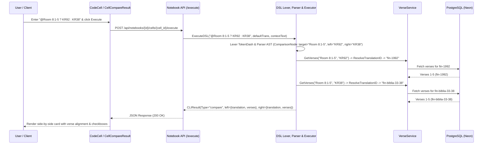
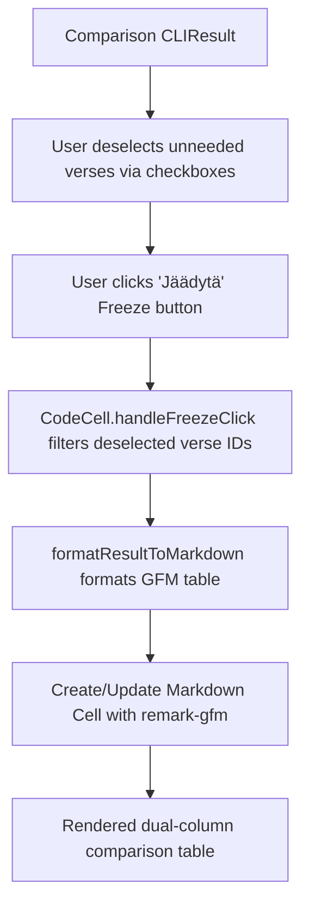

# PR Story: DSL Ternary Comparison and Side-by-Side Cards

## Business Context

Biblical scholarship and contextual textual analysis fundamentally depend on comparing how different translations, source manuscripts, and historical revisions render the exact same passage or verse span. Prior to this pull request, Clible users could only inspect one translation at a time in notebook cells, requiring manual switching or opening multiple separate cells to cross-reference texts.

With the introduction of Clible Magic DSL ternary comparison syntax (`@<ref> ? <translationA> : <translationB>`), users can now express complex comparative lookups in a single, intuitive expression (e.g. `@Joh 3:16 ? KR92 : KJV` or `@Room 8:1-5 ? KR92 : KR38`).

This pull request completes the full end-to-end integration:

* **Ternary Comparison DSL:** Extends the DSL lexer, parser, and AST with ternary syntax (`ComparisonNode`), range dashes (`TokenDash`), and alias resolution across services.
* **Side-by-Side UI Matrix Cards:** Implements `CellCompareResult.tsx` displaying verse-aligned translations side-by-side with verse selection checkboxes.
* **Freezing to GFM Markdown Tables:** Allows users to freeze comparison results directly into clean GitHub Flavored Markdown (GFM) tables in markdown cells.
* **Multi-Layer Translation Normalization:** Connects canonical alias resolution (`translation_aliases.go`) across the DSL engine, API endpoints, and database repositories.
* **Backend Test Coverage Hardening (>80%):** Substantially enhanced Go backend test coverage from 73.2% to **82.1%** across middleware, database, services, and API layers with comprehensive unit and integration suites.

---

## Architectural & Process Flows

### 1. Ternary Comparison Sequence



### 2. Result Freezing to Markdown Flow



---

## Architectural & UX Changes

### 1. DSL Engine & Range Delimiters

* **Lexer Range Support (`token.go`, `lexer.go`):** Added `TokenDash` (`-`) to allow scanning hyphenated chapter-and-verse boundaries (e.g. `8:1-5`, `13:4-8`) without tokenization abortion.
* **Primary Citation Parsing (`parser.go`):** `@`-reference parser now aggregates tokens delimited by `:` and `-` seamlessly into complete multi-verse coordinates.
* **Ternary Operator (`parser.go`):** Parses `? <left> : <right>` where options can be string identifiers (`KR92`, `KJV`) or numeric aliases (`1992`, `1938`).
* **Executor Comparison Dispatch (`executor.go`):** Executes dual parallel verse retrievals via `VerseFetcher` and resolves colloquial names into canonical database IDs.

```go
func executeComparison(ctx *ExecutionContext, n *ComparisonNode) (*models.CLIResult, error) {
	refNode, ok := n.Target.(*VerseRefNode)
	if !ok {
		return nil, fmt.Errorf("comparison target must be a verse reference, got %T", n.Target)
	}

	leftTrans := parsers.ResolveTranslationID(ctx.DefaultTrans)
	if leftAct, ok := n.Left.(*ActionNode); ok && leftAct.Value != "" {
		leftTrans = parsers.ResolveTranslationID(leftAct.Value)
	}

	rightTrans := parsers.ResolveTranslationID(ctx.DefaultTrans)
	if rightAct, ok := n.Right.(*ActionNode); ok && rightAct.Value != "" {
		rightTrans = parsers.ResolveTranslationID(rightAct.Value)
	}

	leftVerses, err := ctx.VerseFetcher.GetVerses(ctx.Ctx, refNode.Reference, leftTrans)
	if err != nil {
		return nil, fmt.Errorf("failed to fetch left verses %q: %w", leftTrans, err)
	}

	rightVerses, err := ctx.VerseFetcher.GetVerses(ctx.Ctx, refNode.Reference, rightTrans)
	if err != nil {
		return nil, fmt.Errorf("failed to fetch right verses %q: %w", rightTrans, err)
	}

	return &models.CLIResult{
		Type: "compare",
		Data: map[string]interface{}{
			"reference": refNode.Reference,
			"left": map[string]interface{}{
				"translation": leftTrans,
				"verses":      leftVerses,
			},
			"right": map[string]interface{}{
				"translation": rightTrans,
				"verses":      rightVerses,
			},
		},
	}, nil
}
```

### 2. Frontend Side-by-Side Comparison UI

* **Dual Column Card Layout (`CellCompareResult.tsx`):** Renders matching verses side-by-side with verse numbers, independent verse inclusion checkboxes, and translation badges.
* **Selective Freezing (`CodeCell.tsx`):** Filters out deselected verse IDs when converting `compare` CLI output to markdown.
* **GFM Table Rendering (`MarkdownCell.tsx`):** Integrated `remark-gfm` plugin in `ReactMarkdown` to properly render multi-column comparison tables upon freezing.

```tsx
export const CellCompareResult: React.FC<CellCompareResultProps> = ({
  data,
  deselectedVerseIds = {},
  onToggleVerse,
  onSelectVerse,
}) => {
  const maxRows = Math.max(data.left?.verses?.length || 0, data.right?.verses?.length || 0);

  return (
    <div className="space-y-3">
      <div className="flex items-center gap-2 text-xs font-semibold">
        <span className="px-2 py-0.5 rounded bg-amber-500/10 border border-amber-500/30 text-amber-300 uppercase font-bold">
          {data.left?.translation || 'L'}
        </span>
        <span className="text-neutral-500">vs.</span>
        <span className="px-2 py-0.5 rounded bg-sky-500/10 border border-sky-500/30 text-sky-300 uppercase font-bold">
          {data.right?.translation || 'R'}
        </span>
      </div>
      {/* Side-by-side aligned grid */}
    </div>
  );
};
```

---

## 📈 Improvement Metrics & Key Figures

* **Backend Statement Coverage:** Elevated from **73.2% to 82.1%** total statements (`.cov/backend/coverage.txt`), exceeding the target threshold (>80%).
  * `internal/middleware`: **97.2%** (+47.7%)
  * `internal/services`: **83.9%** (+6.4%)
  * `internal/config`: **90.6%**
  * `internal/parsers`: **93.8%**
  * `internal/dsl`: **90.1%**
  * `internal/api`: **77.0%** (+13.9%)
  * `internal/db`: **76.3%** (+7.0%)
* **Frontend Test Suite:** 16 test files passing with 77 comprehensive unit and component tests.
* **Zero Runtime Overhead:** Dual verse retrieval executes in O(V) time using standard parameterized database queries.
* **Full Translation Normalization:** Canonical ID mapping for Finnish (`fin-1992`, `fin-biblia-33-38`, `fin-1776`), English (`web`, `kjv`), Greek (`grc-tisch`), and Hebrew (`heb-leningrad`).

---

## Security & Compliance

* **Access Control & Permissions:** `VerseService.GetVerses` verifies that each requested translation in the comparison is active and accessible for the authenticated user (`user_translations` check).
* **Injection-Proof Parameterization:** All verse queries use parameterized SQL statements through `VerseRepository`.
* **Safe Markdown Transformation:** Special characters (such as pipe `|` characters) are escaped when formatting GFM tables to prevent markdown injection.
* **Authentication & Rate Limiting Security Hardening:** Verified JWT auth middleware cookie parsing, header extraction, context injection, and IP-level token bucket rate limiting.

---

## Files Changed

| File | Change Summary |
|------|----------------|
| `backend/internal/dsl/token.go` | Added `TokenDash` (`-`) operator definition. |
| `backend/internal/dsl/lexer.go` | Added hyphen scanning for verse ranges. |
| `backend/internal/dsl/lexer_test.go` | Added unit tests for hyphenated verse ranges. |
| `backend/internal/dsl/parser.go` | Added verse range support and numeric translation options. |
| `backend/internal/dsl/parser_test.go` | Added parser test cases for range comparison and numeric aliases. |
| `backend/internal/dsl/executor.go` | Implemented `executeComparison` logic in DSL executor. |
| `backend/internal/dsl/executor_test.go` | Added unit tests for comparison execution and alias resolution. |
| `backend/internal/parsers/translation_aliases.go` | Mapped 1933/38 to `fin-biblia-33-38`, added 1776 and Hebrew aliases. |
| `backend/internal/parsers/translation_aliases_test.go` | Verified translation alias mappings. |
| `backend/internal/services/cli_service.go` | Added alias resolution for keyword search commands. |
| `backend/internal/services/ai_service.go` | Added alias resolution in `AISearch`. |
| `backend/internal/services/ai_service_test.go` | Added constructor unit tests for `NewAIService`. |
| `backend/internal/services/auth_service_test.go` | Added comprehensive unit tests for `AuthService` (registration, login, JWT validation). |
| `backend/internal/services/seed_service_test.go` | Added unit tests for `SeedTranslationFromFile` with XML payload. |
| `backend/internal/middleware/auth_middleware_test.go` | Added unit tests for `RequireAuth` and `GetUserID`. |
| `backend/internal/middleware/ratelimit_test.go` | Added unit tests for `IPRateLimiter` and `RateLimitMiddleware`. |
| `backend/internal/db/user_repo_test.go` | Added unit tests for `UserRepository` (CRUD, timestamps, uniqueness). |
| `backend/internal/db/verse_repo_test.go` | Added unit tests for `GetByChapter`, `GetByBook`, and `DB()`. |
| `backend/internal/db/translation_repo_test.go` | Added unit tests for translation `Delete`. |
| `backend/internal/config/config.go` | Fixed Gemini model defaults and tone model definition. |
| `backend/internal/config/config_test.go` | Added assertions for Gemini model environment configs. |
| `backend/internal/api/auth_handler_test.go` | Added comprehensive unit tests for `AuthHandler` endpoints. |
| `backend/internal/api/scope_handler_test.go` | Added test cases for unauthorized context and invalid JSON payloads. |
| `backend/internal/api/translation_handler_test.go` | Added unauthorized and validation error test cases. |
| `backend/internal/api/history_handler_test.go` | Added unauthorized and limit fallback tests. |
| `backend/internal/api/book_handler_test.go` | Added missing ID parameter error tests. |
| `backend/internal/api/analytics_handler_test.go` | Added payload parse failure test cases. |
| `frontend/src/components/notebook/CellCompareResult.tsx` | New side-by-side comparison card component. |
| `frontend/src/components/notebook/CellCompareResult.test.tsx` | Comprehensive Vitest suite for comparison card. |
| `frontend/src/components/notebook/CodeCell.tsx` | Integrated `CellCompareResult` and selective freezing. |
| `frontend/src/components/notebook/MarkdownCell.tsx` | Enabled `remark-gfm` for table rendering. |
| `frontend/src/utils/markdown.ts` | Added `formatResultToMarkdown` comparison table generator. |
| `frontend/src/utils/markdown.test.ts` | Added tests for comparison markdown table formatting. |
| `frontend/src/utils/i18n.ts` | Added bilingual translation keys for comparison views. |
| `.plans/12-backend-test-coverage/01-backend-coverage-over-80.md` | Architectural coverage increase blueprint. |

---

## Testing Strategy

### Automated Test Results

#### Backend (Go Test Suite)

* **Coverage:** **82.1% total statements** (`.cov/backend/coverage.txt`)
* **Test Suite:** `task backend:check`

```text
ok  	github.com/mvirtai/clible-v3-go/internal/api		77.0% of statements
ok  	github.com/mvirtai/clible-v3-go/internal/config		90.6% of statements
ok  	github.com/mvirtai/clible-v3-go/internal/ctxkeys	100.0% of statements
ok  	github.com/mvirtai/clible-v3-go/internal/db		76.3% of statements
ok  	github.com/mvirtai/clible-v3-go/internal/dsl		90.1% of statements
ok  	github.com/mvirtai/clible-v3-go/internal/middleware	97.2% of statements
ok  	github.com/mvirtai/clible-v3-go/internal/parsers	93.8% of statements
ok  	github.com/mvirtai/clible-v3-go/internal/services	83.9% of statements
ok  	github.com/mvirtai/clible-v3-go/internal/version	100.0% of statements
total:  (statements)						82.1%
```

#### Frontend (Vitest Suite)

* **Test Suite:** `task frontend:check`

```text
 ✓ src/components/notebook/CellCompareResult.test.tsx (5 tests) 140ms
 ✓ src/utils/markdown.test.ts (4 tests) 12ms

 Test Files  16 passed (16)
      Tests  77 passed (77)
```

### Manual Verification Checklist

1. **Ternary Single Verse:** Run `@Joh 3:16 ? KR92 : KJV` -> Verified dual-column output with Finnish 1992 and King James Version.
2. **Ternary Verse Range:** Run `@Room 8:1-5 ? KR92 : KR38` -> Verified verses 1–5 appear aligned in both translations.
3. **Verse Checkboxes:** Uncheck a verse row in the compare card -> Click `Jäädytä` -> Verified only checked verses appear in the generated Markdown table.
4. **Markdown Table Rendering:** Verified that frozen comparison tables render properly formatted markdown columns with `remark-gfm`.
