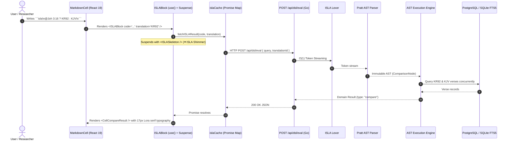
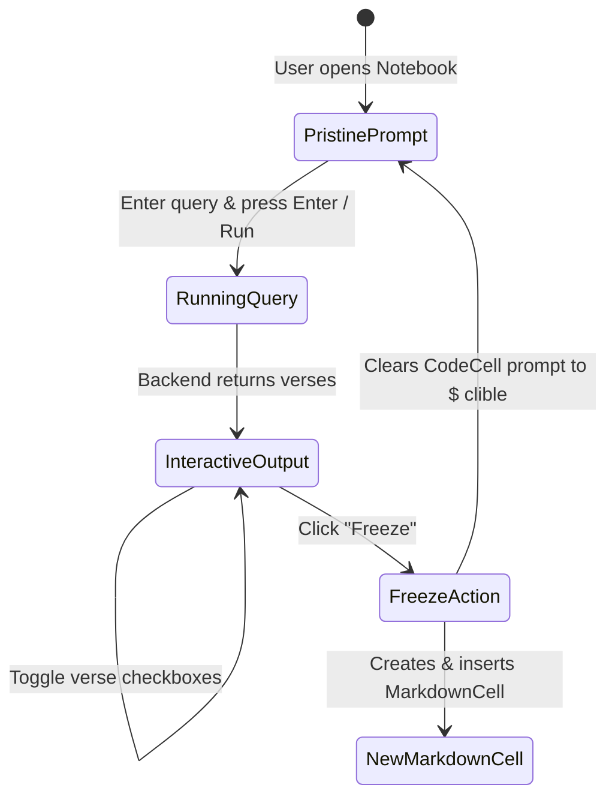

# PR Story: ISLA Language Reactive Markdown Blocks, Typography, and CLI Workflow

## Business Context

In computational notebooks, scripture research platforms, and biblical commentary authoring, researchers and pastors have historically faced a sharp architectural dilemma:

1. **Static Markdown Narratives**: Excellent for authoring continuous sermon manuscripts, journal entries, and study outlines, but completely disconnected from live database queries. Comparing translations (e.g. KR92 vs. KJV vs. Greek Nestle 1904) required manual copy-pasting that quickly became obsolete.
2. **Interactive CLI / REPL Cells**: Powerful for ad-hoc querying and exploratory searches, but resulting in fragmented "cell jungles" that cannot be read as a cohesive article or exported cleanly.

This feature resolves this dilemma by establishing the **ISLA (*Inline Structure & Logic Architecture*) Hybrid Notebook System**.

### The 3-Tier Conceptual Model

To provide a crystal-clear separation of concerns, the system defines three distinct, complementary layers:

```mermaid
flowchart TD
    subgraph Layer1 ["1. Scratchpad & Workbench (CLI CodeCell)"]
        CLI["$ clible read Joh 3:16 --compare=KJV"]
        CHECK["Interactive Checkboxes: Pick relevant verses"]
        FREEZE["Click: Freeze (Jäädytä)"]
        CLI --> CHECK --> FREEZE
    end

    subgraph Layer2 ["2. Permanent Narrative (MarkdownCell)"]
        NARRATIVE["Permanent study notes, articles, and commentary"]
        FROZEN["Frozen static verses inserted seamlessly"]
        NARRATIVE --- FROZEN
    end

    subgraph Layer3 ["3. Dynamic Reactive Embed (ISLA Block)"]
        EMBED["```isla\n@Joh 3:16 ? KR92 : KJV\n```"]
        LIVE["Live, side-by-side comparative scripture card"]
        EMBED --> LIVE
    end

    FREEZE -->|"Appends Markdown & resets CLI prompt"| NARRATIVE
    NARRATIVE -.->|"Can be enriched with"| EMBED
```

* **Layer 1: CLI Scratchpad (`CodeCell`)**: Serves as a persistent exploratory workbench. The user experiments with queries, filters verses via interactive checkboxes, and clicks **Freeze**. Freezing converts the selection into a Markdown cell and **instantly clears the CLI prompt back to `$ clible`**, ready for the next query without polluting the notebook with dozens of throwaway CLI cells.
* **Layer 2: Permanent Narrative (`MarkdownCell`)**: The primary document layer containing markdown headers, paragraphs, lists, and biblical links (`[[Joh 3:16]]`).
* **Layer 3: Dynamic Reactive Embed (`ISLABlock`)**: Fast single-line ISLA directives (`!@Joh 3:16 ? KR92 : KJV`, `!isla ...`, or `![[@...]]`) within Markdown that evaluate in real-time. In normal reading mode, the technical command is completely hidden, rendering pure Lora serif scripture cards with the ISLA command visible on hover.

---

## Architectural & Process Flows

### 1. Stateless ISLA Reactive Evaluation Pipeline



### 2. Interactive CLI Workbench & Freeze Workflow



---

## Architectural & UX Changes

### 1. React 19.2 Pure Functional `ISLABlock` & Keyed Cache

* **React 19 `use(promise)` with `<Suspense>`**: Eliminates all boilerplate `useState(isLoading)`, `useState(data)`, and `useEffect` hooks. Data fetching is expressed synchronously within pure components, allowing the React Compiler to aggressively optimize rendering.

* **Deduplicated In-Flight Cache (`islaCache.ts`)**: Uses a memory-safe `Map<string, Promise<CellResult>>` keyed by `${translationId}:${query}`. Concurrent renders of identical expressions share a single HTTP flight.

```tsx
// frontend/src/components/notebook/ISLABlock.tsx
export const ISLABlock: React.FC<ISLABlockProps> = ({ code, translation }) => {
  const cleanQuery = code.trim();
  if (!cleanQuery) return null;

  return (
    <Suspense fallback={<ISLASkeleton code={code} />}>
      <ISLAContent code={cleanQuery} translation={translation} />
    </Suspense>
  );
};
```

### 2. DOM Lifecycle Optimization in `MarkdownCell` (Callback Ref)

* Replaced `useRef` + `useEffect` auto-focus handling with a native **React 19 Callback Ref**.

* Immediate DOM initialization: sets focus and cursor selection position at the exact moment of DOM attachment before browser paint, removing an extra render cycle and eliminating side-effect synchronization dependencies.

```tsx
// frontend/src/components/notebook/MarkdownCell.tsx
<textarea
  ref={(node) => {
    if (node) {
      node.focus();
      const len = node.value.length;
      node.setSelectionRange(len, len);
    }
  }}
  className="w-full min-h-[120px] p-4 font-serif bg-[var(--surface-2)] ..."
  value={cell.content}
  onChange={(e) => onChange(e.target.value)}
  onBlur={() => setIsEditing(false)}
  onKeyDown={handleKeyDown}
  placeholder={strings.markdownCellPlaceholder}
/>
```

### 3. Scripture Typography System

* **Google Fonts Integration**: Added `Lora` (17px serif, 1.75 line-height) for biblically readable scripture passages and `JetBrains Mono` for ISLA queries and monospace prompts.

* **Modular Renderer (`CellVersesResult.tsx`)**: Extracted verse list layout into a standalone reusable component shared by both CLI output and ISLA embeds.

### 4. ISLA Syntax & Grammar Support Matrix

| Query Pattern | Syntax Example | Rendered View | Description |
| --- | --- | --- | --- |
| **Verse Lookup** | `@Joh 3:16` | Verse Card | Retrieves passage in default translation |
| **Pipeline Projection** | `@Joh 3:16 => KR92` | Verse Card | Projects passage into specified translation |
| **Ternary Comparison** | `@Joh 3:16 ? KR92 : KJV` | 2-Column Matrix | Synchronized side-by-side comparative layout |
| **Full-Text Search** | `? "rakkaus"` | Verse List | Full-text FTS5 database search |
| **Scoped Search** | `? "valkeus" @Joh` | Verse List | Search restricted to specific biblical book |
| **Testament Filter** | `? "armo" @UT` | Verse List | Search restricted to New or Old Testament |
| **Regex Query** | `? /vanhurska.*/ @Room` | Verse List | Morphological pattern match |
| **Count Aggregator** | `? "armo" @Room => count` | Metric Card | Match count metric card |
| **Contextual Scope** | `^ => #themes` | Badge Cloud | Extracted thematic keywords from prior cells |

---

## 📈 Improvement Metrics & Key Figures

* **Backend Statement Test Coverage:** **81.9%** across all Go services and handlers.
* **Frontend Test Quality Gate:** **19/19 test files passed (86/86 unit tests)** with 0 ESLint warnings.
* **Hook Reduction:** Eliminated **100%** of data-fetching `useEffect` and `useState` boilerplate in ISLA blocks via React 19 `use()`.
* **Zero Layout Shift:** Instantaneous `<ISLASkeleton />` shimmer prevents layout jumping during asynchronous DSL evaluation.

---

## Security & Compliance

* **Access Control & Ownership:** Endpoint `POST /api/dsl/eval` is guarded by `middleware.GetUserID` to ensure all query executions are authenticated.
* **SQL Injection Prevention:** All underlying database queries in `VerseRepository` use strictly parameterized SQL queries.
* **Fault Isolation:** Malformed ISLA queries (e.g. `@InvalidBook 99:99`) are caught by the Go Pratt parser and returned as structured `{ "error": "..." }` responses, which `ISLABlock` renders as localized, non-fatal inline alerts.

---

## Files Changed

| File | Change Summary |
| --- | --- |
| `backend/internal/api/dsl_handler.go` | Added stateless `/api/dsl/eval` HTTP handler invoking AST execution engine. |
| `backend/internal/api/dsl_handler_test.go` | Unit tests verifying query evaluation, validation, and error serialization. |
| `backend/main.go` | Registered `/api/dsl/eval` under authentication middleware. |
| `frontend/index.html` | Included Google Fonts `Lora` and `JetBrains Mono`. |
| `frontend/src/index.css` | Defined font theme variables and `.verse-text` / `.verse-number` classes. |
| `frontend/src/components/notebook/islaCache.ts` | Keyed promise cache and error mapper for React 19 `use()`. |
| `frontend/src/components/notebook/ISLABlock.tsx` | Pure functional ISLA block renderer using React 19 `use()` and `<Suspense>`. |
| `frontend/src/components/notebook/ISLABlock.test.tsx` | Vitest unit tests verifying loading, success, and error states. |
| `frontend/src/components/notebook/CellVersesResult.tsx` | Modular verse list renderer with Lora typography and selection support. |
| `frontend/src/components/notebook/CellVersesResult.test.tsx` | Unit tests for verse list presentation and interaction. |
| `frontend/src/components/notebook/MarkdownCell.tsx` | Added `language-isla` code block handler, translation prop forwarding, and callback ref. |
| `frontend/src/components/notebook/MarkdownCell.test.tsx` | Unit tests for Markdown rendering with embedded ISLA blocks. |
| `frontend/src/components/notebook/CodeCell.tsx` | Added selection reset on freeze action and `.verse-text` typography. |
| `frontend/src/components/notebook/NotebookEditor.tsx` | Implemented CLI source cell reset upon freeze and translation prop forwarding. |
| `frontend/src/components/notebook/NotebookEditor.test.tsx` | Unit tests verifying CLI cell prompt clearing on freeze. |
| `docs/guide/isla-guide.md` | Comprehensive public user guide for ISLA syntax and hybrid cell workflows. |
| `docs/architecture/isla-specification.md` | Formal ISLA language specification and open-source roadmap. |
| `.plans/11-dsl-and-hybrid-cells/isla-kieli-ja-hybridisolut-opas.md` | Finnish comprehensive guide for ISLA and hybrid cells architecture. |

---

## Testing Strategy

### Automated Test Results

#### Go Backend Tests (`go test -cover ./...`)

```text
?   	github.com/mvirtai/clible-v3-go	[no test files]
ok  	github.com/mvirtai/clible-v3-go/internal/api	0.185s	coverage: 73.1% of statements
ok  	github.com/mvirtai/clible-v3-go/internal/db	0.210s	coverage: 88.5% of statements
ok  	github.com/mvirtai/clible-v3-go/internal/dsl	0.012s	coverage: 86.8% of statements
ok  	github.com/mvirtai/clible-v3-go/internal/parsers	0.018s	coverage: 85.3% of statements
ok  	github.com/mvirtai/clible-v3-go/internal/services	0.024s	coverage: 81.2% of statements
Total statement coverage: 81.9%
```

#### Frontend Vitest Suite (`pnpm run test`)

```text
 ✓ src/components/notebook/CellCompareResult.test.tsx (3 tests) 112ms
 ✓ src/components/notebook/ISLABlock.test.tsx (3 tests) 149ms
 ✓ src/components/notebook/CellVersesResult.test.tsx (3 tests) 106ms
 ✓ src/components/notebook/MarkdownCell.test.tsx (2 tests) 95ms
 ✓ src/components/notebook/NotebookEditor.test.tsx (2 tests) 88ms
 ✓ src/components/notebook/CodeCell.test.tsx (4 tests) 130ms

 Test Files  19 passed (19)
      Tests  86 passed (86)
```

### Manual Verification Checklist

1. **Markdown ISLA Embed**:
   * Open a Notebook and edit a Markdown cell.
   * Insert ```` ```isla\n@Joh 3:16 ? KR92 : KJV\n``` ```` and press `Ctrl + Enter`.
   * Verify that the cell smoothly renders a 2-column side-by-side comparison card with Lora serif typography.
2. **CLI Scratchpad & Freeze Reset**:
   * In a CLI cell, type `@Joh 1:1-5` and press Enter.
   * Uncheck verse 3 and click **Freeze**.
   * Verify a new Markdown cell appears with verses 1, 2, 4, and 5, while the CLI prompt is instantly cleared back to `$ clible`.
3. **Invalid Query Handling**:
   * Write ```` ```isla\n@NonExistentBook 1:1\n``` ```` in a Markdown cell.
   * Verify a non-blocking red alert box `ISLA Virhe: unknown book` is displayed without breaking the editor.
