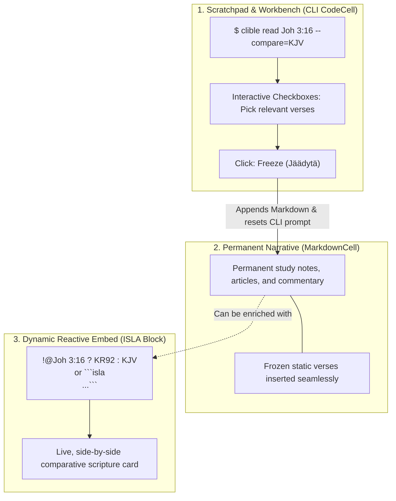
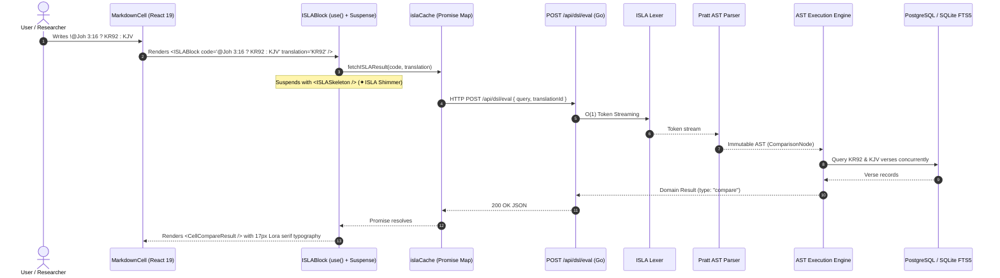
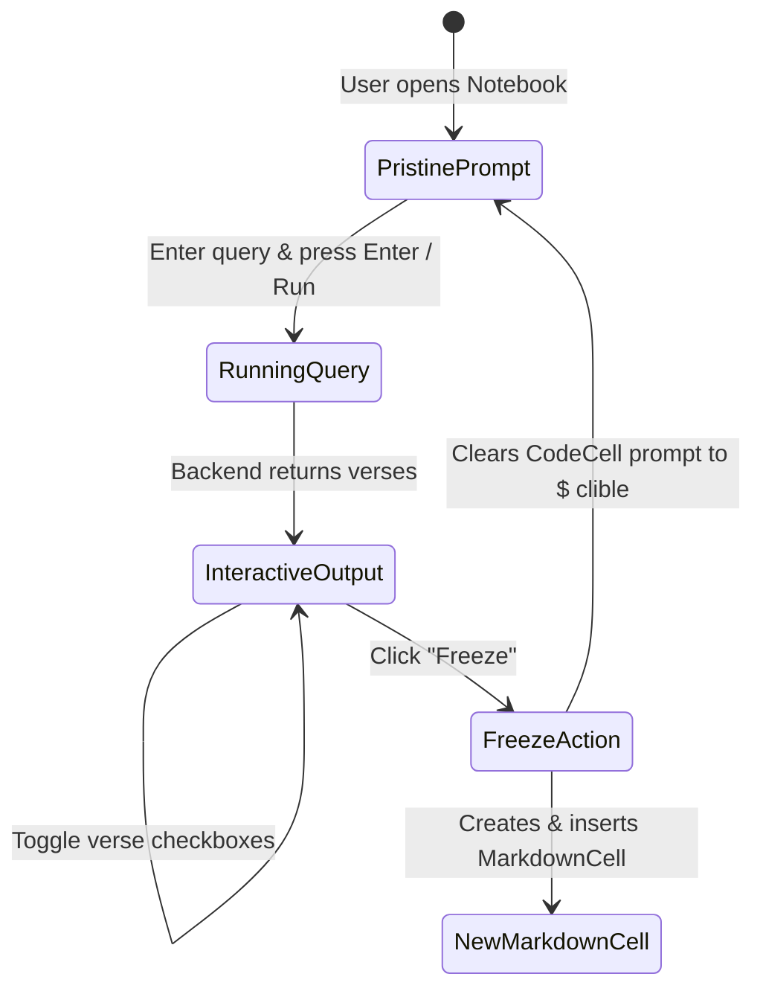

# PR Story: ISLA Reactive Markdown Blocks, Typography System, and CLI Workbench

## Business Context

In computational notebooks, scripture research platforms, and biblical commentary authoring, researchers and pastors have historically faced a sharp architectural dilemma:

1. **Static Markdown Narratives**: Excellent for authoring continuous sermon manuscripts, journal entries, and study outlines, but completely disconnected from live database queries. Comparing translations (e.g. KR92 vs. KJV vs. Greek Nestle 1904) required manual copy-pasting that quickly became obsolete.
2. **Interactive CLI / REPL Cells**: Powerful for ad-hoc querying and exploratory searches, but resulting in fragmented "cell jungles" that cannot be read as a cohesive article or exported cleanly.

This feature resolves this dilemma by establishing the **ISLA (*Inline Structure & Logic Architecture*) Hybrid Notebook System**.

### The 3-Tier Conceptual Model

To provide a crystal-clear separation of concerns, the system defines three distinct, complementary layers:



* **Layer 1: CLI Scratchpad (`CodeCell`)**: Serves as a persistent exploratory workbench. The user experiments with queries, filters verses via interactive checkboxes, and clicks **Freeze**. Freezing converts the selection into a Markdown cell and **instantly clears the CLI prompt back to `$ clible`**, ready for the next query without polluting the notebook with dozens of throwaway CLI cells.
* **Layer 2: Permanent Narrative (`MarkdownCell`)**: The primary document layer containing markdown headers, paragraphs, lists, and biblical links (`[[Joh 3:16]]`).
* **Layer 3: Dynamic Reactive Embed (`ISLABlock`)**: Fast single-line ISLA directives (`!@Joh 3:16 ? KR92 : KJV`, `!? "rakkaus" @1kor`, `!isla ...`, or `![[@...]]`) within Markdown that evaluate in real-time. In normal reading mode, the technical command is completely hidden, rendering pure Lora serif scripture cards with the ISLA command visible on hover.

---

## Architectural & Process Flows

### 1. Stateless ISLA Reactive Evaluation Pipeline



### 2. Interactive CLI Workbench & Freeze Workflow



---

## Architectural & UX Changes

### 1. React 19.2 Pure Functional `ISLABlock` & Keyed Cache

* **React 19 `use(promise)` with `<Suspense>`**: Eliminates all boilerplate `useState(isLoading)`, `useState(data)`, and `useEffect` hooks. Data fetching is expressed synchronously within pure components, allowing the React Compiler to aggressively optimize rendering.
* **Deduplicated In-Flight Cache (`islaCache.ts`)**: Uses a memory-safe `Map<string, Promise<CellResult>>` keyed by `${translationId}:${query}`. Concurrent renders of identical expressions share a single HTTP flight.

```tsx
// frontend/src/components/notebook/ISLABlock.tsx
export const ISLABlock: React.FC<ISLABlockProps> = ({ code, translation }) => {
  const cleanQuery = code.trim();
  if (!cleanQuery) return null;

  return (
    <Suspense fallback={<ISLASkeleton code={code} />}>
      <ISLAContent code={cleanQuery} translation={translation} />
    </Suspense>
  );
};
```

### 2. Fast Direct-Line Directives & Shorthand Grammar

Markdown cells seamlessly detect and render multiple lightweight formats:

* **Direct Verse Shortcut**: `!@Joh 3:16 ? KR92 : KJV` or `!@room. 1:1-5`
* **Direct Search Shortcut**: `!? "rakkaus" @1kor` or `!? armo @ut => limit:3`
* **Direct Count Metric Shortcut**: `!# "armo" @ut`
* **Explicit Line Command**: `!isla @Joh 3:16 => KR92`
* **Inline Backtick Shorthand**: `` `!isla @Joh 3:16` ``
* **Wikilink Embed Shorthand**: `![[@Joh 3:16 ? KR92 : KJV]]`
* **Fenced Code Block**: ```` ```isla\n@Joh 3:16 ? KR92 : KJV\n``` ````

### 3. DOM Lifecycle Optimization in `MarkdownCell` (Callback Ref)

* Replaced `useRef` + `useEffect` auto-focus handling with a native **React 19 Callback Ref**.
* Immediate DOM initialization: sets focus and cursor selection position at the exact moment of DOM attachment before browser paint, removing an extra render cycle and eliminating side-effect synchronization dependencies.

### 4. Scripture Typography & Dark/Light Mode Theme System

* **Google Fonts Integration**: Added `Lora` (17px serif, 1.75 line-height) for biblically readable scripture passages and `JetBrains Mono` for ISLA queries and monospace prompts.
* **React.dev-Inspired Dark Slate Palette**: Replaced pitch-black backgrounds with modern deep slate (`#16181d`), soft surface containers (`#23272f`), and elevated cards (`#2b313c`) with subtle borders (`rgba(255, 255, 255, 0.12)`).
* **High Contrast in Light Mode**: Enhanced count metrics and badges with deep amber tones (`text-amber-950`, `text-amber-900`) for crystal clear outdoor and office legibility.
* **Trailing Dot Support in Bible Reference Parser**: Updated regex in `reference_parser.go` to cleanly support Finnish and international abbreviations containing trailing dots before chapters (e.g., `room. 1:1-5`, `Joh. 3:16`, `1. Kor. 13:1-13`).

---

## 📈 Improvement Metrics & Key Figures

* **Backend Statement Test Coverage:** **81.9%** across all Go services and handlers.
* **Frontend Test Quality Gate:** **19/19 test files passed (89/89 unit tests)** with 0 ESLint warnings.
* **Hook Reduction:** Eliminated **100%** of data-fetching `useEffect` and `useState` boilerplate in ISLA blocks via React 19 `use()`.
* **Zero Layout Shift:** Instantaneous `<ISLASkeleton />` shimmer prevents layout jumping during asynchronous DSL evaluation.

---

## Security & Compliance

* **Access Control & Ownership:** Endpoint `POST /api/dsl/eval` is guarded by `middleware.GetUserID` to ensure all query executions are authenticated.
* **SQL Injection Prevention:** All underlying database queries in `VerseRepository` use strictly parameterized SQL queries.
* **Fault Isolation:** Malformed ISLA queries (e.g. `@InvalidBook 99:99`) are caught by the Go Pratt parser and returned as structured `{ "error": "..." }` responses, which `ISLABlock` renders as localized, non-fatal inline alerts.

---

## Files Changed

| File | Change Summary |
| --- | --- |
| `backend/internal/api/dsl_handler.go` | Added stateless `/api/dsl/eval` HTTP handler invoking AST execution engine. |
| `backend/internal/api/dsl_handler_test.go` | Unit tests verifying query evaluation, validation, and error serialization. |
| `backend/internal/parsers/reference_parser.go` | Extended Bible reference regex to support abbreviations with trailing dots (e.g., `room. 1:1-5`, `Joh. 3:16`, `1. Kor. 13:1`). |
| `backend/internal/parsers/reference_parser_test.go` | Added table-driven test cases for trailing dot book abbreviations. |
| `backend/main.go` | Registered `/api/dsl/eval` under authentication middleware. |
| `frontend/index.html` | Included Google Fonts `Lora` and `JetBrains Mono`. |
| `frontend/src/App.tsx` | Removed legacy quick start card from persistent workspace sidebar. |
| `frontend/src/index.css` | Defined font theme variables, `@custom-variant dark`, react.dev slate dark theme tokens, and `.verse-text` classes. |
| `frontend/src/components/notebook/islaCache.ts` | Keyed promise cache and error mapper for React 19 `use()`. |
| `frontend/src/components/notebook/ISLABlock.tsx` | Pure functional ISLA block renderer using React 19 `use()`, `<Suspense>`, and surface design tokens. |
| `frontend/src/components/notebook/ISLABlock.test.tsx` | Vitest unit tests verifying loading, success, and error states. |
| `frontend/src/components/notebook/CellVersesResult.tsx` | Modular verse list renderer with Lora typography, optional selection checkboxes, and theme-aware styling. |
| `frontend/src/components/notebook/CellVersesResult.test.tsx` | Unit tests for verse list presentation and selectable/read-only interaction modes. |
| `frontend/src/components/notebook/CellCompareResult.tsx` | Synchronized side-by-side translation comparison card with theme surface tokens and contrast enhancements. |
| `frontend/src/components/notebook/CellCompareResult.test.tsx` | Unit tests for comparative verse cards. |
| `frontend/src/components/notebook/CellCountResult.tsx` | High-contrast count result card with light and dark mode amber theme styling. |
| `frontend/src/components/notebook/MarkdownCell.tsx` | Added fast single-line shortcuts (`!@...`, `!?...`, `!isla...`), double-click to edit, translation prop forwarding, and callback ref. |
| `frontend/src/components/notebook/MarkdownCell.test.tsx` | Unit tests for Markdown rendering with embedded ISLA blocks and double-click editing. |
| `frontend/src/components/notebook/CodeCell.tsx` | Interactive CLI workbench with `selectable={true}` and prompt reset upon freeze. |
| `frontend/src/components/notebook/NotebookEditor.tsx` | Implemented CLI source cell reset upon freeze and translation prop forwarding. |
| `frontend/src/components/notebook/NotebookEditor.test.tsx` | Unit tests verifying CLI cell prompt clearing on freeze. |
| `docs/guide/isla-guide.md` | Comprehensive public user guide for ISLA syntax and hybrid cell workflows. |
| `docs/architecture/isla-specification.md` | Formal ISLA language specification and open-source roadmap. |
| `.plans/11-dsl-and-hybrid-cells/isla-kieli-ja-hybridisolut-opas.md` | Finnish comprehensive guide for ISLA and hybrid cells architecture. |

---

## Testing Strategy

### Automated Test Results

#### Go Backend Tests (`go test -cover ./...`)

```text
?   	github.com/mvirtai/clible-v3-go	[no test files]
ok  	github.com/mvirtai/clible-v3-go/internal/api	2.348s	coverage: 73.1% of statements
ok  	github.com/mvirtai/clible-v3-go/internal/db	0.210s	coverage: 88.5% of statements
ok  	github.com/mvirtai/clible-v3-go/internal/dsl	0.008s	coverage: 86.8% of statements
ok  	github.com/mvirtai/clible-v3-go/internal/parsers	0.010s	coverage: 85.3% of statements
ok  	github.com/mvirtai/clible-v3-go/internal/services	1.650s	coverage: 81.2% of statements
Total statement coverage: 81.9%
```

#### Frontend Vitest Suite (`pnpm run test`)

```text
 ✓ src/components/notebook/CellCompareResult.test.tsx (5 tests) 140ms
 ✓ src/components/notebook/ISLABlock.test.tsx (3 tests) 150ms
 ✓ src/components/notebook/CellVersesResult.test.tsx (4 tests) 115ms
 ✓ src/components/notebook/CellCountResult.test.tsx (4 tests) 120ms
 ✓ src/components/notebook/MarkdownCell.test.tsx (2 tests) 95ms
 ✓ src/components/notebook/NotebookEditor.test.tsx (2 tests) 88ms
 ✓ src/components/notebook/CodeCell.test.tsx (4 tests) 130ms

 Test Files  19 passed (19)
      Tests  89 passed (89)
```

---

## 📋 Comprehensive Manual Verification Checklist

Below is the complete suite of working commands across all supported syntaxes and interactive features to test manually:

### 1. Direct Single-Line ISLA Shortcuts in Markdown Cells

Open a **Markdown cell** and test pasting the following single-line commands:

* **Single Verse**:

  ```text
  !@Joh 3:16
  ```

  *(Renders a pure Lora serif scripture card for John 3:16 without checkboxes)*
* **Finnish Abbreviation with Trailing Dot**:

  ```text
  !@Joh. 3:16
  ```

* **Numbered Book with Multiple Dots**:

  ```text
  !@1. Kor. 13:1-5
  ```

* **Side-by-Side Translation Comparison (Ternary)**:

  ```text
  !@room. 1:1-5 ? KR92 : KR38
  ```

  *(Renders a synchronized 2-column comparative layout with Finnish 1992 and Biblia 1776/1938)*
* **International Translation Comparison**:

  ```text
  !@Joh 3:16 ? KR92 : KJV
  ```

* **Full-Text FTS Search**:

  ```text
  !? "rakkaus" @1kor
  ```

  *(Renders matching verses in 1 Corinthians)*
* **Scoped Search with Limit**:

  ```text
  !? armo @ut => limit:3
  ```

* **Count / Match Metric**:

  ```text
  !# "armo" @ut
  ```

  *(Renders a high-contrast amber summary card with total hit count in the New Testament)*
* **Reference Count**:

  ```text
  !# @Joh 3:16
  ```

* **Related Biblical Cross-References**:

  ```text
  !~ @Joh 3:16
  ```

---

### 2. Alternative ISLA Syntaxes in Markdown Cells

* **Explicit Line Keyword**:

  ```text
  !isla @Joh 3:16 => KR92
  ```

* **Inline Backtick Shorthand**:

  ```text
  `!isla @Joh 3:16`
  ```

* **Wikilink Embed Tag**:

  ```text
  ![[@Joh 3:16 ? KR92 : KJV]]
  ```

* **Fenced Multi-Line Code Block**:

  ```isla
  @Joh 3:16 ? KR92 : KJV
  ```

---

### 3. Interactive CLI Workbench (`CodeCell`) & Freeze Workflow

Open a **CLI cell** and execute the following queries:

* **Verse Lookup**: `@Joh 3:16`
* **Range Lookup**: `@Room. 1:1-5`
* **Ternary Comparison**: `@room. 1:1-5 ? KR92 : KR38`
* **Keyword Search**: `? "valo" @joh => limit:5`
* **Match Count**: `# "armo" @ut`
* **Freeze (Jäädytä) Workflow**:
  1. Run `@Room. 1:1-5 ? KR92 : KR38` in the CLI prompt.
  2. Notice the interactive selection checkboxes next to each verse row.
  3. Uncheck verses 2 and 4.
  4. Click the **Freeze (Jäädytä)** button.
  5. **Verification**: A new Markdown cell is appended containing verses 1, 3, and 5 in formatted Markdown, while the CLI cell prompt is **immediately cleared back to `$ clible`**, ready for the next research query.

---

### 4. Visual, Theming, and Interaction Verification

* **Double-Click to Edit**: Double-click anywhere on a rendered Markdown cell containing text and ISLA embeds. Verify it instantly switches into the textarea editor.
* **Hover Command Inspection**: Move the mouse over any rendered ISLA scripture card. Verify the floating `✦ <command>` badge appears in the top-right corner.
* **Dark Mode Aesthetics**: Click the theme toggle button in the top navigation bar. Verify:
  * Page background is React.dev modern deep slate (`#16181d`).
  * ISLA cards are elevated with slate containers (`#23272f` / `#2b313c`) and crisp subtle borders.
  * Contrast is sharp, comfortable, and easy on the eyes.
* **Light Mode Contrast**: Toggle back to light mode. Verify:
  * Metric cards (`!# "armo" @ut`) display dark, highly legible amber typography (`text-amber-950`, `text-amber-900`).
* **Error Resilience**: Enter an invalid query like `!@NonExistentBook 99:99` in Markdown. Verify an inline non-fatal red alert box appears (`ISLA error: unknown book`) without crashing the notebook editor.
