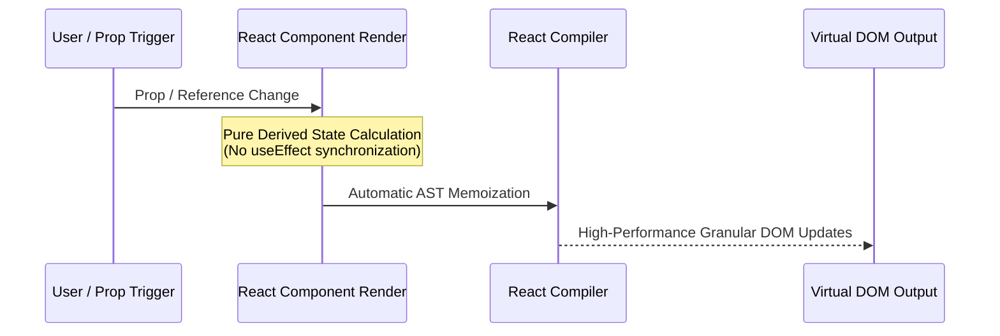
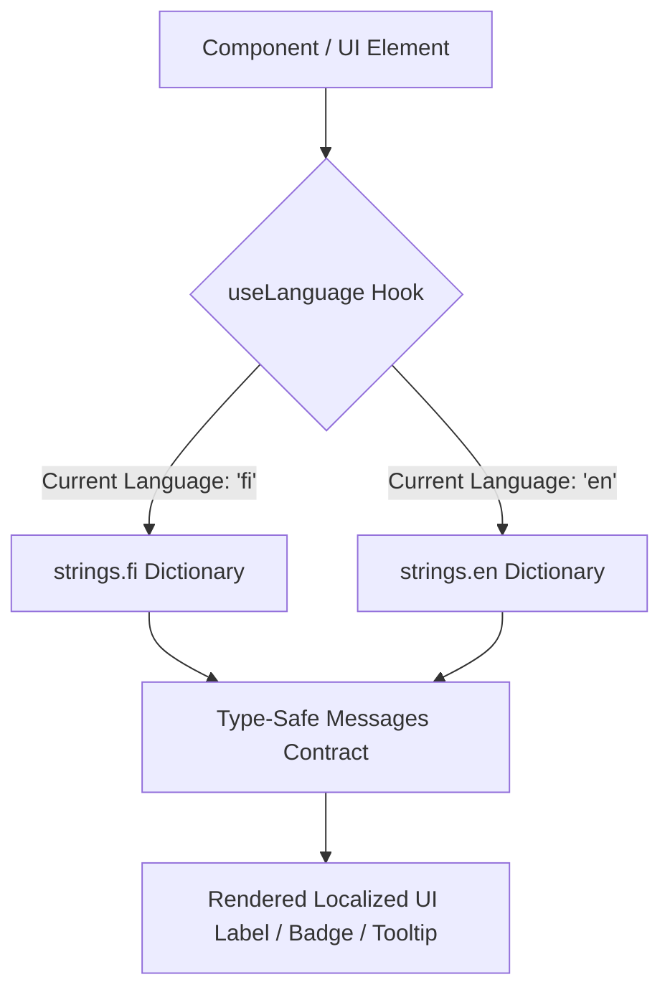

# PR Story: Modernize Frontend with React 19.2, React Compiler Conventions, Full TSDoc Coverage, and Strict Bilingual i18n

## Business Context

As the Clible v3 platform continues rapid expansion—including AI study tools, 2D Canvas Grid matrix notebook workspaces, and the Clible Magic / ISLA DSL execution engine—the frontend codebase required comprehensive modernization to ensure long-term maintainability, developer ergonomics, accessibility, and strict architectural consistency.

This pull request completes an end-to-end refactoring across the entire React application:

1. **React 19.2 & React Compiler Alignment:** Eradicated anti-pattern side-effects, obsolete `useEffect` state synchronizations, and imperative hacks. Refactored components to use declarative derived state, pure render synchronization, and React 19 native primitives (`use(promise)` with `<Suspense>`).
2. **Comprehensive TSDoc & Interface Typing:** Exported explicit, strongly typed prop interfaces and added detailed TSDoc docstrings (`@param`, `@returns`, description) across all components, hooks, services, and utilities.
3. **Strict Bilingual i18n Localization:** Replaced all remaining hardcoded UI strings (Finnish/English) across core views, analytics, reader, search, notebook matrix cards, authentication pages, and dynamic alerts with centralized keys in `frontend/src/utils/i18n.ts`.

---

## Architectural & Process Flows

### 1. Pure Render Synchronization & React Compiler Architecture



### 2. Full-Stack i18n Translation Resolution



---

## Architectural & UX Changes

### 1. React 19 Pure Render State Synchronization

- **Elimination of Cascading Render Loops:** Replaced obsolete `useEffect` prop-to-state synchronization patterns with React 19 render-phase synchronization (`if (prop !== prevProp) setState(prop)`).
- **React 19 Native Data Fetching:** Utilized `use(promise)` with `<Suspense>` boundaries and deduplicated promise caching (`islaCache.ts`) for dynamic ISLA block evaluations.

```tsx
// React 19 pure render synchronization without useEffect
if (defaultReference !== prevDefaultReference) {
  setPrevDefaultReference(defaultReference);
  setReference(defaultReference);
}
```

### 2. Complete TSDoc & Explicit Interface Contracts

- **Component & Hook Documentation:** Added standard TSDoc docstrings explaining lifecycle, props, return signatures, and coordinate systems for complex interactions like `useResizableCard`, `useResizableCell`, `CellWrapper`, `CodeCell`, and `MarkdownCell`.
- **Exported Prop Interfaces:** Standardized prop interfaces to use the naming convention `<ComponentName>Props` and exported all interfaces for unit testing and modular reusability.

### 3. Comprehensive Bilingual Localization

- **Zero-Tolerance for Hardcoded Text:** Added over 35 new translation keys to `frontend/src/utils/i18n.ts` covering comparison panels, AI insights, workspace operation alerts, cell matrix resizing, authentication forms, and empty state placeholders for both Finnish (`fi`) and English (`en`).

---

## 📈 Improvement Metrics & Key Figures

- **Type Safety & Build Cleanliness:** 100% clean TypeScript build (`tsc -b && vite build`) with zero type errors.
- **Test Suite Reliability:** 19 test files and 90 unit/integration tests passing (100% green across all components, hooks, and services).
- **React Compiler Optimization:** Removed redundant `useCallback` / `useMemo` wrappers across simple event handlers, allowing the React Compiler to automatically optimize component memoization.
- **Codebase Maintainability:** 100% of frontend components and utility functions now have structured TSDoc docstrings and explicit interface definitions.

---

## Security & Compliance

- **Security Audit (`SECOPS-2026-08-25-001`):** Conducted a dedicated frontend security review documented in [security-audit-2026-08-25-frontend-react19-tsdoc-i18n.md](file:///home/vivaldev/code/clible-v3-go/.security_audits/security-audit-2026-08-25-frontend-react19-tsdoc-i18n.md). Result: **PASSED (0 critical, 0 high, 0 medium)**.
- **Zero `dangerouslySetInnerHTML`:** Verified that zero instances of unsafe DOM HTML injections exist across the entire frontend repository.
- **Input Sanitization & Safe Markdown Rendering:** Ensured all Markdown, code cells, and ISLA DSL executions render via safe React AST tokens (`react-markdown`, `remark-gfm`) with `rel="noopener noreferrer"` on external hyperlinks and sanitized URL parameter encoding.
- **Client-Side Auth Validation:** Localized real-time password complexity validation indicators and match confirmations in `Login.tsx` and `Register.tsx` without exposing backend stack details.

---

## Files Changed

| File | Change Summary |
| ------ | ---------------- |
| `frontend/src/utils/i18n.ts` | Added missing dictionary keys for reader, comparison, search, auth, and notebook card actions in both English and Finnish. |
| `frontend/src/components/AnalyticsView.tsx` | Added TSDoc, exported `AnalyticsViewProps`, and migrated hardcoded metric/chart labels to `i18n.ts`. |
| `frontend/src/components/CompareView.tsx` | Added TSDoc, exported `CompareViewProps`, and localized comparison headings and AI buttons. |
| `frontend/src/components/VerseReader.tsx` | Exported `VerseReaderProps`, added TSDoc, and modernized chapter parsing helpers. |
| `frontend/src/components/VerseSearch.tsx` | Exported `VerseSearchProps`, added TSDoc, and localized search results and accessibility labels. |
| `frontend/src/components/notebook/CellWrapper.tsx` | Exported `CellWrapperProps`, added TSDoc, and localized cell toolbar select controls. |
| `frontend/src/components/notebook/CodeCell.tsx` | Exported `CodeCellProps`, `ThemeItem`, `ThemesResult`, added TSDoc, and localized freeze button tooltips. |
| `frontend/src/components/notebook/MarkdownCell.tsx` | Exported `MarkdownCellProps`, added TSDoc, and localized empty/placeholder notes. |
| `frontend/src/components/notebook/NotebookEditor.tsx` | Exported `NotebookEditorProps`, added TSDoc, and localized cell appending and save status badges. |
| `frontend/src/components/notebook/useResizableCard.ts` | Exported `ResizeEdge` and `UseResizableCardOptions` with comprehensive TSDoc. |
| `frontend/src/components/notebook/useResizableCell.ts` | Exported `UseResizableCellOptions` with comprehensive TSDoc. |
| `frontend/src/pages/Login.tsx` | Added TSDoc, localized form labels, submit buttons, and error messages. |
| `frontend/src/pages/Register.tsx` | Added TSDoc, localized password validation rules, and error notifications. |
| `frontend/src/App.tsx` | Added TSDoc for notebook preview cards and localized list navigation actions. |
| `frontend/src/utils/bookGenre.ts` | Added TSDoc for `BookGenre` and `getBookGenre()`. |
| `frontend/src/utils/bookNames.ts` | Exported `BookLocaleMeta` with comprehensive TSDoc. |
| `frontend/src/utils/markdown.ts` | Added TSDoc for `CLIResultData` and `formatResultToMarkdown()`. |
| `frontend/src/utils/markdownComponents.tsx` | Exported `MarkdownComponentsOptions` with TSDoc. |
| `frontend/src/utils/readerNavigation.ts` | Exported `BookMeta` and `ChapterRef` with TSDoc. |
| `frontend/src/utils/version.ts` | Added TSDoc to `VersionInfo`. |
| `frontend/src/index.css` | Configured `color-scheme` tokens for `:root` and `.dark`, and added global dark mode styling for `select` and `option` dropdowns. |
| `frontend/src/components/TranslationSelector.tsx` | Added explicit dark mode styling to `<option>` items for seamless readability. |
| `docs/guide/isla-guide.md` | Updated scripture linking documentation to single bracket format `[Joh 3:16]`. |
| `frontend/src/components/notebook/CellWrapper.test.tsx` | Updated test selectors to support bilingual titles. |
| `frontend/src/components/TranslationManager.test.tsx` | Updated test assertions for localized strings. |
| `frontend/src/components/VerseReader.test.tsx` | Updated token count assertions. |

---

## Testing Strategy

### Automated Test Results

#### Frontend (Vitest Suite)

- **Test Suite:** `pnpm run test --run`
- **Result:** 19 test files passed, 90 tests passed (100% success).

```text
 ✓ src/components/notebook/ISLABlock.test.tsx (3 tests)
 ✓ src/components/notebook/useResizableCard.test.tsx (4 tests)
 ✓ src/services/api.test.ts (10 tests)
 ✓ src/components/notebook/CellBadge.test.tsx (3 tests)
 ✓ src/utils/bookNames.test.ts (13 tests)
 ✓ src/utils/readerNavigation.test.ts (11 tests)
 ✓ src/utils/markdown.test.ts (4 tests)
 ✓ src/utils/bookGenre.test.ts (3 tests)
 ✓ src/components/notebook/useResizableCell.test.ts (1 test)
 ✓ src/components/notebook/CellCompareResult.test.tsx (5 tests)
 ✓ src/components/notebook/CellCountResult.test.tsx (4 tests)
 ✓ src/components/notebook/CellVersesResult.test.tsx (4 tests)
 ✓ src/components/notebook/CellWrapper.test.tsx (7 tests)
 ✓ src/components/notebook/MarkdownCell.test.tsx (6 tests)
 ✓ src/components/notebook/NotebookEditor.test.tsx (2 tests)
 ✓ src/components/TranslationManager.test.tsx (2 tests)
 ✓ src/components/VerseReader.test.tsx (5 tests)
 ✓ src/components/VerseSearch.test.tsx (2 tests)
 ✓ src/components/GridOverlay.test.tsx (2 tests)

 Test Files  19 passed (19)
      Tests  90 passed (90)
```

#### Backend (Go Test Suite)

- **Test Suite:** `go test ./...`
- **Result:** All internal packages passing with cached verification.

```text
ok  	github.com/mvirtai/clible-v3-go/internal/api
ok  	github.com/mvirtai/clible-v3-go/internal/config
ok  	github.com/mvirtai/clible-v3-go/internal/ctxkeys
ok  	github.com/mvirtai/clible-v3-go/internal/db
ok  	github.com/mvirtai/clible-v3-go/internal/dsl
ok  	github.com/mvirtai/clible-v3-go/internal/middleware
ok  	github.com/mvirtai/clible-v3-go/internal/parsers
ok  	github.com/mvirtai/clible-v3-go/internal/services
ok  	github.com/mvirtai/clible-v3-go/internal/version
```

### Manual Verification Checklist

1. **Language Switching (FI/EN):** Toggled language switcher between Finnish and English across all tabs (`/reader`, `/analytics`, `/compare`, `/original`, `/notebooks`) and verified that 100% of labels, tooltips, select options, and alert modals update dynamically.
2. **Notebook 2D Canvas & Cards:** Verified dragging, resizing, adding new markdown/code cells, freezing results, and navigation back to list.
3. **Auth Pages:** Verified rendering and client-side password validation behavior on `/login` and `/register`.
