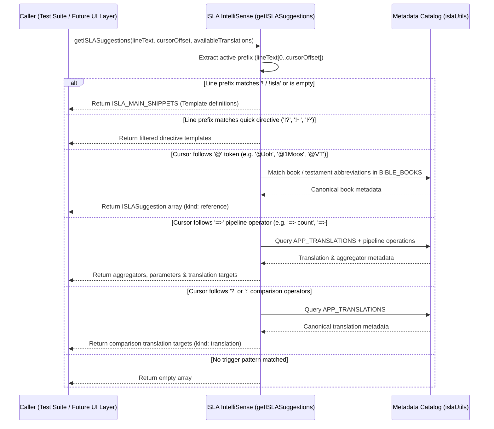

# PR Story: ISLA IntelliSense Core Engine, Cross-Reference Categorization, and Single Source of Truth Versioning

## Business Context

As part of the ISLA (Interactive Scripture Language Architecture) IDE initiative for Clible-v3 notebooks, this PR implements the foundational **ISLA IntelliSense Core Engine** and **Metadata Catalog**. The engine parses cursor context and active line tokens to produce structured autocompletion suggestions (such as ternary comparisons, scoped FTS queries, metrics, book references, cross-references, and regex search templates), establishing the analytical foundation for upcoming editor UI overlays.

In addition, this PR resolves semantic classification ambiguities across the notebook UI by formally categorizing `~` and `!~` directives as deterministic **Cross-Reference** (`refs`) queries instead of AI-driven operations, ensuring accurate badge labels and icon assignments. Finally, it implements a compile-time **Single Source of Truth (SSOT)** versioning mechanism that synchronizes the application version (`v3.1.1`) from the root [`VERSION`](file:///home/vivaldev/code/clible-v3-go/VERSION) file through Docker and Vite into the header UI.

---

## Architectural & Process Flows

### Token Context & Suggestion Dispatch Flow



---

## Architectural & Technical Highlights

### 1. Dedicated ISLA Metadata Registry ([`islaUtils.ts`](file:///home/vivaldev/code/clible-v3-go/frontend/src/components/notebook/isla/islaUtils.ts))

- **Single Source of Truth:** Dynamically transforms `bible_structure.json` alongside `bookNames.ts` helpers (`bookCitationAbbrevFi`, `bookNameLocalized`, `bookName`) into canonical suggestion metadata with localized book names and abbreviations (e.g. `@Joh`, `@1Moos`, `@Gen`).
- **Testament-Level Scoping:** Built-in support for testament scopes (`@VT`, `@UT`, `@OT`, `@NT`) for broad queries such as `!? "armo" @ut => count`.
- **Installed Translation Registry:** Canonical metadata for installed Bible translations with ISLA code aliases:
  - `fin-1992` → `KR92` (Kirkkoraamattu 1992)
  - `fin-biblia-33-38` → `KR38` (Kirkkoraamattu 1933/38)
  - `fin-1776` → `1776` (Biblia 1776)
  - `eng-web` → `WEB` (World English Bible)
  - `kjv` → `KJV` (King James Version)

### 2. Contextual Autocompletion Engine ([`islaIntellisense.ts`](file:///home/vivaldev/code/clible-v3-go/frontend/src/components/notebook/isla/islaIntellisense.ts))

- **Bilingual Documentation:** Each suggestion provides localized descriptions (`fi` and `en`) and syntax usage examples.
- **Active Feature Support:** Fully aligns with verified backend DSL capabilities:
  - Verse lookups (`!@Joh 3:16 => KR92`)
  - Ternary comparisons (`!@Joh 3:16 ? KR92 : KR38`)
  - Cross-references (`!~ @Joh 3:16`)
  - Scoped full-text search (`!? "valkeus" @Joh => limit:5`)
  - Regex queries (`!? /righteous.*/ @Rom => limit:5`)
  - Contextual themes (`!^ => #themes`)
  - Result limiters (`limit:3`, `limit:5`, `limit:10`)
- **Prefix Matching:** Typing `!?`, `!~`, or `!^` filters suggestions to their respective categories.
- **Dynamic Translation Scoping:** Accepts an optional `availableTranslations` parameter to constrain suggestions to active translations while providing safe defaults.

### 3. Cross-Reference Classification & UI Badge Alignment

- **Accurate Semantics:** Replaced legacy `ai` category labels in [`islaClassifier.ts`](file:///home/vivaldev/code/clible-v3-go/frontend/src/utils/islaClassifier.ts) with `refs` for `~`, `!~`, and `refs` queries.
- **UI Components:** Updated [`CellBadge.tsx`](file:///home/vivaldev/code/clible-v3-go/frontend/src/components/notebook/cells/CellBadge.tsx) and [`SortableNotebookCard.tsx`](file:///home/vivaldev/code/clible-v3-go/frontend/src/components/notebook/SortableNotebookCard.tsx) to render link icons (`🔗`) and localized badges (**Viitteet** / **Refs**).

### 4. Single Source of Truth Application Versioning (`v3.1.1`)

- **Vite Build-time Injection:** Configured [`vite.config.ts`](file:///home/vivaldev/code/clible-v3-go/frontend/vite.config.ts) to read the root [`VERSION`](file:///home/vivaldev/code/clible-v3-go/VERSION) file (`3.1.1`) and define `__APP_VERSION__` with robust file-presence fallbacks.
- **Multi-Stage Dockerfile:** Updated [`Dockerfile`](file:///home/vivaldev/code/clible-v3-go/Dockerfile) to copy the root `VERSION` file into the frontend builder stage, ensuring reproducible CI/CD container builds.
- **Dynamic Header:** Replaced hardcoded version text in [`AppHeader.tsx`](file:///home/vivaldev/code/clible-v3-go/frontend/src/components/layout/AppHeader.tsx) with dynamic `v{APP_VERSION}`.
- **Taskfile Hardening:** Updated `version:bump` task in [`Taskfile.yml`](file:///home/vivaldev/code/clible-v3-go/Taskfile.yml) with exact regex patterns to prevent accidental syntax truncation.

### 5. Build & Compiler Hardening

- Cleaned up path aliasing in [`frontend/tsconfig.app.json`](file:///home/vivaldev/code/clible-v3-go/frontend/tsconfig.app.json) by replacing deprecated `baseUrl` with standard `"@/*": ["./src/*"]` mapping for TypeScript compatibility.

---

## 📈 Improvement Metrics & Key Figures

* **Test Coverage:** `islaIntellisense.ts` achieved **100% statements, 100% branches, 100% functions, 100% lines**.
* **Metadata Coverage:** `islaUtils.ts` achieved **100% statements, 100% branches, 100% functions, 100% lines**.
* **Engine Execution Speed:** Sub-millisecond synchronous evaluation ($O(N)$ with $N \le 70$).
* **Full Test Suite:** 25 test files and 135 unit/integration tests passing.

---

## Security & Compliance

* **Memory Safety:** In-memory lexical parsing without dynamic `eval()`, DOM script injection, or unsafe regex backtracking vulnerabilities.
* **Zero Keystroke Telemetry:** Pure client-side static suggestion calculations without network transmission.

---

## Files Changed

| File | Change Summary |
|------|----------------|
| [`VERSION`](file:///home/vivaldev/code/clible-v3-go/VERSION) | Bumps application version to `3.1.1`. |
| [`Taskfile.yml`](file:///home/vivaldev/code/clible-v3-go/Taskfile.yml) | Hardens `version:bump` task replacement patterns. |
| [`Dockerfile`](file:///home/vivaldev/code/clible-v3-go/Dockerfile) | Copies root `VERSION` into frontend build stage for reproducible container builds. |
| [`backend/internal/version/version.go`](file:///home/vivaldev/code/clible-v3-go/backend/internal/version/version.go) | Updates Go backend version constant to `3.1.1`. |
| [`frontend/package.json`](file:///home/vivaldev/code/clible-v3-go/frontend/package.json) | Updates frontend package version to `3.1.1`. |
| [`frontend/vite.config.ts`](file:///home/vivaldev/code/clible-v3-go/frontend/vite.config.ts) | Extracts `VERSION` file with safe fallbacks and defines compile-time `__APP_VERSION__`; configures `@/*` alias. |
| [`frontend/src/vite-env.d.ts`](file:///home/vivaldev/code/clible-v3-go/frontend/src/vite-env.d.ts) | Declares global `__APP_VERSION__` constant for TypeScript. |
| [`frontend/src/utils/version.ts`](file:///home/vivaldev/code/clible-v3-go/frontend/src/utils/version.ts) | Exports `APP_VERSION` sourced from compile-time `__APP_VERSION__`. |
| [`frontend/src/components/layout/AppHeader.tsx`](file:///home/vivaldev/code/clible-v3-go/frontend/src/components/layout/AppHeader.tsx) | Binds header logo version badge to dynamic `APP_VERSION` instead of hardcoded `v3`. |
| [`frontend/src/components/layout/AppHeader.test.tsx`](file:///home/vivaldev/code/clible-v3-go/frontend/src/components/layout/AppHeader.test.tsx) | Asserts dynamic `v3.1.1` rendering in header unit tests. |
| [`frontend/src/components/notebook/isla/islaIntellisense.ts`](file:///home/vivaldev/code/clible-v3-go/frontend/src/components/notebook/isla/islaIntellisense.ts) | Implements `ISLASuggestion` data model, `ISLA_MAIN_SNIPPETS`, and `getISLASuggestions` engine with prefix filtering. |
| [`frontend/src/components/notebook/isla/islaUtils.ts`](file:///home/vivaldev/code/clible-v3-go/frontend/src/components/notebook/isla/islaUtils.ts) | Defines `BIBLE_BOOKS` registry and `APP_TRANSLATIONS` catalog with bilingual metadata. |
| [`frontend/src/components/notebook/isla/islaIntellisense.test.ts`](file:///home/vivaldev/code/clible-v3-go/frontend/src/components/notebook/isla/islaIntellisense.test.ts) | Comprehensive test suite covering snippets, prefixes (`!?`, `!~`, `!^`), book references, pipeline operators, comparisons, and fallbacks. |
| [`frontend/src/utils/islaClassifier.ts`](file:///home/vivaldev/code/clible-v3-go/frontend/src/utils/islaClassifier.ts) | Replaces legacy `ai` category with accurate `refs` cross-reference classification. |
| [`frontend/src/utils/islaClassifier.test.ts`](file:///home/vivaldev/code/clible-v3-go/frontend/src/utils/islaClassifier.test.ts) | Unit tests verifying `refs` classification across queries, cells, and notebook summaries. |
| [`frontend/src/components/notebook/cells/CellBadge.tsx`](file:///home/vivaldev/code/clible-v3-go/frontend/src/components/notebook/cells/CellBadge.tsx) | Updates category badges and labels to render `Refs` / `Viitteet` 🔗. |
| [`frontend/src/components/notebook/cells/MarkdownCell.tsx`](file:///home/vivaldev/code/clible-v3-go/frontend/src/components/notebook/cells/MarkdownCell.tsx) | Aligns cross-reference shorthand documentation and processing. |
| [`frontend/src/components/notebook/SortableNotebookCard.tsx`](file:///home/vivaldev/code/clible-v3-go/frontend/src/components/notebook/SortableNotebookCard.tsx) | Aligns 2D matrix canvas card previews to `refs` theme styling. |
| [`frontend/tsconfig.app.json`](file:///home/vivaldev/code/clible-v3-go/frontend/tsconfig.app.json) | Configures `"@/*": ["./src/*"]` without deprecated `baseUrl`. |

---

## Testing Strategy

### Automated Test Results

#### Frontend (Vitest Suite with Coverage)

```text
Test Files  25 passed (25)
     Tests  135 passed (135)
  Duration  8.52s

% Coverage report from v8
-------------------|---------|----------|---------|---------|-------------------
File               | % Stmts | % Branch | % Funcs | % Lines | Uncovered Line #s 
-------------------|---------|----------|---------|---------|-------------------
.../notebook/isla  |   91.97 |    87.34 |   91.66 |   92.69 |                   
 islaIntellisense  |     100 |      100 |     100 |     100 |                   
 islaUtils.ts      |     100 |      100 |     100 |     100 |                   
 islaLexer.ts      |   89.09 |    84.04 |     100 |   88.99 | ...               
-------------------|---------|----------|---------|---------|-------------------
```

#### Backend (Go Test Suite)

```text
ok  	github.com/mvirtai/clible-v3-go/internal/api	(cached)
ok  	github.com/mvirtai/clible-v3-go/internal/config	(cached)
ok  	github.com/mvirtai/clible-v3-go/internal/db	(cached)
ok  	github.com/mvirtai/clible-v3-go/internal/dsl	(cached)
ok  	github.com/mvirtai/clible-v3-go/internal/parsers	(cached)
ok  	github.com/mvirtai/clible-v3-go/internal/services	(cached)
```

---

## Manual Verification Checklist

1. **Dynamic Version Header:** Verified in browser that the top-level application header dynamically renders `v3.1.1` sourced from `VERSION`.
2. **Cross-Reference Cell Badges:** Verified in browser that notebook cells containing `~` and `!~` render the localized `Viitteet` / `Refs` (🔗) badge pill without AI references.
3. **Frontend Production Build:** Verified locally via `pnpm run build` (`tsc -b && vite build`) that TypeScript type checking and bundling succeed without warnings or errors.
4. **Multi-Stage Docker Build:** Verified that Docker builds complete cleanly with root `VERSION` resolution in the `frontend-builder` stage.
5. **IntelliSense Engine Integrity:** Verified via automated unit tests (`islaIntellisense.test.ts`, 19 test cases) that token parsing, prefix filtering (`!?`, `!~`, `!^`), book reference resolutions (`@Joh`), comparison operators, and pipeline aggregators execute accurately with 100% code coverage.
