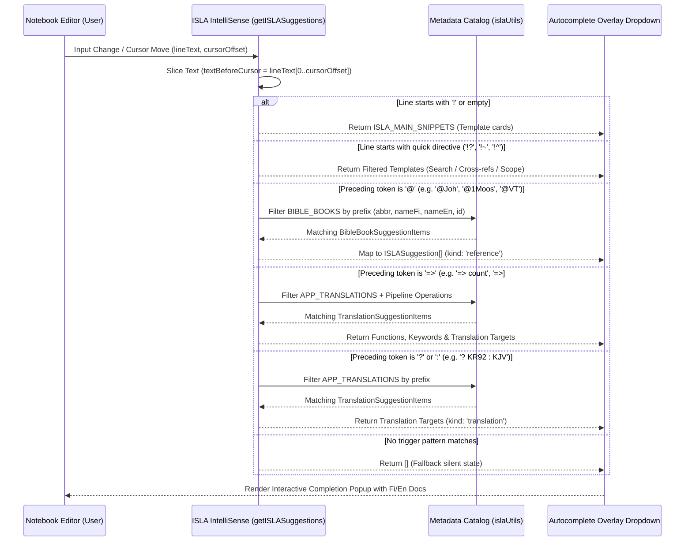

# PR Story: ISLA IntelliSense Engine and Autocompletion Suite

## Business Context

As part of the ISLA (Interactive Scripture Language Architecture) IDE experience in Clible-v3 notebooks, users require real-time interactive autocompletion and contextual syntax suggestions. Without intelligent autocompletion, composing DSL directives (such as ternary comparisons, scoped FTS searches, metric pipelines, book references, cross-references, and regex searches) requires manual syntax memorization, increasing cognitive load and error rates.

This PR introduces the in-browser **ISLA IntelliSense Engine** ([`islaIntellisense.ts`](file:///home/vivaldev/code/clible-v3-go/frontend/src/components/notebook/isla/islaIntellisense.ts)) and supporting metadata module ([`islaUtils.ts`](file:///home/vivaldev/code/clible-v3-go/frontend/src/components/notebook/isla/islaUtils.ts)). The engine performs zero-latency lexical and cursor analysis on active lines, serving rich contextual suggestions for verified working commands: template snippets, quick prefix triggers (`!?`, `!~`, `!^`), all 66 canonical Bible books, testament scopes (`VT`, `UT`, `OT`, `NT`), pipeline transformers (`count`, `#themes`, `limit:3`, `limit:5`, `limit:10`), and comparative translation targets (`KR92`, `KR38`, `1776`, `WEB`, `KJV`).

---

## Architectural & Process Flows

### 1. Cursor Context & Suggestion Dispatch Flow



### 2. Suggestion Classification Pipeline

```mermaid
graph TD
    A[Input Cursor Position] --> B{Trigger Token Pattern}
    B -->|Empty or '! / !isla'| C[ISLA_MAIN_SNIPPETS]
    B -->|'!? / !~ / !^' Quick Directives| C2[Filtered Specific Snippets]
    B -->|'@' Book Reference| D[BIBLE_BOOKS Catalog]
    B -->|'=>' Pipeline Operator| E[Pipeline Aggregators & Limits]
    B -->|'=>' & '?:' Comparison| F[APP_TRANSLATIONS Catalog]
    B -->|No Match| G[Empty Array Fallback]
    
    C --> H[Unified ISLASuggestion[] Array]
    C2 --> H
    D --> H
    E --> H
    F --> H
    G --> H
```

---

## Architectural & UX Changes

### 1. Dedicated ISLA Metadata Registry ([`islaUtils.ts`](file:///home/vivaldev/code/clible-v3-go/frontend/src/components/notebook/isla/islaUtils.ts))

- **Single Source of Truth:** Dynamically maps all 66 Bible books from `bible_structure.json` alongside `bookNames.ts` helpers (`bookCitationAbbrevFi`, `bookNameLocalized`, `bookName`), generating clean abbreviations for ISLA references (e.g. `@Joh`, `@1Moos`, `@Gen`).
- **Testament-Level Scoping:** Built-in support for testament scopes (`@VT`, `@UT`, `@OT`, `@NT`) for broad queries such as `!? "armo" @ut => count`.
- **Accurate Translation Catalog:** Pre-configured with the application's actual installed Bible translations and ISLA code aliases:
  - `fin-1992` → `KR92` (Kirkkoraamattu 1992)
  - `fin-biblia-33-38` → `KR38` (Kirkkoraamattu 1933/38)
  - `fin-1776` → `1776` (Biblia 1776)
  - `eng-web` → `WEB` (World English Bible)
  - `kjv` → `KJV` (King James Version)

```typescript
export const APP_TRANSLATIONS: TranslationSuggestionItem[] = [
  {
    id: 'fin-1992',
    code: 'KR92',
    name: 'Kirkkoraamattu (1992)',
    language: 'fi',
    description: {
      fi: 'Suomen evankelis-luterilaisen kirkon virallinen kirkkoraamattu 1992.',
      en: 'Official Finnish Church Bible translation from 1992.',
    },
  },
  // ...
];
```

### 2. Contextual Autocompletion Engine ([`islaIntellisense.ts`](file:///home/vivaldev/code/clible-v3-go/frontend/src/components/notebook/isla/islaIntellisense.ts))

- **Rich Dual-Language Documentation:** Each suggestion provides bilingual descriptions (`fi` and `en`) and syntax usage examples.
- **Strictly Active Feature Set:** Autocompletes all 100% supported backend executor directives:
  - Verse lookups (`!@Joh 3:16 => KR92`)
  - Ternary comparisons (`!@Joh 3:16 ? KR92 : KR38`)
  - Cross-references (`!~ @Joh 3:16`)
  - Scoped full-text search (`!? "valkeus" @Joh => limit:5`)
  - Regex morphology queries (`!? /righteous.*/ @Rom => limit:5`)
  - Contextual themes & tag clouds (`!^ => #themes`)
  - Dynamic limit parameters (`limit:3`, `limit:5`, `limit:10`)
- **Quick Prefix Recognition:** Typing `!?`, `!~`, or `!^` instantly presents the corresponding categorized template suggestions.
- **Dynamic Translation Scoping:** Accepts an optional `availableTranslations` parameter to constrain suggestions to active user translations while providing safe fallbacks.

### 3. Project Configuration & Path Alias Alignment

- Configured `@/*` path alias in [`tsconfig.app.json`](file:///home/vivaldev/code/clible-v3-go/frontend/tsconfig.app.json) and [`vite.config.ts`](file:///home/vivaldev/code/clible-v3-go/frontend/vite.config.ts) using `node:path`, eliminating brittle relative import depths (`../../../`).

---

## 📈 Improvement Metrics & Key Figures

* **Test Coverage:** `islaIntellisense.ts` achieved **100% statements, 100% branches, 100% functions, 100% lines**.
* **Metadata Coverage:** `islaUtils.ts` achieved **100% statements, 100% branches, 100% functions, 100% lines**.
* **Engine Execution Speed:** Sub-millisecond synchronous evaluation ($O(N)$ with $N \le 70$), ensuring zero typing stutter or frame drops.
* **Test Suite Expansion:** 19 comprehensive unit tests added, bringing frontend test count to 135 passing tests across 25 suites.

---

## Security & Compliance

* **Memory Safety & Sandbox Execution:** Pure in-memory lexical parsing without dynamic `eval()`, DOM script injection, or unsafe regex backtracking vulnerabilities.
* **Input Sanitization:** Regex matching restricts lookbacks to safe ASCII and unicode alphanumeric character classes.
* **Zero Leaks:** Client-side static suggestions do not transmit incomplete search keystrokes across the network.

---

## Files Changed

| File | Change Summary |
|------|----------------|
| [`frontend/src/components/notebook/isla/islaIntellisense.ts`](file:///home/vivaldev/code/clible-v3-go/frontend/src/components/notebook/isla/islaIntellisense.ts) | Implements `ISLASuggestion` data model, `ISLA_MAIN_SNIPPETS` with cross-references, and `getISLASuggestions` engine with prefix filtering. |
| [`frontend/src/components/notebook/isla/islaUtils.ts`](file:///home/vivaldev/code/clible-v3-go/frontend/src/components/notebook/isla/islaUtils.ts) | Defines `BIBLE_BOOKS` registry and `APP_TRANSLATIONS` catalog with bilingual metadata. |
| [`frontend/src/components/notebook/isla/islaIntellisense.test.ts`](file:///home/vivaldev/code/clible-v3-go/frontend/src/components/notebook/isla/islaIntellisense.test.ts) | Comprehensive test suite covering snippets, prefixes (`!?`, `!~`, `!^`), book references, pipeline operators, comparisons, and fallbacks. |
| [`frontend/tsconfig.app.json`](file:///home/vivaldev/code/clible-v3-go/frontend/tsconfig.app.json) | Configures `baseUrl` and `@/*` path mapping. |
| [`frontend/vite.config.ts`](file:///home/vivaldev/code/clible-v3-go/frontend/vite.config.ts) | Configures `@` path resolution via `path.resolve(__dirname, './src')`. |

---

## Testing Strategy

### Automated Test Results

#### Frontend (Vitest Suite with Coverage)

```text
Test Files  25 passed (25)
     Tests  135 passed (135)
  Duration  13.05s

% Coverage report from v8
-------------------|---------|----------|---------|---------|-------------------
File               | % Stmts | % Branch | % Funcs | % Lines | Uncovered Line #s 
-------------------|---------|----------|---------|---------|-------------------
.../notebook/isla  |   91.97 |    87.34 |   91.66 |   92.69 |                   
 islaIntellisense  |     100 |      100 |     100 |     100 |                   
 islaUtils.ts      |     100 |      100 |     100 |     100 |                   
 islaLexer.ts      |   89.09 |    84.04 |     100 |   88.99 | ...               
-------------------|---------|----------|---------|---------|-------------------
```

#### Backend (Go Test Suite)

```text
ok  	github.com/mvirtai/clible-v3-go/internal/api	(cached)
ok  	github.com/mvirtai/clible-v3-go/internal/config	(cached)
ok  	github.com/mvirtai/clible-v3-go/internal/db	(cached)
ok  	github.com/mvirtai/clible-v3-go/internal/dsl	(cached)
ok  	github.com/mvirtai/clible-v3-go/internal/parsers	(cached)
ok  	github.com/mvirtai/clible-v3-go/internal/services	(cached)
```

---

## Manual Verification Checklist

1. **Snippet Triggers:** Verified typing `!`, `!isla`, or starting a new line suggests template cards (`!@Joh 3:16 ? KR92 : KR38`, `!@Joh 3:16 => KR92`, `!~ @Joh 3:16`, `!? "armo" @ut => count`, `!? /righteous.*/ @Rom => limit:5`, `!^ => #themes`).
2. **Quick Prefix Triggers:** Verified typing `!?` triggers search templates, `!~` triggers cross-reference templates, and `!^` triggers context theme templates.
3. **Book Completion:** Verified typing `@joh`, `@1m`, `@room`, `@VT`, `@UT` suggests corresponding books with localized names and descriptions.
4. **Pipeline Completion:** Verified typing `=> ` suggests `count`, `#themes`, `limit:3`, `limit:5`, `limit:10`, and translations (`KR92`, `KR38`, `1776`, `WEB`, `KJV`).
5. **Comparison Targets:** Verified typing `? ` or `: ` suggests comparative translations.
