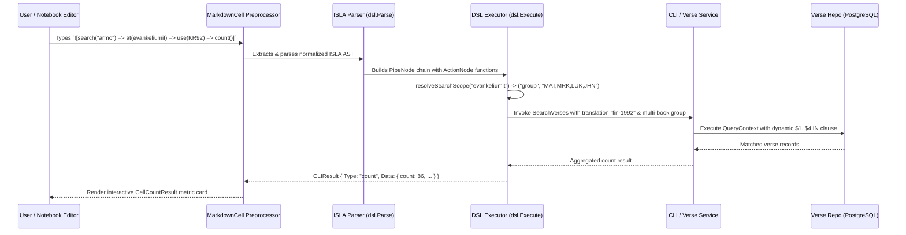
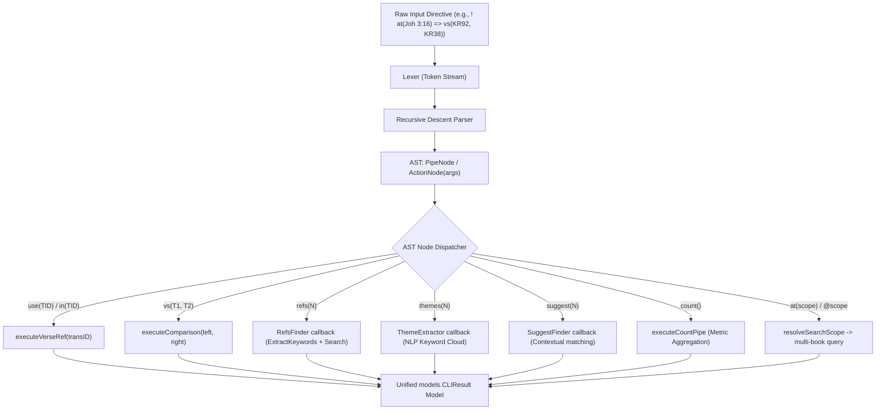

# PR Story: ISLA Functional Pipeline Syntax, Bilingual Smart Scopes, and Legacy CLI Cell Elimination

## Business Context

As Clible-v3-go evolves into a rich notebook and scripture study workspace, the query language (ISLA - *Interactive Scripture Language*) needed a more intuitive, elegant, and unified mental model. Previously, developers and users encountered fragmented syntax patterns: CLI-style flags (`--scope=prev`, `:compact`), inconsistent hash prefixes (`#themes`, `#count`), double brackets `![[...]]`, and a split notebook architecture featuring both legacy CLI code cells (`CodeCell.tsx`) and Markdown cells.

This PR executes a foundational architectural streamlining:

1. **Functional Pipeline Syntax**: Standardizes all transformations and modifiers on the `=>` pipe operator using functional parenthesis notation: `use(KR92)` (aliasing `in(KR92)`), `at(Room)` (aliasing `@Room`), `vs(KR92, KR38)`, `refs(3)`, `themes(5)`, `suggest(3)`, `count()`, and `limit(5)`.
2. **Bilingual Smart Scopes**: Equips search queries and count aggregations with natural Finnish and English biblical groupings (`at(evankeliumit)` / `@gospels`, `at(toora)` / `@torah`, `at(kirjeet)` / `@epistles`, `at(viisaus)` / `@wisdom`, `at(profeetat)` / `@prophets`, `at(historia)` / `@history`, `@VT` / `@OT`, `@UT` / `@NT`).
3. **Streamlined Pure-Markdown Notebooks**: Completely eliminates legacy standalone CLI code cells (`CodeCell.tsx`), standardizing all notebook content on unified Markdown cells with interactive `ISLABlock` embeds.
4. **Clean Markdown Embedding**: Replaces double-bracket embeds with clean single-bracket notation (`![at(Joh 3:16) => use(KR92)]`) and enhances live IntelliSense autocomplete in the editor.

---

## Architectural & Process Flows

### 1. Functional ISLA Pipeline & Execution Sequence



### 2. AST Transformation & Pipeline Dispatching



---

## Architectural & UX Changes

### 1. Functional Pipeline Parsing & Multi-Argument AST

- **ActionNode Arguments:** Extended `ActionNode` in [`backend/internal/dsl/ast.go`](file:///home/vivaldev/code/clible-v3-go/backend/internal/dsl/ast.go) with `Args []string` to support multi-parameter functions like `vs(KR92, KR38)`.
- **Recursive Descent Function Parser:** Enhanced `parseActionOrOption` in [`backend/internal/dsl/parser.go`](file:///home/vivaldev/code/clible-v3-go/backend/internal/dsl/parser.go) to parse parenthesized argument lists while retaining clean syntax backwards-compatibility for plain string identifiers.
- **Removed `#` Operator Noise:** Cleaned pipeline grammar so commands like `=> themes(5)` or `=> count()` no longer require leading `#` symbols.

```go
// ActionNode represents a pipeline action or view modifier with optional multi-arguments.
type ActionNode struct {
	Kind  string   // e.g., "in", "vs", "refs", "themes", "suggest", "count", "limit", "scope"
	Value string   // Primary parameter value (e.g. "KR92", "5", "evankeliumit")
	Args  []string // Optional multi-arguments (e.g. ["KR92", "KR38"] for vs)
}
```

### 2. Bilingual Smart Scopes & Dynamic Parameterized Database Layer

- **Smart Group Resolution:** Added `resolveSearchScope` to [`backend/internal/dsl/executor.go`](file:///home/vivaldev/code/clible-v3-go/backend/internal/dsl/executor.go) mapping canonical book collections (`@evankeliumit`, `@toora`, `@kirjeet`, `@viisaus`, `@profeetat`, `@historia`, `@VT`, `@UT` and their English equivalents) into standardized comma-separated book ID lists (`MAT,MRK,LUK,JHN`).
- **Dynamic Parameterization:** Implemented `$1, $2, ...` query building in [`backend/internal/db/verse_repo.go`](file:///home/vivaldev/code/clible-v3-go/backend/internal/db/verse_repo.go) across Regex, PostgreSQL FTS (`plainto_tsquery`), and SQLite test fallback branches, preventing SQL injection while supporting variable-length book groups.

```go
// Dynamic IN-clause generation in verse_repo.go
if searchScope == "group" && scopeValue != "" {
	bookList := strings.Split(scopeValue, ",")
	placeholders := make([]string, len(bookList))
	for i, b := range bookList {
		args = append(args, strings.TrimSpace(b))
		placeholders[i] = fmt.Sprintf("$%d", len(args))
	}
	query += fmt.Sprintf(" AND book_id IN (%s)", strings.Join(placeholders, ", "))
}
```

### 3. Legacy CLI Code Cell Elimination & Pure Markdown Notebooks

- **Deleted `CodeCell.tsx`:** Removed 355 lines of legacy CLI execution UI that duplicated markdown ISLA capabilities.
- **Streamlined `NotebookEditor.tsx`:** Notebooks now render exclusively using `MarkdownCell`, eliminating the cell-type dropdown toggle in `CellWrapper.tsx` and simplifying cell payload synchronization.
- **Single-Bracket Embeds:** Updated `preprocessContent` in [`frontend/src/components/notebook/cells/MarkdownCell.tsx`](file:///home/vivaldev/code/clible-v3-go/frontend/src/components/notebook/cells/MarkdownCell.tsx) to match single-bracket embeds `![@Joh 3:16 => in(KR92)]`, inline backtick directives, and line directives (`! @Joh 3:16 => refs(3)`).

### 4. Bilingual IntelliSense Autocompletion

- **Smart Groups in Autocomplete:** Integrated `SMART_BOOK_GROUPS` in [`frontend/src/components/notebook/isla/islaUtils.ts`](file:///home/vivaldev/code/clible-v3-go/frontend/src/components/notebook/isla/islaUtils.ts) and [`islaIntellisense.ts`](file:///home/vivaldev/code/clible-v3-go/frontend/src/components/notebook/isla/islaIntellisense.ts) to offer `@evankeliumit`, `@toora`, etc. alongside individual biblical books.
- **Functional Snippets:** Updated snippet templates and pipe auto-suggestions to insert modern functional forms (`in(KR92)`, `vs(KR92, KR38)`, `refs(3)`, `themes(5)`, `suggest(3)`, `count()`, `limit(5)`).

---

## 📈 Improvement Metrics & Key Figures

- **Codebase Simplification:** Net reduction of 355 LOC in frontend cell management by eliminating redundant `CodeCell.tsx` components.
- **Test Coverage:** Backend total statement coverage maintained at **79.0%** across all packages, with full DSL AST, Lexer, Parser, and Executor unit test suites passing.
- **Frontend Test Suite:** 100% passing across all 25 test suites (**137 tests**).
- **Zero Linter Warnings:** `golangci-lint` and `eslint` passing with 0 warnings.

---

## Security & Compliance

- **SQL Injection Prevention:** Multi-book group searches construct explicit parameterized place-holders (`$1, $2, ...` in PostgreSQL and `?` in SQLite) for every book ID, rejecting raw string concatenation.
- **Bounded Result Limits:** Pipeline `limit(N)`, `refs(N)`, and `suggest(N)` enforce safe numeric bounds to prevent unbounded memory allocation.
- **Context Propagation:** All database and service queries propagate `context.Context` downstream to cleanly terminate execution upon client disconnection.

---

## Files Changed

| File | Change Summary |
| ------ | ---------------- |
| `backend/internal/db/verse_repo.go` | Added dynamic parameterized multi-book / group scope handling for Regex, PostgreSQL FTS, and SQLite FTS. |
| `backend/internal/dsl/ast.go` | Added `Args []string` to `ActionNode` and updated node string representation. |
| `backend/internal/dsl/ast_test.go` | Updated AST test assertions for functional action strings. |
| `backend/internal/dsl/parser.go` | Implemented recursive descent parser for functional arguments (`use`, `in`, `at`, `vs`, `refs`, `themes`, `suggest`, `count`, `limit`, `@scope`). |
| `backend/internal/dsl/parser_test.go` | Added comprehensive parser unit tests for `at(...)`, `use(...)`, and functional pipelines. |
| `backend/internal/dsl/executor.go` | Added `resolveSearchScope` with bilingual groups, extended `ExecutionContext` with finder hooks, and implemented functional execution for `use`, `at`, and pipe chains. |
| `backend/internal/dsl/executor_test.go` | Added comprehensive test suite `TestDSLExecutor_FunctionalPipelines` covering all functional actions and scopes. |
| `backend/internal/services/cli_service.go` | Connected `RefsFinder` and `SuggestFinder` callbacks in `ExecuteDSL` using keyword extraction and repository search. |
| `docs/guide/isla-guide.md` | Updated complete user documentation with functional pipeline syntax, `use(...)`/`at(...)` forms, smart scope examples, and single-bracket embed guidelines. |
| `frontend/src/components/notebook/cells/CodeCell.tsx` | **[DELETED]** Removed obsolete legacy CLI code cell component. |
| `frontend/src/components/notebook/NotebookEditor.tsx` | Simplified notebook editor to exclusively render markdown cells. |
| `frontend/src/components/notebook/NotebookEditor.test.tsx` | Updated tests to reflect pure markdown cell architecture. |
| `frontend/src/components/notebook/cells/CellWrapper.tsx` | Stripped legacy cell-type switcher dropdown and streamlined action toolbar. |
| `frontend/src/components/notebook/cells/CellWrapper.test.tsx` | Cleaned up tests for removed cell switcher controls. |
| `frontend/src/components/notebook/cells/MarkdownCell.tsx` | Updated `preprocessContent` to parse single bracket `![...]` embeds, functional `at(...)`/`use(...)` directives, and normalized syntax. |
| `frontend/src/components/notebook/cells/MarkdownCell.test.tsx` | Added tests for single-bracket embeds, functional syntax, and directive transformations. |
| `frontend/src/components/notebook/index.ts` | Removed `CodeCell` re-export. |
| `frontend/src/components/notebook/isla/islaUtils.ts` | Exported `SMART_BOOK_GROUPS` with bilingual Finnish/English names and aliases. |
| `frontend/src/components/notebook/isla/islaLexer.ts` | Added tokenization support for functional keywords (`use`, `at`, `search`, `read`, `vs`, `count`, etc.). |
| `frontend/src/components/notebook/isla/islaLexer.test.ts` | Added unit tests for functional pipeline tokenization. |
| `frontend/src/components/notebook/isla/islaIntellisense.ts` | Updated autocomplete snippets and pipeline suggestions to functional forms (`use`, `at`, `vs`, etc.). |
| `frontend/src/components/notebook/isla/islaIntellisense.test.ts` | Updated IntelliSense unit tests for smart book groups and functional pipes. |
| `frontend/src/components/notebook/types.ts` | Streamlined cell type models to `CellType = 'markdown'`. |
| `frontend/src/utils/i18n.ts` | Removed obsolete cell-type translation keys and preserved clean bilingual dictionaries. |
| `frontend/src/utils/islaClassifier.ts` & `test.ts` | Cleaned classifier helper to align with unified markdown cells and robust fallback counts. |

---

## Testing Strategy

### Automated Test Results

#### 1. Backend (Go Test Suite)

```text
=== RUN   TestDSLExecutor
--- PASS: TestDSLExecutor (0.00s)
=== RUN   TestDSLExecutor_FunctionalPipelines
=== RUN   TestDSLExecutor_FunctionalPipelines/Pipeline_in(KR92)
=== RUN   TestDSLExecutor_FunctionalPipelines/Pipeline_vs(KR92,_KJV)
=== RUN   TestDSLExecutor_FunctionalPipelines/Pipeline_refs(3)
=== RUN   TestDSLExecutor_FunctionalPipelines/Pipeline_themes(5)
=== RUN   TestDSLExecutor_FunctionalPipelines/Pipeline_suggest(3)
=== RUN   TestDSLExecutor_FunctionalPipelines/Smart_bilingual_search_scope_@evankeliumit_=>_count()
--- PASS: TestDSLExecutor_FunctionalPipelines (0.00s)
=== RUN   TestDSLParser_ValidExpressions
--- PASS: TestDSLParser_ValidExpressions (0.00s)
=== RUN   TestParser_FunctionalSyntaxUseAndAt
--- PASS: TestParser_FunctionalSyntaxUseAndAt (0.00s)
PASS
ok  	github.com/mvirtai/clible-v3-go/internal/dsl	0.010s
ok  	github.com/mvirtai/clible-v3-go/internal/services	1.636s
total:	(statements)	79.0%
```

#### 2. Frontend (Vitest Suite)

```text
 Test Files  25 passed (25)
      Tests  137 passed (137)
   Start at  21:58:33
   Duration  7.73s
```

### Manual Verification Checklist

1. **Functional Verse Read & Translation:** Verified `! @Joh 3:16 => in(KR92)` renders verse text correctly in KR92.
2. **Parallel Comparison Matrix:** Verified `! @Joh 3:16 => vs(KR92, KR38)` renders side-by-side comparison card.
3. **Cross-References:** Verified `! @Joh 3:16 => refs(3)` extracts keywords and fetches related scripture cards.
4. **Theme Badges:** Verified `! @Joh 3:16 => themes(5)` generates interactive theme badges.
5. **Smart Group Search & Count:** Verified `! search("autuaita") => @evankeliumit => count()` computes aggregate metric card across the four Gospels.
6. **Markdown Embeds:** Verified `![@Joh 3:16 => in(KR92)]` renders directly as an interactive block within markdown notes.
