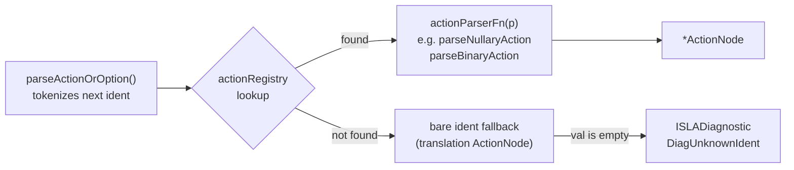
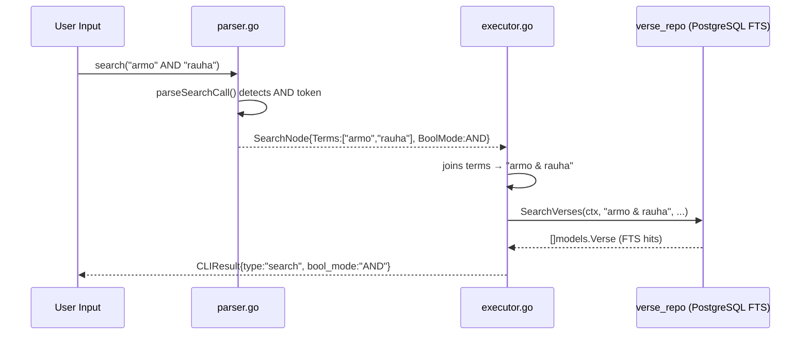
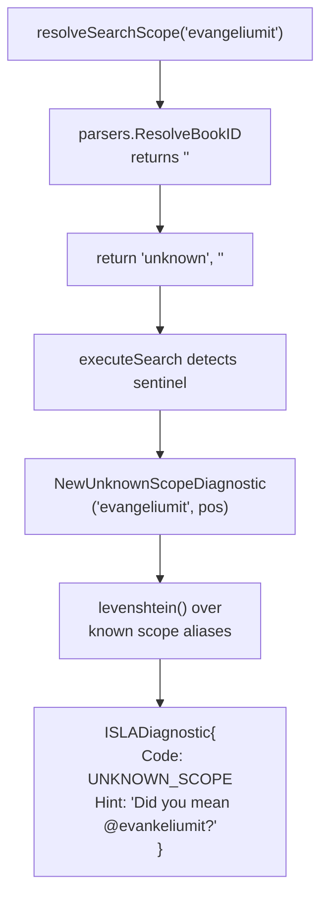
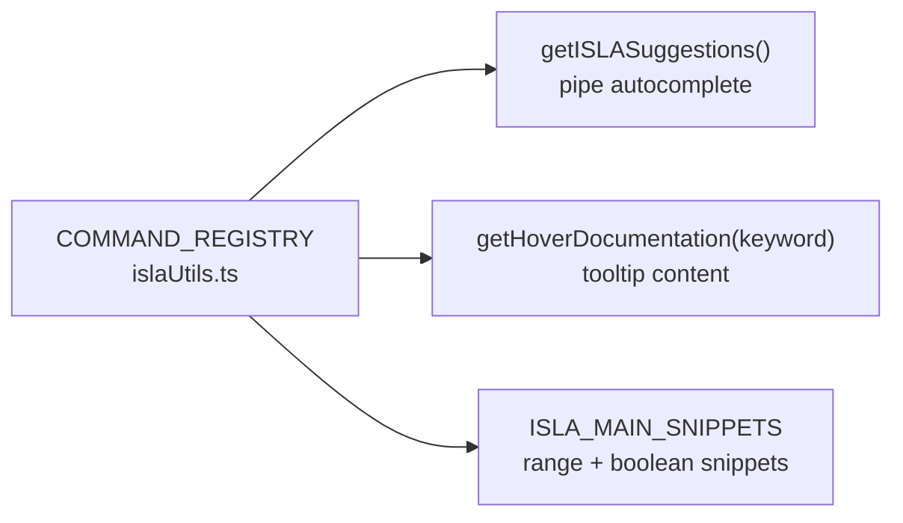

# PR Story: ISLA DSL Extensions — Action Registry, Range Passages, Boolean Search, and Smart Diagnostics

## Business Context

The ISLA DSL parser has grown organically since its introduction, relying on a long sequential `if` chain in `parseActionOrOption` and on simple string equality in the executor's scope resolver. This accumulation of ad-hoc logic made adding new commands risky (high regression risk) and error messages unhelpful for the user (plain `"unknown token"` without suggestions).

This PR executes three tightly related capability increments that together elevate ISLA from a working prototype DSL to an extensible, self-documenting query language:

1. **ActionRegistry architecture** — replaces the `if`/`else` chain with a `map[string]actionParserFn` registry. Adding a new command now requires only a single registry entry.
2. **`RangeNode` and `range()` primary** — enables contiguous passage reading (`range(Joh 1:1, Joh 3:36)`), opening the door to chapter-level and book-level studies.
3. **Boolean search composition** — `search("armo" AND "rauha")` and `search("valo" OR "pimeys")` compile to PostgreSQL `tsquery` operators (`&`, `|`) at execution time, pushing boolean logic to the database FTS layer.
4. **ISLADiagnostic error system** — replaces bare `fmt.Errorf` errors with typed `*ISLADiagnostic` values carrying a `DiagnosticCode`, a human-readable message, and a Levenshtein-driven `Hint` (`"Did you mean @evankeliumit?"`).
5. **COMMAND_REGISTRY and IntelliSense alignment** — a single TypeScript registry now drives pipeline autocomplete, hover documentation, and snippet generation, eliminating duplicated documentation strings across the frontend.

---

## Architectural & Process Flows

### 1. ActionRegistry Dispatch — Parser Layer

Every ISLA pipeline action resolves through a `map[string]actionParserFn` initialized in `init()`. The parser's control flow is a direct data lookup rather than a long `if` chain.



### 2. Boolean Search — Parser → Executor → DB Layer

Boolean terms are collected into `SearchNode.Terms` with a `SearchBoolMode` (AND/OR/None). The executor joins them with PostgreSQL `tsquery` operators before calling `SearchVerses`.



### 3. ISLADiagnostic — Structured Error Flow

Unknown scope identifiers and unrecognised command names now return `*ISLADiagnostic` (implements `error`), carrying a code and a Levenshtein-computed suggestion.



### 4. COMMAND_REGISTRY — Frontend Single Source of Truth



---

## Changed Files

### Backend — `internal/dsl/`

#### [NEW] `diagnostics.go`

Introduces `ISLADiagnostic` (implements `error`), `DiagnosticCode` constants (`UNKNOWN_SCOPE`, `UNKNOWN_IDENT`, `MISSING_ARG`, `SYNTAX_ERROR`), and the private `levenshtein()` function.

#### [MODIFIED] `ast.go`

| Addition | Purpose |
|---|---|
| `RangeNode{Start, End string}` | AST node for `range(Joh 1:1, Joh 3:36)` |
| `SearchBoolMode` typed enum | `SearchBoolNone`, `SearchBoolAND`, `SearchBoolOR` |
| `SearchNode.Terms []string` | Individual query terms for boolean composition |
| `SearchNode.BoolMode SearchBoolMode` | Boolean operator for the terms |
| `SearchNode.String()` | Updated canonical form: `search(...)` |

#### [MODIFIED] `parser.go`

- `actionRegistry map[string]actionParserFn` — replaces the `if`/`else` chain
- `parsePrimary()` — handles `search()`, `range()`, `at()` (source position), `read()`/`from()` aliases
- `parseSearchCall()` — boolean AND/OR terms, named params (`scope: evankeliumit`), positional and trailing `@scope`
- `parseRangeCall()` — robust whitespace-tolerant `range(START, END)` parser
- Bare-ident fallback in pipeline position → `ActionNode{Kind:"translation"}` for backwards compat (`=> KR92`)

#### [MODIFIED] `executor.go`

- `Execute()` switch — adds `*RangeNode` → `executeRange()`
- `executeRange()` — fetches boundary references, deduplicates, returns `CLIResult{type:"range"}`
- `executeSearch()` — joins terms with `&`/`|`, surfaces `ISLADiagnostic` on unknown scope
- `resolveSearchScope()` — returns `("unknown","")` sentinel instead of silently ignoring bad scopes

---

### Frontend — `isla/`

#### [MODIFIED] `islaUtils.ts`

| Addition | Purpose |
|---|---|
| `ISLACommandMeta` interface | Type contract for registry entries |
| `COMMAND_REGISTRY` (13 entries) | Single source of truth for all ISLA commands |
| `getCommandMeta(keyword)` | Case-insensitive lookup helper |

#### [MODIFIED] `islaIntellisense.ts`

- **4 new snippets**: `search("armo" AND "rauha")`, `search("kuolema" OR "elämä")`, `range(Joh 1:1, Joh 3:36) => themes(5)`, `range(GEN, DEU) => count()`
- **Pipe autocomplete** — replaced 9 hardcoded literals with `COMMAND_REGISTRY.filter().map()` pipeline
- **`getHoverDocumentation(keyword, lang)`** — new exported function returning `{ label, syntax, description, example }`

---

## Testing Strategy

### Automated — Backend

```
ok  github.com/mvirtai/clible-v3-go/internal/dsl  0.007s
21 test functions / 60+ sub-tests — all PASS, 0 FAIL
```

| Test | What it covers |
|---|---|
| `TestLevenshtein` | 7 edit-distance cases |
| `TestISLADiagnostic_Error` | Error string format with/without hint |
| `TestNewUnknownScopeDiagnostic_Hints` | 4 near-miss scope aliases |
| `TestNewUnknownIdentDiagnostic_Hints` | 3 command name typos |
| `TestASTNodes_StringAndNode` | All node types incl. `RangeNode` |
| `TestParser_RangeExpression` | 3 range forms (verse, book, piped) |
| `TestParser_BooleanSearch` | AND, OR, plain, AND+scope |
| `TestParser_SearchNamedParams` | Named, positional, trailing `@scope` |
| `TestParser_FromAlias` | `from(ref)` → `VerseRefNode` |
| `TestParser_ISLADiagnosticErrors` | Typed `*ISLADiagnostic` for unknown call syntax |
| `TestDSLParser_ValidExpressions` | 12 regression cases — all pass |
| `TestDSLExecutor` + `TestDSLExecutor_FunctionalPipelines` | 17 executor cases |

### Automated — Frontend

```
pnpm tsc --noEmit  →  exit 0 (no type errors)
```

> [!NOTE]
> `executeRange()` currently fetches boundary references individually. A full `GetVerseRange(start, end)` repository method with a single SQL between-query is tracked as follow-up work. The current implementation is correct for boundary-level studies.

> [!NOTE]
> Bare identifiers in pipeline position (e.g. `=> KR92`) fall through to a `translation`-kind `ActionNode` fallback for backwards compatibility. `ISLADiagnostic` is only emitted for clearly unparseable primary expressions with explicit call syntax (e.g. `unknownfn(5)`).

---

## Commit Breakdown

| Hash | Commit |
|---|---|
| `403519f` | `feat(dsl)`: add `RangeNode`, `SearchBoolMode`, `ISLADiagnostic` with Levenshtein hints |
| `b365d6e` | `feat(dsl)`: refactor parser with action registry, add `range()`, boolean search and named params |
| `314a38d` | `feat(frontend)`: add `COMMAND_REGISTRY`, range/boolean snippets and `getHoverDocumentation` |

**Total: 10 files changed, +1 230 / −280 lines**
