# PR Story: VitePress Documentation Overhaul — Web-Native Platform, ISLA Guides & Terms of Service

## Business Context

As clible-v3 transitioned from a traditional CLI utility to a modern, cloud-native web application (Go REST API + React 19 SPA + Neon PostgreSQL), the existing documentation partially retained legacy CLI-first and local-clone framing. This created friction for end-users, researchers, and theological students who access clible-v3 directly through their web browsers.

This pull request delivers a comprehensive overhaul of the VitePress documentation suite (`docs/`), restructuring it into an authoritative, professional, and user-centric knowledge base. Additionally, it integrates a formal Terms of Service & Privacy Policy, updates the user registration experience with friction-free signup messaging, and bumps the application version to `v3.1.2`.

Key objectives achieved:

1. **Web-Native Product Framing**: Reorients the landing page and getting-started guide to introduce clible-v3 as a web-native research workspace, detailing the Reader, Dual Full-Text/Regex Search, Side-by-Side Comparison Matrix, Text Analytics, Scoped Workspaces, 2D Canvas Notebooks, and AI study tools.
2. **Comprehensive Research Workspaces Guide (`docs/guide/workspaces.md`)**: Documents project-based exegesis workflows, pinned searches, saved analyses, and aggregate single-roundtrip workspace fetching (`GET /api/scopes/workspace?id=...`).
3. **Search & Text Analytics Guide (`docs/guide/search-and-analytics.md`)**: Details the dual-search architecture (PostgreSQL GIN tsvector indexing with SQLite FTS5 fallback), search scoping, history tracking, and quantitative lexical analysis (Type-Token Ratio / TTR, n-grams, word frequency rankings).
4. **Terms of Service & Privacy Policy (`docs/guide/terms-and-privacy.md`)**: Establishes a transparent, GDPR-aligned legal and privacy policy outlining user data ownership (100% intellectual property rights over private notes), no third-party ad tracking, Scripture license usage, and theological AI assistive disclaimers.
5. **Fast Registration & Terms Integration (`Register.tsx`)**: Integrates a "Create a free account in 10 seconds" badge and an explicit Terms of Service link in the user registration UI with full Finnish and English localization (`i18n.ts`).
6. **Dedicated Self-Hosting & Development Guide (`docs/guide/self-hosting.md`)**: Separates developer/DevOps installation instructions (Docker containers, Go/Node prerequisites, Taskfile automation, and quality gates) from the general user guide.
7. **Interactive 2D Canvas & ISLA Directives Alignment**: Refines the Notebooks and ISLA Language guides with practical examples, functional pipelines (`=> use()`, `=> vs()`, `=> refs()`, `=> themes()`, `=> count()`), smart genre scopes (`@epistolat`, `@evankeliumit`, `@toora`, etc.), and Monaco IntelliSense features.
8. **Application Version Bump (`v3.1.2`)**: Synchronizes root `VERSION`, Go backend constant, and frontend package/Vite injection to `3.1.2` while refining `task version:bump` shell automation in `Taskfile.yml`.

---

## Architectural & Documentation Structure Changes

```mermaid
graph TD
    Root["VitePress Docs Root: docs/"] --> Config["docs/.vitepress/config.ts"]
    Root --> Index["docs/index.md: Web Platform Hero & Map"]
    
    subgraph Guides ["User Guide & Workspaces"]
        Config --> G1["guide/getting-started.md: Platform Overview & Quick Start"]
        Config --> G2["guide/reader.md: Scripture Reader & Canonical Navigation"]
        Config --> G3["guide/compare-and-diff.md: Translation Comparison & Visual Diffing"]
        Config --> G4["guide/search-and-analytics.md: Search Modes & Lexical Analytics"]
        Config --> G5["guide/original-languages.md: Original Languages & Morphology"]
        Config --> G6["guide/ai-study-tools.md: Theological AI Tools & Insights"]
        Config --> G7["guide/workspaces.md: Research Workspaces & Scopes"]
        Config --> G8["guide/notebooks.md: 2D Canvas & Hybrid Cells"]
        Config --> G9["guide/isla-guide.md: ISLA Directives & Pipelines"]
        Config --> G10["guide/import-and-seeding.md: Translations & O(1) Ingestion"]
        Config --> G11["guide/self-hosting.md: Self-Hosting, Docker & Quality Gates"]
        Config --> G12["guide/terms-and-privacy.md: Terms of Service & Privacy Policy"]
    end
    
    subgraph Architecture ["Architecture & Engine Specs"]
        Config --> A1["architecture/overview.md: Layered REST Monolith"]
        Config --> A2["architecture/database.md: Dual FTS & ERD Schemas"]
        Config --> A3["architecture/isla-specification.md: Formal EBNF Grammar"]
    end
    
    subgraph API ["API Reference"]
        Config --> API1["api/reference.md: Endpoints & Payloads"]
    end
```



### Summary of File Changes

| File | Change Type | Description |
|---|---|---|
| `docs/.vitepress/config.ts` | **MODIFY** | Updated sidebar structure to incorporate the new *Terms & Privacy* document alongside reorganized exploration, workspace, and architecture guides. |
| `docs/guide/terms-and-privacy.md` | **NEW** | Added comprehensive, user-centric Terms of Service and Privacy Policy covering GDPR alignment, data ownership, zero ad tracking, and AI disclaimers. |
| `docs/guide/getting-started.md` | **MODIFY** | Rebuilt from scratch as *Platform Overview & Quick Start*, providing a 5-minute UI tour and workflow guide for web users. |
| `docs/guide/reader.md` | **NEW** | Comprehensive guide covering scripture reading, canonical navigation, serif typography, and verse action bars. |
| `docs/guide/compare-and-diff.md` | **NEW** | Dedicated guide for dual-translation alignment, LCS visual word diffing, dynamic similarity bars, and AI comparative exegesis. |
| `docs/guide/search-and-analytics.md` | **NEW** | Full documentation of search modes (FTS, phrase, regex), book scoping, search history, and quantitative lexical metrics (TTR). |
| `docs/guide/original-languages.md` | **NEW** | Deep-dive guide covering Koine Greek (SBLGNT) and Biblical Hebrew (Aleppo/Leningrad), interlinear lemmas, and morphological parsing. |
| `docs/guide/ai-study-tools.md` | **NEW** | Documentation of theological AI insights, NextFocusChips suggestions, DeepDiveCards, and semantic natural language search. |
| `docs/guide/workspaces.md` | **NEW** | Comprehensive guide covering workspace creation, pinned searches, saved analyses, and aggregate JSON payload fetching. |
| `docs/guide/notebooks.md` | **MODIFY** | Polished 2D canvas matrix documentation, persistent CLI scratchpad (`$ clible`), freeze workflow, and reactive ISLA embeds. |
| `docs/guide/isla-guide.md` | **MODIFY** | Complete guide covering quick directives, functional pipeline actions, smart genre scopes, and Monaco IntelliSense. |
| `docs/guide/import-and-seeding.md` | **MODIFY** | Reframed to cover user translation catalog activation in the UI alongside the $O(1)$ streaming XML parsing engine. |
| `docs/guide/self-hosting.md` | **NEW** | Dedicated technical guide for developers/sysadmins detailing Docker deployment, Go/React local setup, and Task quality gates. |
| `frontend/src/pages/Register.tsx` | **MODIFY** | Added *10-second registration* badge and direct link to Terms of Service & Privacy Policy in the registration footer. |
| `frontend/src/utils/i18n.ts` | **MODIFY** | Added bilingual localized strings for Terms of Service notice and rapid registration badge (`fi` and `en`). |
| `VERSION` | **MODIFY** | Bumped application SemVer version identifier to `3.1.2`. |
| `backend/internal/version/version.go` | **MODIFY** | Updated Go backend version constant to `3.1.2`. |
| `frontend/package.json` | **MODIFY** | Updated frontend package version to `3.1.2`. |
| `frontend/src/utils/version.ts` | **MODIFY** | Updated default build-time version fallback to `3.1.2`. |
| `frontend/vite.config.ts` | **MODIFY** | Updated Vite build fallback version to `3.1.2`. |
| `frontend/src/components/layout/AppHeader.test.tsx` | **MODIFY** | Switched version assertion to dynamic `v${APP_VERSION}` matching SSOT. |
| `Taskfile.yml` | **MODIFY** | Refined `task version:bump` shell script execution for robust sed multi-file replacements and added docs management tasks. |
| `README.md` | **MODIFY** | Overhauled root repository showcase with compelling value proposition, feature highlights, and documentation matrix. |

---

## Testing & Verification Strategy

### 1. VitePress Documentation Build

The documentation suite was built using `vitepress build` (`task docs:build`) to ensure all cross-document markdown links, mermaid diagrams, and navigation configurations compile with zero errors:

```text
> clible-v3-docs@1.0.0 docs:build /home/vivaldev/code/clible-v3-go/docs
> vitepress build

  vitepress v2.0.0-alpha.18
✓ building client + server bundles...
✓ rendering pages...
build complete in 4.62s.
```

### 2. Frontend Unit Test Suite (Vitest)

All 25 test suites containing 137 unit and integration tests passed cleanly:

```text
Test Files  25 passed (25)
     Tests  137 passed (137)
  Duration  9.20s
```

### 3. Quality Gates & Backend Test Suite

All workspace quality gates passed with full race detection and linter checks:

```text
total: (statements) 79.1%
task: [check] echo "All local quality checks passed flawlessly!"
All local quality checks passed flawlessly!
```
