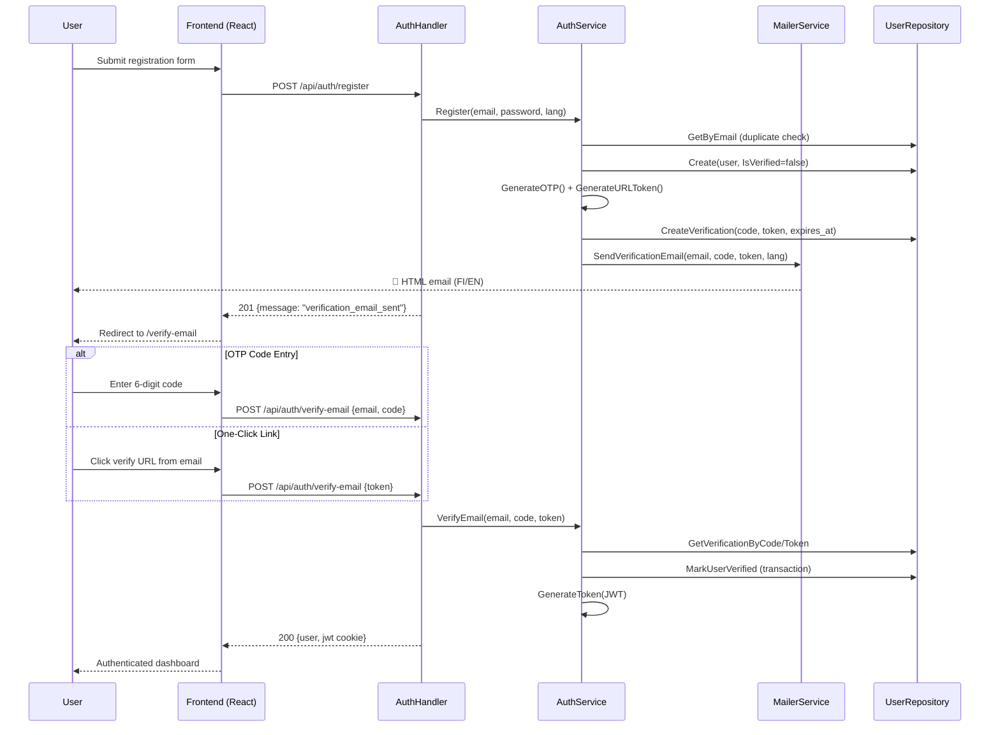
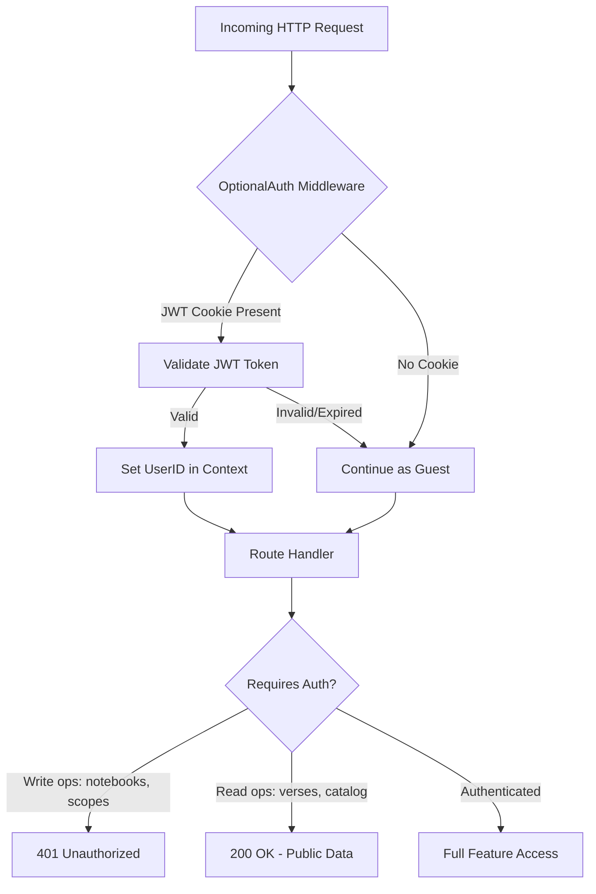

# PR Story: Guest Mode & Email Verification System

## Business Context

Clible previously required full authentication for all interactions, blocking potential users from exploring the platform before committing to an account. This PR introduces a **guest mode** that allows unauthenticated users to browse publicly available translations and the verse catalog, while gating write operations (notebooks, scopes, search history) behind verified accounts.

The email verification system ensures account legitimacy through a dual-verification mechanism: a **6-digit OTP code** (for UI-based entry) and a **one-click URL token** (for email link activation). Both paths converge to the same `VerifyEmail` service method, providing a seamless onboarding experience in Finnish and English.

---

## Architectural & Process Flows

### 1. Registration & Email Verification Flow



### 2. Optional Auth & Guest Mode Decision Tree



---

## Architectural & UX Changes

### 1. Backend: Email Verification Pipeline (Go)

- **Cryptographic code generation:** `GenerateOTP()` uses `crypto/rand` with `math/big` to produce unbiased 6-digit codes. `GenerateURLToken()` generates 64-character hex tokens from 32 bytes of entropy.
- **Dual verification paths:** `VerifyEmail()` accepts either a direct token (email link) or email+code (UI entry), with expiration checking (15 min) and idempotent re-verification handling.
- **Login gate:** `Login()` rejects unverified users with `ErrEmailNotVerified`, enabling the frontend to redirect to the verification flow.
- **Transactional activation:** `MarkUserVerified()` atomically updates both `users.is_verified` and `email_verifications.verified_at` within a single database transaction.

### 2. Backend: Mailer Service & Templates

- **Interface-driven design:** `MailerService` interface with `SendVerificationEmail()` contract. `MockMailer` logs emails for local development; production will use `ResendMailer`.
- **Bilingual HTML templates:** Rich inline-styled HTML email templates for Finnish and English, rendered via `strings.ReplaceAll` with `{{CODE}}` and `{{VERIFY_URL}}` placeholders.
- **Template rendering tested:** `RenderVerificationEmail()` is exported and independently tested for both language variants.

### 3. Backend: Optional Auth Middleware & Global Translation Access

- **`OptionalAuthMiddleware`:** Extracts JWT from cookies without rejecting unauthenticated requests. Sets `UserID` in context when valid, allows guest pass-through otherwise.
- **Public translation catalog:** `GET /api/translations` now serves globally available translations to guests, while user-specific translations remain authenticated.
- **Global preset verse reading & search:** `TranslationRepository.IsGlobal()` and `VerseService` enable unauthenticated guest users to read and search all global preset translations (e.g., `fin-1776`, `web`) without leaking private user translations.

### 4. Database: Migration 014

- **Extended migration:** Consolidates subscription tracking columns (`subscription_tier`, `stripe_customer_id`, etc.), AI usage tracking table (`user_ai_daily_usage`), email verification column (`is_verified`), and `email_verifications` table with indexed `token` and `user_id` lookups.

### 5. Frontend: Verify Email Page & Guest Experience

- **`VerifyEmail.tsx`:** New page component with 6-digit OTP input, automatic token extraction from URL query params, resend verification button, and bilingual feedback messages.
- **Auth context extension:** `AuthContext` now tracks `isVerified` state and exposes `verifyEmail()` and `resendVerification()` methods.
- **Streamlined guest header controls:** Replaced redundant status badge with clean `Login` and `Create account` action buttons for seamless guest-to-member conversion.
- **Guest-aware components:** `AppHeader`, `WorkspaceSidebar`, and feature components conditionally render based on authentication state.
- **SEO improvements:** Open Graph metadata, `robots.txt`, `sitemap.xml`, and dynamic document titles per page.

### 6. Frontend: React Compiler Compliance

- **`React.FC` elimination:** All function components converted from `React.FC<Props>` to plain function declarations for React Compiler compatibility.
- **Direct prop destructuring:** Props destructured in function signatures instead of intermediate variables.

---

## 📈 Improvement Metrics & Key Figures

- **Statement coverage (total):** 78.0% (increased from 74.6%)
- **Statement coverage (services):** 80.0%
- **Go test suite:** 9 packages passing, 0 failures, race detector clean
- **Frontend test suite:** 25 test suites passing, 138 unit & component tests passing
- **Security audit:** `SECOPS-2026-09-04-001` PASSED (0 critical, 0 high, 0 medium vulnerabilities)
- **Security:** Cryptographic OTP/token generation (`crypto/rand`), bcrypt cost 12, JWT with HMAC-SHA256 + issuer/audience validation

---

## Security & Compliance

- **Password hashing:** bcrypt with cost factor 12, resistant to brute-force attacks.
- **OTP generation:** `crypto/rand` ensures uniform distribution across 000000–999999 range (no modulo bias via `math/big`).
- **URL tokens:** 256-bit entropy (32 random bytes → 64 hex chars), unique constraint in database.
- **JWT validation:** HMAC-SHA256 signing, issuer/audience claims, expiration enforcement, algorithm pinning (rejects `none` algorithm).
- **Verification expiry:** 15-minute TTL on verification codes prevents replay attacks.
- **Error isolation:** Authentication errors return generic messages to prevent user enumeration.
- **Guest access restriction:** Unauthenticated guest verse queries explicitly validated via `IsGlobal` query, preventing access to private user translations.

---

## Files Changed

| File | Change Summary |
|------|----------------|
| `backend/internal/services/auth_service.go` | Register, Login (unverified gate), VerifyEmail (dual path), ResendVerification, OTP/token generators |
| `backend/internal/services/auth_service_test.go` | 16 test cases: generators, register, login rejection, OTP verify, token verify, expiry, resend, JWT lifecycle |
| `backend/internal/services/mailer_service.go` | MailerService interface, MockMailer with template rendering |
| `backend/internal/services/mailer_service_test.go` | MockMailer send test, RenderVerificationEmail language tests |
| `backend/internal/services/mailer_templates.go` | Bilingual HTML email templates (FI/EN) with EmailContent struct |
| `backend/internal/services/verse_service.go` | Extended `GetVerses` and `SearchVerses` to allow guest access to all global translations |
| `backend/internal/services/verse_service_test.go` | Added guest mode global translation retrieval and search unit tests |
| `backend/internal/db/user_repo.go` | User + EmailVerification models, CRUD, GetByID, verification queries, MarkUserVerified transaction |
| `backend/internal/db/user_repo_test.go` | User and verification repository tests |
| `backend/internal/db/translation_repo.go` | Added `IsGlobal` parameterized check for global presets |
| `backend/internal/db/translation_repo_test.go` | Added unit tests for `IsGlobal` query |
| `backend/internal/api/auth_handler.go` | Register, VerifyEmail, ResendVerification HTTP endpoints |
| `backend/internal/api/auth_handler_test.go` | Handler-level integration tests |
| `backend/internal/api/translation_handler.go` | Public catalog endpoint for guest access |
| `backend/internal/middleware/auth_middleware.go` | OptionalAuthMiddleware for guest pass-through |
| `backend/internal/config/config.go` | Resend API key, SMTP config, AppBaseURL fields |
| `backend/migrations/014_email_verification.sql` | is_verified column, email_verifications table, subscription columns |
| `backend/main.go` | Mailer and auth service wiring with config |
| `frontend/src/pages/VerifyEmail.tsx` | OTP input, token-based verification, resend flow |
| `frontend/src/context/AuthContext.tsx` | isVerified state, verifyEmail/resendVerification methods |
| `frontend/src/components/layout/AppHeader.tsx` | Streamlined guest header layout with clean login & signup controls |
| `frontend/src/components/layout/AppHeader.test.tsx` | Updated test assertions for updated header action labels |
| `frontend/src/components/layout/WorkspaceSidebar.tsx` | Guest-aware sidebar |
| `frontend/src/utils/i18n.ts` | Verification-related and guest action translations (FI/EN) |
| `frontend/index.html` | Open Graph metadata, SEO meta tags |
| `frontend/public/robots.txt` | Search engine crawl directives |
| `frontend/public/sitemap.xml` | Static sitemap for SEO |
| `.security_audits/security-audit-2026-09-04-guest-mode-and-email-verification.md` | Formal security audit report SECOPS-2026-09-04-001 |

---

## Testing Strategy

### Automated Test Results

#### Backend (Go Test Suite)

- **Total coverage:** 78.0% of statements
- **Services coverage:** 80.0%
- **API coverage:** 75.7%
- **DB coverage:** 72.2%
- **Config coverage:** 91.4%
- **All packages:** PASS (race detector clean)

```text
ok  	github.com/mvirtai/clible-v3-go/internal/api        2.869s  coverage: 75.7% of statements
ok  	github.com/mvirtai/clible-v3-go/internal/config     0.008s  coverage: 91.4% of statements
ok  	github.com/mvirtai/clible-v3-go/internal/ctxkeys    0.008s  coverage: 100.0% of statements
ok  	github.com/mvirtai/clible-v3-go/internal/db         0.545s  coverage: 72.2% of statements
ok  	github.com/mvirtai/clible-v3-go/internal/dsl        0.017s  coverage: 79.3% of statements
ok  	github.com/mvirtai/clible-v3-go/internal/middleware 0.056s  coverage: 83.9% of statements
ok  	github.com/mvirtai/clible-v3-go/internal/parsers    0.014s  coverage: 93.8% of statements
ok  	github.com/mvirtai/clible-v3-go/internal/services   3.043s  coverage: 80.0% of statements
ok  	github.com/mvirtai/clible-v3-go/internal/version    0.016s  coverage: 100.0% of statements
```

#### Frontend (Vitest Suite)

- **Test suites:** 25 passed (25 total)
- **Tests:** 138 passed (138 total)
- **ESLint:** 0 warnings, 0 errors

### Manual Verification Checklist

1. **MockMailer output:** Verified that `MockMailer` logs correct verification codes, URLs, and subjects in both FI and EN during test runs.
2. **Guest mode translation access:** Confirmed unauthenticated requests can read and search global translations (`fin-1776`, `web`), while non-global/private translations return 400/403.
3. **Migration idempotency:** Confirmed `014_email_verification.sql` applies cleanly on fresh SQLite `:memory:` databases during test initialization.
4. **React Compiler compliance:** All frontend components converted from `React.FC` to plain function declarations — no `useEffect` or `useRef` introduced.

