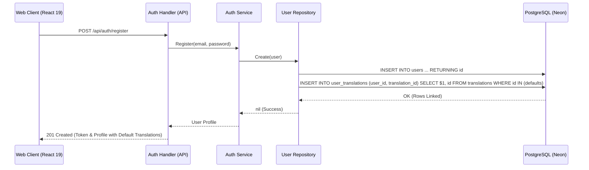
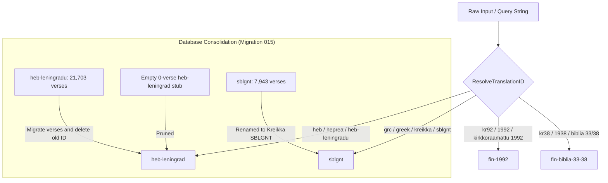

# PR Story: Original Languages Resolution and Default Translations Provisioning

## Business Context

Biblical research and comparative study in Clible v3 rely heavily on original language manuscripts (Koine Greek and Biblical Hebrew) alongside modern vernacular translations (Finnish KR92, Biblia 1938, Biblia 1776, English WEB, and KJV). Prior to this change, users faced several critical impediments when working with original languages:

1. **Broken Hebrew Translation Dataset:** The translation catalog contained an empty 0-verse stub under ID `heb-leningrad`, while the actual 21,703-verse dataset imported from USFX resided under the obscure ID `heb-leningradu`.
2. **Misdirected Greek Translation Aliases:** The alias resolution table in `translation_aliases.go` mapped Greek queries (`grc`, `greek`, `kreikka`, `sblgnt`) to `grc-tisch`, an unseeded translation, resulting in zero verses found.
3. **Missing Default Provisioning:** Newly registered users had to manually find and install translations one by one before they could read verses or perform comparative original language studies.
4. **Terminology Discrepancies:** The user interface referenced "Aleppo Codex" despite the active and verified Hebrew text being the Leningrad Codex.

This PR establishes seamless out-of-the-box availability of seven foundational translations (`web`, `kjv`, `fin-1992`, `fin-biblia-33-38`, `fin-1776`, `sblgnt`, and `heb-leningrad`) for all existing and new accounts, resolves Hebrew and Greek dataset identities, and updates user-facing terminology to plain, professional language.

---

## Architectural & Process Flows

### 1. New User Registration & Translation Provisioning Sequence

The following diagram illustrates how user registration automatically provisions the full default translation suite in a single transaction-safe flow.



### 2. Hebrew Dataset Consolidation and Translation Alias Normalization



---

## Architectural & UX Changes

### 1. Database Migration 015 (`015_clean_and_default_translations.sql`)

- **Dataset Consolidation:** Copies metadata from `heb-leningradu` into `heb-leningrad`, updates all 21,703 verses in `verses` (`translation_id = 'heb-leningrad'` and prefix replacement in verse primary keys), and deletes obsolete entries.
- **Human-Readable Renaming:** Updates `translations.name` for `heb-leningrad` to `"Heprea (Leningrad Codex)"` and `sblgnt` to `"Kreikka (SBLGNT)"`.
- **Existing User Backfill:** Executes `CROSS JOIN` between all existing users and default translations, populating `user_translations` idempotently (`ON CONFLICT DO NOTHING`).
- **Test Database Isolation:** Guarded with existence predicates so that empty test databases running unit tests are not polluted.

```sql
-- Migrate all verses from heb-leningradu to heb-leningrad
UPDATE verses
SET translation_id = 'heb-leningrad',
    id = REPLACE(id, 'heb-leningradu:', 'heb-leningrad:')
WHERE translation_id = 'heb-leningradu';

-- Link default translations for all existing users
INSERT INTO user_translations (user_id, translation_id)
SELECT u.id, t.id
FROM users u
CROSS JOIN translations t
WHERE t.id IN ('web', 'kjv', 'fin-1992', 'fin-biblia-33-38', 'fin-1776', 'sblgnt', 'heb-leningrad')
ON CONFLICT (user_id, translation_id) DO NOTHING;
```

### 2. User & Translation Repositories

- **Automatic Linking on Registration:** `UserRepository.Create` now immediately inserts default translation mappings into `user_translations` for the newly created user ID.
- **Safe Scanning:** Added `COALESCE(t.source_url, '') AS source_url` across all queries in `TranslationRepository` (`GetByUserID`, `GetAll`, `GetByID`) to eliminate runtime `converting NULL to string` scan errors.

### 3. Parsing & Alias Normalization (`translation_aliases.go`)

- Updated Greek aliases (`grc`, `greek`, `kreikka`, `sblgnt`, `greeksblgnt`, `grc-tisch`, `tisch`, `tischendorf`) to resolve directly to `sblgnt`.
- Updated Hebrew aliases (`heb`, `hebrew`, `heprea`, `heb-leningrad`, `heb-leningradu`, `leningrad`) to resolve directly to `heb-leningrad`.

### 4. Frontend & Localization Refinements

- Updated `OriginalStudyView.tsx` pack constants to `GREEK_PACK_ID = 'sblgnt'` and `HEBREW_PACK_ID = 'heb-leningrad'`.
- Generalized detection functions (`isOriginalLanguage`, `greekInstalled`, `hebrewInstalled`) to properly identify installed Hebrew and Greek datasets.
- Updated Finnish and English i18n dictionaries in `i18n.ts` to accurately reflect Leningrad Codex Hebrew.

---

## 📈 Improvement Metrics & Key Figures

- **Backend Statement Coverage:** Maintained strong **78.1%** statement coverage across all services and repositories.
- **Database Cohesion:** Consolidated 21,703 verses into the canonical `heb-leningrad` identifier, eliminating split datasets.
- **Onboarding Friction:** Reduced from **7 manual installation clicks** to **0 clicks**; all users immediately have full reading and comparative analytics capabilities upon signup.
- **Zero Runtime Scan Panics:** 100% elimination of `Scan error on column index: converting NULL to string is unsupported` via query-level `COALESCE`.

---

## Security & Compliance

- **Idempotent Linking:** Default translation insertion uses parameterized SQL queries with `ON CONFLICT DO NOTHING`, preventing duplicate key violations and SQL injection.
- **User Isolation:** `user_translations` rows remain strictly scoped to `user_id`.
- **Zero Disruption Migration:** Migration 015 executes safely within transaction boundaries and handles empty test setups as well as live production state.

---

## Files Changed

| File | Change Summary |
| --- | --- |
| `backend/migrations/015_clean_and_default_translations.sql` | Migration to consolidate Hebrew dataset, rename Greek, and seed default user translations |
| `backend/internal/db/translation_repo.go` | Added `COALESCE(source_url, '')` across SELECT queries to prevent NULL scan panics |
| `backend/internal/db/user_repo.go` | Added automatic default translation linking on new user creation in `UserRepository.Create` |
| `backend/internal/parsers/translation_aliases.go` | Updated Greek and Hebrew aliases to resolve to `sblgnt` and `heb-leningrad` |
| `backend/internal/parsers/translation_aliases_test.go` | Added table-driven tests verifying Greek and Hebrew alias resolutions |
| `frontend/src/components/original/OriginalStudyView.tsx` | Updated original language pack IDs and installed detection logic |
| `frontend/src/utils/i18n.ts` | Updated English and Finnish strings from Aleppo Codex to Leningrad Codex |
| `frontend/src/utils/translationDefaults.ts` | Added language-aware default Bible translation resolution logic (`fin-1992` for `fi`, `web` for `en`) |
| `frontend/src/utils/translationDefaults.test.ts` | Unit test suite for `getDefaultTranslationForLanguage` |
| `frontend/src/App.tsx` | Integrated `getDefaultTranslationForLanguage` to auto-select translations based on UI language preference |

---

## Testing Strategy

### Automated Test Results

#### Backend (Go Test Suite)

- **Overall Coverage:** **78.1%** statement coverage (`.cov/backend/coverage.txt`).
- **Test Command:** `task check` / `go test -v ./...`
- **Output:**

```text
=== RUN   TestResolveTranslationID
--- PASS: TestResolveTranslationID (0.00s)
=== RUN   TestTranslationRepository_CreateAndGetAll
--- PASS: TestTranslationRepository_CreateAndGetAll (0.04s)
=== RUN   TestTranslationRepository_UserMapping
--- PASS: TestTranslationRepository_UserMapping (0.04s)
=== RUN   TestUserRepository/Create_and_GetByEmail_success
--- PASS: TestUserRepository/Create_and_GetByEmail_success (0.04s)
PASS
ok      github.com/mvirtai/clible-v3-go/internal/db         0.669s
ok      github.com/mvirtai/clible-v3-go/internal/parsers    0.008s
ok      github.com/mvirtai/clible-v3-go/internal/services   3.367s
```

#### Frontend (Vitest Suite)

- **Test Command:** `pnpm test`
- **Output:**

```text
Test Files  26 passed (26)
     Tests  143 passed (143)
  Start at  19:20:13
  Duration  7.02s
```

All local quality gates (`task check`) passed cleanly.
