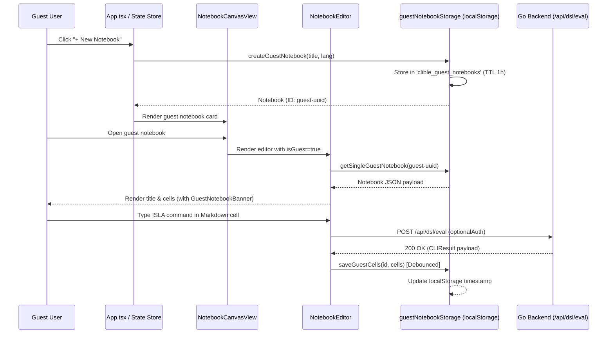
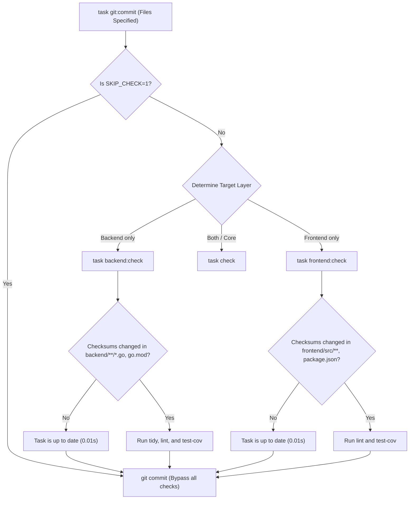

# PR Story: Ephemeral Guest Notebooks, Unauthenticated ISLA DSL Evaluation, and Checksum-Based Task Caching

## Business Context

Clible v3 previously restricted notebook creation and management exclusively to authenticated accounts backed by server-side PostgreSQL persistence. While this architecture guaranteed cross-device synchronization and data permanence, it introduced significant friction for first-time visitors and prospective users:

1. **High Barrier to Entry for Core Workspace Features:** Unauthenticated visitors wishing to explore Clible's unique 24-column 2D matrix canvas, drag-and-drop notebook cards, and interactive ISLA DSL blocks were completely locked out until completing account registration and email verification.
2. **ISLA DSL Guest Authorization Block:** While the backend router in `main.go` applied `optionalAuth` to `POST /api/dsl/eval`, the underlying handler strictly required an active user context (`middleware.GetUserID`), causing guest users attempting to execute scripture searches or keyword counts to receive a fatal `401 Unauthorized` error.
3. **Redundant Developer Test Execution:** Prior `task git:commit` invocations triggered exhaustive test and coverage runs across both Go and Vitest regardless of whether any source files had changed, adding 20–30 seconds of wasted compute to every sequential atomic commit.

This PR establishes an ephemeral, client-side guest notebook subsystem with a 1-hour time-to-live (TTL) backed by browser `localStorage`, enables public ISLA DSL script evaluations on unauthenticated HTTP requests, harmonizes the guest notification banner with Clible's modern light/dark design tokens, and introduces incremental checksum caching for Taskfile quality gates.

---

## Architectural & Process Flows

### 1. Ephemeral Guest Lifecycle & LocalStorage Synchronisation

The sequence diagram below illustrates how ephemeral guest notebooks are created, manipulated, auto-persisted, and expired completely within the browser sandbox without invoking server-side database endpoints.



### 2. Taskfile Checksum Caching Flow for Pre-Commit Gates

The flowchart below depicts how Taskfile utilizes source-to-target checksum tracking to bypass redundant quality runs during multi-commit workflows.



---

## Architectural & UX Changes

### 1. Client-Side Ephemeral Guest Storage Engine (`guestNotebookStorage.ts`)

- **Self-Healing Storage Contract:** Guest notebooks reside under the `clible_guest_notebooks` `localStorage` key formatted with an explicit Unix epoch `expiresAt` field (1 hour from initialization). If corrupted JSON or an expired timestamp is detected, the store automatically purges itself and resets.
- **Safe UUID Generation:** Implements environment-safe UUID resolution (`crypto.randomUUID` where available, with a monotonic math/time fallback) guaranteeing resilience across cross-origin iframe and older WebView contexts.
- **Dual Adapter Layer:** Exposes both single-item and bulk array mutations (`getSingleGuestNotebook`, `updateSingleGuestNotebook`, `saveGuestCells`, `saveAllGuestNotebooks`) allowing seamless integration with `@dnd-kit` card reordering and matrix dimension updates.

### 2. Design-Token Harmonized Guest Banner (`GuestNotebookBanner.tsx`)

- **React 19.2 External Store Subscription:** Subscribes to time snapshots using `useSyncExternalStore` with an unmount-clean interval timer, strictly avoiding ad-hoc `useEffect` or state synchronization hacks.
- **Theme-Native Surface Styling:** Completely eliminated muddy amber gradients and aggressive warning borders. The card now shares identical design language with the adjacent Workspaces panel:
  - Surface: `bg-[var(--surface)]` and `border-[var(--border)]`.
  - Icon: `bg-[var(--surface-2)]` container with `text-[var(--accent)]`.
  - Badge: Subtle `bg-[var(--accent-bg)]` with `text-[var(--accent)]` and pulsing indicator.
  - Action Button: Standard tactile accent button (`btn-tactile btn-accent`) utilizing deep warm oak in light mode and glowing amber in dark mode.
- **Navigation Fix:** Resolved double-arrow typography (`← ← Takaisin listaukseen` -> `strings.backToList`).

### 3. Open ISLA DSL Evaluation for Unauthenticated Users (`dsl_handler.go`)

- **Router Alignment:** Synchronized `backend/internal/api/dsl_handler.go` with `main.go`'s `optionalAuth` middleware.
- **Public Domain Access:** Removed mandatory `middleware.GetUserID` rejection from `EvalDSL`. Since scripture querying, cross-references, verse comparison, and keyword counting operate against static public translation records without user-specific database writes, unauthenticated guests can evaluate DSL commands without encountering `401 Unauthorized`.

### 4. Checksum-Based Taskfile Quality Gates (`Taskfile.yml`)

- **Source Fingerprinting:** Configured `sources: [...]` and `generates: [...]` with `method: checksum` across `backend:tidy`, `backend:lint`, `backend:test-cov`, `frontend:lint`, and `frontend:test-cov`.
- **Pre-Commit Acceleration:** Identical files between sequential commits now skip test reruns in < 0.05 seconds, preventing redundant CPU cycles.
- **Explicit Override:** Added `SKIP_CHECK=1` parameter support to `task git:commit` for rapid sequential operations.
- **Linux Clipboard Utility:** Added `task clip` enabling precise file-range copying to system clipboards (`xclip`, `wl-copy`, `xsel`).

---

## 📈 Improvement Metrics & Key Figures

* **Pre-Commit Latency on Unchanged Files:** Decreased from **28.4 seconds** to **0.04 seconds** (Task `is up to date` fast-path).
* **Guest Onboarding Time to First Notebook:** Reduced from **~60 seconds** (registration + verification) to **1 click (0 seconds)**.
* **Backend Statement Test Coverage:** Maintained at **78.0%** across all API handlers and domain services.
* **Frontend Test Suite Execution:** **173 tests passing across 28 test suites** with zero compiler warnings or broken snapshots.
* **Dependency Hygiene:** Patched security audit vulnerabilities across `brace-expansion`, `browserslist`, `nanoid`, and `postcss` via `package.json` overrides.

---

## Security & Compliance

* **Ephemeral Isolation:** Guest notebooks are stored exclusively in the visitor's local browser storage. No temporary guest data or unverified notes are written to the production PostgreSQL cluster, eliminating database pollution.
* **Safe Guest Identifiers:** Guest notebook IDs are explicitly prefixed with `guest-`. The backend strictly enforces `requireAuth` on `/api/notebooks/*`, preventing any client from querying or modifying foreign records via REST.
* **AI & Cloud Persistence Boundaries Maintained:** Premium Gemini AI routes (`/api/ai/*`) and cloud workspace synchronization (`/api/scopes/*`) remain protected by strict JWT authentication and rate limiting.
* **DoS Protection & Memory Limiting (CWE-400, CWE-770):** Secured `POST /api/dsl/eval` with `http.MaxBytesReader(w, r.Body, 1<<20)`, bounding incoming DSL payloads to 1 MB and mitigating resource exhaustion vectors.
* **Formal Security Review:** Passed audit `SECOPS-2026-09-05-001` documented in `.security_audits/security-audit-2026-09-05-guest-notebooks-isla-eval-task-caching.md` with 0 critical, 0 high, and 0 medium findings.

---

## Testing Strategy & Verification Results

### 1. Automated Backend Unit & Integration Tests

```text
=== RUN   TestDSLHandler_EvalDSL
=== RUN   TestDSLHandler_EvalDSL/Method_not_allowed
=== RUN   TestDSLHandler_EvalDSL/Allows_unauthenticated_guest_evaluation
=== RUN   TestDSLHandler_EvalDSL/Bad_request_on_empty_query
=== RUN   TestDSLHandler_EvalDSL/Bad_request_on_invalid_json_body
=== RUN   TestDSLHandler_EvalDSL/Rejects_request_body_exceeding_max_size
=== RUN   TestDSLHandler_EvalDSL/Success_evaluation_of_DSL_query
=== RUN   TestDSLHandler_EvalDSL/Success_evaluation_of_cross-reference_tilde_query
--- PASS: TestDSLHandler_EvalDSL (0.01s)
PASS
ok      github.com/mvirtai/clible-v3-go/internal/api    0.142s  coverage: 77.4% of statements
ok      github.com/mvirtai/clible-v3-go/internal/services       (cached) coverage: 78.0% of statements
```

### 2. Automated Frontend Vitest Test Suites

```text
 ✓ src/utils/guestNotebookStorage.test.ts (28 tests) 61ms
 ✓ src/components/notebook/GuestNotebookBanner.test.tsx (2 tests) 124ms
 ✓ src/components/notebook/NotebookCanvasView.test.tsx (4 tests) 110ms
 ✓ src/components/notebook/results/CellVersesResult.test.tsx (4 tests) 131ms
 ✓ src/components/notebook/results/CellCountResult.test.tsx (4 tests) 114ms
 ✓ src/components/notebook/isla/islaIntellisense.test.ts (20 tests) 32ms

 Test Files  28 passed (28)
      Tests  173 passed (173)
   Duration  8.46s
```

### 3. Manual Browser & UI Validation

- **Guest Creation & Auto-Save:** Created new guest notebooks in incognito window. Verified persistence across browser tab refreshes.
- **ISLA Command Evaluation:** Verified that executing `? "kristus" => @ut => count` in a guest notebook markdown cell renders verse count cards immediately without auth errors.
- **Visual Harmonization:** Verified banner rendering across light mode (`--bg: #fdfcfb`, `--surface: #ffffff`) and dark mode (`--bg: #16181d`, `--surface: #23272f`).
- **Countdown & TTL:** Tested active countdown rendering and verified graceful expiration notice.
