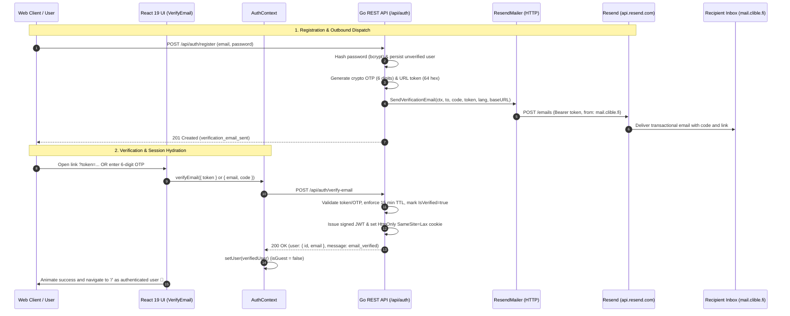
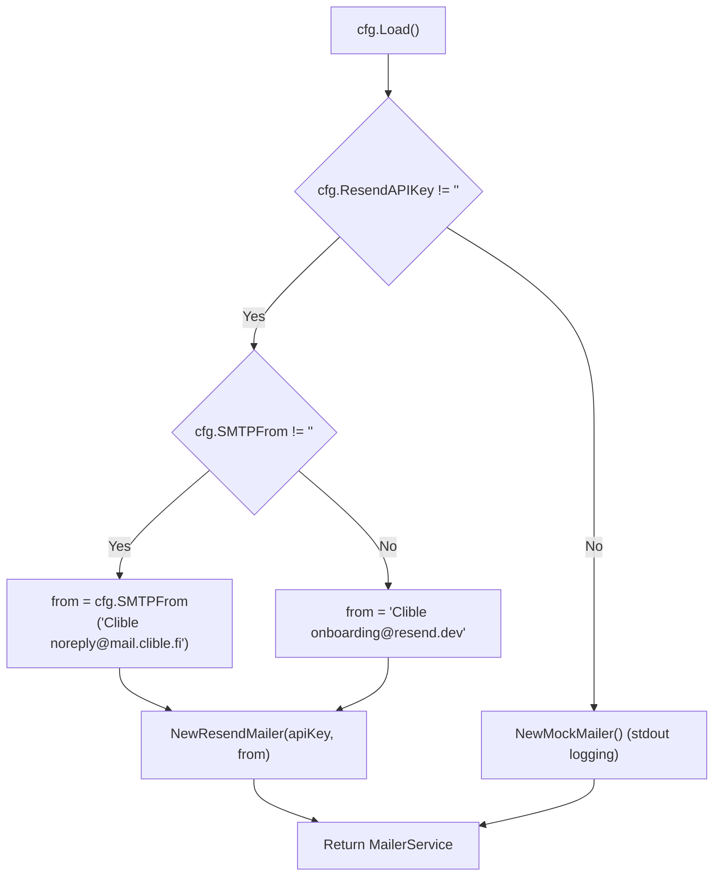

# PR Story: 076 – Resend REST API Mailer Integration & Authenticated Verification Flow

## Business Context

Transactional emails are critical for account security and user onboarding in Clible, specifically for email address verification and one-time password (OTP) delivery. Previously, the backend relied solely on `MockMailer`, which printed verification tokens to `stdout`.

This PR introduces production email delivery via **Resend's HTTPS REST API**, enabling reliable, fast, and deliverable transactional emails from `mail.clible.fi` without external third-party Go dependencies or cumbersome SMTP socket configurations. Paired with a configuration factory (`NewMailerFromConfig`), local development remains frictionless by seamlessly falling back to `MockMailer` when `RESEND_API_KEY` is not present.

Furthermore, this PR closes a critical user experience gap by automatically establishing the authenticated session in React state upon successful verification, eliminating an issue where users were redirected to guest mode instead of their authenticated workspace. The email verification view was concurrently modernized to adhere to **React 19.2 and React Compiler** conventions.

---

## Architectural & Process Flows

### 1. End-to-End Verification & Session Establishment Flow

The sequence diagram below illustrates the end-to-end flow from user registration, Resend delivery via `mail.clible.fi`, token verification, and automated session hydration into `AuthContext`:



---

### 2. Provider Selection Decision Pipeline

The runtime environment determines provider selection dynamically on startup:



---

## Architectural & Technical Changes

### 1. ResendMailer Implementation (`backend/internal/services/resend_mailer.go`)

- **Standard Library HTTP Transport:** Implemented strictly with `net/http`, `encoding/json`, and `context.Context` without introducing external Go SDK dependencies.
- **Client Extensibility & Testability:** Exposed `NewResendMailerWithClient(apiKey, from, baseURL, httpClient)` to enable injecting `httptest.Server` instances for zero-network unit testing.
- **Error Deserialization:** Safely unmarshals structured error responses from Resend (HTTP 4xx/5xx) and surfaces human-readable error descriptions without credential leakage.
- **Defensive Timeouts & Clean Teardowns:** Configured a 10-second request timeout on default HTTP clients and ensures proper response body closures (`defer func() { _ = resp.Body.Close() }()`).

### 2. Mailer Service Factory (`backend/internal/services/mailer_service.go`)

- **Configuration-Driven Factory:** Added `NewMailerFromConfig(cfg *config.Config) MailerService` to evaluate environment configuration at startup.
- **Sensible Defaults:** Automatically supplies `"Clible <onboarding@resend.dev>"` when `SMTPFrom` is not explicitly set, enabling immediate testing with unverified domains.
- **Observability:** Logs initialized mailer provider and configured sender address to stdout during service startup.

### 3. Frontend Session Hydration on Verification (`AuthContext.tsx` & `api.ts`)

- **Response Normalization:** Updated `apiService.verifyEmail` in `api.ts` to extract `data.user` as a normalized `UserResponse` object.
- **AuthContext Session Action:** Added `verifyEmail` to `AuthContextType`, which updates React user state (`setUser(verifiedUser)`) upon verification.
- **Removed False Registration Session:** Removed premature `setUser` call in `register` since unverified users do not possess a valid JWT cookie session.

### 4. Frontend Architectural Modernization: React 19.2 & React Compiler Paradigms

The email verification flow in `VerifyEmail.tsx` was restructured to establish a reference implementation for **React 19.2 idioms and React Compiler optimization patterns**, moving away from legacy imperative effect cascades, distributed boolean state juggling, and DOM ref bridges.

#### Deterministic Action State Machines vs. Distributed Boolean State

Conventional form handling in earlier React versions often relied on multiple disconnected state setters to orchestrate submission lifecycles:

```tsx
// Distributed state approach: prone to state desynchronization
const [code, setCode] = useState("");
const [loading, setLoading] = useState(false);
const [error, setError] = useState<string | null>(null);
const [success, setSuccess] = useState(false);

const handleSubmit = async (e: React.FormEvent) => {
  e.preventDefault();
  setLoading(true);
  setError(null);
  try {
    await verifyCode(code);
    setSuccess(true);
  } catch (err) {
    setError(err.message);
  } finally {
    setLoading(false);
  }
};
```

This distributed model introduces cognitive overhead and structural risks:

- **State Desynchronization:** Exception boundaries or aborted requests can leave `loading: true` permanently active or preserve stale error messages.
- **Render Pass Multiplicity:** Independent state dispatches trigger redundant render passes unless explicitly batched by concurrent schedulers.
- **Decoupling from Web Standards:** Bypasses native HTML form behavior, requiring synthetic event interception (`e.preventDefault()`).

#### Declarative Mutation Architecture with `useActionState`

React 19 formalizes asynchronous operations through first-class **Actions**, consolidating submission lifecycles into a deterministic state transition:

```tsx
interface ActionState {
  error: string | null;
  success: boolean;
}

const [actionState, formAction, isPending] = useActionState(
  async (prevState: ActionState, formData: FormData): Promise<ActionState> => {
    const rawCode = (formData.get("code") as string)?.replace(/\D/g, "");
    if (!rawCode || rawCode.length !== 6) {
      return { error: t("auth.invalid_code"), success: false };
    }
    try {
      await verifyEmail({ email, code: rawCode });
      return { error: null, success: true };
    } catch (err) {
      return { error: (err as Error).message, success: false };
    }
  },
  { error: null, success: false }
);
```

##### Architectural Characteristics

- **Atomic State Transitions:** Next states are calculated pure-functionally as `(prevState, formData) => Promise<nextState>`. The UI cannot enter invalid composite states (e.g. concurrent `loading = true` and `success = true`).
- **Integrated Transition Coordination:** The returned `isPending` boolean is managed natively within React's transition scheduler, avoiding manual loading flags and keeping peripheral UI responsive.
- **Standard Form Binding:** Attaching `formAction` to `<form action={formAction}>` delegates event capture, form data aggregation, and submission lifecycle to the browser and React runtime declaratively.

| Dimension | Distributed State (`useState`) | Declarative Actions (`useActionState`) |
| :--- | :--- | :--- |
| **State Machine** | Disconnected variables (`loading`, `error`, `success`) | Single unified state tuple `[state, action, isPending]` |
| **Error Handling** | Imperative `try/catch/finally` blocks | Deterministic state resolution via return value |
| **Concurrency** | Manual flag synchronization | Native integration with React Transition scheduler |
| **DOM Semantics** | Synthetic `onSubmit` handlers | Standard HTML `<form action={...}>` invocation |

---

#### Synchronous Initial State Derivation vs. Effect-Driven Synchronization

Component initialization from URL parameters (such as `?token=abc...`) often creates cascading render loops if parameters are evaluated inside effects:

```tsx
// Anti-pattern: Cascading update cycle
const [isPending, setIsPending] = useState(false);
useEffect(() => {
  if (token) {
    setIsPending(true); // Schedules synchronous second render pass
    runVerification(token);
  }
}, [token]);
```

When `setIsPending(true)` executes synchronously during effect processing, React must discard the initial render commit and schedule an immediate re-render, generating a `react-hooks/set-state-in-effect` linting diagnostic.

##### Deterministic Resolution via Lazy State Initialization

In `VerifyEmail.tsx`, the initial pending state is resolved synchronously during the initial render pass:

```tsx
const [isTokenPending, setIsTokenPending] = useState(() => Boolean(urlToken));
```

The component mounts directly in its verified pending state without intermediate layout shifts or discarded render frames. The asynchronous network execution remains cleanly isolated inside the effect lifecycle.

---

#### Declarative Document Metadata Hoisting

Manipulating document headers traditionally required imperative DOM effects or third-party wrappers:

```tsx
// Imperative effect approach
useEffect(() => {
  document.title = `${t("auth.verify_email")} | Clible`;
}, [t]);
```

React 19 natively recognizes document metadata elements (`<title>`, `<meta>`, `<link>`) placed within standard component trees and hoists them automatically into document `<head>`:

```tsx
// Native declarative hoisting
return (
  <div className="verify-page">
    <title>{`${t("auth.verify_email")} | Clible`}</title>
    {/* View content */}
  </div>
);
```

This eliminates imperative DOM access, supports seamless server-side rendering reconciliation, and ensures strict consistency during client-side route transitions.

---

#### Native Web Standards Event Dispatching vs. Imperative Refs

Automated form submission upon reaching a target character threshold (e.g. 6-digit verification codes) previously encouraged imperative DOM manipulation via `useRef`:

##### Modern Standards-Compliant Approach

Using HTML5 `HTMLFormElement.requestSubmit()`:

```tsx
onChange={(e) => {
  const val = e.target.value.replace(/\D/g, "").slice(0, 6);
  if (val.length === 6) {
    e.currentTarget.form?.requestSubmit();
  }
}}
```

`requestSubmit()` adheres to web standards by validating form constraints, triggering native submit handlers, and activating React's synthetic form pipeline without introducing mutable component ref bridges.

---

#### React Compiler Compatibility Principles

The React Compiler performs automatic fine-grained memoization by statically analyzing lexical scopes and variable dependencies.

Architectures that minimize side-effect dependencies (`useEffect`), eliminate mutable state bridges (`useRef`), and maintain unidirectional data flow allow the compiler to maximize optimization surface and omit manual `useMemo`/`useCallback` directives across the component hierarchy.

---

## 🔒 Security & Compliance Audit

A formal security audit ([`SECOPS-2026-09-05-002`](file:///home/vivaldev/code/clible-v3-go/.security_audits/security-audit-2026-09-05-resend-mailer-and-email-verification.md)) was conducted covering outbound mail transport and authentication flows:

- **Credential Protection:** `RESEND_API_KEY` is loaded exclusively from environment variables and is never exposed in client-facing API responses or logs.
- **Bearer HTTPS Authentication:** All outbound requests strictly use TLS with standard Bearer authorization headers.
- **OTP & Token Entropy:** 6-digit numeric OTPs and 64-hex-character URL tokens are generated using cryptographically secure random (`crypto/rand`).
- **Session Cookie Security:** JWT session cookies issued upon verification are configured with `HttpOnly: true`, `SameSite: Lax`, and `Secure: isProduction`.
- **Zero Vulnerabilities:** 0 Critical, 0 High, 0 Medium, 0 Low — **PASSED**.

---

## 📈 Improvement Metrics & Key Figures

- **Zero External Dependencies:** 0 external Go modules added; 100% standard library implementation.
- **Services Statement Coverage:** 78.2% across `internal/services`, with 100% on `mailer_service.go` and `mailer_templates.go`, and 89.7% on `resend_mailer.go`.
- **Frontend Test Suite:** 28 test suites passing, 177/177 tests green (100% pass rate).
- **Linter Quality:** 0 errors across `golangci-lint` and `eslint`.

---

## Files Changed

| File | Change Summary |
| :--- | :--- |
| `backend/internal/services/resend_mailer.go` | ResendMailer implementation via Resend HTTPS REST API (`POST /emails`). |
| `backend/internal/services/resend_mailer_test.go` | Comprehensive unit tests with `httptest.Server` verifying success, errors, and cancellation. |
| `backend/internal/services/mailer_service.go` | Added `NewMailerFromConfig` factory to dynamically choose between Resend and Mock mailers. |
| `backend/main.go` | Wired `NewMailerFromConfig(cfg)` into dependency injection setup. |
| `frontend/src/services/api.ts` | Normalized `verifyEmail` return payload to extract `data.user` as `UserResponse`. |
| `frontend/src/services/api.test.ts` | Unit tests for `verifyEmail` (success, normalized user mapping, error handling) and `resendVerification`. |
| `frontend/src/context/AuthContext.tsx` | Added `verifyEmail` action handler to hydrate authenticated session upon verification. |
| `frontend/src/pages/VerifyEmail.tsx` | Modernized component to React 19.2 `useActionState`, native `<title>`, pure derived state, and zero `useRef`. |
| `.agents/AGENTS.md` | Added permanent proactive React 19.2 modernization and mandatory testing on refactoring rules. |
| `.security_audits/security-audit-2026-09-05-resend-mailer-and-email-verification.md` | Formal security audit report `SECOPS-2026-09-05-002` (PASSED). |
| `.env.example` | Documented `RESEND_API_KEY` and `SMTP_FROM` configuration options. |

---

## Testing Strategy

### Automated Test Execution

#### 1. Backend Service & Mailer Tests (`go test -v ./internal/services/...`)

```text
=== RUN   TestResendMailer_SendVerificationEmail_Success
--- PASS: TestResendMailer_SendVerificationEmail_Success (0.00s)
=== RUN   TestResendMailer_SendVerificationEmail_English
--- PASS: TestResendMailer_SendVerificationEmail_English (0.00s)
=== RUN   TestResendMailer_ValidationErrors
--- PASS: TestResendMailer_ValidationErrors (0.00s)
=== RUN   TestResendMailer_APIErrors
--- PASS: TestResendMailer_APIErrors (0.00s)
=== RUN   TestResendMailer_ContextCancellation
--- PASS: TestResendMailer_ContextCancellation (0.00s)
=== RUN   TestNewMailerFromConfig
--- PASS: TestNewMailerFromConfig (0.00s)
PASS
ok  	github.com/mvirtai/clible-v3-go/internal/services	3.462s
```

#### 2. Frontend Test Suite (`task frontend:test`)

```text
Test Files  28 passed (28)
     Tests  177 passed (177)
  Duration  8.59s
```

### Manual Verification Checklist

1. **Mock Mailer Fallback:** Verified that starting without `RESEND_API_KEY` logs verification tokens directly to `stdout`.
2. **Resend Activation:** Verified that starting with `RESEND_API_KEY` and `SMTP_FROM="Clible <noreply@mail.clible.fi>"` successfully initializes ResendMailer.
3. **Live Email Delivery:** Delivered actual verification email to user inbox via `mail.clible.fi` domain and Resend API.
4. **Auto-Login Session Transition:** Verified in browser that submitting verification code or link token logs the user in immediately, sets the `jwt` cookie, and opens the authenticated workspace without guest mode fallback.
