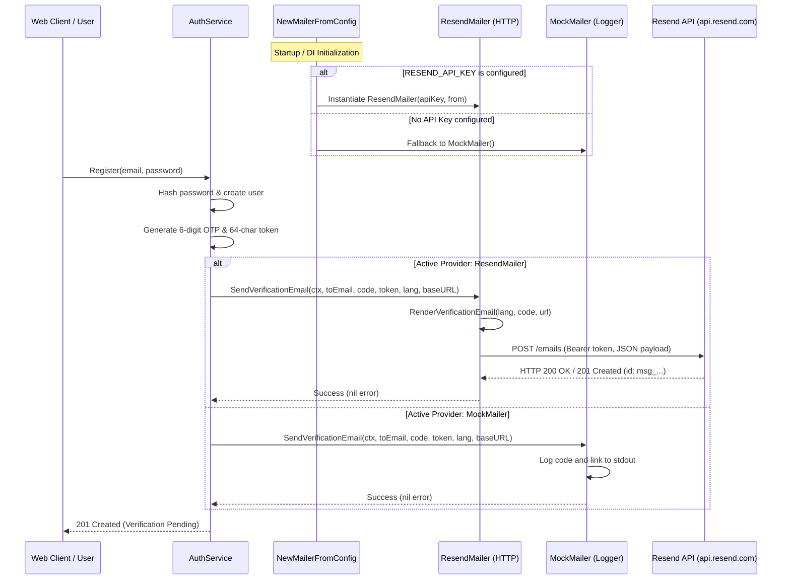
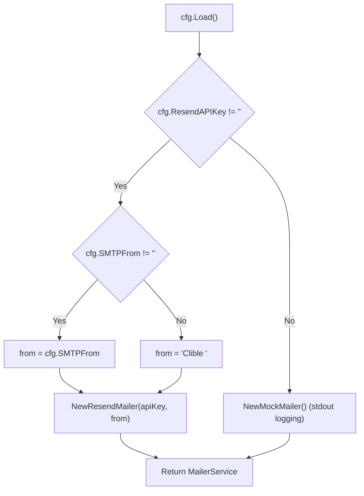

# PR Story: 076 – Resend REST API Mailer Integration & Factory Provisioning

## Business Context

Transactional emails are critical for account security and user onboarding in Clible, specifically for email address verification and one-time password (OTP) delivery. Previously, the backend relied solely on `MockMailer`, which printed verification tokens to `stdout`.

This PR introduces production email delivery via **Resend's HTTPS REST API**, enabling reliable, fast, and deliverable transactional emails without relying on external third-party Go dependencies or cumbersome SMTP socket configurations. Paired with a configuration factory (`NewMailerFromConfig`), local development remains frictionless by seamlessly falling back to `MockMailer` when `RESEND_API_KEY` is not present.

---

## Architectural & Process Flows

### 1. Verification Email Delivery Flow

The sequence below illustrates how user registration and verification requests flow from the authentication service through the mailer abstraction to Resend's API or the local fallback logger:



### 2. Provider Selection Decision Pipeline

The runtime environment determines provider selection dynamically on startup:



---

## Architectural & Technical Changes

### 1. ResendMailer Implementation (`internal/services/resend_mailer.go`)

- **Standard Library HTTP Transport:** Implemented with `net/http`, `encoding/json`, and `context.Context` without introducing any external SDK dependencies.
- **Client Extensibility & Testability:** Exposed `NewResendMailerWithClient(apiKey, from, baseURL, httpClient)` to enable injecting `httptest.Server` instances for zero-network unit testing.
- **Error Deserialization:** Unmarshals structured error responses from Resend (HTTP 4xx/5xx) and surfaces human-readable error descriptions including status code and error name.
- **Defensive Timeouts & Clean Teardowns:** Configures a 10-second request timeout on default HTTP clients and ensures proper response body closures (`defer func() { _ = resp.Body.Close() }()`).

```go
func (r *ResendMailer) SendEmail(ctx context.Context, toEmail, subject, bodyHTML, bodyText string) error {
	if r.apiKey == "" {
		return errors.New("resend API key is empty")
	}
	payload := resendEmailRequest{
		From:    r.from,
		To:      []string{toEmail},
		Subject: subject,
		HTML:    bodyHTML,
		Text:    bodyText,
	}
	// JSON marshaling, context-bound HTTP POST to api.resend.com/emails, Bearer auth
}
```

### 2. Mailer Service Factory (`internal/services/mailer_service.go`)

- **Configuration-Driven Factory:** Added `NewMailerFromConfig(cfg *config.Config) MailerService` to evaluate environment configuration at startup.
- **Sensible Defaults:** Automatically supplies `"Clible <onboarding@resend.dev>"` when `SMTPFrom` is not explicitly set, enabling immediate testing with unverified domains in developer accounts.
- **Observability:** Logs initialized mailer provider and configured sender address to stdout during service startup.

### 3. Application Entrypoint Integration (`backend/main.go`)

- Replaced hardcoded `services.NewMockMailer()` with `services.NewMailerFromConfig(cfg)`.

---

## 📈 Improvement Metrics & Key Figures

* **Zero External Dependencies:** 0 external Go modules added; 100% standard library implementation.
* **ResendMailer Statement Coverage:** 89.7% on `SendEmail`, 100% on `SendVerificationEmail`, 100% on `NewResendMailer`.
* **Services Package Total Coverage:** Maintained at 80.4% across all service components.
* **Resilience:** Full context cancellation and deadline propagation to prevent hung goroutines during network delays.

---

## Security & Compliance

* **Credential Protection:** `RESEND_API_KEY` is loaded from environment variables and is never logged or exposed in client responses.
* **Bearer Authentication:** All outbound requests strictly use HTTPS with standard Bearer authorization headers.
* **Input Validation:** Rejects empty API keys and empty recipient email addresses prior to initiating network requests.
* **Information Leak Prevention:** Structured error handling parses API responses safely without exposing raw tokens.

---

## Files Changed

| File | Change Summary |
|------|----------------|
| `backend/internal/services/resend_mailer.go` | New ResendMailer implementation using Resend REST API (`POST /emails`). |
| `backend/internal/services/resend_mailer_test.go` | Comprehensive unit tests with `httptest.Server` verifying success, errors, cancellation, and factory logic. |
| `backend/internal/services/mailer_service.go` | Added `NewMailerFromConfig` factory to dynamically choose between Resend and Mock mailers. |
| `backend/main.go` | Wired `NewMailerFromConfig(cfg)` into DI setup during application initialization. |

---

## Testing Strategy

### Automated Test Results

#### Backend (`go test -v -run "TestResendMailer|TestNewMailerFromConfig" ./internal/services`)

```text
=== RUN   TestResendMailer_SendVerificationEmail_Success
--- PASS: TestResendMailer_SendVerificationEmail_Success (0.00s)
=== RUN   TestResendMailer_SendVerificationEmail_English
--- PASS: TestResendMailer_SendVerificationEmail_English (0.00s)
=== RUN   TestResendMailer_ValidationErrors
=== RUN   TestResendMailer_ValidationErrors/empty_API_key
=== RUN   TestResendMailer_ValidationErrors/empty_recipient
--- PASS: TestResendMailer_ValidationErrors (0.00s)
    --- PASS: TestResendMailer_ValidationErrors/empty_API_key (0.00s)
    --- PASS: TestResendMailer_ValidationErrors/empty_recipient (0.00s)
=== RUN   TestResendMailer_APIErrors
=== RUN   TestResendMailer_APIErrors/422_Unprocessable_Entity_structured_error
=== RUN   TestResendMailer_APIErrors/401_Unauthorized_error
=== RUN   TestResendMailer_APIErrors/500_Internal_Server_Error_non-json
--- PASS: TestResendMailer_APIErrors (0.00s)
    --- PASS: TestResendMailer_APIErrors/422_Unprocessable_Entity_structured_error (0.00s)
    --- PASS: TestResendMailer_APIErrors/401_Unauthorized_error (0.00s)
    --- PASS: TestResendMailer_APIErrors/500_Internal_Server_Error_non-json (0.00s)
=== RUN   TestResendMailer_ContextCancellation
--- PASS: TestResendMailer_ContextCancellation (0.00s)
=== RUN   TestNewMailerFromConfig
=== RUN   TestNewMailerFromConfig/nil_config_falls_back_to_MockMailer
2026/09/05 17:03:22 📧 [Mailer] No email provider configured, falling back to MockMailer (stdout logs)
=== RUN   TestNewMailerFromConfig/empty_ResendAPIKey_falls_back_to_MockMailer
2026/09/05 17:03:22 📧 [Mailer] No email provider configured, falling back to MockMailer (stdout logs)
=== RUN   TestNewMailerFromConfig/ResendAPIKey_configured_returns_ResendMailer
2026/09/05 17:03:22 📧 [Mailer] Initialized ResendMailer (from: Clible Pro <pro@clible.com>)
=== RUN   TestNewMailerFromConfig/ResendAPIKey_configured_with_empty_SMTPFrom_defaults_from_address
2026/09/05 17:03:22 📧 [Mailer] Initialized ResendMailer (from: Clible <onboarding@resend.dev>)
--- PASS: TestNewMailerFromConfig (0.00s)
    --- PASS: TestNewMailerFromConfig/nil_config_falls_back_to_MockMailer (0.00s)
    --- PASS: TestNewMailerFromConfig/empty_ResendAPIKey_falls_back_to_MockMailer (0.00s)
    --- PASS: TestNewMailerFromConfig/ResendAPIKey_configured_returns_ResendMailer (0.00s)
    --- PASS: TestNewMailerFromConfig/ResendAPIKey_configured_with_empty_SMTPFrom_defaults_from_address (0.00s)
PASS
ok  	github.com/mvirtai/clible-v3-go/internal/services	0.015s
```

### Manual Verification Checklist

1. **Mock Mailer Fallback:**
   - Started backend without `RESEND_API_KEY`: verified log output:
     `📧 [Mailer] No email provider configured, falling back to MockMailer (stdout logs)`.
2. **Resend Activation:**
   - Started backend with `RESEND_API_KEY="re_test..."`: verified log output:
     `📧 [Mailer] Initialized ResendMailer (from: Clible <onboarding@resend.dev>)`.
3. **Template Rendering:**
   - Verified that both Finnish (`Tervetuloa Clibleen`) and English (`Verify your Clible account`) templates populate the 6-digit OTP code and link token as expected.
