# PR Story: Modernize NotebookEditor to React 19.2 and React Compiler Paradigms

## Business Context

Interactive document workspaces (such as the Bible study notebook canvas) require predictable, low-latency state synchronization between local in-memory modifications, browser storage (for guest users), and persistent backend databases (for authenticated users). 

Prior to this refactoring, `NotebookEditor.tsx` relied on legacy React 16–18 synchronization patterns:
1. **Mutable Synchronisation Hacks (`useRef` Flags & Artificial Delays):** An `initialLoadDone = useRef(false)` state flag paired with a 100ms `setTimeout` was used to prevent auto-saving during the initial component mount. This created subtle race conditions when mounting or remounting editors.
2. **Asynchronous Initialisation Cascades in Guest Mode:** Ephemeral guest notebooks stored synchronously in `localStorage` were deferred into an asynchronous `useEffect` hook. This triggered an unnecessary loading spinner flicker (`isLoading: true` -> `false`) on the initial mount despite the data already being in client memory.
3. **Scattered Form & Title State:** Inline title editing relied on four disparate `useState` variables (`isEditingTitle`, `titleInput`, `isSaving`, `error`) combined with manual keyboard event handlers (`onKeyDown`, `onBlur`).
4. **Impure Render Functions & Linter Warnings:** `Date.now()` and `Math.random()` were called within the component scope, violating React Compiler purity invariants (`react-hooks/purity`), and synchronous `setState` within an effect triggered cascading renders (`react-hooks/set-state-in-effect`).

This refactoring fully modernizes `NotebookEditor.tsx` into declarative React 19.2 idioms, eliminating legacy synchronization hooks and enabling zero-overhead memoization via the React Compiler.

---

## Architectural & Process Flows

### 1. Unified State Derivation & Auto-Save Lifecycle

```mermaid
flowchart TD
    subgraph InitialMount["1. Initial Mount & State Hydration"]
        CheckMode{"Guest Mode?"}
        CheckMode -->|"Yes (LocalStorage)"| LazyInit["useState(() => getSingleGuestNotebook())<br/>Synchronous Instant Hydration"]
        CheckMode -->|"No (Authenticated)"| FetchEffect["useEffect with AbortController<br/>GET /api/notebooks/:id"]
        LazyInit --> RenderReady["Immediate DOM Render<br/>isLoading = false"]
        FetchEffect --> AsyncReady["Hydrate Remote Notebook<br/>isLoading = false"]
    end

    subgraph UserMutations["2. Direct Event-Driven Mutations"]
        EditEvent["User Action (Type, Delete, Insert, Drag)"]
        EditEvent --> StateUpdate["Pure State Transition setCells()"]
        EditEvent --> DebouncedSave["scheduleAutoSave(updatedCells)"]
        DebouncedSave --> Timer["1500ms Debounce Window"]
        Timer --> BackendSync["Persist via REST PUT or saveGuestCells()"]
    end

    subgraph TitleActionFlow["3. Title Mutation via React 19 Action"]
        TitleForm["form action={saveTitleAction}"]
        TitleForm --> ActionState["useActionState hook"]
        ActionState --> PendingState["isTitlePending automatically derived"]
        ActionState --> PersistTitle["Synchronize title via REST / LocalStorage"]
    end
```



---

## Architectural & UX Changes

### 1. Synchronous Lazy State Derivation (Zero-Flicker Guest Mode)

Rather than starting with `isLoading: true` and deferring guest notebook retrieval to an effect, the initial state is derived synchronously via React's lazy initializer function:

```tsx
const isGuestMode = isGuest || isGuestNotebookId(notebookId);

// 1. Synchronous lazy initial state derivation
const [notebook, setNotebook] = useState<Notebook | null>(() => {
  if (isGuestMode) {
    return getSingleGuestNotebook(notebookId);
  }
  return null;
});

const [cells, setCells] = useState<Cell[]>(() => {
  if (isGuestMode) {
    const guestData = getSingleGuestNotebook(notebookId);
    return (guestData?.cells || []).slice().sort((a, b) => (a.position ?? 0) - (b.position ?? 0));
  }
  return [];
});

const [isLoading, setIsLoading] = useState<boolean>(() => !isGuestMode);
```

**Benefits:**
- Eliminates the loading flicker for local and guest notebooks.
- Reduces render cycles on initial mount from 2+ down to 1.
- Guarantees that guest data is rendered in the very first paint.

### 2. Event-Driven Debounced Auto-Save (Eliminating `useEffect` and `useRef` Hacks)

React's modern guidance states that code responding to user interactions belongs in event handlers, not in reactive effects. We removed the secondary `useEffect([cells, saveCells])`, the `initialLoadDone` mutable ref, and the 100ms timing hack.

Mutations now directly trigger an event-driven debounce:

```tsx
const saveTimerRef = useRef<ReturnType<typeof setTimeout> | null>(null);

const scheduleAutoSave = (updatedCells: Cell[]) => {
  setIsSaving(true);
  if (saveTimerRef.current) {
    clearTimeout(saveTimerRef.current);
  }

  saveTimerRef.current = setTimeout(async () => {
    try {
      if (isGuestMode) {
        saveGuestCells(notebookId, updatedCells);
      } else {
        const res = await fetch(`/api/notebooks/${notebookId}/cells`, {
          method: 'PUT',
          headers: { 'Content-Type': 'application/json' },
          body: JSON.stringify(
            updatedCells.map((c, index) => ({
              id: c.id,
              type: c.type,
              content: c.content,
              position: index,
            }))
          ),
        });
        if (!res.ok) throw new Error('Cell persistence error');
      }
      setError(null);
    } catch (err) {
      console.error(err);
      setError('Auto-save failed. Check network connection.');
    } finally {
      setIsSaving(false);
    }
  }, 1500);
};
```

### 3. Declarative Title Management via React 19 Action (`useActionState`)

Title editing was converted from fragile manual keyboard handlers into a declarative HTML form driven by React 19's `useActionState`:

```tsx
const [, saveTitleAction, isTitlePending] = useActionState<TitleActionState, FormData>(
  async (_prevState, formData) => {
    const trimmed = (formData.get('title') as string || '').trim();
    if (!trimmed || !notebook || trimmed === notebook.title) {
      setIsEditingTitle(false);
      return { error: null };
    }

    if (isGuestMode) {
      const updated = updateSingleGuestNotebook(notebookId, { title: trimmed });
      if (updated) {
        setNotebook(updated);
      }
      setIsEditingTitle(false);
      return { error: null };
    }

    try {
      const res = await fetch(`/api/notebooks/${notebookId}`, {
        method: 'PUT',
        headers: { 'Content-Type': 'application/json' },
        body: JSON.stringify({
          title: trimmed,
          scopeId: notebook.scopeId,
        }),
      });

      if (!res.ok) throw new Error('Title update failed');
      const updated: Notebook = await res.json();
      setNotebook(updated);
      setIsEditingTitle(false);
      return { error: null };
    } catch (err) {
      console.error(err);
      setError('Title save failed.');
      return { error: err instanceof Error ? err.message : 'Title save failed.' };
    }
  },
  { error: null }
);
```

The JSX simply wraps the input in a standard `<form action={saveTitleAction}>`, utilizing native `requestSubmit()` on blur and native Enter key handling.

### 4. React Compiler Purity & Document Metadata Hoisting

- **Component Purity:** Isolated ID generation (`generateCellId()`) outside the React component scope to adhere to strict React Compiler idempotence invariants.
- **Document Metadata:** Added native `<title>` hoisting directly in the render tree without external dependencies:
  ```tsx
  <title>{notebook?.title ? `${notebook.title} | Clible` : strings.notebookTitle}</title>
  ```
- **Cleanup of Manual `useCallback` Wrappers:** Removed manual `useCallback` boilerplates, deferring closure and function memoization to the React Compiler.

---

## 📈 Improvement Metrics & Key Figures

- **React Effects Eliminated:** Reduced from 3 cascaded effects down to 1 isolated, cancellation-safe fetch effect (with `AbortController`).
- **Render Cycles on Mount:** Reduced from 2–3 renders down to a single synchronous paint in guest mode.
- **Code Purity & Static Verification:** 0 ESLint errors/warnings (`react-hooks/set-state-in-effect` and `react-hooks/purity` fully resolved).
- **Unit Test Coverage:** 100% pass rate across 28 test suites and 179 unit tests (expanded from 177).

---

## Security & Compliance

- **Cancellation & Cleanup:** Remote fetch requests attach an `AbortController` signal to prevent memory leaks and unmounted component state updates.
- **Safe HTML Form Submissions:** The title edit form uses declarative actions without manual synthetic event manipulations, preventing injection vulnerabilities.
- **Data Isolation:** Enforces strict boundary separation between ephemeral guest localStorage keys and authenticated backend REST endpoints.

---

## Files Changed

| File | Change Summary |
|------|----------------|
| `frontend/src/components/notebook/NotebookEditor.tsx` | Modernized state hydration (lazy initializer), event-driven debounced auto-save, React 19 `useActionState` title form, and `<title>` metadata hoisting. |
| `frontend/src/components/notebook/NotebookEditor.test.tsx` | Added automated tests for synchronous guest hydration without network calls, title form action persistence, and cell mutation auto-saving. |

---

## Testing Strategy

### Automated Test Results

#### Frontend (Vitest & React 19)

- **Test Suites:** 28 passed (28)
- **Tests:** 179 passed (179)
- **Duration:** 8.63s
- **Linter & Typecheck:** 0 errors, 0 warnings (`tsc -b --noEmit` and `eslint .` clean)

```text
 ✓ src/components/notebook/NotebookEditor.test.tsx (4 tests) 142ms
   ✓ loads and renders notebook cells inside DragDropProvider
   ✓ allows inserting a new markdown cell and schedules debounced auto-save
   ✓ initializes synchronous state immediately in guest mode without network calls (lazy initializer zero-flicker)
   ✓ handles title inline editing and saving via form action and useActionState

 Test Files  28 passed (28)
      Tests  179 passed (179)
   Duration  8.63s
```

#### Backend (Go Test Suite)

- **Coverage:** 78.2% of statements across internal services
- **Test Result:** All Go unit and integration tests passed cleanly.

```text
PASS
ok  	github.com/mvirtai/clible-v3-go/internal/services	(cached)
ok  	github.com/mvirtai/clible-v3-go/internal/version	(cached)
```

### Manual Verification Checklist

1. **Guest Notebook Instant Hydration:** Opened an existing guest notebook in `/notebooks`. Verified immediate text rendering without spinner flash.
2. **Title Editing with React 19 Action:** Clicked notebook title, edited value, verified Enter and Blur trigger saving with subtle saving pulse indicator. Verified Escape cancels without mutating title.
3. **Auto-Save on Cell Edit:** Typed in a Markdown cell; verified auto-save pulse triggered after 1500ms debounce without any initial load false saves.
4. **Drag and Drop Ordering:** Reordered cells via drag handle; verified new positions persisted cleanly.
