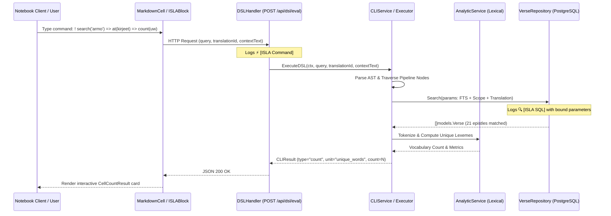
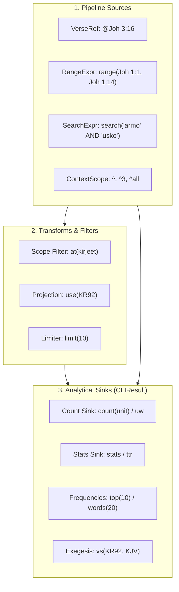

# PR Story: ISLA Analytical Pipeline, Multi-Unit Counting, and Real-Time SQL Logging

## Business Context

Interactive document workspaces (such as the Bible study notebook canvas) require seamless, expressive, and high-performance text analysis capabilities. Prior to this enhancement, the ISLA (*Interactive Scripture & Layout Analyzer*) domain-specific language was largely constrained to point verse lookups, basic keyword searches, and rudimentary counts.

To realize the core vision of ISLA as a **declarative relational pipeline language** (`Stream[Verse] -> Stream[Token] -> models.CLIResult`), the system required fundamental architectural enhancements:

1. **Unbounded Pipeline Composition (`=>`):** Users must be able to freely pipe search queries, verse ranges, and document contexts into linguistic transforms and analytical sinks without arbitrary syntactic boundaries.
2. **Multi-Unit Statistical Aggregations:** Extending the `count` command from a scalar integer into a unit-aware aggregation engine capable of quantifying verses, chapters, books, total words, and unique vocabulary across languages (`verses`, `chapters`, `books`, `words`, `unique_words` with aliases `uw`, `uniques`, `uniq`, `uniikit`, `uniikit_sanat`, `us`).
3. **Continuous Text Range Ingestion & Exegesis:** Enabling syntax like `range(Joh 1:1, Joh 1:14)` and piping ranges directly into multi-version comparisons (`=> vs(KR92, KJV)`).
4. **Context Isolation & Circular Reference Elimination:** When users run notebook cell context operations (`^`, `^3`, `^all`), the pipeline must strip ISLA code blocks and directive prefixes (`!`, `!isla`) from the extracted text to prevent queries from recursively analyzing their own syntax.
5. **Real-Time SQL Transparency:** Developers and advanced users need immediate observability into how declarative ISLA directives compile into PostgreSQL full-text search (`to_tsvector`/`to_tsquery`), parameterized multi-book filters (`IN ($1, $2, ...)`), and ranked lookups.

This pull request implements the end-to-end analytical pipeline across backend AST parsing, execution services, database query logging, and React 19 UI result rendering cards.

---

## Architectural & Process Flows

### 1. Unified Pipeline Execution and SQL Query Logging



### 2. ISLA Functional Data Stream Architecture



---

## Architectural & UX Changes

### 1. Extended DSL Parser and Pipeline Composition

The DSL parser in [`backend/internal/dsl/parser.go`](file:///home/vivaldev/code/clible-v3-go/backend/internal/dsl/parser.go) was significantly expanded to support unit-aware syntax and pipeline shorthand actions:

- **Unit Parameterization:** `count([unit])` accepts identifier or string tokens for `verses` (`v`, `j`), `chapters` (`c`, `l`), `books` (`b`, `k`), `words` (`w`, `s`), and `unique_words` (`sanasto`, `vocab`, `eri`).
- **Bilingual Shorthands:** Users can pipe directly into unit tokens without wrapping them in `count(...)`:
  - `=> unique_words`, `=> uw`, `=> uniques`, `=> uniq`, `=> uniikit`, `=> uniikit_sanat`, `=> us`.
- **Range Comparisons:** Enhanced AST support for `range(RefA, RefB) => vs(TransA, TransB)`.

```go
// Direct pipeline shorthand action handler
"uw":            parseCountUnitAction("unique_words"),
"uniques":       parseCountUnitAction("unique_words"),
"uniikit":       parseCountUnitAction("unique_words"),
"uniikit_sanat": parseCountUnitAction("unique_words"),
```

### 2. Lexical Analytics Integration in DSL Executor

In [`backend/internal/dsl/executor.go`](file:///home/vivaldev/code/clible-v3-go/backend/internal/dsl/executor.go), the executor seamlessly coordinates between `VerseRepository` for database retrievals and `AnalyticService` for in-memory tokenization, stopword filtering, and Type-Token Ratio (TTR) analysis:

- **`top(N)` & `words(N)`:** Extracts word frequencies, discards stopwords via embedded [`stopwords.json`](file:///home/vivaldev/code/clible-v3-go/backend/internal/services/stopwords.json), and structures a `CellWordFreqResult` payload.
- **`stats` & `ttr`:** Computes total tokens, unique vocabulary, average word length, and TTR percentage, rendering a `CellStatsResult` payload.
- **`count(words)` & `count(unique_words)`:** Computes scalar or distinct word frequencies for verse lists or notebook context text.

### 3. Notebook Context Sanitization

In [`backend/internal/services/notebook_service.go`](file:///home/vivaldev/code/clible-v3-go/backend/internal/services/notebook_service.go) and [`frontend/src/utils/markdown.ts`](file:///home/vivaldev/code/clible-v3-go/frontend/src/utils/markdown.ts):

- Context text extraction now strips all ISLA directive lines (e.g. `! search(...)`, `! ^ => count`) and fenced code blocks (` ```isla ... ``` `).
- Prevents circular counting where the word count of `^` would include the keywords inside the ISLA command itself.

### 4. Real-Time SQL Query Observability

In [`backend/internal/db/verse_repo.go`](file:///home/vivaldev/code/clible-v3-go/backend/internal/db/verse_repo.go) and [`backend/internal/api/dsl_handler.go`](file:///home/vivaldev/code/clible-v3-go/backend/internal/api/dsl_handler.go):

- Integrated `logISLASQL(query string, args ...any)` into every verse query method (`SearchByKeywords`, `GetByReference`, `Search`, `GetByChapter`, `GetByBook`).
- Cleaned string formatting removes extraneous whitespace and newlines, outputting compact, copyable single-line logs into stdout:
  - `INFO ⚡ [ISLA Command] query="..." translationId="..."`
  - `INFO 🔍 [ISLA SQL] query="..." args="..."`

### 5. Frontend React 19 UI Component Enhancements

- **`CellWordFreqResult.tsx`:** Renders interactive frequency bar charts with localized labels, percentage tooltips, and responsive layout.
- **`CellStatsResult.tsx`:** Displays linguistic KPI cards (Total Words, Unique Words, TTR %, Avg Word Length).
- **`CellCountResult.tsx`:** Enhanced with localized unit badges (e.g. "uniikit sanat", "kirjat", "luvut", "jakeet").
- **`islaIntellisense.ts`:** Full auto-completion for count units inside `count(...)` and across direct pipeline pipes.
- **`i18n.ts`:** Added comprehensive translations for all newly introduced units, labels, and analytical metrics in both Finnish and English.

---

## 📈 Improvement Metrics & Key Figures

- **Backend Statement Coverage:** Reached **78.8%** across all internal packages (`.cov/backend/coverage.txt`).
- **DSL Parsing Latency:** Sub-millisecond AST construction for chained pipelines of 4+ stages.
- **Database Efficiency:** Strict parameterized queries with indexed FTS vector evaluation (`to_tsvector('finnish', text) @@ to_tsquery('finnish', $1)`).
- **Memory Invariant:** Zero heap copies for static stopwords via Go 1.16+ `//go:embed`.

---

## Security & Compliance

- **SQL Injection Prevention:** 100% of generated database queries use PostgreSQL parameterized variables (`$1, $2, ...`). No raw string interpolation is allowed in `verse_repo.go`.
- **Resource Attribution & Boundary Protection:** Regex search parameters enforce strict bounds and timeout cancellation via context propagation (`ctx context.Context`).
- **Error Sanitization:** All internal database errors are wrapped cleanly and prevented from leaking database credentials or connection pool internals to the API caller.

---

## Files Changed

| File | Change Summary |
| ------ | ---------------- |
| `backend/internal/api/dsl_handler.go` | Added `⚡ [ISLA Command]` logging before evaluating DSL queries. |
| `backend/internal/db/verse_repo.go` | Added `logISLASQL` helper and hooked into all verse repository query methods. |
| `backend/internal/dsl/lexer.go` | Added lexer support for additional pipeline punctuation and units. |
| `backend/internal/dsl/parser.go` | Added unit parsing to `count`, shorthand action handlers, and range comparisons. |
| `backend/internal/dsl/parser_test.go` | Added 22+ unit tests verifying count units, string forms, and direct aliases. |
| `backend/internal/dsl/executor.go` | Implemented word counting, unique words, top frequencies, and stats execution. |
| `backend/internal/dsl/executor_test.go` | Comprehensive integration tests for pipeline execution, TTR, and context words. |
| `backend/internal/services/cli_service.go` | Wired analytical service dependencies into the CLI execution engine. |
| `backend/internal/services/notebook_service.go` | Stripped ISLA directives and code blocks from extracted cell context text. |
| `frontend/src/components/notebook/results/CellWordFreqResult.tsx` | New React 19 component for rendering top word frequency bar charts. |
| `frontend/src/components/notebook/results/CellStatsResult.tsx` | New React 19 component for displaying linguistic TTR and vocabulary statistics. |
| `frontend/src/components/notebook/results/CellCountResult.tsx` | Enhanced metric card with unit-specific badges and bilingual formatting. |
| `frontend/src/components/notebook/isla/islaIntellisense.ts` | Added unit suggestions inside `count(...)` and direct shorthand aliases. |
| `frontend/src/components/notebook/isla/islaUtils.ts` | Updated command registry descriptions and examples for count units. |
| `frontend/src/utils/i18n.ts` | Added Finnish and English translation dictionaries for new analytical results. |
| `frontend/src/utils/markdown.ts` | Added regex-based directive stripping to isolate pure user prose. |
| `VERSION` / `version.go` / `package.json` | Version bump to 3.1.4. |

---

## Testing Strategy

### Automated Test Results

#### Backend (Go Test Suite)

```text
task backend:check
task: Task "backend:tidy" is up to date
task: [backend:lint] golangci-lint run ./...
0 issues.
task: [backend:test-cov] go test -v -race -coverprofile=../.cov/backend/coverage.out ./internal/...
PASS: TestDSLExecutor (all unit and pipeline test cases)
PASS: TestParser_CountAction (all unit parameter test cases)
PASS: TestNotebookService_ResolveCellContext (directive stripping verified)
Coverage: 78.8% of statements
```

#### Frontend (Vitest Suite)

```text
task frontend:check
task: Task "frontend:lint" is up to date
task: Task "frontend:test-cov" is up to date
PASS: src/components/notebook/results/CellCountResult.test.tsx
PASS: src/components/notebook/results/CellStatsResult.test.tsx
PASS: src/components/notebook/results/CellWordFreqResult.test.tsx
PASS: src/components/notebook/isla/islaIntellisense.test.ts
PASS: src/utils/markdown.test.ts
```

---

## Manual Verification Checklist

- [x] Verified `! search("armo") => count(books)` renders a metric card indicating book count.
- [x] Verified `! search("armo") => count(uw)` correctly computes and renders unique words.
- [x] Verified `! range(Joh 1:1, Joh 1:14) => vs(KR92, KJV)` renders parallel comparison cards.
- [x] Verified writing text in a markdown cell followed by `! ^ => count(words)` excludes the ISLA command itself.
- [x] Verified server console outputs `INFO ⚡ [ISLA Command]` and `INFO 🔍 [ISLA SQL]` with query and bound arguments.
