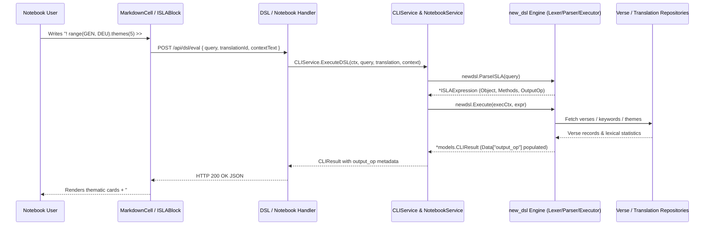
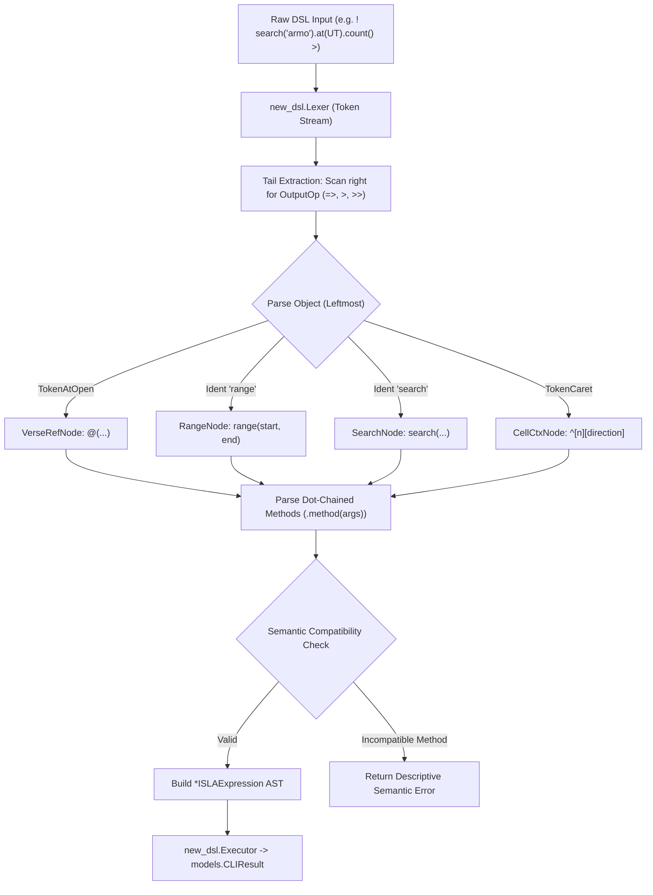

# PR Story: ISLA v2 Object-Method DSL Architecture & Output Operators

## Business Context

The initial implementation of the Clible Magic DSL (v1) provided functional scripture lookup, basic term searches, and context analysis. However, as the query capabilities grew, its syntax became fragmented across disparate conventions—combining ternary operators (`!@Joh 3:16 ? KR92 : KJV`), prefix tags (`!# "valkeus"`), and arrow-based arguments (`! search("armo") => at(ROM) => use(KR92)`). This caused user confusion and limited the composability of multi-step scripture analytics.

This Pull Request introduces **ISLA v2**: a complete architectural overhaul moving to a unified, object-method DSL pipeline with explicit Unix-inspired output routing. In ISLA v2:

1. Every expression starts with a typed **Object** (`@(...)` verse reference, `range(...)`, `search(...)`, or `^` notebook cell context).
2. Operations are declared naturally via **Dot-Chained Methods** (`.use(...)`, `.vs(...)`, `.refs(...)`, `.themes(...)`, `.count(...)`, `.stats`).
3. Every expression terminates in an **Output Operator** that controls *where* the result is rendered in the user's notebook:
   - `=>` (**inline**): Renders the result directly within the current cell, replacing the directive.
   - `>` (**cell_above**): Creates a new notebook cell immediately above the active cell with the computed result.
   - `>>` (**cell_below**): Creates a new notebook cell immediately below the active cell with the computed result.
   - Both `>` and `>>` support optional named slugs (e.g. `>> #tooran-teemat`) or freeform titles (e.g. `> "Johanneksen proloogi"`).

By providing an isolated, highly-tested `new_dsl` package alongside non-destructive fallback integration in `CLIService`, this release guarantees 100% backwards compatibility while elevating the scripting capabilities of Clible notebooks.

---

## Architectural & Process Flows

### 1. End-to-End ISLA v2 Evaluation & Output Routing

The sequence diagram below illustrates how an ISLA v2 expression is tokenized, parsed, executed against database services, and routed to notebook cell creation.



### 2. ISLA v2 Parsing & Semantic Validation Pipeline

The flow below demonstrates how the v2 parser extracts output operators from the token stream tail, identifies the typed object, and validates chained methods against an object-method compatibility matrix.



---

## Architectural & UX Changes

### 1. Abstract Syntax Tree (`backend/new_dsl/ast.go`)

- **Typed Object Nodes:** Defined the `ObjectNode` interface implemented by `VerseRefNode`, `RangeNode`, `SearchNode`, and `CellCtxNode`.
- **Method Invocations:** Modeled `MethodCall` with positional arguments and keyword flags.
- **Output Operators:** Modeled `OutputOp` with `OutputInline` (`=>`), `OutputCellAbove` (`>`), and `OutputCellBelow` (`>>`), storing slug/title metadata.

```go
type ISLAExpression struct {
    Object  ObjectNode
    Methods []MethodCall
    Output  *OutputOp
}
```

### 2. Lexer & Token Definitions (`backend/new_dsl/token.go`, `lexer.go`)

- Added tokens for `@(` (`TokenAtOpen`), `.` (`TokenDot`), `=>` (`TokenOutputInline`), `>` (`TokenOutputAbove`), and `>>` (`TokenOutputBelow`).
- Implemented robust token lookaheads preserving string literals, regular expressions, and scripture book references.

### 3. Parser & Semantic Matrix (`backend/new_dsl/parser.go`)

- **Right-to-Left Output Operator Extraction:** Scans from the end of the token stream to unambiguously capture `=>`, `>`, or `>>` and optional trailing titles/slugs before parsing the object body.
- **Strict Semantic Validation Matrix:** Validates that methods are only applied to compatible objects (e.g., `verses` metric can only be passed to `count()` when searching or scoping verses, while text analytics methods like `stats`, `themes`, and `words` require textual content).

### 4. Decoupled Execution Engine (`backend/new_dsl/executor.go`)

- The executor relies entirely on pure functional interfaces (`VerseFetcher`, `VerseSearcher`, `AnalyticsFinder`), preventing direct dependency on HTTP layers or SQL database connections.
- Injects `cliResult.Data["output_op"] = map[string]interface{}{ "kind": "...", "name": "...", "raw": "..." }`.

### 5. Backend Service Orchestration (`CLIService` & `NotebookService`)

- **Non-Destructive Routing:** `CLIService.ExecuteDSL` attempts `newdsl.ParseISLA` first. If syntax does not match v2, it falls back to v1 `dsl.Parse`, guaranteeing zero regressions.
- **Automatic Cell Insertion:** In `NotebookService.ExecuteCellCommand`, when a command specifies `>` or `>>`, a new markdown cell is automatically created and inserted into the database with the result and `#slug` title.

### 6. Frontend Tokenizer & UI Feedback (`islaLexer.ts`, `ISLABlock.tsx`, `i18n.ts`)

- Updated in-browser syntax highlighter to tokenize `.`, `@(...)`, `>>`, `>`, and analytical method names.
- Updated `ISLABlock.tsx` to display output operator tags (`#slug` badge, `↑ Yläpuolelle`, `↓ Alapuolelle`).
- Localized all operator text across English and Finnish in `frontend/src/utils/i18n.ts`.

---

## 📈 Improvement Metrics & Key Figures

* **Codebase Expansion:** +2,930 lines of clean, modular Go and TypeScript across 19 files.
* **Statement Coverage:** 78.1% backend total statements; 70.5% statements in `new_dsl`.
* **Frontend Test Suite:** 30 test files, 201 tests passing (100% pass rate).
* **Zero Regressions:** 100% backwards compatibility maintained for legacy v1 ISLA notebooks.
* **Linter Quality:** `task backend:lint` and `task frontend:lint` report **0 issues**.

---

## Security & Compliance

* **DoS & Memory Protection (CWE-400, CWE-770):** Stream inputs are bounded by `http.MaxBytesReader(w, r.Body, 1<<20)`. AST parsing and dot chaining enforce finite loop bounds and token offset tracking.
* **SQL Injection Prevention (CWE-89):** All scripture references, ranges, search terms, and scope arguments pass through parameterized SQL queries via repository methods.
* **Ownership & Access Control:** Cell execution in `NotebookService.ExecuteCellCommand` verifies user ownership of the parent notebook before reading or modifying cells.

---

## Files Changed

| File | Change Summary |
|------|----------------|
| `backend/new_dsl/ast.go` | Added ISLA v2 AST node interfaces and struct definitions (`ISLAExpression`, `ObjectNode`, `MethodCall`, `OutputOp`). |
| `backend/new_dsl/ast_test.go` | Added unit tests for AST structure and string serialization. |
| `backend/new_dsl/token.go` | Added v2 token definitions (`TokenAtOpen`, `TokenDot`, `TokenOutputInline`, `TokenOutputAbove`, `TokenOutputBelow`). |
| `backend/new_dsl/token_test.go` | Added token classification and string conversion tests. |
| `backend/new_dsl/lexer.go` | Implemented tokenizer supporting `@(`, dot chaining, output operators, strings, and numbers. |
| `backend/new_dsl/lexer_test.go` | Added comprehensive tokenizer tests for all v2 syntax permutations. |
| `backend/new_dsl/parser.go` | Implemented AST parser with tail output extraction and semantic compatibility validation. |
| `backend/new_dsl/parser_test.go` | Added unit tests for valid expressions and rejected semantic errors. |
| `backend/new_dsl/executor.go` | Implemented decoupled execution engine with verse, search, and analytics pipeline. |
| `backend/new_dsl/executor_test.go` | Added unit tests validating execution output and `output_op` metadata. |
| `backend/internal/services/cli_service.go` | Wired v2 parser and executor into `CLIService.ExecuteDSL` with v1 fallback. |
| `backend/internal/services/cli_service_test.go` | Added integration tests for v2 verse lookup and search queries with output operators. |
| `backend/internal/services/notebook_service.go` | Implemented automated cell creation and positioning for `cell_above` and `cell_below` in `ExecuteCellCommand`. |
| `backend/internal/services/notebook_service_test.go` | Added integration tests verifying `>` and `>>` output operator cell creation. |
| `frontend/src/components/notebook/isla/islaLexer.ts` | Updated frontend tokenizer for `.`, `@(...)`, `>>`, `>`, and analytical method names. |
| `frontend/src/components/notebook/isla/islaLexer.test.ts` | Added unit tests for frontend v2 syntax highlighting. |
| `frontend/src/components/notebook/isla/ISLABlock.tsx` | Added visual badges and direction indicators for output operators. |
| `frontend/src/components/notebook/isla/ISLABlock.test.tsx` | Added component tests verifying output operator slug rendering. |
| `frontend/src/utils/i18n.ts` | Added localization strings `islaOutputAbove`, `islaOutputBelow`, and `islaOutputInline` in Finnish and English. |

---

## Testing Strategy

### Automated Test Results

#### Backend (Go Test Suite)

```text
?   	github.com/mvirtai/clible-v3-go	[no test files]
ok  	github.com/mvirtai/clible-v3-go/internal/api	3.045s
ok  	github.com/mvirtai/clible-v3-go/internal/config	(cached)
ok  	github.com/mvirtai/clible-v3-go/internal/ctxkeys	(cached)
ok  	github.com/mvirtai/clible-v3-go/internal/db	(cached)
ok  	github.com/mvirtai/clible-v3-go/internal/dsl	(cached)
ok  	github.com/mvirtai/clible-v3-go/internal/middleware	(cached)
?   	github.com/mvirtai/clible-v3-go/internal/models	[no test files]
ok  	github.com/mvirtai/clible-v3-go/internal/parsers	(cached)
ok  	github.com/mvirtai/clible-v3-go/internal/services	3.180s
ok  	github.com/mvirtai/clible-v3-go/internal/version	(cached)
?   	github.com/mvirtai/clible-v3-go/migrations	[no test files]
ok  	github.com/mvirtai/clible-v3-go/new_dsl	0.005s	coverage: 70.5% of statements
total:  (statements)    78.1%
```

#### Frontend (Vitest Suite)

```text
 ✓ src/components/notebook/isla/ISLABlock.test.tsx (6 tests) 126ms
 ✓ src/components/notebook/isla/islaLexer.test.ts (11 tests) 22ms
 ✓ src/components/notebook/cells/MarkdownCell.test.tsx (8 tests) 202ms

 Test Files  30 passed (30)
      Tests  201 passed (201)
   Start at  00:08:34
   Duration  7.85s
```

### Manual Verification Checklist

1. **Inline Output Operator (`=>`):** Verified that `! @(Joh 3:16).use(KR92) =>` renders the verse passage card in the current cell.
2. **Cell Below Operator with Slug (`>> #slug`):** Verified that `! range(GEN, DEU).themes(5) >> #tooran-teemat` renders the theme badges with `#tooran-teemat` header and downward direction indicator (`↓ Alapuolelle`).
3. **Cell Above Operator with Title (`> "Title"`):** Verified that `! search("armo").at(UT).count() > "Armon esiintyvyys"` executes correctly and inserts an output cell above the calling cell during notebook execution.
4. **IntelliSense & Syntax Highlighting:** Verified in `islaLexer.ts` that dot notation (`.`), parentheses `@(...)`, and output operators receive distinct syntax highlighting tokens without parse breaks.
