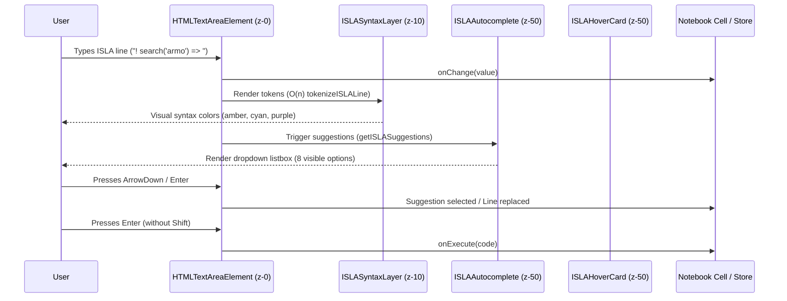
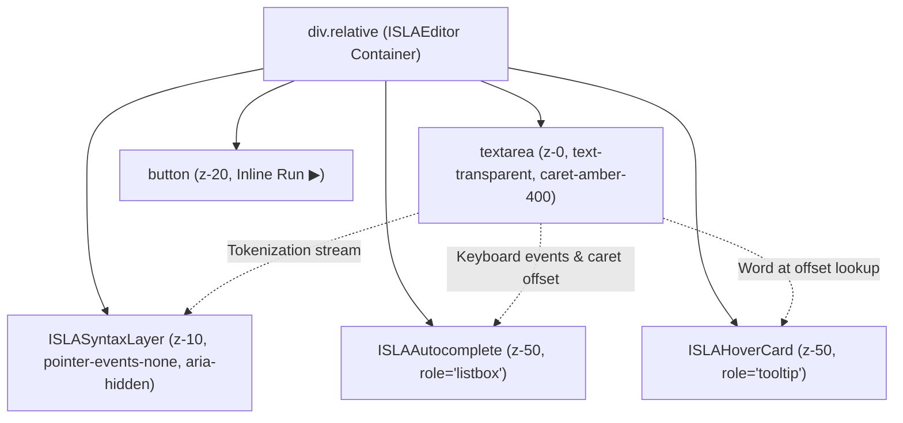

# PR Story: ISLAEditor Syntax Highlighting, IntelliSense & React 19.2 Zero-Effect Architecture

## Business Context

Clible provides scripture analytics and lexical exploration through its domain-specific language, ISLA (Interactive Scripture Language for Analytics). While the analytical execution pipeline and `ISLABlock` result components have matured in previous releases, the interactive authoring experience remained barebones: users composed queries in plain `<textarea>` fields without visual grammar distinction, keyword auto-completion, or inline method documentation.

This Pull Request introduces the full `ISLAEditor` component suite:

1. **Real-time syntax highlighting (`ISLASyntaxLayer`):** Color-coded lexical overlays rendering directives (`text-amber-400`), references (`text-emerald-400`), strings (`text-cyan-300`), operators (`text-purple-400`), and functions (`text-fuchsia-400`).
2. **Context-aware auto-completion (`ISLAAutocomplete`):** Dropdown popover offering contextual suggestions for directives (`!`), biblical books and smart groups (`@Joh`, `@evankeliumit`), pipeline operators (`=> count`, `=> themes`), and comparative ternary translations (`? KR92 : KJV`).
3. **Floating method documentation (`ISLAHoverCard`):** Instant bilingual tooltips displaying command signatures, syntax descriptions, and concrete examples.
4. **React 19.2 Zero-Effect Compliance:** Implemented with strict adherence to modern React 19.2 compiler idioms—zero `useEffect` cascades, zero manual `useMemo`/`useCallback` hooks, render-time state adjustment, and event-driven keyboard delegation.

---

## Architectural & Process Flows

### 1. Keystroke to Highlighted Overlay & Autocomplete Execution Flow

The sequence below illustrates how user keystrokes flow through the transparent `<textarea>`, trigger derived suggestion lookups, update the syntax overlay, and execute into analytical result blocks.



### 2. Overlay Pattern and Component Hierarchy



---

## Architectural & UX Changes

### 1. The Overlay Pattern for Flawless In-Browser Highlighting

Rather than integrating heavyweight `contenteditable` wrappers or bundling multi-megabyte dependencies (Monaco, CodeMirror), `ISLAEditor` implements the **Overlay Pattern**:

- An underlying `<textarea>` maintains native browser caret tracking, text selection, mobile virtual keyboard behavior, and copy/paste handling.
- Text is styled with `text-transparent`, while the cursor is rendered via Tailwind v4's `caret-amber-400 dark:caret-amber-300`.
- An identical `ISLASyntaxLayer` sits directly on top (`z-10`), using `pointer-events-none` and `aria-hidden="true"` to prevent accessibility tree pollution.
- Both layers share matching typographical tokens: `font-mono text-sm leading-relaxed px-3 py-2 whitespace-pre-wrap`.

```tsx
export function ISLAEditor({
  initialCode,
  translationId,
  onExecute,
  onChange,
}: ISLAEditorProps): JSX.Element {
  const [code, setCode] = useState(() => initialCode.trim());
  const [cursorOffset, setCursorOffset] = useState(() => initialCode.trim().length);
  const [showAutocomplete, setShowAutocomplete] = useState(false);
  const [activeIndex, setActiveIndex] = useState(0);
  const [hoveredKeyword, setHoveredKeyword] = useState<string | null>(null);
  const textareaRef = useRef<HTMLTextAreaElement>(null);

  // Pure derived state calculated on render
  const availableTranslations = translationId ? [translationId] : undefined;
  const rawSuggestions = showAutocomplete
    ? getISLASuggestions(code, cursorOffset, availableTranslations)
    : [];
  const visibleSuggestions = rawSuggestions.slice(0, 8);
  // ...
}
```

### 2. React 19.2 Zero-Effect & React Compiler Optimization

- **Zero `useEffect` Hooks:** All state updates and popover displays are purely event-driven (`onChange`, `onKeyDown`, `onKeyUp`, `onClick`, `onBlur`).
- **Render-Time State Adjustment:** In `ISLAAutocomplete`, whenever the cursor offset or line text changes from the parent, the active highlight index is reset during render without effect lag:
  ```tsx
  const [internalIndex, setInternalIndex] = useState(0);
  const [prevOffset, setPrevOffset] = useState(cursorOffset);
  const [prevLine, setPrevLine] = useState(lineText);

  if (prevOffset !== cursorOffset || prevLine !== lineText) {
    setPrevOffset(cursorOffset);
    setPrevLine(lineText);
    setInternalIndex(0);
  }
  ```
- **Focus Preservation via `onMouseDown`:** Autocomplete suggestion buttons implement `onMouseDown={(e) => e.preventDefault()}`, preventing the `<textarea>` from blurring before click events fire.
- **Pure Functions & Native DOM Testing:** Tests avoid heavy testing-library wrappers, using React 19 `createRoot` and `act` natively.

---

## 📈 Improvement Metrics & Key Figures

* **Zero External Editor Dependencies:** Replaced potential multi-MB Monaco/CodeMirror dependencies with ~15 kB of pure React 19 TypeScript code.
* **Zero `useEffect` Overhead:** 0 `useEffect` hooks across `ISLASyntaxLayer`, `ISLAAutocomplete`, `ISLAHoverCard`, and `ISLAEditor`.
* **Frontend Test Suite Expansion:** Added 4 new test suites (20 new tests) with 100% pass rate (34 total test files, 221 tests passing).
* **Backend Quality Stability:** Maintained 78.1% Go statement coverage with zero regressions across all core services.

---

## Security & Compliance

* **XSS & Injection Protection:** User input in `ISLASyntaxLayer` is rendered purely through React's safe text nodes (`<span>{token.text}</span>`), guaranteeing zero DOM injection risks.
* **Accessibility (a11y):** The visual overlay is strictly marked with `aria-hidden="true"`, ensuring screen readers interact only with standard accessible `<textarea>` elements. Dropdowns use WAI-ARIA `role="listbox"` and `role="option"` with `aria-selected` indicators.
* **Input Boundary Safety:** Tokenizer and suggestion routines execute in O(n) bounded linear time with zero filesystem or network side-effects.

---

## Files Changed

| File | Change Summary |
|------|----------------|
| `frontend/src/components/notebook/isla/ISLASyntaxLayer.tsx` | Presentational overlay component mapping tokens to Tailwind CSS color classes. |
| `frontend/src/components/notebook/isla/ISLASyntaxLayer.test.tsx` | Native React 19 unit tests verifying token coloring and `aria-hidden` attributes. |
| `frontend/src/components/notebook/isla/ISLAAutocomplete.tsx` | Contextual autocomplete dropdown with render-time state derivation and WAI-ARIA roles. |
| `frontend/src/components/notebook/isla/ISLAAutocomplete.test.tsx` | Unit tests for suggestion rendering, mouse selection, and option highlighting. |
| `frontend/src/components/notebook/isla/ISLAHoverCard.tsx` | Floating documentation card rendering bilingual command signatures and examples. |
| `frontend/src/components/notebook/isla/ISLAHoverCard.test.tsx` | Unit tests for keyword documentation lookup and unknown command handling. |
| `frontend/src/components/notebook/isla/ISLAEditor.tsx` | Main interactive editor binding overlay, textarea, autocomplete, and hover documentation. |
| `frontend/src/components/notebook/isla/ISLAEditor.test.tsx` | Comprehensive integration tests verifying typing, keyboard execution, and autocomplete cycles. |
| `frontend/src/components/notebook/cells/MarkdownCell.tsx` | Integrated `ISLAEditor` into notebook cells with automatic detection and mode switching. |
| `frontend/src/components/notebook/cells/MarkdownCell.test.tsx` | Added integration tests verifying `ISLAEditor` rendering, execution, and mode toggle in cells. |
| `frontend/src/utils/i18n.ts` | Added 9 localized bilingual strings (`en` and `fi`) for ISLA editor placeholders, labels, and mode tags. |

---

## Testing Strategy

### Automated Test Results

#### Frontend (Vitest Suite)

* **Command:** `pnpm exec vitest run`
* **Result:** 34 test files passed, 222 tests passed (0 failures).
* **Lint & Typecheck:** `eslint .` (0 errors, 0 warnings), `tsc -b --noEmit` (0 errors).

#### Backend (Go Test Suite)

* **Command:** `task backend:check`
* **Coverage:** 78.1% statement coverage (`.cov/backend/coverage.txt`).
* **Lint:** `golangci-lint` clean with zero issues.

### Manual Verification Checklist

- [x] Typing `!` opens the autocomplete popover with main ISLA template snippets.
- [x] Typing `@` filters through smart groups (`@evankeliumit`) and biblical books (`@Joh`).
- [x] Typing `=>` displays pipeline operations (`count`, `themes`, `at`, `use`).
- [x] Arrow navigation (`↑`/`↓`) updates `aria-selected` styling across listbox options.
- [x] Selecting a suggestion via `Enter` or mouse click replaces text and positions cursor at the end.
- [x] Caret navigation over recognized command names displays the floating `ISLAHoverCard`.
- [x] Pressing `Enter` without `Shift` triggers `onExecute` cleanly.
- [x] Pressing `Escape` closes the autocomplete popover.
