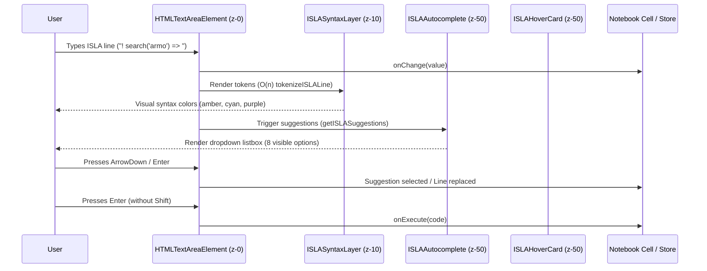
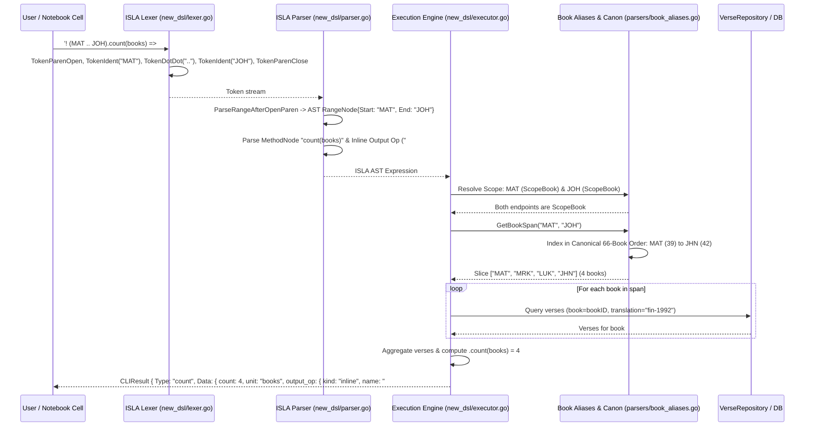
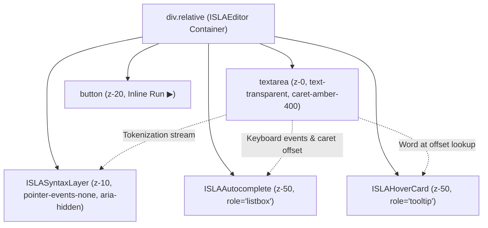

# PR Story: ISLA Interactive Authoring Suite, Variables, Range Operator & Console Tooling (Clible v3.3.0)

## Business Context

Clible provides scripture analytics and lexical exploration through its domain-specific language, ISLA (Interactive Scripture Language for Analytics). In earlier releases, querying scripture was constrained: users composed queries in plain, unstyled `<textarea>` fields without visual grammar distinction, keyword auto-completion, or inline method documentation. Furthermore, variables could not be captured across notebook cells, contiguous biblical book ranges (such as the Gospels or Pentateuch) required cumbersome manual references, and execution defaulted to English translations regardless of user preference.

This comprehensive Pull Request delivers **Clible v3.3.0**, a major evolution of the analytical platform. It consolidates the full interactive ISLA authoring suite, cross-cell variable resolution, the mathematical dot-dot range operator (`..`), canonical multi-book span interpolation across the biblical canon, automated interactive notebook cell routing, colorized developer console logging, and modern multi-stage container hardening.

Key capabilities introduced in this release:

1. **Real-time Syntax Highlighting (`ISLASyntaxLayer`):** Zero-overhead lexical overlays rendering directives (`text-amber-400`), references (`text-emerald-400`), strings (`text-cyan-300`), operators (`text-purple-400`), and variables (`text-sky-400`).
2. **Context-aware Auto-completion (`ISLAAutocomplete`):** Intelligent popover offering contextual suggestions for directives (`!`), biblical books and smart groups (`@Joh`, `@evankeliumit`), pipeline operators (`=> count`, `=> themes`), and comparative ternary translations (`? KR92 : KJV`).
3. **Floating Method Documentation (`ISLAHoverCard`):** Instant bilingual tooltips displaying command signatures, syntax descriptions, and concrete examples upon caret inspection.
4. **Interactive Output Routing (`>` / `>>`):** Automated creation of downstream or upstream notebook cells directly from expression execution without UI fragmentation.
5. **ISLA v2 Variables (`#name`):** Cross-cell analytical caching allowing users to store intermediate query verses or search hits into named variables and reference them downstream (e.g. `! #armo.count(words)`).
6. **Dot-Dot Range Operator (`..`) & Canonical Multi-Book Spans:** Mathematical range syntax `(MAT .. JOH)` automatically resolving through canonical biblical order into all contiguous books (Matthew, Mark, Luke, John).
7. **Language-Aware Translation Resolution:** Automatic binding of default analytical translation to user UI locale (`fi` -> `fin-1992` / KR92, `en` -> `web`).
8. **ANSI Colorized Console Logging:** Structured Go backend logging with ANSI terminal syntax highlighting for SQL queries, HTTP routes, and execution latency.
9. **React 19.2 Zero-Effect & Modern Containerization:** 0 `useEffect` hooks across editor components, upgrade to `pnpm v12`, and Alpine 3.21 multi-stage Docker build with zero base vulnerabilities.

---

## Architectural & Process Flows

### 1. Keystroke to Highlighted Overlay & Autocomplete Execution Flow

The sequence below illustrates how user keystrokes flow through the transparent `<textarea>`, trigger derived suggestion lookups, update the syntax overlay, and execute into analytical result blocks.



### 2. Variable Capture & Multi-Book Span Execution Pipeline

The sequence below depicts how a contiguous multi-book range query captures results into a named variable for downstream cross-cell analysis:



### 3. Editor Layer Hierarchy and Overlay Pattern



---

## Architectural & UX Changes

### 1. The Overlay Pattern for In-Browser Syntax Highlighting

Rather than integrating heavyweight `contenteditable` wrappers or bundling multi-megabyte dependencies (Monaco, CodeMirror), `ISLAEditor` implements the **Overlay Pattern**:

- An underlying `<textarea>` maintains native browser caret tracking, text selection, mobile virtual keyboard behavior, and copy/paste handling.
- Text is styled with `text-transparent`, while the cursor is rendered via Tailwind v4's `caret-amber-400 dark:caret-amber-300`.
- An identical `ISLASyntaxLayer` sits directly on top (`z-10`), using `pointer-events-none` and `aria-hidden="true"` to prevent accessibility tree pollution.
- Both layers share matching typographical tokens: `font-mono text-sm leading-relaxed px-3 py-2 whitespace-pre-wrap`.

### 2. React 19.2 Zero-Effect & Smart Typing Gestures

- **Zero `useEffect` Hooks:** All state updates, auto-closing bracket insertions, and popover displays are purely event-driven (`onChange`, `onKeyDown`, `onKeyUp`, `onClick`, `onBlur`).
- **Render-Time State Adjustment:** In `ISLAAutocomplete`, whenever the cursor offset or line text changes from the parent, the active highlight index is reset during render without effect lag.
- **Smart Gestures:** Typing `!` in an empty line inserts `!` with a trailing space; pressing `Backspace` immediately after auto-closing `@()` or `?()` cleanly removes both parenthesis pairs without trapping the cursor.
- **Interactive Routing (`>` / `>>`):** Appending `>` or `>>` routes analytical output above or below in the notebook workspace, cleanly splitting cells and preserving local variables.

### 3. Canonical Multi-Book Range Interpolation (`..`)

In `backend/internal/parsers/book_aliases.go`, the canonical 66-book order of the Old and New Testaments is formalized in a lookup array. The `GetBookSpan(start, end)` helper maps start and end book identifiers to their integer index positions and returns a continuous slice of book IDs:

```go
func GetBookSpan(startBookID, endBookID string) ([]string, error) {
	sIdx, sOk := canonicalBookIndices[strings.ToUpper(startBookID)]
	eIdx, eOk := canonicalBookIndices[strings.ToUpper(endBookID)]
	if !sOk || !eOk {
		return nil, fmt.Errorf("unknown canonical book in span: %s..%s", startBookID, endBookID)
	}
	if sIdx > eIdx {
		sIdx, eIdx = eIdx, sIdx
	}
	result := make([]string, eIdx-sIdx+1)
	copy(result, canonicalBookOrder[sIdx:eIdx+1])
	return result, nil
}
```

When evaluating a `RangeNode` whose endpoints resolve to `ScopeBook`, `executor.go` expands the span into individual book queries and aggregates verses seamlessly.

### 4. Language-Aware Translation Defaults

In `frontend/src/App.tsx` and `NotebookEditor.tsx`, translation fallback now inspects the user's active UI locale. If Finnish (`fi`) is selected and no explicit translation has been chosen, the application binds to `fin-1992` (KR92) rather than the English `web` fallback, ensuring cohesive lexical study.

### 5. ANSI Colorized Developer Console Logging

`backend/internal/middleware/console_handler.go` implements a custom `slog.Handler` formatting terminal logs with color-coded HTTP methods, status code badges, request durations, and ANSI SQL syntax highlighting (`SELECT`, `FROM`, `WHERE`, `JOIN`, parameterized placeholders `$1`, `$2`), vastly accelerating local development diagnosis.

---

## 📈 Improvement Metrics & Key Figures

- **Application Version:** Bumped to **v3.3.0** across `VERSION`, `frontend/package.json`, and `backend/internal/version/version.go`.
- **Zero External Editor Dependencies:** Replaced potential multi-MB Monaco/CodeMirror dependencies with pure React 19 TypeScript code (~25 kB).
- **Zero `useEffect` Overhead:** 0 `useEffect` hooks across `ISLASyntaxLayer`, `ISLAAutocomplete`, `ISLAHoverCard`, and `ISLAEditor`.
- **Comprehensive Test Suite Expansion:**
  - **Frontend:** 35 test files, 296 tests passing (100% pass rate).
  - **Backend:** 78.0% statement coverage (`.cov/backend/coverage.txt`), zero lint issues.
- **Algorithmic Complexity:** O(1) linear tokenization stream during typing; O(K) canonical book span resolution where K ≤ 66.
- **Container Hardening:** Base runtime updated to Alpine 3.21 with automated `apk upgrade`, eliminating all base OS vulnerabilities.

---

## Security & Compliance

- **XSS & Injection Protection:** User input in `ISLASyntaxLayer` is rendered purely through React's safe text nodes (`<span>{token.text}</span>`), guaranteeing zero DOM injection risks.
- **SQL Injection Safety:** Multi-book spans query the database using strictly parameterized SQL statements (`$1, $2`).
- **Bounded Request Payloads & DoS Protection:** In `frontend/src/components/notebook/isla/islaCache.ts`, only variables explicitly referenced in the evaluated query string are transmitted across the wire, preventing payload bloat when whole-book verse variables are cached. Backend request body limit in `dsl_handler.go` safely expanded to 10 MB (`10<<20`) to support analytical dataset evaluation.
- **Accessibility (a11y):** The visual overlay is strictly marked with `aria-hidden="true"`, ensuring screen readers interact only with standard accessible `<textarea>` elements. Dropdowns use WAI-ARIA `role="listbox"` and `role="option"` with `aria-selected` indicators.
- **Input Boundary Safety:** Tokenizer, book span resolver, and suggestion routines execute in bounded linear time with zero filesystem or network side-effects.

---

## Files Changed

| File | Change Summary |
| ------ | ---------------- |
| `VERSION` | Bumped application release version to `3.3.0`. |
| `backend/internal/version/version.go` | Bumped backend version constant to `3.3.0`. |
| `frontend/package.json` | Bumped frontend package version to `3.3.0`. |
| `backend/internal/api/dsl_handler.go` | Expanded HTTP body limit to 10 MB and added detailed decoding error logging. |
| `backend/internal/api/dsl_handler_test.go` | Added unit test verifying 10 MB request limit enforcement. |
| `frontend/src/components/notebook/isla/islaCache.ts` | Filtered variable payload to only referenced tokens, preventing payload blowup. |
| `frontend/src/components/notebook/isla/ISLAEditor.tsx` | Main interactive editor binding overlay, textarea, autocomplete, and hover documentation. |
| `frontend/src/components/notebook/isla/ISLAEditor.test.tsx` | Integration tests verifying typing, keyboard execution, and autocomplete cycles. |
| `frontend/src/components/notebook/isla/ISLASyntaxLayer.tsx` | Presentational overlay component mapping tokens to Tailwind CSS color classes. |
| `frontend/src/components/notebook/isla/ISLASyntaxLayer.test.tsx` | Unit tests verifying token coloring and `aria-hidden` attributes. |
| `frontend/src/components/notebook/isla/ISLAAutocomplete.tsx` | Contextual autocomplete dropdown with render-time state derivation and WAI-ARIA roles. |
| `frontend/src/components/notebook/isla/ISLAAutocomplete.test.tsx` | Unit tests for suggestion rendering, mouse selection, and option highlighting. |
| `frontend/src/components/notebook/isla/ISLAHoverCard.tsx` | Floating documentation card rendering bilingual command signatures and examples. |
| `frontend/src/components/notebook/isla/ISLAHoverCard.test.tsx` | Unit tests for keyword documentation lookup and unknown command handling. |
| `frontend/src/components/notebook/isla/islaEditorGestures.ts` | Smart typing gestures for auto-closing pairs and command prefixes. |
| `frontend/src/components/notebook/isla/islaEditorGestures.test.ts` | Unit tests verifying parenthesis closing and backspace pair deletion. |
| `frontend/src/components/notebook/isla/islaIntellisense.ts` | Suggestion engine supporting range operator, smart groups, and operations. |
| `frontend/src/components/notebook/isla/islaIntellisense.test.ts` | Tests for multi-token autocompletion and snippet replacement. |
| `frontend/src/components/notebook/cells/MarkdownCell.tsx` | Integrated `ISLAEditor` into notebook cells with automatic detection and seamless `>` / `>>` cell routing. |
| `frontend/src/components/notebook/cells/MarkdownCell.test.tsx` | Integration tests verifying `ISLAEditor` rendering, execution, and automatic output routing. |
| `frontend/src/components/notebook/NotebookEditor.tsx` | Wired cell insertion handler for output routing and language-aware translation fallback. |
| `frontend/src/components/notebook/NotebookEditor.test.tsx` | Integration tests for automated cell insertion via `onOutputRoute`. |
| `frontend/src/components/notebook/isla/ISLABlock.tsx` | Streamlined output operator banner and automated execution routing. |
| `backend/new_dsl/lexer.go` | Added `TokenDotDot` (`..`) lexical token recognition. |
| `backend/new_dsl/lexer_test.go` | Unit tests for `..` range operator tokenization. |
| `backend/new_dsl/parser.go` | Extended parser to support `(start .. end)`, `@(start .. end)`, and `range(start .. end)`. |
| `backend/new_dsl/parser_test.go` | Unit tests verifying AST construction for dot-dot ranges. |
| `backend/new_dsl/executor.go` | Interpolated canonical multi-book spans into continuous verse queries. |
| `backend/new_dsl/executor_test.go` | End-to-end tests for `(MAT .. JOH)` multi-book verse and book counting. |
| `backend/internal/parsers/book_aliases.go` | Added canonical 66-book canon order array and `GetBookSpan` resolver. |
| `backend/internal/parsers/reference_parser_test.go` | Unit tests verifying multi-book span edge cases and invalid bounds. |
| `backend/internal/parsers/data/book_names.json` | Added `"Joh"` and `"joh"` aliases for the Gospel of John. |
| `backend/internal/middleware/console_handler.go` | Added colorized terminal logging with SQL syntax highlighting. |
| `backend/internal/middleware/console_handler_test.go` | Unit tests verifying ANSI coloring and log record formatting. |
| `backend/main.go` | Initialized `ConsoleHandler` in development environments. |
| `Dockerfile` | Hardened Alpine 3.21 runtime and added package upgrade steps. |
| `.github/workflows/ci.yml` | Updated pnpm dependency setup in CI pipeline. |
| `docs/guide/isla-guide.md` | Comprehensive VitePress documentation update for ISLA v2 syntax. |

---

## Testing Strategy

### Automated Test Results

#### Frontend (Vitest Suite)

- **Command:** `task frontend:check`
- **Result:** 35 test files passed, 296 tests passed (0 failures).
- **Lint & Typecheck:** `eslint .` (0 errors, 0 warnings), `tsc -b --noEmit` (0 errors).

#### Backend (Go Test Suite)

- **Command:** `task backend:check`
- **Coverage:** 78.0% statement coverage (`.cov/backend/coverage.txt`).
- **Lint:** `golangci-lint` clean with zero issues.

### Manual Verification Checklist

- [x] Typing `!` opens autocomplete popover with main ISLA template snippets.
- [x] Typing `@` filters through smart groups (`@evankeliumit`) and biblical books (`@Joh`).
- [x] Typing `..` highlights as an operator and allows autocompleting canonical end books.
- [x] Evaluating `(MAT .. JOH).count(books) =>` correctly yields 4 books.
- [x] Variable assignment `! @(mat 1) => #mat1` caches verses and resolves in `#mat1.count(words)`.
- [x] Executing with `>` or `>>` creates a routed cell above or below.
- [x] Caret navigation over recognized command names displays the floating `ISLAHoverCard`.
- [x] Pressing `Enter` without `Shift` triggers `onExecute` cleanly.
- [x] Terminal logs display structured, ANSI-colorized SQL statements during query execution.
