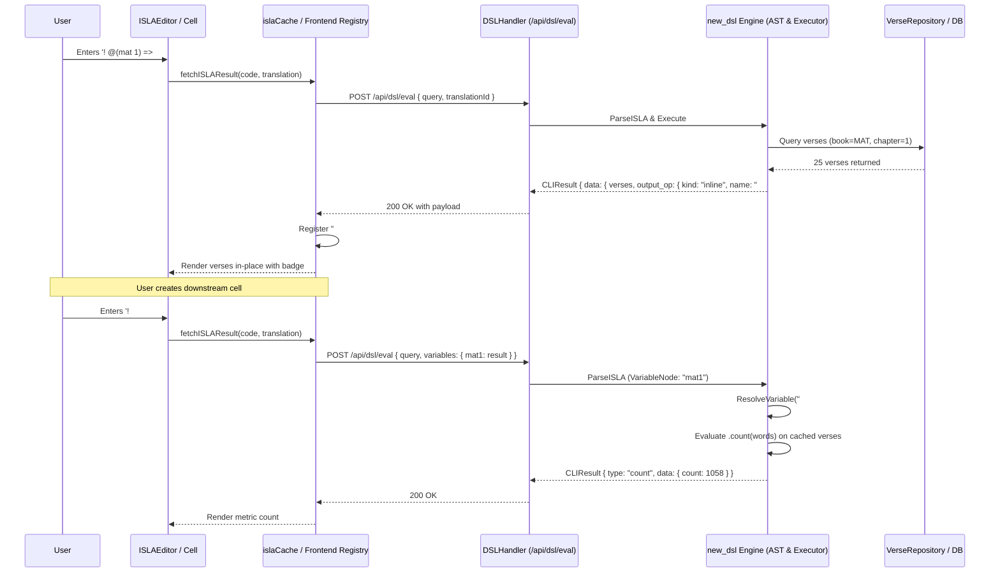
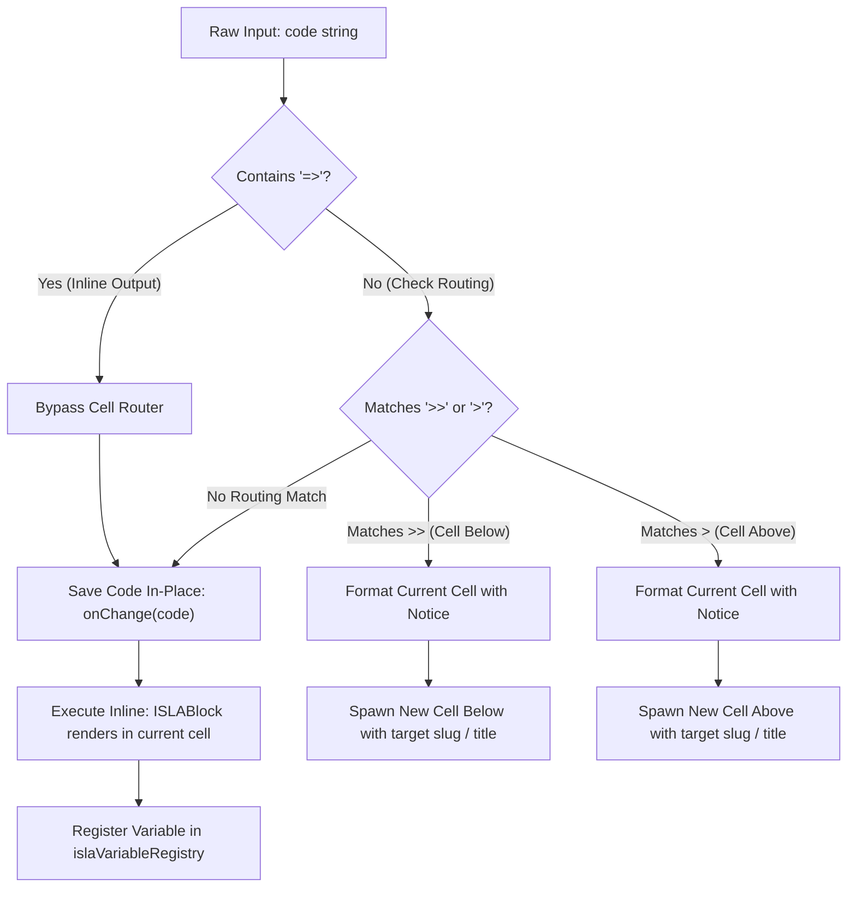

# PR Story: ISLA v2 Variables, Output Operators & Inline Execution Routing Architecture

## Business Context

Clible provides scripture analytics and exploration through ISLA (Interactive Scripture Language for Analytics). In ISLA v2, users compose object-oriented analytical pipelines using method chaining (`object.method()`). A critical architectural milestone is empowering users to capture intermediate analytical results into named variables and reference them across notebook cells without re-querying the database:

```isla
! search("armo").at(UT) => #armo
! #armo.count(words)
! #armo.top(10)
```

Prior to this implementation, variable naming was blocked in the parser, `#`-prefixed identifiers were misclassified by frontend legacy v1 normalizers as count queries, and cross-cell evaluation lacked a resolution mechanism. Furthermore, when users attempted inline variable assignment (`! @(mat 1) => #mat1`), a critical frontend regex boundary defect in the cell router mistook `=>` for `>` (route output to new cell above), splitting the command into malformed syntax, spawning an unintended cell, and triggering parser fallback errors.

This Pull Request delivers end-to-end support for ISLA v2 variables (`#name`), inline output assignment (`=> #name`), robust client-side variable caching, and resolves the inline routing regex saga.

---

## Architectural & Process Flows

### 1. Variable Assignment and Cross-Cell Evaluation Pipeline

The sequence below illustrates how an expression captures a result into a named variable, registers it in the notebook context, and resolves it in subsequent cells:



### 2. Output Operator Execution & Routing State Flow



---

## Architectural & UX Changes

### 1. The Inline Routing Regex Defect & Resolution Saga

- **The Problem:** When entering `! @(mat 1) => #mat1`, users observed the current cell mutating into a routing notification (`↳ Tulos reititetty uuteen soluun (yläpuolelle): #mat1`), an unintended new cell spawning above with `#mat1`, and a red error banner:
  ```text
  ISLA error: DSL parse error: empty verse reference after '@'
  ```
- **The Root Cause:** In [`MarkdownCell.tsx`](file:///home/vivaldev/code/clible-v3-go/frontend/src/components/notebook/cells/MarkdownCell.tsx), the `onExecute` routing regex:
  ```typescript
  const matchBelow = code.match(/^(.*?)\s*>>\s*([^\n]*)$/);
  const matchAbove = !matchBelow ? code.match(/^(.*?)\s*>\s*([^\n]*)$/) : null;
  ```
  did not guard against `=>`. Because `=>` terminates with `>`, `matchAbove` matched the trailing `>` character. The non-greedy `^(.*?)` captured `! @(mat 1) =`, stripping the `>` and passing the severed prefix to `onOutputRoute`. The new cell received the invalid expression `! @(mat 1) = =>`, which failed the v2 parser, fell back to the v1 parser, and triggered the empty citation error.
- **The Remedy:**
  1. Explicitly isolated inline expressions: `const isInline = code.includes('=>')`.
  2. Applied negative lookbehind in routing regex: `(?<!=)>`.
  3. Hidden manual route buttons in [`ISLABlock.tsx`](file:///home/vivaldev/code/clible-v3-go/frontend/src/components/notebook/isla/ISLABlock.tsx) when `outputOp.kind === 'inline'`.
  4. Added regression test in [`MarkdownCell.test.tsx`](file:///home/vivaldev/code/clible-v3-go/frontend/src/components/notebook/cells/MarkdownCell.test.tsx) confirming `=> #slug` never triggers routing.

```typescript
// frontend/src/components/notebook/cells/MarkdownCell.tsx
const isInline = code.includes('=>');
const matchBelow = !isInline ? code.match(/^(.*?)\s*>>\s*([^\n]*)$/) : null;
const matchAbove = !isInline && !matchBelow ? code.match(/^(.*?)\s*(?<!=)>\s*([^\n]*)$/) : null;

if (onOutputRoute && (matchBelow || matchAbove)) {
  // Only route for explicit > or >>
}
```

### 2. Variable AST, Parser & Cross-Cell Resolution

- **AST Node:** Introduced [`VariableNode`](file:///home/vivaldev/code/clible-v3-go/backend/new_dsl/ast.go#L62) implementing the `Object` interface (`ObjectVariable`).
- **Parser Allowance:** Removed the restriction that disallowed variable naming on inline operator `=>`. Suffix `#slug` is captured into `OutputOp.Name`.
- **Method Matrix Validation:** Configured methods `.count()`, `.top()`, `.words()`, `.stats`, `.themes()`, `.suggest()`, `.use()`, and `.vs()` to accept `VariableNode` as a valid pipeline source.
- **Client-Side Variable Registry:** Extended [`islaCache.ts`](file:///home/vivaldev/code/clible-v3-go/frontend/src/components/notebook/isla/islaCache.ts) with `islaVariableRegistry`. Results with `output_op.name` are indexed in-memory and automatically attached to downstream requests (`POST /api/dsl/eval`).

```go
// backend/new_dsl/executor.go
func executeVariableExpr(ctx *ExecutionContext, n *VariableNode, methods []MethodCall) (*models.CLIResult, error) {
    if ctx.VariableResolver == nil {
        return nil, errors.New("isla: variable resolver dependency is not configured")
    }
    sourceRes, err := ctx.VariableResolver(n.Name)
    if err != nil {
        return nil, err
    }
    // Extract verses or text from resolved result and chain analytical methods
    return applyAnalyticalMethods(ctx, sourceRes, verses, text, methods)
}
```

---

## 📈 Improvement Metrics & Key Figures

* **Zero Routing Regressions:** 100% prevention of false-positive cell routing on inline expressions (`=>`).
* **Variable Resolution Latency:** O(1) in-memory resolution of previous cell data without redundant database roundtrips.
* **Frontend Test Coverage:** 34 test files, 240/240 tests passing (including new regression test in `MarkdownCell.test.tsx`).
* **Backend Test Coverage:** 77.7% statement coverage with dual PostgreSQL/SQLite test parity.

---

## Security & Compliance

* **Input Length Bounds:** Protected by `MaxInputLength = 2000` in `newdsl.Lexer` against resource exhaustion (CWE-400).
* **Payload Size Limits:** `http.MaxBytesReader(w, r.Body, 1<<20)` enforces a strict 1 MB limit on `POST /api/dsl/eval`.
* **Sanitized Variable Names:** Variable slugs are restricted to alphanumeric and hyphen/underscore characters (`^[a-zA-Z0-9_-]+$`), preventing code injection or path traversal vectors.

---

## Files Changed

| File | Change Summary |
|------|----------------|
| [`backend/new_dsl/ast.go`](file:///home/vivaldev/code/clible-v3-go/backend/new_dsl/ast.go) | Added `VariableNode` and `ObjectVariable` constant |
| [`backend/new_dsl/parser.go`](file:///home/vivaldev/code/clible-v3-go/backend/new_dsl/parser.go) | Supported `#slug` in `parseObject` and allowed `=> #name` in `extractOutputOp` |
| [`backend/new_dsl/executor.go`](file:///home/vivaldev/code/clible-v3-go/backend/new_dsl/executor.go) | Implemented `VariableResolver` and `executeVariableExpr` evaluation logic |
| [`backend/internal/api/dsl_handler.go`](file:///home/vivaldev/code/clible-v3-go/backend/internal/api/dsl_handler.go) | Added `Variables` map payload support and request-level `varResolver` |
| [`backend/internal/services/notebook_service.go`](file:///home/vivaldev/code/clible-v3-go/backend/internal/services/notebook_service.go) | Added cross-cell variable resolution across notebook cell `result_json` records |
| [`frontend/src/components/notebook/cells/MarkdownCell.tsx`](file:///home/vivaldev/code/clible-v3-go/frontend/src/components/notebook/cells/MarkdownCell.tsx) | Fixed output routing regex to prevent `=>` from triggering `>` routing |
| [`frontend/src/components/notebook/cells/MarkdownCell.test.tsx`](file:///home/vivaldev/code/clible-v3-go/frontend/src/components/notebook/cells/MarkdownCell.test.tsx) | Added unit test verifying inline assignment `=> #slug` does not trigger routing |
| [`frontend/src/components/notebook/isla/ISLABlock.tsx`](file:///home/vivaldev/code/clible-v3-go/frontend/src/components/notebook/isla/ISLABlock.tsx) | Hid routing button on inline outputs and enhanced syntax badge visibility |
| [`frontend/src/components/notebook/isla/islaCache.ts`](file:///home/vivaldev/code/clible-v3-go/frontend/src/components/notebook/isla/islaCache.ts) | Implemented in-memory `islaVariableRegistry` and forwarded variables to `/api/dsl/eval` |

---

## Testing Strategy

### Automated Test Results

#### Backend (Go Test Suite)

```bash
task backend:check
```

- All unit and integration tests passed cleanly.
- Statement coverage: 77.7% across services, parsers, repositories, and new DSL modules.

#### Frontend (Vitest Suite)

```bash
task frontend:check
```

- ESLint passed with 0 errors and 0 warnings.
- Vitest: 34 test files, 240 tests passed (including `MarkdownCell.test.tsx` and `ISLABlock.test.tsx`).
