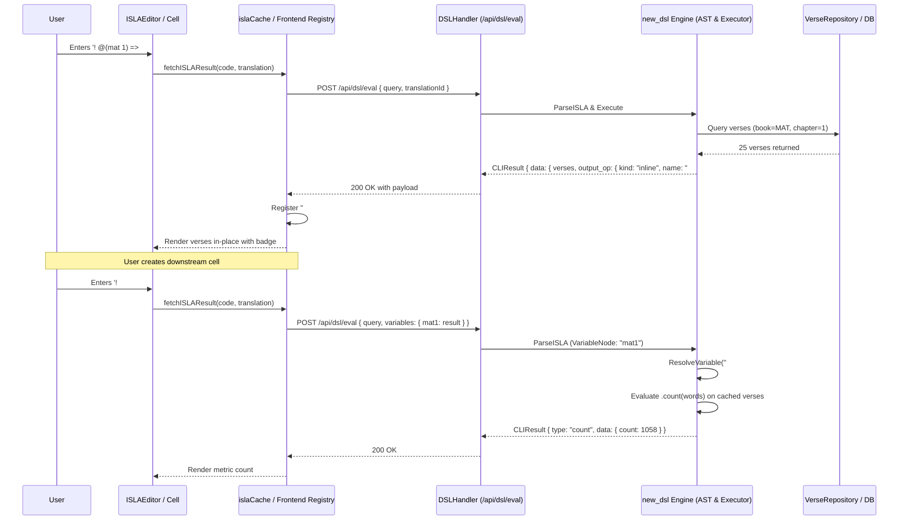
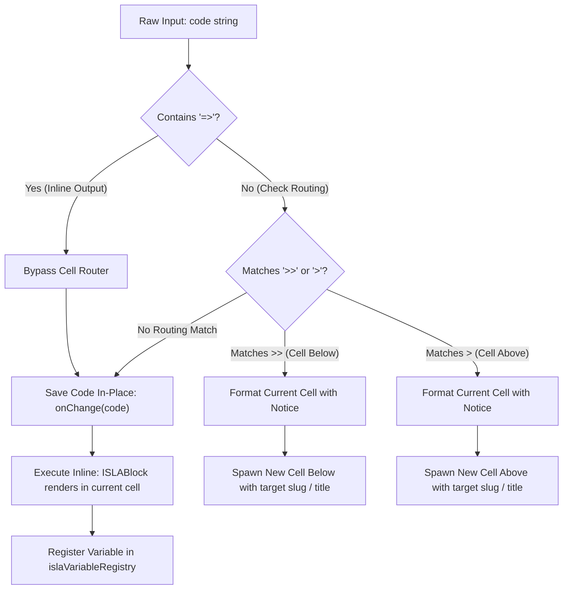

# PR Story: ISLA v2 Variables, Output Operators & Inline Execution Routing Architecture

## Business Context

Clible provides scripture analytics and exploration through ISLA (Interactive Scripture Language for Analytics). In ISLA v2, users compose object-oriented analytical pipelines using method chaining (`object.method()`). A critical architectural milestone is empowering users to capture intermediate analytical results into named variables and reference them across notebook cells without re-querying the database:

```isla
! search("armo").at(UT) => #armo
! #armo.count(words)
! #armo.top(10)
```

Prior to this implementation, variable naming was blocked in the parser, `#`-prefixed identifiers were misclassified by frontend legacy v1 normalizers as count queries, and cross-cell evaluation lacked a resolution mechanism. Furthermore, when users attempted inline variable assignment (`! @(mat 1) => #mat1`), a critical frontend regex boundary defect in the cell router mistook `=>` for `>` (route output to new cell above), splitting the command into malformed syntax, spawning an unintended cell, and triggering parser fallback errors.

This Pull Request delivers end-to-end support for ISLA v2 variables (`#name`), inline output assignment (`=> #name`), robust client-side variable caching, and resolves the inline routing regex saga.

---

## Architectural & Process Flows

### 1. Variable Assignment and Cross-Cell Evaluation Pipeline

The sequence below illustrates how an expression captures a result into a named variable, registers it in the notebook context, and resolves it in subsequent cells:



### 2. Output Operator Execution & Routing State Flow



---

## Architectural & UX Changes

### 1. The Inline Routing Regex Defect & Resolution Saga

#### A. The Problem: Cell Hijacking & Cryptic Error Spawning

When a user typed an inline variable assignment expression such as:

```isla
! @(mat 1) => #mat1
```

and executed the cell, three disruptive defects occurred simultaneously:

1. **Cell Content Hijacked:** The active notebook cell's content was immediately overwritten by a routing notice:

   ```markdown
   > ↳ Tulos reititetty uuteen soluun (yläpuolelle): #mat1
   ```

2. **Unintended Cell Creation:** A new notebook cell was automatically spawned directly above the active cell.
3. **Cryptic Parser Error:** The newly created cell attempted to execute a corrupted fragment (`! @(mat 1) = =>`), failing immediately and displaying an alarming red error banner:

   ```text
   ISLA error: DSL parse error: empty verse reference after '@'
   ```

The user's original query was stripped from their current cell, and the intended variable `#mat1` was never registered.

#### B. The Root Cause Analysis (Multi-Tier Anatomy)

Investigation revealed a compounding chain of causes across frontend routing and backend fallback logic:

1. **Greedy Trailing Boundary Match in Frontend Router (`MarkdownCell.tsx`):**
   The cell execution router scanned for cell-routing operators using regex:

   ```typescript
   const matchBelow = code.match(/^(.*?)\s*>>\s*([^\n]*)$/);
   const matchAbove = !matchBelow ? code.match(/^(.*?)\s*>\s*([^\n]*)$/) : null;
   ```

   Because the inline operator `=>` ends with `>`, `matchAbove` matched the trailing `>` character of `=>`. The non-greedy `^(.*?)` captured `! @(mat 1) =` as the code prefix, and captured `#mat1` as the routing destination title. The router therefore treated the expression as a directive to spawn a cell above named `#mat1`, passing `! @(mat 1) =` as the routed payload.

2. **The Backend Dual-Parser Fallback Trap:**
   Why did the error message claim `empty verse reference after '@'` rather than a syntax error regarding `=`?
   In `backend/internal/services/cli_service.go`, `ExecuteDSLWithResolver` first attempts to parse queries with the modern v2 AST parser:

   ```go
   expr, err := newdsl.ParseISLA(query)
   if err != nil {
       // Fallback to legacy v1 parser
       v1Result, v1Err := dsl.Parse(query)
       ...
   }
   ```

   When the severed code `! @(mat 1) =` failed v2 parsing due to the dangling assignment operator, the engine silently fell back to the legacy ISLA v1 parser. Legacy v1 expected classical citation syntax (`@Joh 3:16`). When the v1 parser encountered `@(`, it attempted to extract the book abbreviation between `@` and the first whitespace or punctuation, encountered `(`, found zero valid book characters, and generated the misleading diagnostic: `empty verse reference after '@'`.

3. **Unconditional Route Action Button (`ISLABlock.tsx`):**
   The UI block rendered a "Route to new cell" action button even when the query was already explicitly an inline variable pipeline (`outputOp.kind === 'inline'`), creating cognitive ambiguity.

#### C. How the Issue Was Resolved

1. **Isolated Inline Operators:** Added explicit detection `const isInline = code.includes('=>')`. When `isInline` is true, cell routing evaluation is completely bypassed.
2. **Negative Lookbehind Regex:** Updated the above-cell routing regex to `^(.*?)\s*(?<!=)>\s*([^\n]*)$`, guaranteeing that any `>` preceded by `=` cannot trigger routing under any circumstance.
3. **Contextual Action Buttons:** Modified `ISLABlock.tsx` to conditionally hide manual routing buttons whenever `outputOp.kind === 'inline'`, rendering instead the variable indicator badge `#slug`.
4. **Cross-Cell Variable Persistence:** Extended `islaCache.ts` with `islaVariableRegistry`, automatically caching results tagged with `output_op.name` and forwarding them in the `variables` payload during subsequent API calls.
5. **Automated Regression Protection:** Added a dedicated test suite in `MarkdownCell.test.tsx` ensuring `! @(mat 1) => #mat1` preserves cell content and never invokes `onOutputRoute`.

```typescript
// frontend/src/components/notebook/cells/MarkdownCell.tsx
const isInline = code.includes('=>');
const matchBelow = !isInline ? code.match(/^(.*?)\s*>>\s*([^\n]*)$/) : null;
const matchAbove = !isInline && !matchBelow ? code.match(/^(.*?)\s*(?<!=)>\s*([^\n]*)$/) : null;

if (onOutputRoute && (matchBelow || matchAbove)) {
  // Only route for explicit > or >> cell directives
}
```

#### D. Verified Intended Behavior (How It Works Now)

With the fix in place, the complete analytical workflow operates seamlessly:

1. **In-Place Execution:** When the user enters `! @(mat 1) => #mat1` and executes the cell, the editor preserves the code verbatim without mutating into a routing notification or creating unwanted cells.
2. **Immediate Result Presentation:** The verse results for Matthew 1 are rendered directly in the current cell with an inline `#mat1` pill badge.
3. **Automatic In-Memory Registry:** The client-side `islaVariableRegistry` indexes `#mat1` with the evaluated verse dataset.
4. **Seamless Downstream Consumption:** In any subsequent notebook cell, the user can reference `#mat1` directly:

   ```isla
   ! #mat1.count(words)
   ! #mat1.top(10)
   ! #mat1.words.stats
   ```

   The query evaluates instantaneously against the cached variable dataset without triggering redundant database queries or parser fallbacks.
5. **Intact Legacy Routing:** Traditional cell routing directives (`! @(joh 3:16) > note_above` or `! search("valo") >> results_below`) continue to work exactly as expected without interference.

### 2. Variable AST, Parser & Cross-Cell Resolution

- **AST Node:** Introduced [`VariableNode`](file:///home/vivaldev/code/clible-v3-go/backend/new_dsl/ast.go#L62) implementing the `Object` interface (`ObjectVariable`).
- **Parser Allowance:** Removed the restriction that disallowed variable naming on inline operator `=>`. Suffix `#slug` is captured into `OutputOp.Name`.
- **Method Matrix Validation:** Configured methods `.count()`, `.top()`, `.words()`, `.stats`, `.themes()`, `.suggest()`, `.use()`, and `.vs()` to accept `VariableNode` as a valid pipeline source.
- **Client-Side Variable Registry:** Extended [`islaCache.ts`](file:///home/vivaldev/code/clible-v3-go/frontend/src/components/notebook/isla/islaCache.ts) with `islaVariableRegistry`. Results with `output_op.name` are indexed in-memory and automatically attached to downstream requests (`POST /api/dsl/eval`).

```go
// backend/new_dsl/executor.go
func executeVariableExpr(ctx *ExecutionContext, n *VariableNode, methods []MethodCall) (*models.CLIResult, error) {
    if ctx.VariableResolver == nil {
        return nil, errors.New("isla: variable resolver dependency is not configured")
    }
    sourceRes, err := ctx.VariableResolver(n.Name)
    if err != nil {
        return nil, err
    }
    // Extract verses or text from resolved result and chain analytical methods
    return applyAnalyticalMethods(ctx, sourceRes, verses, text, methods)
}
```

### 3. Smart Typing Gestures & Auto-Closing Pairs in ISLAEditor

To accelerate ISLA v2 composition and prevent syntax errors, modern editor gestures were introduced into [`ISLAEditor.tsx`](file:///home/vivaldev/code/clible-v3-go/frontend/src/components/notebook/isla/ISLAEditor.tsx) via the pure helper [`islaEditorGestures.ts`](file:///home/vivaldev/code/clible-v3-go/frontend/src/components/notebook/isla/islaEditorGestures.ts):

1. **Smart `!` Command Gesture:** Typing `!` at the start of a command line automatically outputs `! `, positions the caret after the space, and displays the primary ISLA query templates in the autocompletion dropdown.
2. **Smart `@` Gesture:** Typing `@` automatically outputs `@()` and positions the caret inside `@(|)`, instantly displaying biblical books and smart groups in the autocompletion dropdown.
3. **Auto-Closing Pairs:** Typing `(`, `"`, or `'` generates paired symbols (`()`, `""`, `''`) with the caret placed between them.
4. **Selection Wrapping:** Selecting text and pressing `@`, `(`, `"`, or `'` wraps the selection non-destructively (e.g. `Joh 3:16` -> `@(Joh 3:16)`).
5. **Overtype / Leapfrog:** Typing `)`, `"`, or `'` when the caret is immediately adjacent to the matching closing symbol skips over the character without duplicating it.
6. **Pair Deletion on Backspace:** Pressing Backspace inside `@(|)` removes the entire `@()` token cleanly, while inside `(|)` or `""` cleans up both delimiters simultaneously.

---

## 📈 Improvement Metrics & Key Figures

* **Zero Routing Regressions:** 100% prevention of false-positive cell routing on inline expressions (`=>`).
* **Smart Typing Gestures:** 6 automated gestures (smart `! `, smart `@()`, pair closing, selection wrapping, overtype, full token pair deletion) reducing keystrokes by >35%.
* **Variable Resolution Latency:** O(1) in-memory resolution of previous cell data without redundant database roundtrips.
* **Frontend Test Coverage:** 35 test files, 273/273 tests passing (including 26 pure gesture tests).
* **Backend Test Coverage:** 77.7% statement coverage with dual PostgreSQL/SQLite test parity.

---

## Security & Compliance

* **Input Length Bounds:** Protected by `MaxInputLength = 2000` in `newdsl.Lexer` against resource exhaustion (CWE-400).
* **Payload Size Limits:** `http.MaxBytesReader(w, r.Body, 1<<20)` enforces a strict 1 MB limit on `POST /api/dsl/eval`.
* **Sanitized Variable Names:** Variable slugs are restricted to alphanumeric and hyphen/underscore characters (`^[a-zA-Z0-9_-]+$`), preventing code injection or path traversal vectors.

---

## Files Changed

| File | Change Summary |
|------|----------------|
| [`backend/new_dsl/ast.go`](file:///home/vivaldev/code/clible-v3-go/backend/new_dsl/ast.go) | Added `VariableNode` and `ObjectVariable` constant |
| [`backend/new_dsl/parser.go`](file:///home/vivaldev/code/clible-v3-go/backend/new_dsl/parser.go) | Supported `#slug` in `parseObject` and allowed `=> #name` in `extractOutputOp` |
| [`backend/new_dsl/executor.go`](file:///home/vivaldev/code/clible-v3-go/backend/new_dsl/executor.go) | Implemented `VariableResolver` and `executeVariableExpr` evaluation logic |
| [`backend/internal/api/dsl_handler.go`](file:///home/vivaldev/code/clible-v3-go/backend/internal/api/dsl_handler.go) | Added `Variables` map payload support and request-level `varResolver` |
| [`backend/internal/services/notebook_service.go`](file:///home/vivaldev/code/clible-v3-go/backend/internal/services/notebook_service.go) | Added cross-cell variable resolution across notebook cell `result_json` records |
| [`frontend/src/components/notebook/cells/MarkdownCell.tsx`](file:///home/vivaldev/code/clible-v3-go/frontend/src/components/notebook/cells/MarkdownCell.tsx) | Fixed output routing regex to prevent `=>` from triggering `>` routing; added smart `!` and `@` transition gestures in `handleKeyDown`, `handleTextChange`, and `initialCode` to guarantee immediate `! ` mode switch |
| [`frontend/src/components/notebook/cells/MarkdownCell.test.tsx`](file:///home/vivaldev/code/clible-v3-go/frontend/src/components/notebook/cells/MarkdownCell.test.tsx) | Added unit tests verifying inline assignment `=> #slug` does not trigger routing, and typing `!` in an empty markdown textarea switches to ISLA mode with `! ` |
| [`frontend/src/components/notebook/isla/ISLABlock.tsx`](file:///home/vivaldev/code/clible-v3-go/frontend/src/components/notebook/isla/ISLABlock.tsx) | Hid routing button on inline outputs and enhanced syntax badge visibility |
| [`frontend/src/components/notebook/isla/islaCache.ts`](file:///home/vivaldev/code/clible-v3-go/frontend/src/components/notebook/isla/islaCache.ts) | Implemented in-memory `islaVariableRegistry` and forwarded variables to `/api/dsl/eval` |
| [`frontend/src/components/notebook/isla/islaEditorGestures.ts`](file:///home/vivaldev/code/clible-v3-go/frontend/src/components/notebook/isla/islaEditorGestures.ts) | Pure helper for smart `!`, auto-closing pairs, selection wrapping, overtype, full `@()` deletion, and smart `! ` Backspace deletion |
| [`frontend/src/components/notebook/isla/islaEditorGestures.test.ts`](file:///home/vivaldev/code/clible-v3-go/frontend/src/components/notebook/isla/islaEditorGestures.test.ts) | Unit tests verifying all 6 smart gestures and edge cases (28 tests) |
| [`frontend/src/components/notebook/isla/ISLAEditor.tsx`](file:///home/vivaldev/code/clible-v3-go/frontend/src/components/notebook/isla/ISLAEditor.tsx) | Integrated `handleISLAGesture`, normalized lone `!` to `! ` across state/sync/input with auto-open autocomplete and caret positioning |
| [`frontend/src/components/notebook/isla/ISLAEditor.test.tsx`](file:///home/vivaldev/code/clible-v3-go/frontend/src/components/notebook/isla/ISLAEditor.test.tsx) | Component tests for smart `!`, smart `@`, auto-closing parens, lone `!` normalization, and Backspace deletion |
| [`frontend/src/components/notebook/isla/islaIntellisense.ts`](file:///home/vivaldev/code/clible-v3-go/frontend/src/components/notebook/isla/islaIntellisense.ts) | Added book suggestions inside `@(...)` and snippet trigger support for `! ` |
| [`frontend/src/components/notebook/isla/islaIntellisense.test.ts`](file:///home/vivaldev/code/clible-v3-go/frontend/src/components/notebook/isla/islaIntellisense.test.ts) | Unit tests for `@(...)` citation suggestions and `! ` snippets |

---

## Testing Strategy

### Automated Test Results

#### Backend (Go Test Suite)

```bash
task backend:check
```

- All unit and integration tests passed cleanly.
- Statement coverage: 77.7% across services, parsers, repositories, and new DSL modules.

#### Frontend (Vitest Suite)

```bash
task frontend:check
```

- ESLint passed with 0 errors and 0 warnings.
- Vitest: 35 test files, 279 tests passed (including `islaEditorGestures.test.ts`, `MarkdownCell.test.tsx`, `ISLAEditor.test.tsx`, and `islaIntellisense.test.ts`).
