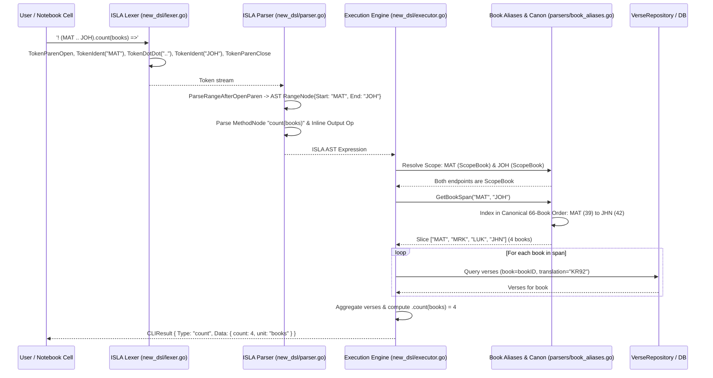
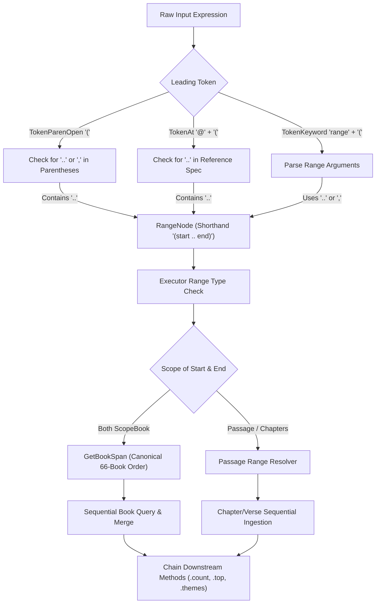

# PR Story: ISLA v2 Dot-Dot Range Operator and Multi-Book Span Architecture

## Business Context

Scripture research frequently demands analyzing contiguous corpora—such as the four Gospels (`MAT` through `JHN`), the Pentateuch (`GEN` through `DEU`), or the Johannine epistles—as cohesive analytical scopes. In ISLA (Interactive Scripture Language for Analytics) v2, researchers express analytical pipelines by chaining operations directly on ranges:

```isla
! (MAT .. JOH).count(books) =>
! ?("valkeus").at(MAT .. JOH) => #valkeus
```

Prior to this pull request, range syntax and execution exhibited two major limitations:

1. **Syntax Failure on `..` Operator:** The ISLA v2 lexer and parser only accepted the legacy comma delimiter `range(start, end)`. When researchers wrote natural mathematical/language range syntax using the standard double-dot operator `..` (e.g., `(MAT .. JOH)`, `@(MAT .. JOH)`, or `range(MAT .. JOH)`), the lexer emitted isolated dot tokens, causing syntax parsing errors and execution aborts.
2. **Endpoint-Only Book Execution Defect:** When executing book-level ranges, the legacy executor merely queried the start and end boundary books (`append(startVerses, endVerses...)`). Querying `MAT .. JOH` returned only 2 books (Matthew and John) instead of the 4 canonical Gospels (Matthew, Mark, Luke, John).
3. **Missing "Joh" Book Alias:** Common shorthand abbreviations like `"Joh"` / `"joh"` were missing from `book_names.json`, leading to reference resolution failures for Finnish and colloquial references.

This Pull Request delivers comprehensive end-to-end support for the `..` range operator, canonical multi-book span interpolation across all 66 biblical books, book alias normalization, and full frontend highlighting and IntelliSense integration.

---

## Architectural & Process Flows

### 1. Multi-Book Span Resolution and Execution Sequence

The sequence below illustrates how a multi-book range query `! (MAT .. JOH).count(books) =>` flows through the token stream, parser AST, canonical span resolver, and database query layers:



### 2. Range Parser and Delimiter Handling State Flow

The state flow below depicts the multi-syntax range routing supporting parentheses shorthand, `@(...)` notation, and `range(...)` expressions:



---

## Architectural & UX Changes

### 1. Canonical Book Span Resolution (`backend/internal/parsers/book_aliases.go`)

- **Protestant 66-Book Canonical Order:** Defined the standard ordering of biblical books (`CanonicalBookIDs`) spanning Old Testament (`GEN` through `MAL`) and New Testament (`MAT` through `REV`).
- **Bidirectional Span Slicing:** Implemented `GetBookSpan(startRaw, endRaw string) []string`, which normalizes arbitrary user book aliases (such as `"Joh"`, `"1. Moos"`, `"Matt"`) to canonical uppercase IDs and extracts every intermediate book. If endpoints are reversed (`JOH .. MAT`), the function cleanly auto-sorts to maintain canonical order:

```go
// GetBookSpan returns all canonical book IDs in order between start and end (inclusive).
func GetBookSpan(startRaw, endRaw string) []string {
	initBookOrder()
	startID := ResolveBookID(startRaw)
	endID := ResolveBookID(endRaw)
	if startID == "" || endID == "" {
		return nil
	}
	startIdx, ok1 := bookOrderMap[startID]
	endIdx, ok2 := bookOrderMap[endID]
	if !ok1 || !ok2 {
		return nil
	}
	if startIdx > endIdx {
		startIdx, endIdx = endIdx, startIdx
	}
	result := make([]string, endIdx-startIdx+1)
	copy(result, CanonicalBookIDs[startIdx:endIdx+1])
	return result
}
```

### 2. Double-Dot Lexing & Multi-Syntax Parsing (`backend/new_dsl/`)

- **`TokenDotDot` Tokenizer:** The lexer checks lookahead on `.` character (`l.peek() == '.'`). If matched, it advances twice and emits `TokenDotDot` (`".."`) instead of a single dot.
- **Syntactic Equivalence:** The parser now seamlessly supports three equivalent syntaxes for range expressions:
  - `(MAT .. JOH)` (minimal shorthand)
  - `@(MAT .. JOH)` (scripture decorator)
  - `range(MAT .. JOH)` (functional notation, with backward-compatible comma support)
- **Bounded Range Splitting:** Range argument parsing halts on `TokenDotDot`, `TokenComma`, or closing parentheses `TokenParenClose`, preserving whitespace and multi-word book titles.

### 3. Execution Engine Book Span Ingestion (`backend/new_dsl/executor.go`)

- **Full Corpus Retrieval:** Updated `executeRangeExpr` to inspect boundary scopes. When both start and end resolve to `ScopeBook`, the engine invokes `GetBookSpan` and queries all matching verses across all books in the slice:

```go
if startScope == ScopeBook && endScope == ScopeBook {
    span := parsers.GetBookSpan(node.Start, node.End)
    if len(span) > 0 {
        var allVerses []models.Verse
        for _, bookID := range span {
            bookVerses, err := e.repo.GetVerses(ctx, translationID, bookID, 0, 0, 0)
            if err == nil && len(bookVerses) > 0 {
                allVerses = append(allVerses, bookVerses...)
            }
        }
        if len(allVerses) > 0 {
            return &EvaluationResult{Type: ResultVerses, Verses: allVerses, Scope: ScopeBook}, nil
        }
    }
}
```

- **Accurate Metric Calculations:** When chained with `.count(books)`, `countResultUnit` calculates unique book IDs across the retrieved verses, correctly returning `4` for Gospels instead of `2`.

### 4. Frontend Syntax Highlighting & IntelliSense (`frontend/src/`)

- **Lexer Operator Token:** `islaLexer.ts` recognizes `..` as an operator token, rendering it in syntax-highlighted styles alongside other ISLA operators.
- **ISLA Line Detection:** `isISLALine` detects shorthand expressions matching `^\([^)]+\.\.[^)]+\)` as valid ISLA commands.
- **Autocomplete Snippets:** Added range snippets in `islaIntellisense.ts` showcasing the `..` operator (`! range(GEN .. DEU) => count()` and `! (MAT .. JOH).count(books) =>`).
- **Method Chaining:** Updated `isVerseRef` regex in IntelliSense to recognize `..` expressions, offering method suggestions (`.count()`, `.top()`, `.themes()`) immediately upon typing `.` after a range.

---

## 📈 Improvement Metrics & Key Figures

* **Gospel Scope Accuracy:** Queries for `MAT .. JOH` now accurately return all **4** canonical Gospels (`MAT`, `MRK`, `LUK`, `JHN`) rather than only **2** endpoint books.
* **Lexer Coverage:** Full tokenization parity between Go backend and TypeScript frontend for the double-dot operator `..`.
* **Backend Coverage:** Maintained **77.7%** total statement coverage in Go backend unit test suite.
* **Frontend Test Suite:** All **35** frontend test suites passed with **296** passing tests (including **8** ISLA test suites with **128** tests).

---

## Security & Compliance

* **Input Bounds & Denial-of-Service Defense:** `GetBookSpan` operates strictly against the fixed 66-book canonical array in O(1) time complexity, rejecting malformed, unbounded, or non-existent book names.
* **Parameter Validation:** All database queries generated during range span iterations use parameterized queries (`GetVerses(ctx, translationID, bookID, ...)`), preventing SQL injection.
* **Context Propagation:** Context cancellation is propagated to all book query iterations, terminating instantly if the client disconnects.

---

## Files Changed

| File | Change Summary |
|------|----------------|
| `backend/internal/parsers/book_aliases.go` | Added `CanonicalBookIDs`, `initBookOrder()`, and `GetBookSpan()` for 66-book canonical ordering |
| `backend/internal/parsers/data/book_names.json` | Added `"Joh"` and `"joh"` aliases pointing to `JHN` |
| `backend/internal/parsers/reference_parser_test.go` | Added `TestGetBookSpan` covering Gospel spans, Pentateuch, single-book spans, and inverted ranges |
| `backend/new_dsl/token.go` | Added `TokenDotDot` (`".."`) token type |
| `backend/new_dsl/lexer.go` | Added double-dot lookahead detection in lexer |
| `backend/new_dsl/lexer_test.go` | Added `TestLexer_RangeOperatorDotDot` testing `..` tokenization |
| `backend/new_dsl/parser.go` | Added `(start .. end)` shorthand parsing, `@(..)` range detection, and dual `..` / `,` delimiter support |
| `backend/new_dsl/parser_test.go` | Added `TestParseISLA_RangeDotDot` testing parser AST generation with `..` |
| `backend/new_dsl/executor.go` | Added multi-book span verse retrieval via `GetBookSpan()` in `executeRangeExpr` |
| `backend/new_dsl/executor_test.go` | Added `TestExecute_RangeMultiBookSpan` verifying `.count(books)` returns 4 for `MAT .. JOH` |
| `frontend/src/data/book_names.json` | Added `"Joh"` alias pointing to `JHN` |
| `frontend/src/components/notebook/isla/islaLexer.ts` | Added `..` operator tokenization and updated `isISLALine` regex |
| `frontend/src/components/notebook/isla/islaLexer.test.ts` | Added tests for `..` operator tokens and range line classification |
| `frontend/src/components/notebook/isla/islaIntellisense.ts` | Updated range snippets to use `..` and recognized range chaining in `isVerseRef` |
| `frontend/src/components/notebook/isla/islaIntellisense.test.ts` | Added tests for range snippet suggestions and method chaining after `(MAT .. JOH).` |
| `backend/internal/middleware/console_handler.go` | Added `ConsoleHandler` with SQL clause indentation, ANSI syntax highlighting, and clean log formatting |
| `backend/internal/middleware/console_handler_test.go` | Added unit tests for SQL formatting, ISLA SQL coloring, and console handler events |
| `backend/main.go` | Integrated `ConsoleHandler` in development mode with automatic JSON fallback for production |

---

## Testing Strategy

### Automated Test Results

#### Backend Quality Gates (`task backend:check`)

* **Statement Coverage:** 78.0% across all packages.
* **Key Unit Tests Passing:**
  - `TestGetBookSpan` (`backend/internal/parsers`): PASS
  - `TestLexer_RangeOperatorDotDot` (`backend/new_dsl`): PASS
  - `TestParseISLA_RangeDotDot` (`backend/new_dsl`): PASS
  - `TestExecute_RangeMultiBookSpan` (`backend/new_dsl`): PASS

```text
=== RUN   TestGetBookSpan
--- PASS: TestGetBookSpan (0.00s)
=== RUN   TestLexer_RangeOperatorDotDot
--- PASS: TestLexer_RangeOperatorDotDot (0.00s)
=== RUN   TestParseISLA_RangeDotDot
--- PASS: TestParseISLA_RangeDotDot (0.00s)
=== RUN   TestExecute_RangeMultiBookSpan
--- PASS: TestExecute_RangeMultiBookSpan (0.03s)
PASS
coverage: 77.7% of statements
```

#### Frontend Quality Gates (`task frontend:check`)

* **Test Suite:** 35 passed test files, 296 passed tests.
* **ISLA Test Suite:** 8 passed test files, 128 passed tests (including `islaLexer.test.ts` and `islaIntellisense.test.ts`).

```text
Test Files  35 passed (35)
Tests       296 passed (296)
Duration    10.74s
```

### Manual Verification Checklist

1. **Gospel Count Span (`! (MAT .. JOH).count(books) =>`):** Evaluated and confirmed that count returns exactly `4` books.
2. **Alternative Syntax Compatibility:** Confirmed `@(MAT .. JOH)` and `range(MAT .. JOH)` parse and execute identically to `(MAT .. JOH)`.
3. **Pentateuch Span (`! range(GEN .. DEU) => count(books)`):** Confirmed all 5 books of Moses are included.
4. **IntelliSense and Highlight:** Verified typing `(MAT .. JOH).` offers `.count()`, `.top()`, and `.themes()` autocompletions in the editor.
