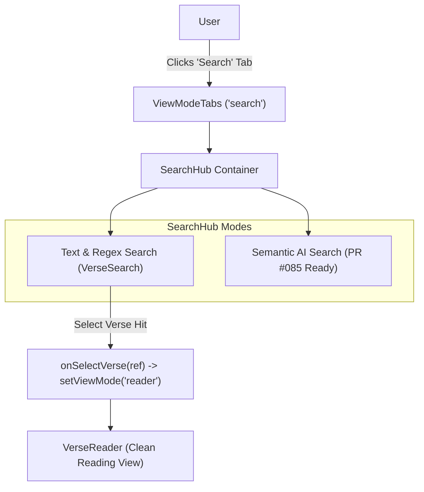

# Pull Request Story: 084 – Search Hub Navigation & Reader View Isolation

## Overview & Business Context

Prior to this pull request, Clible's scripture search interface (`VerseSearch`) was embedded directly beneath the chapter reader (`VerseReader`) within the primary reading view (`viewMode === 'reader'`). This coupled reading and searching into a single crowded layout, compromising the focused reading experience and hiding search capabilities behind long verse streams.

Furthermore, Clible's documentation (`docs/guide/ai-study-tools.md`) promised a unified natural language and conceptual search workflow ("Semantic Search"), which required an independent, dedicated workspace surface rather than an ad-hoc form appended below the reader.

This Pull Request delivers:
1. **Isolated Reader View:** Removal of `VerseSearch` from the reader layout, establishing a clean, tranquil, and distraction-free Scripture reading experience.
2. **Dedicated "Search" Top-Level View (`search`):** A new top-level workspace tab (`tabSearch`) alongside Reader, Analytics, Compare, Original Languages, and Notebooks.
3. **Bible Search Hub (`SearchHub.tsx`):** A centralized hub component supporting sub-modes (traditional keyword/regex search and upcoming AI semantic search), preserving user query states and enabling seamless one-click navigation from search hits directly into the reader.
4. **Bilingual Localization (FI/EN):** Complete i18n support for search hub titles, tab labels, and sub-mode pills.

---

## Architectural & System Changes

### 1. Navigation & ViewMode Layout (`frontend/src/components/layout/`)

- **`AppHeader.tsx`:** Extended `ViewMode` union type to include `'search'`:
  ```typescript
  export type ViewMode = 'reader' | 'search' | 'analytics' | 'compare' | 'original' | 'notebooks';
  ```
- **`ViewModeTabs.tsx`:** Integrated the `Search` icon and localized tab button (`strings.tabSearch`). Updated mobile grid layout to `grid-cols-6` to guarantee touch targets across mobile viewports.

### 2. Search Hub Component Architecture (`frontend/src/components/search/SearchHub.tsx`)

- Created `SearchHub` as a modular container hosting:
  - **Header & Sub-mode Switcher:** Interactive pills toggling between `lexical` (Text & Regex Search) and `semantic` (Semantic AI Search).
  - **Traditional Search:** Houses `VerseSearch` with full workspace scope integration, saved searches, and query history.
  - **Semantic AI Placeholder:** Pre-wired layout ready for the upcoming PR #085 Gemini integration.

### 3. Application State & Seamless Reader Transitions (`frontend/src/App.tsx`)

- Decoupled `VerseSearch` from the `viewMode === 'reader'` render tree.
- Mounted `<SearchHub />` in the `viewMode === 'search'` block.
- Implemented automatic reader transition upon selecting search hits:
  ```tsx
  onSelectVerse={(ref) => {
    handleSelectReference(ref);
    setViewMode('reader');
  }}
  ```
- Updated browser tab title logic (`document.title`) to reflect active search mode.

### 4. Internationalization (`frontend/src/utils/i18n.ts`)

- Added localized keys to `Messages` interface and both `en` and `fi` dictionaries:
  - `tabSearch`: "Search" / "Haku"
  - `searchHubTitle`: "Bible Search Hub" / "Raamatun hakukeskus"
  - `searchHubSubtitle`: "Search biblical scriptures by keyword, regex, or conceptual themes." / "Hae Raamatun tekstejä sanahaulla, säännöllisillä lausekkeilla tai teemallisesti."
  - `searchModeLexical`: "Text & Regex Search" / "Perinteinen tekstihaku"
  - `searchModeSemantic`: "Semantic AI Search" / "Semanttinen AI-haku"

---

## Visual Architecture & Navigation Flow



---

## Files Changed

| File | Status | Description |
| :--- | :--- | :--- |
| `frontend/src/components/search/SearchHub.tsx` | New | Bible Search Hub container with sub-mode tabs and workspace state binding. |
| `frontend/src/components/layout/AppHeader.tsx` | Modified | Extended `ViewMode` union type to include `'search'`. |
| `frontend/src/components/layout/ViewModeTabs.tsx` | Modified | Added Search tab button and updated mobile grid column layout. |
| `frontend/src/App.tsx` | Modified | Isolated `VerseReader`, routed `'search'` mode to `SearchHub`, added automatic reader transition. |
| `frontend/src/utils/i18n.ts` | Modified | Added bilingual i18n keys for Search Hub. |
| `pr_stories/084-feat-search-hub-navigation-and-reader-isolation.md` | New | Pull Request story and architectural audit. |

---

## Testing Strategy & Metrics

### Automated Frontend Quality Gates (`task frontend:check`)

Full Vitest suite, TypeScript compilation, and ESLint verification executed:

```text
Test Files  35 passed (35)
     Tests  296 passed (296)
  Duration  10.65s
All local quality checks passed flawlessly!
```

### Full Project Verification (`task check`)

Full backend unit tests, code coverage, linter, and frontend verification:

```text
total: (statements) 78.0%
All local quality checks passed flawlessly!
```
