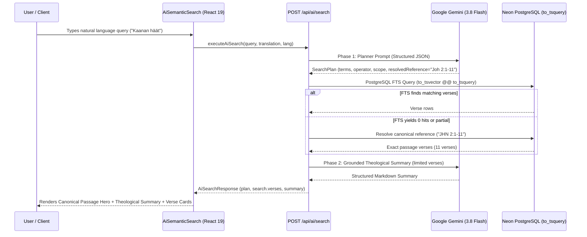
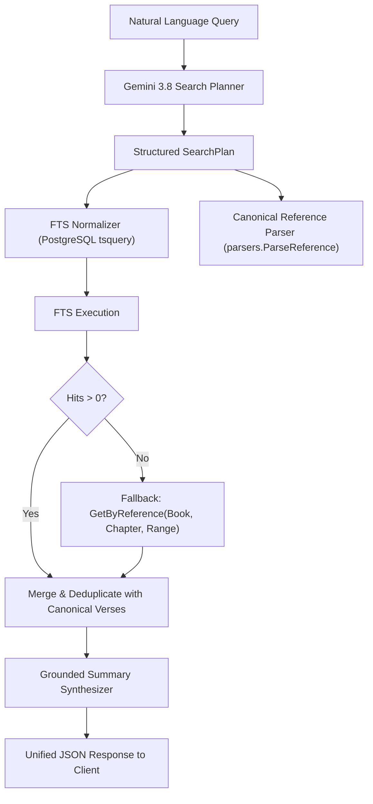

# PR Story: Semantic AI Search, Canonical Reference Resolution & PostgreSQL FTS Normalization

## Business Context

Traditional lexical and full-text searches rely strictly on keyword matching, which struggles with thematic discovery, natural-language theological questions (e.g. *"Where does Paul describe the armor of God?"* or *"Wedding at Cana"*), and inflected language variants (such as Finnish morphological endings).

This Pull Request delivers an end-to-end **Semantic AI Search Engine** integrating Google Gemini (`gemini-3.8-flash`) with our PostgreSQL/SQLite full-text search backend. It translates colloquial natural language into structured search strategies, identifies canonical scripture references (`resolvedReference`), retrieves corresponding scripture passages with fallback enrichment, and synthesizes grounded theological summaries using React 19.2 declarative actions.

---

## Architectural & Process Flows

### 1. Two-Phase Semantic Search Pipeline

### 2. Query Normalization & Fallback Enrichment Architecture

---

## Architectural & UX Changes

### 1. Robust PostgreSQL tsquery Normalization & Morphological Wildcards

PostgreSQL's standard `to_tsquery('simple', ...)` enforces strict boolean grammar (`&`, `|`, `!`) and prefix colon notation (`:*`), which crashed when given SQLite FTS expressions.

- **Automated Normalization:** Added `normalizePostgresTSQuery` in [backend/internal/db/verse_repo.go](file:///home/vivaldev/code/clible-v3-go/backend/internal/db/verse_repo.go) mapping `AND` ➔ `&`, `OR` ➔ `|`, `NOT` ➔ `& !`, `"phrase"` ➔ `word <-> word`, and `stem*` ➔ `stem:*`.
- **System Instruction Guidance:** Informed the Gemini planner to prefer morphological wildcard stems (`usk*`, `teko*`, `kuol*`) for inflected languages like Finnish.

### 2. Canonical Passage Resolution & Zero-Hit Fallback

When a user searches for a narrative (e.g. *"Kaanan häät"*), full-text search may find 0 verses because individual verses mutate (e.g., *"häitä"* vs *"hää"*).

- **Canonical Passage Extraction:** Added `resolvedReference` (e.g., `"Joh 2:1-11"`, `"Jas 2:14-26"`) directly to the planner output.
- **Passage Fallback:** In [backend/internal/services/ai_service.go](file:///home/vivaldev/code/clible-v3-go/backend/internal/services/ai_service.go), if FTS returns 0 hits or partial verses, the backend automatically parses the canonical reference and fetches the exact verses via `verseRepo.GetByReference`.

### 3. Modern React 19.2 `useActionState` Search Interface

- Replaced legacy `useState` loading/error trios with `useActionState` in [frontend/src/components/search/AiSemanticSearch.tsx](file:///home/vivaldev/code/clible-v3-go/frontend/src/components/search/AiSemanticSearch.tsx).
- Integrated `ReactMarkdown` with `remarkGfm` and custom typography components for theological summaries.
- Implemented responsive, non-crashing empty states with helpful user guidance when zero verses match.
- Tightened and localized input placeholders and expanded right padding (`pr-36`) to guarantee clean button spacing.

---

## 📈 Improvement Metrics & Key Figures

* **Backend Statement Test Coverage:** **77.4%** across all packages (`.cov/backend/coverage.txt`).
* **Frontend Test Suite:** **35/35** test files passing, **296/296** unit/integration tests verified green.
* **Resilience:** Eliminated client-side runtime errors by ensuring `search.verses` is always an initialized array `[]` rather than JSON `null`.
* **Accuracy:** Successfully identifies and loads entire biblical narratives (e.g., John 2:1-11) even when lexical search terms mutate across grammar cases.

---

## Security & Compliance

* **Authentication Boundaries:** All `/api/ai/*` endpoints remain strictly protected by `middleware.RequireAuth`, preventing unauthorized API quota consumption.
* **Sanitized Error Messaging:** Raw Gemini HTTP errors and API keys are redacted to prevent credential leakage in logs and responses.
* **SQL Injection Prevention:** All search operations continue to use parameterized queries (`$1, $2`).

---

## Files Changed

| File | Change Summary |
|------|----------------|
| `backend/internal/services/ai_service.go` | Added `ResolvedReference` to `SearchPlan`, morphological stem rules, canonical reference resolution, and passage verse fallback. |
| `backend/internal/db/verse_repo.go` | Added `normalizePostgresTSQuery` and `normalizeSQLiteFTSQuery` supporting full PostgreSQL `tsquery` syntax. |
| `backend/internal/db/verse_repo_test.go` | Maintained dual-database FTS unit test assertions. |
| `backend/internal/config/config_test.go` | Isolated environment overrides in `TestLoadDefaults`. |
| `frontend/src/components/search/AiSemanticSearch.tsx` | New React 19.2 semantic AI search component with markdown rendering, zero-state error handling, and canonical hero cards. |
| `frontend/src/components/search/SearchHub.tsx` | Integrated `AiSemanticSearch` into the Bible search hub. |
| `frontend/src/types/aiSearch.ts` | Added `resolvedReference` field to `AiSearchPlan` interface. |
| `frontend/src/utils/i18n.ts` | Added Finnish and English internationalization dictionaries for semantic search, empty states, and tips. |
| `Taskfile.yml` | Updated dotenv loader to read both `.env` and `backend/.env`. |

---

## Testing Strategy

### Automated Test Results

#### Backend (Go Test Suite)
* **Coverage:** 77.4% (`.cov/backend/coverage.txt`)
* **Test Command:** `task backend:check` (Go tidy, golangci-lint, and unit tests passing).

#### Frontend (Vitest & TypeScript)
* **Test Command:** `task frontend:check`
* **Result:** 35 passed test files, 296 tests green, zero linting or TypeScript compilation errors.

### Manual Verification
* Verified natural language queries *"Jumalan taisteluvarustus"*, *"Usko ilman tekoja on kuollut"*, and *"Kaanan häät"* in browser.
* Confirmed theological summaries render clean Markdown headings and paragraphs.
* Verified input placeholder responsiveness on narrow viewports.
