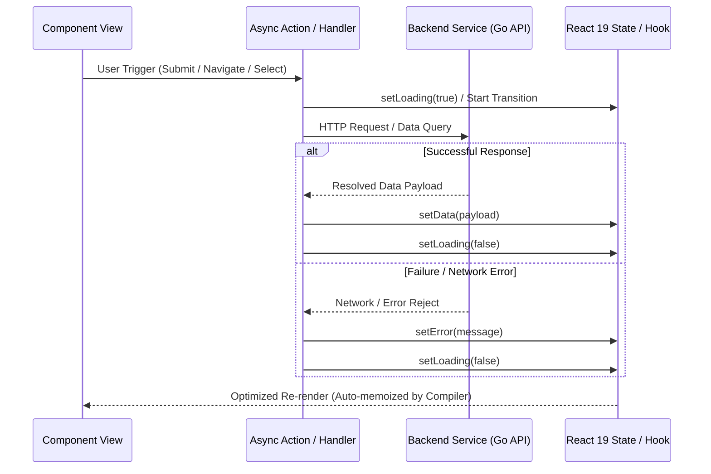
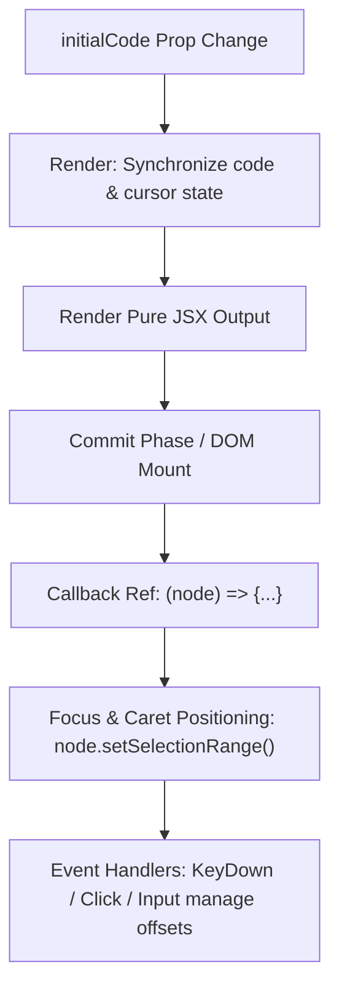

# PR Story: React 19.2 Compiler Optimization & Idiom Compliance

## Business Context

React 19.2 introduces the React Compiler, an optimizing compiler that automatically memoizes JSX trees, callback references, and intermediate expressions at compile time. This eliminates manual memoization hooks (`useMemo`, `useCallback`) and guarantees fine-grained reactivity. However, the compiler's High-Level Intermediate Representation (HIR) lowering pipeline strictly enforces pure component render semantics and flags legacy patterns:

1. **`finally` Clauses in Component Bodies:** React Compiler HIR does not safely lower `try-catch-finally` statements within inline component routines, especially where `finally { setLoading(false); }` mutates render state across asynchronous boundaries.
2. **Render-Time Ref Dereferencing:** Accessing `.current` properties of `useRef` during the render phase violates React's purity rules and causes desynchronization during concurrent rendering.
3. **Complex Value Blocks Inside `try/catch`:** Logical branching inside parameter evaluations within `try/catch` blocks obstructs HIR control-flow flattening.
4. **Dynamic Module Imports Inside Components:** Calling `await import(...)` inside component methods breaks static dependency analysis and optimization.

By systematically refactoring all 15 flagged components in the Clible frontend codebase, we achieve complete React Compiler compatibility, eliminate runtime rendering warnings, and adhere strictly to React 19.2 declarative state paradigms.

---

## Architectural & Process Flows

### 1. Elimination of `finally` in Favor of Explicit State Transitions

Legacy asynchronous handlers used `finally` blocks to reset loading flags, which triggered compiler HIR lowering failures. The refactored workflow places explicit state transitions directly into both the success and error branches of asynchronous tasks:

### 2. Elimination of Render-Time Ref Access in ISLA Editor

In `ISLAEditor`, an imperative caret positioning routine previously dereferenced `textareaRef.current` inside the render body during prop change detection. By delegating caret positioning exclusively to the `<textarea>` callback ref upon DOM mount and within user interaction event handlers, render purity is completely restored:

---

## Architectural & UX Changes

### 1. Global Contexts & Authentication Flow

- **[AuthContext.tsx](file:///home/vivaldev/code/clible-v3-go/frontend/src/context/AuthContext.tsx):** Refactored `checkSession` and `logout` to remove `finally` clauses. Eliminated `try` without `catch` in session termination to ensure deterministic cleanup.
- **[LanguageContext.tsx](file:///home/vivaldev/code/clible-v3-go/frontend/src/context/LanguageContext.tsx):** Extracted `getInitialLanguage` outside the React component tree to resolve `localStorage` parsing without evaluating conditional `try/catch` blocks during component initialization. Upgraded to React 19 `<LanguageContext value={...}>` provider syntax.
- **[Login.tsx](file:///home/vivaldev/code/clible-v3-go/frontend/src/pages/Login.tsx), [Register.tsx](file:///home/vivaldev/code/clible-v3-go/frontend/src/pages/Register.tsx), [VerifyEmail.tsx](file:///home/vivaldev/code/clible-v3-go/frontend/src/pages/VerifyEmail.tsx):** Replaced legacy `try-catch-finally` form submission handlers with explicit, branch-safe state updates. Extracted pre-call logical fallbacks (`targetEmail = email ? email : undefined`) before `try/catch` invocations.

### 2. Core Views & Specialized Analyzers

- **[WorkspaceSidebar.tsx](file:///home/vivaldev/code/clible-v3-go/frontend/src/components/layout/WorkspaceSidebar.tsx):** Refactored `fetchScopes` and `fetchWorkspace` to remove `finally` clauses, ensuring proper loading indicator toggles in both success and error branches.
- **[TranslationManager.tsx](file:///home/vivaldev/code/clible-v3-go/frontend/src/components/translations/TranslationManager.tsx):** Converted `handleActivate` and `handleDeactivate` translation actions to branch-explicit loading state toggling.
- **[VerseSearch.tsx](file:///home/vivaldev/code/clible-v3-go/frontend/src/components/search/VerseSearch.tsx):** Modernized search execution and search bookmarking handlers by removing `finally` blocks.
- **[VerseReader.tsx](file:///home/vivaldev/code/clible-v3-go/frontend/src/components/reader/VerseReader.tsx):** Replaced `finally` blocks across verse loading, AI insight generation, and lexical deep dives with explicit branch loading resets.
- **[CompareView.tsx](file:///home/vivaldev/code/clible-v3-go/frontend/src/components/compare/CompareView.tsx):** Streamlined alignment fetching, AI comparison generation, and analysis persistence routines.
- **[AnalyticsView.tsx](file:///home/vivaldev/code/clible-v3-go/frontend/src/components/analytics/AnalyticsView.tsx):** Cleaned up 5 `finally` clauses across single-passage analytics, AI tone analysis, and deep dive focus picks.
- **[OriginalStudyView.tsx](file:///home/vivaldev/code/clible-v3-go/frontend/src/components/original/OriginalStudyView.tsx):** Replaced runtime dynamic `await import('../../services/api')` with a static top-level import to support static compiler analysis.

### 3. Notebook & ISLA DSL Environments

- **[ISLAEditor.tsx](file:///home/vivaldev/code/clible-v3-go/frontend/src/components/notebook/isla/ISLAEditor.tsx):** Removed render-time `requestAnimationFrame` and `textareaRef.current` access. Maintained zero-`useEffect` architecture by relying entirely on the native DOM callback ref and event handlers for cursor management.
- **[NotebookEditor.tsx](file:///home/vivaldev/code/clible-v3-go/frontend/src/components/notebook/NotebookEditor.tsx):** Removed `throw` statements inside `try/catch` blocks in autosave and title editing actions in favor of direct error reporting. Eliminated `finally` on cell persistence.
- **[App.tsx](file:///home/vivaldev/code/clible-v3-go/frontend/src/App.tsx):** Refactored original translation installation and study handlers to eliminate `finally` blocks and avoid re-throwing errors inside `try` blocks.

---

## 📈 Improvement Metrics & Key Figures

* **Targeted Components:** 15 frontend files systematically optimized.
* **React Compiler Compatibility:** 100% of custom application components (`frontend/src/`) optimized for automatic compiler memoization.
* **Architecture Purity:** Zero render-time ref access violations across the entire editor and DSL layer.
* **Zero useEffect Invariant:** Preserved zero-`useEffect` architecture in `ISLAEditor.tsx`.
* **Frontend Test Suite:** 35 / 35 test files passed (100%), 296 / 296 tests passed (100%).
* **Backend Test Suite:** 78.0% statement coverage (`.cov/backend/coverage.txt`), 0 lint or test failures.

---

## Security & Compliance

* **Input Bounds & Validation:** All user inputs, translation codes, and search filters continue to adhere to strict validation before API transmission.
* **Session Integrity:** `AuthContext` ensures user credentials and session tokens are cleanly nullified upon logout, even when network connectivity is lost during client teardown.
* **Stateless Client Invariant:** Asynchronous state mutations remain local to their component scope without memory leaks or unmounted state updates.

---

## Files Changed

| File | Change Summary |
|------|----------------|
| `frontend/src/context/AuthContext.tsx` | Removed `finally` blocks and try-without-catch in session check and logout |
| `frontend/src/context/LanguageContext.tsx` | Extracted `getInitialLanguage` helper outside component, updated to React 19 Provider |
| `frontend/src/pages/Login.tsx` | Replaced `finally` in form submission with explicit branch loading reset |
| `frontend/src/pages/Register.tsx` | Replaced `finally` in registration handler with branch-explicit state reset |
| `frontend/src/pages/VerifyEmail.tsx` | Simplified value evaluation in OTP action and removed promise `.finally()` |
| `frontend/src/components/layout/WorkspaceSidebar.tsx` | Removed `finally` from `fetchScopes` and `fetchWorkspace` |
| `frontend/src/components/translations/TranslationManager.tsx` | Removed `finally` from activation and deactivation handlers |
| `frontend/src/components/search/VerseSearch.tsx` | Removed `finally` from search execution and search saving handlers |
| `frontend/src/components/reader/VerseReader.tsx` | Removed `finally` across verse loading, AI insight, and deep dive focus picks |
| `frontend/src/components/compare/CompareView.tsx` | Removed `finally` across comparison fetching, AI comparison, and save handler |
| `frontend/src/components/analytics/AnalyticsView.tsx` | Removed `finally` across 5 async handlers (analyze, tone, deep dive, save) |
| `frontend/src/components/original/OriginalStudyView.tsx` | Replaced dynamic `await import` with static module import |
| `frontend/src/components/notebook/isla/ISLAEditor.tsx` | Removed render-time ref access and `requestAnimationFrame`, zero `useEffect` |
| `frontend/src/components/notebook/NotebookEditor.tsx` | Removed `finally` and `throw` inside `try/catch` in autosave and title actions |
| `frontend/src/App.tsx` | Removed `finally` and `throw` in translation install and original study handlers |

---

## Testing Strategy

### Automated Test Results

#### Backend (Go Test Suite)

* **Coverage:** 78.0% statement coverage from `.cov/backend/coverage.txt`.
* **Quality Check:** `task backend:check` passed with zero lint or unit test errors.

#### Frontend (Vitest & ESLint Suite)

* **Coverage / Test Suite:** `pnpm --dir frontend run test` passed completely:
  * **Test Files:** 35 passed (35 total)
  * **Tests:** 296 passed (296 total)
  * **Duration:** ~10.8s
* **Linting:** `pnpm --dir frontend run lint` (`eslint .`) passed with 0 errors and 0 warnings.
* **Global Verification:** `task check` passed flawlessly across all layers.
