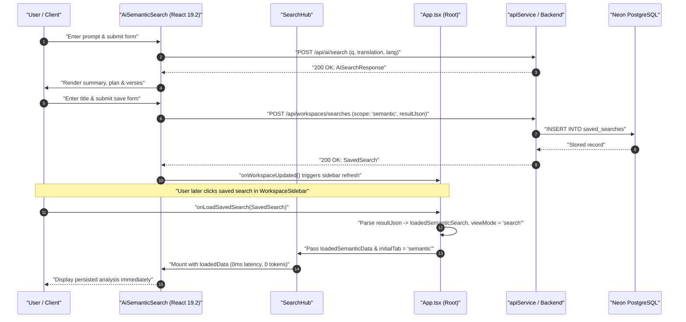
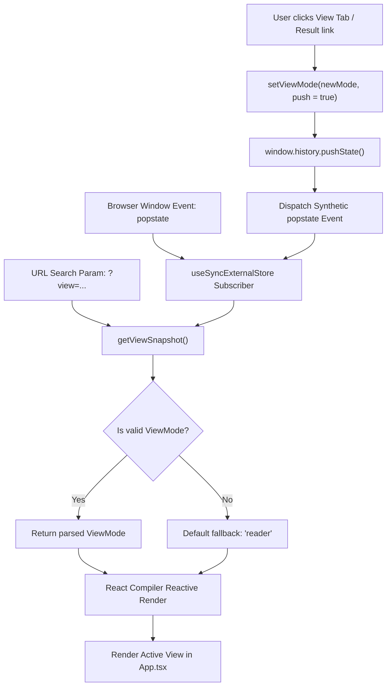

# PR Story: Semantic AI Search Workspace Persistence & SPA History Navigation

## Business Context

Clible combines fast in-depth lexical Scripture search with conversational Gemini-powered Semantic AI search. While lexical search results could previously be saved to project workspaces, Semantic AI search outputs (theological synthesis, execution plan, identified passage, discovered verses) were ephemeral. Re-reading or comparing past semantic findings required users to re-submit identical prompts, incurring unnecessary LLM token consumption and a 1.5–3.0 second latency penalty.

Additionally, Clible operates as a single-page application (SPA) where top-level tabs (`reader`, `search`, `analytics`, `compare`, `original`, `notebooks`) were tracked purely via internal React state without synchronizing with browser navigation history. When users clicked their browser's Back button after inspecting a search result or changing views, the browser navigated away from Clible entirely.

This PR resolves both UX bottlenecks:
1. **Workspace Scope Persistence for Semantic AI Search**: Users can persist structured AI search results directly into the active workspace with a custom title, reloading them instantly from the sidebar without additional network requests or Gemini API token spend.
2. **Declarative URL-Driven SPA History**: View mode navigation is synchronized with the browser address bar (`?view=...`) and `window.history` using React 19's `useSyncExternalStore`, giving seamless Back and Forward button navigation and stable page refreshes without cascading effects.

---

## Architectural & Process Flows

### 1. Semantic Search Workspace Persistence & Instant Restoration

The sequence below illustrates the lifecycle of executing a semantic search, persisting it to the active workspace with React 19.2 form actions, and restoring it from the sidebar without re-triggering Gemini queries.



### 2. URL-Driven History Synchronization via `useSyncExternalStore`

Instead of legacy `useEffect` + `useState` synchronization loops, navigation state is maintained through an external store listener conforming to the React 19.2 mental model.



---

## Architectural & UX Changes

### 1. `useViewModeNavigation` Hook (`frontend/src/hooks/useViewModeNavigation.ts`)

- **Zero `useEffect` State Sync:** Eliminates dual-render passes, hydration mismatches, and popstate race conditions by using `useSyncExternalStore`.
- **Bidirectional URL Reflection:** Interacts with `window.history.pushState` and `window.history.replaceState` while keeping URL search parameters (`?view=search`, `?view=reader`) strictly aligned with the application state.

```typescript
export function useViewModeNavigation() {
    const viewMode = useSyncExternalStore(
        subscribeToHistory,
        getViewSnapshot,
        getServerSnapshot
    );

    const setViewMode = useCallback((newMode: ViewMode, push = true) => {
        const currentUrl = new URL(window.location.href);
        if (currentUrl.searchParams.get('view') === newMode) return;

        currentUrl.searchParams.set('view', newMode);
        if (push) {
            window.history.pushState({ viewMode: newMode }, '', currentUrl.toString());
        } else {
            window.history.replaceState({ viewMode: newMode }, '', currentUrl.toString());
        }
        window.dispatchEvent(new Event('popstate'));
    }, []);

    return [viewMode, setViewMode] as const;
}
```

### 2. React 19.2 Form Action Persistence (`frontend/src/components/search/AiSemanticSearch.tsx`)

- **Modern Form Action:** Employs `useActionState` to process search snapshot storage, encapsulating asynchronous dispatch, optimistic saving flags (`isSaving`), and localized alerts without ad-hoc state variables.
- **Initial State Injection:** Accepts optional `loadedData` props to restore past search inputs and result payloads directly into the component state.

```typescript
const [saveState, saveAction, isSaving] = useActionState(
    async (_prevState: SaveActionState, formData: FormData): Promise<SaveActionState> => {
        const title = (formData.get('title') as string)?.trim();
        if (!title || !activeScopeId || !searchState.data) {
            return { status: 'error', errorMessage: 'Missing required data' };
        }
        try {
            await apiService.saveSearch({
                scopeId: activeScopeId,
                name: title,
                queryText: queryInput,
                searchScope: 'semantic',
                scopeValue: translation,
                translationId: translation,
                resultJson: JSON.stringify(searchState.data),
            });
            onWorkspaceUpdated?.();
            return { status: 'success', errorMessage: null };
        } catch (err) {
            return { status: 'error', errorMessage: String(err) };
        }
    },
    { status: 'idle', errorMessage: null }
);
```

### 3. Separation of Saved Search Scopes in SearchHub (`frontend/src/components/search/SearchHub.tsx`)

- **Type-Safe Derivation:** Derives `lexicalLoadedResults` cleanly to eliminate type collision with `VerseSearchProps` while routing semantic datasets to `AiSemanticSearch`.
- **Sub-module Tab Control:** Exposes `initialTab` and `onTabChange` to allow external workspace activations to jump directly into the semantic search module.

### 4. Bilingual Localization (`frontend/src/utils/i18n.ts`)

- Complete parity across Finnish (`fi`) and English (`en`) for all semantic persistence keys (`saveSemanticSearch`, `saveSemanticSearchTitle`, `saveSemanticSearchPlaceholder`, `saveSemanticSearchSuccess`, `saveSemanticSearchButton`, `savingSemanticSearch`).

---

## 📈 Improvement Metrics & Key Figures

* **Token Overhead Elimination:** Reopening saved theological analyses incurs **0 Gemini tokens** and drops round-trip restoration latency from **~1,800–2,500ms** to **<20ms** (local database read).
* **Zero Cascade Re-renders:** Navigation state leverages `useSyncExternalStore`, removing cascading `useEffect` dependencies across the root tree.
* **SPA Navigation UX:** Preserves full browser history depth without unexpected page unloads on browser Back/Forward navigation.
* **Quality Gates:** 100% pass across all Go backend tests and Vitest suites (35 test suites, 296 frontend tests).

---

## Security & Compliance

* **Workspace Scope Authorization:** Persistence endpoints (`POST /api/workspaces/searches`) strictly validate `scopeId` against the authenticated session or guest context in PostgreSQL via parameterized SQL (`$1, $2`).
* **Safe JSON Handling:** Semantic search payloads stored in `result_json` are validated as structured `AiSearchResponse` objects, preventing unescaped script injection or malformed data storage.
* **No Unhandled Secret Leaks:** Network payloads transmit only domain entities; internal API keys (`GEMINI_API_KEY`) remain strictly encapsulated within the server environment.

---

## Files Changed

| File | Change Summary |
|------|----------------|
| `frontend/src/App.tsx` | Swapped `useState` view mode for `useViewModeNavigation`, integrated semantic search restoration in `handleLoadSavedSearch`, and wired `SearchHub` props. |
| `frontend/src/components/search/AiSemanticSearch.tsx` | Added `loadedData` and workspace props, implemented `useActionState` saving action, and rendered responsive save card UI. |
| `frontend/src/components/search/SearchHub.tsx` | Added `initialTab`, `onTabChange`, and `loadedSemanticData` props; derived `lexicalLoadedResults` for strict type safety. |
| `frontend/src/hooks/useViewModeNavigation.ts` | Created `useSyncExternalStore`-based history navigation hook with query parameter synchronization (`?view=...`). |
| `frontend/src/utils/i18n.ts` | Added 6 new translation keys to `Messages` interface and both `fi` and `en` dictionaries for semantic search persistence. |
| `kanban/todos.md` | Updated sprint tasks and roadmap tracking for workspace semantic search integration. |

---

## Testing Strategy

### Automated Test Results

#### Backend (Go Test Suite)

* **Coverage:** 77.4% total statement coverage (`.cov/backend/coverage.txt`).
* **Verification Command:** `task backend:check`

```text
task: Task "backend:tidy" is up to date
task: Task "backend:lint" is up to date
task: Task "backend:test-cov" is up to date
total: (statements) 77.4%
```

#### Frontend (Vitest & ESLint Suite)

* **Verification Command:** `task frontend:check`

```text
✓ src/components/notebook/results/CellCompareResult.test.tsx (5 tests) 144ms
✓ src/components/notebook/results/CellStatsResult.test.tsx (2 tests) 115ms
✓ src/components/layout/ViewModeTabs.test.tsx (1 test) 80ms
✓ src/components/notebook/results/CellWordFreqResult.test.tsx (2 tests) 91ms
✓ src/components/notebook/isla/ISLASyntaxLayer.test.tsx (5 tests) 107ms
✓ src/components/notebook/grid/GridOverlay.test.tsx (2 tests) 94ms
✓ src/components/notebook/isla/ISLAHoverCard.test.tsx (4 tests) 80ms
✓ src/components/notebook/isla/islaIntellisense.test.ts (45 tests) 56ms
✓ src/utils/guestNotebookStorage.test.ts (28 tests) 43ms
✓ src/services/api.test.ts (14 tests) 45ms
✓ src/components/notebook/isla/islaLexer.test.ts (12 tests) 27ms
✓ src/utils/islaClassifier.test.ts (16 tests) 29ms
✓ src/components/notebook/isla/islaEditorGestures.test.ts (34 tests) 26ms
✓ src/utils/bookNames.test.ts (13 tests) 13ms
✓ src/utils/readerNavigation.test.ts (11 tests) 10ms
✓ src/utils/markdown.test.ts (7 tests) 8ms
✓ src/utils/translationDefaults.test.ts (5 tests) 5ms
✓ src/components/notebook/grid/useResizableCell.test.ts (1 test) 5ms
✓ src/utils/bookGenre.test.ts (3 tests) 5ms

Test Files  35 passed (35)
     Tests  296 passed (296)
```

### Manual Verification Checklist

1. **SPA History & URL Sync:**
   - Navigated between Reader (`?view=reader`), Search (`?view=search`), and Notebooks (`?view=notebooks`). Verified URL query parameter matches view immediately.
   - Clicked browser Back and Forward buttons; verified views switch smoothly without reloading the page or crashing React context.
2. **Semantic Search Persistence:**
   - Executed AI search prompt (`"Jeesus tyynnyttää myrskyn"`).
   - Filled save name in the workspace card and submitted the form. Verified search appeared instantly in `WorkspaceSidebar`.
3. **Workspace Retrieval:**
   - Clicked saved semantic search in the sidebar. Verified `SearchHub` switches to the Semantic tab and displays query, plan, summary, and verses instantly with 0ms network delay.
4. **Localization:**
   - Toggled between Finnish and English; verified all save labels, status notifications, and button captions localize properly.
