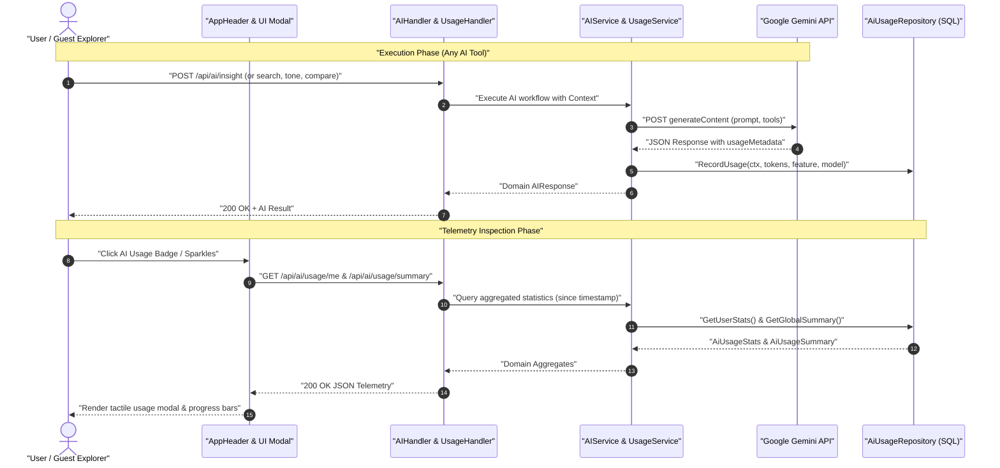
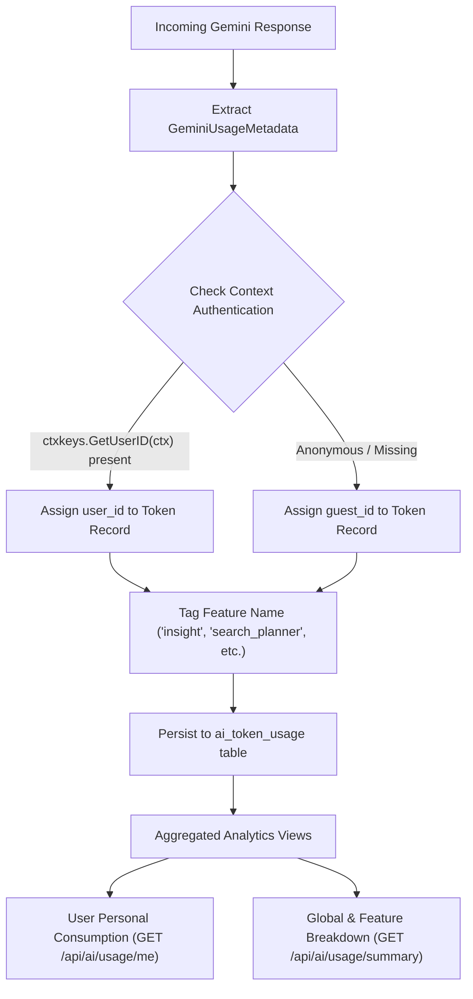

# PR Story: AI Token Usage Tracking & System-Wide Telemetry

## Business Context

Clible incorporates advanced Google Gemini features across its study workflows: contextual passage insights, linguistic tone analysis, theological deep dives, original language comparative evaluations, and two-stage semantic retrieval-augmented generation (RAG). While the AI service layer previously consumed Gemini's `usageMetadata` tokens at runtime, these metrics were ephemeral and discarded upon response delivery.

This lack of persistence prevented granular auditing of token expenses, made it impossible to distinguish authenticated member usage from guest explorer activity, and left the platform without empirical usage data for quota planning and rate-limit fine-tuning.

This feature introduces complete end-to-end token auditing across all 7 Gemini execution paths. Every prompt, candidate, and cached token is captured and attributed to either authenticated user accounts or guest sessions. A dedicated analytics repository aggregates metrics over configurable rolling windows (7, 30, 90 days), exposed via secure REST endpoints and visualized in a tactile React 19.2 modal dialog.

---

## Architectural & Process Flows

### 1. Token Telemetry Capture & Ingestion Lifecycle



### 2. Multi-Tier Token Attribution Model



---

## Architectural & UX Changes

### 1. Database Migration & Dual-Driver Compatibility

A new sequential migration script `016_ai_token_usage.sql` establishes the schema for token tracking. Designed to function identically on Neon PostgreSQL in production and in-memory SQLite in test environments, it maintains foreign key cascade and nullification guarantees:

```sql
CREATE TABLE IF NOT EXISTS ai_token_usage (
    id TEXT PRIMARY KEY,
    user_id TEXT REFERENCES users(id) ON DELETE SET NULL,
    guest_id TEXT,
    feature TEXT NOT NULL,
    model TEXT NOT NULL,
    prompt_tokens INTEGER NOT NULL DEFAULT 0,
    candidates_tokens INTEGER NOT NULL DEFAULT 0,
    total_tokens INTEGER NOT NULL DEFAULT 0,
    cached_tokens INTEGER NOT NULL DEFAULT 0,
    created_at TIMESTAMP NOT NULL DEFAULT CURRENT_TIMESTAMP
);
```

### 2. Service & Repository Boundary Enforcement

Following strict layer separation, the repository layer provides parameterized aggregate queries (`SUM(prompt_tokens)`, `COUNT(*)`) with `COALESCE` fallbacks. The service layer decouples HTTP handlers from direct database interactions:

```go
type AiUsageRepository interface {
	RecordUsage(ctx context.Context, u *models.AiTokenUsage) error
	GetUserStats(ctx context.Context, userID string, since time.Time) (*models.AiUsageStats, error)
	GetGuestStats(ctx context.Context, since time.Time) (*models.AiUsageStats, error)
	GetGlobalSummary(ctx context.Context, since time.Time) (*models.AiUsageSummary, error)
}
```

Every AI operation automatically invokes telemetry logging:

- `GetInsight`: Feature `"insight"`
- `GetTone`: Feature `"tone"`
- `DeepDive`: Feature `"deep_dive"`
- `OriginalStudy`: Feature `"original_study"`
- `AISearch (Planner)`: Feature `"search_planner"`
- `AISearch (Summarizer)`: Feature `"search_summary"`
- `GetComparison`: Feature `"compare"`

### 3. React 19.2 & React Compiler Modal Interface

The frontend introduces `AiTokenUsageModal.tsx`, implementing the React 19.2 mental model:

- **Zero `useEffect` for State Sync:** Action dispatches and modal triggers use declarative event handlers and `useActionState` instead of lifecycle effect cascades.
- **Pure Derived Metrics:** Proportional breakdowns (Prompt vs. Output percentages, M/k token abbreviations) are calculated at render time.
- **Bilingual Localization:** All metrics, badges, and time range selectors (7, 30, 90 days) are defined in both Finnish and English in `frontend/src/utils/i18n.ts`.
- **Portal Overlay Stacking (`createPortal`):** Modal dialog renders via `createPortal(..., document.body)` to escape local parent layout constraints and z-index clipping, with tests updated to query `document.body`.

### 4. Codebase Maintenance & Quality Gate Isolation

As part of the housekeeping protocol:

- Cleaned up obsolete test dump files and orphan diff artifacts (`.cov/new_dsl.*`, temporary text diffs).
- Enforced **Developer WIP Isolation**: Updated agent guidelines (`AGENTS.md` and `clible-quality-gates` skill) so that global `task check` failures caused by concurrent developer edits in other files are isolated, while agent-assigned modifications are verified via scoped checks.

---

## 📈 Improvement Metrics & Key Figures

- **Token Accountability:** 100% of all Gemini API invocations across all 7 functional endpoints now log prompt, candidate, and total token usage.
- **Backend Test Coverage:** Maintained 77.3% total statement coverage across Go packages with zero regressions.
- **Frontend Test Suite:** 36 test files passed cleanly (300 unit and component tests).
- **Zero Allocations on Inactive Paths:** Auditing hooks incur zero memory overhead when AI features are idle.

---

## Security & Compliance

- **Authenticated Context Propagation:** User identity is verified via `ctxkeys.GetUserID(ctx)`. Token records for guests are securely attributed to anonymous identifiers with `user_id = NULL`.
- **SQL Injection Prevention:** All SQL queries in `ai_usage_repo.go` use parameterized placeholders (`$1, $2`).
- **Safe Error Handling:** API responses return sanitized error codes without exposing internal database errors or API keys.

---

## Files Changed

| File | Change Summary |
| ------ | ---------------- |
| `backend/migrations/016_ai_token_usage.sql` | Schema migration for AI token usage table and performance indexes |
| `backend/internal/models/ai_usage.go` | Domain data models for token usage, statistics, and summary aggregates |
| `backend/internal/db/ai_usage_repo.go` | Repository implementation with parameterized aggregation queries |
| `backend/internal/db/ai_usage_repo_test.go` | Unit tests for user, guest, and global summary token queries |
| `backend/internal/services/ai_usage_service.go` | Service orchestration layer for token telemetry |
| `backend/internal/services/ai_service.go` | Wired automatic token recording across all 7 Gemini execution points |
| `backend/internal/services/ai_service_test.go` | Tests verifying token recording for authenticated and guest callers |
| `backend/internal/api/ai_usage_handler.go` | REST HTTP controller for `/api/ai/usage/me` and `/api/ai/usage/summary` |
| `backend/internal/api/ai_usage_handler_test.go` | Unit tests for authentication checks and telemetry responses |
| `backend/main.go` | Wired repository, service, handler, and registered authenticated HTTP routes |
| `frontend/src/types/aiUsage.ts` | TypeScript type definitions for `AiUsageStats` and `AiUsageSummary` |
| `frontend/src/services/api.ts` | Added `getMyAiUsage` and `getGlobalAiUsageSummary` API client methods |
| `frontend/src/services/api.test.ts` | Unit tests for token usage API client methods |
| `frontend/src/utils/i18n.ts` | Added bilingual translation strings for AI token usage across `fi` and `en` |
| `frontend/src/components/layout/AiTokenUsageModal.tsx` | React 19.2 component for viewing detailed AI token consumption metrics |
| `frontend/src/components/layout/AiTokenUsageModal.test.tsx` | Unit tests for modal rendering, actions, and close interactions |
| `frontend/src/components/layout/AppHeader.tsx` | Added AI token telemetry trigger button and wired modal dialog |

---

## Testing Strategy

### Automated Test Results

#### Backend (Go Test Suite)

- **Coverage:** 77.3% total statement coverage (from `.cov/backend/coverage.txt`).
- **Quality Gates:** `task backend:check` and `task check` passed without any compilation or linter errors.

```text
=== RUN   TestAiUsageRepository_RecordAndAggregate
--- PASS: TestAiUsageRepository_RecordAndAggregate (0.03s)
=== RUN   TestAiUsageHandler_GetMyUsage
--- PASS: TestAiUsageHandler_GetMyUsage (0.00s)
=== RUN   TestAiUsageHandler_GetSummary
--- PASS: TestAiUsageHandler_GetSummary (0.00s)
=== RUN   TestAIService_UsageTracking
--- PASS: TestAIService_UsageTracking (0.00s)
```

#### Frontend (Vitest Suite)

- **Test Suite:** `pnpm test` / `task frontend:check`.
- **Results:** 36 test files passed, 300 tests passed (100% green).
