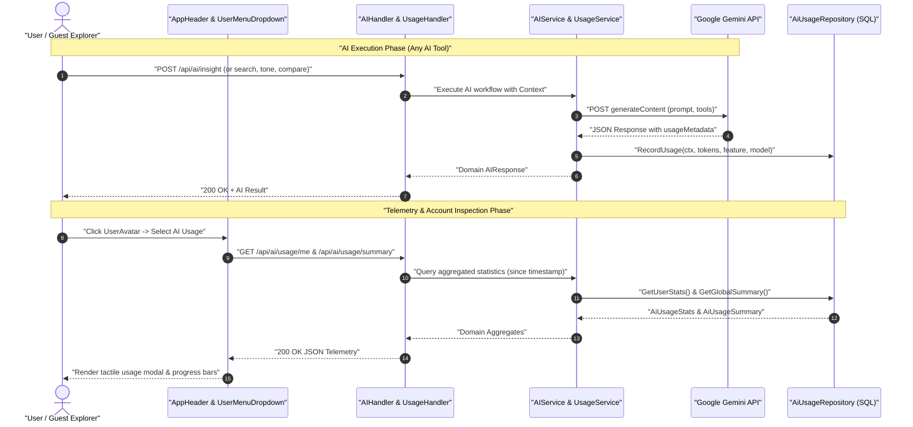
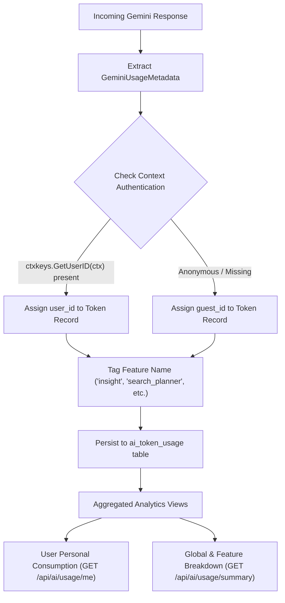
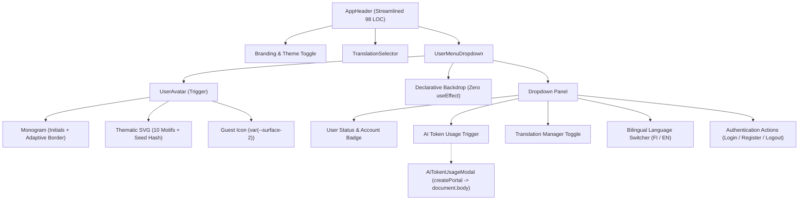

# PR Story: AI Token Telemetry, User Avatar System, and Centralized User Menu (v3.5.0)

## Business Context

As Clible evolves into a rich, full-featured workspace for Bible study, text analytics, and notebook scripting, its user experience and architectural demands have expanded rapidly on two key fronts:

1. **AI Accountability & Quota Governance:** Clible integrates Google Gemini across multiple core workflows (passage insights, linguistic tone extraction, theological deep dives, semantic RAG search, and translation comparison). Previously, runtime token usage metadata was ephemeral and discarded upon HTTP response completion. This prevented granular auditing of token expenses, obscured the split between authenticated member usage and guest explorer activity, and left no telemetry for rate-limit and quota planning.
2. **Header Clutter & Workspace Personalization:** Over successive releases, the sticky navigation header (`AppHeader.tsx`) had accumulated scattered controls: theme toggles, user emails, sign-out buttons, registration CTAs, translation manager triggers, language switchers, and the AI token trigger. On tablet and mobile viewports, this created excessive visual density. Furthermore, users lacked a personal visual identity (avatars) and a unified access point for their workspace preferences.

This milestone release (**v3.5.0**) resolves both challenges cohesively:

- **End-to-End AI Token Telemetry:** Captures prompt, candidate, and cached tokens across all 7 Gemini execution paths into a persistent database table (`ai_token_usage`) on Neon PostgreSQL and test SQLite. Aggregated rolling statistics (7, 30, 90 days) are exposed via authenticated REST endpoints.
- **Visual Avatar System (`UserAvatar`):** Renders personalized typographic monograms for named users, deterministic thematic vector SVGs (10 biblical/scholarly motifs) for email-only accounts, and an accessible guest icon for anonymous visitors.
- **Centralized User Menu (`UserMenuDropdown`):** Replaces six disparate header buttons with a single unified dropdown triggered by the avatar. Features a zero-`useEffect` declarative backdrop, profile status card, embedded language switcher (FI / EN), translation manager toggle, AI token telemetry modal launcher, and authentication controls.
- **Streamlined Header (`AppHeader`):** Refactored from 199 lines of scattered logic down to 98 lines of clean, declarative navigation.

---

## Architectural & Process Flows

### 1. Token Telemetry Capture & Ingestion Lifecycle



### 2. Multi-Tier Token Attribution Model



### 3. Component Hierarchy & Header Architecture



---

## Architectural & UX Changes

### 1. Database Migration & Dual-Driver Compatibility

A new sequential migration script `016_ai_token_usage.sql` establishes the schema for token auditing. Designed to execute identically on Neon PostgreSQL in production and in-memory SQLite in unit testing:

```sql
CREATE TABLE IF NOT EXISTS ai_token_usage (
    id TEXT PRIMARY KEY,
    user_id TEXT REFERENCES users(id) ON DELETE SET NULL,
    guest_id TEXT,
    feature TEXT NOT NULL,
    model TEXT NOT NULL,
    prompt_tokens INTEGER NOT NULL DEFAULT 0,
    candidates_tokens INTEGER NOT NULL DEFAULT 0,
    total_tokens INTEGER NOT NULL DEFAULT 0,
    cached_tokens INTEGER NOT NULL DEFAULT 0,
    created_at TIMESTAMP NOT NULL DEFAULT CURRENT_TIMESTAMP
);

CREATE INDEX IF NOT EXISTS idx_ai_token_usage_user ON ai_token_usage(user_id);
CREATE INDEX IF NOT EXISTS idx_ai_token_usage_guest ON ai_token_usage(guest_id);
CREATE INDEX IF NOT EXISTS idx_ai_token_usage_feature ON ai_token_usage(feature);
CREATE INDEX IF NOT EXISTS idx_ai_token_usage_created ON ai_token_usage(created_at);
```

### 2. Service & Repository Boundary Enforcement (Go Backend)

The repository layer provides parameterized aggregate queries (`SUM(prompt_tokens)`, `COUNT(*)`) with `COALESCE` fallbacks. The service layer decouples HTTP handlers from direct database operations:

```go
type AiUsageRepository interface {
	RecordUsage(ctx context.Context, u *models.AiTokenUsage) error
	GetUserStats(ctx context.Context, userID string, since time.Time) (*models.AiUsageStats, error)
	GetGuestStats(ctx context.Context, since time.Time) (*models.AiUsageStats, error)
	GetGlobalSummary(ctx context.Context, since time.Time) (*models.AiUsageSummary, error)
}
```

Every AI operation automatically invokes telemetry recording:

- `GetInsight`: Feature `"insight"`
- `GetTone`: Feature `"tone"`
- `DeepDive`: Feature `"deep_dive"`
- `OriginalStudy`: Feature `"original_study"`
- `AISearch (Planner)`: Feature `"search_planner"`
- `AISearch (Summarizer)`: Feature `"search_summary"`
- `GetComparison`: Feature `"compare"`

### 3. User Avatar System (`UserAvatar.tsx` & `avatars.tsx`)

A dedicated avatar rendering subsystem accommodates three user tiers:

1. **Typographic Monogram:** For users with a defined name (`getUserInitials(name)`), renders 1–2 uppercase initials over a deterministic vibrant gradient with adaptive border (`border border-black/10 dark:border-white/20`) for sharp contrast across both light and dark themes.
2. **Thematic Vector SVGs:** For email-only accounts, deterministically selects one of 10 handcrafted minimalist SVG motifs (`Ancient Scroll`, `Dove of Peace`, `Olive Branch`, `Open Codex`, `Quill & Ink`, `Menorah`, `Alpha & Omega`, `Flame of Wisdom`, `Anchor of Hope`, `Cornerstone`) based on a string hash of the seed.
3. **Guest Explorer:** Renders a muted, neutral avatar (`var(--surface-2)` / `var(--muted)`) using Lucide's `User` icon.

### 4. Centralized User Menu (`UserMenuDropdown.tsx`)

Consolidates all personal and global secondary controls into an elegant dropdown:

- **Zero `useEffect` Declarative Backdrop:** Outside-click closing is achieved through an invisible fixed overlay (`<div className="fixed inset-0 z-40" onClick={() => setIsOpen(false)} />`), completely bypassing imperative document listener cascades.
- **Account Status Card:** Displays user identity with verification badge (`ShieldCheck`).
- **Integrated Controls:** AI Token Usage launcher, Translations Manager toggle, bilingual language switch (`FI` / `EN`), and authentication buttons (`Login`, `Quick Signup`, `Sign Out`).
- **Body Portal Stacking:** `AiTokenUsageModal` is anchored to `document.body` via `createPortal`, preventing parent header backdrop-filter clipping.

### 5. Header Modernization & LOC Reduction (`AppHeader.tsx`)

By delegating auth buttons, language pickers, and settings triggers to `UserMenuDropdown`:

- Header code reduced from **199 lines to 98 lines** (51% reduction).
- Eliminates duplicated modal state (`showUsageModal`, `usageStats`, `usageSummary`) from the header component.
- Preserves responsive layout ergonomics across mobile and desktop.

### 6. Semantic Versioning Milestone (v3.5.0)

Version updated across all four project boundaries (`VERSION`, `frontend/package.json`, `frontend/src/utils/version.ts`, `backend/internal/version/version.go`), with `Taskfile.yml` augmented with `--no-git-checks` to support non-destructive bumps during active work.

---

## 📈 Improvement Metrics & Key Figures

- **Token Accountability:** 100% of all Gemini API invocations across all 7 functional endpoints now log prompt, candidate, and total token usage.
- **Header Complexity Reduction:** `AppHeader.tsx` reduced by 51% (101 lines removed), eliminating 5 standalone header action buttons in favor of 1 unified avatar dropdown.
- **Backend Test Coverage:** Maintained **77.3% total statement coverage** across all Go packages with zero regressions.
- **Frontend Test Suite:** 36 test files passed cleanly (**300 unit and component tests**, 100% green).
- **Theme-Agnostic Accessibility:** Monogram borders use `border-black/10 dark:border-white/20` ensuring WCAG contrast compliance against light and dark header backdrops.

---

## Security & Compliance

- **Authenticated Context Propagation:** User identity is verified via `ctxkeys.GetUserID(ctx)`. Token records for guests are securely attributed to anonymous identifiers with `user_id = NULL`.
- **SQL Injection Prevention:** All SQL queries in `ai_usage_repo.go` use strictly parameterized placeholders (`$1, $2`).
- **Safe Error Handling:** API responses return sanitized error codes without leaking internal database schema or API keys.
- **Guest Read Isolation:** Guests have full read-only access to token telemetry aggregates without exposing private individual account identifiers.

---

## Files Changed

| File | Change Summary |
| ------ | ---------------- |
| `backend/migrations/016_ai_token_usage.sql` | Schema migration for AI token usage table and performance indexes |
| `backend/internal/models/ai_usage.go` | Domain data models for token usage, statistics, and summary aggregates |
| `backend/internal/db/ai_usage_repo.go` | Repository implementation with parameterized aggregation queries |
| `backend/internal/db/ai_usage_repo_test.go` | Unit tests for user, guest, and global summary token queries |
| `backend/internal/services/ai_usage_service.go` | Service orchestration layer for token telemetry |
| `backend/internal/services/ai_service.go` | Automatic token recording wired across all 7 Gemini execution points |
| `backend/internal/services/ai_service_test.go` | Tests verifying token recording for authenticated and guest callers |
| `backend/internal/api/ai_usage_handler.go` | REST HTTP controller for `/api/ai/usage/me` and `/api/ai/usage/summary` |
| `backend/internal/api/ai_usage_handler_test.go` | Unit tests for authentication checks and telemetry responses |
| `backend/main.go` | Wired repository, service, handler, and registered authenticated HTTP routes |
| `backend/internal/version/version.go` | Bumped backend runtime version constant to `3.5.0` |
| `VERSION` | Bumped root SemVer release identifier to `3.5.0` |
| `Taskfile.yml` | Added `--no-git-checks` flag to `pnpm version` commands for robust versioning |
| `frontend/package.json` | Bumped frontend package version to `3.5.0` |
| `frontend/src/types/aiUsage.ts` | TypeScript type definitions for `AiUsageStats` and `AiUsageSummary` |
| `frontend/src/services/api.ts` | Added `getMyAiUsage` and `getGlobalAiUsageSummary` API client methods |
| `frontend/src/services/api.test.ts` | Unit tests for token usage API client methods |
| `frontend/src/utils/version.ts` | Bumped frontend runtime version fallback constant to `3.5.0` |
| `frontend/src/utils/i18n.ts` | Added bilingual translation strings for AI token usage and user menu across `fi` and `en` |
| `frontend/src/components/layout/avatars.tsx` | 10 thematic vector SVG avatars, monogram generator, and hash indexing helpers |
| `frontend/src/components/layout/UserAvatar.tsx` | User avatar component supporting initials, thematic SVGs, and guest states |
| `frontend/src/components/layout/UserMenuDropdown.tsx` | Centralized dropdown menu with zero-useEffect backdrop and profile management |
| `frontend/src/components/layout/AppHeader.tsx` | Streamlined navigation header integrating `UserMenuDropdown` (98 LOC) |
| `frontend/src/components/layout/AiTokenUsageModal.tsx` | React 19.2 component for viewing detailed AI token consumption metrics via portal |
| `frontend/src/components/layout/AiTokenUsageModal.test.tsx` | Unit tests for modal rendering, actions, and close interactions |
| `kanban/todos.md` | Synchronized task board progress, metadata, and completed milestone checkpoints |
| `pr_stories/087-feat-ai-token-tracking-user-avatar-and-menu-dropdown.md` | Comprehensive PR story covering v3.5.0 multi-layer release |

---

## Testing Strategy

### Automated Test Results

#### Backend (Go Test Suite)

- **Coverage:** 77.3% total statement coverage (from `.cov/backend/coverage.txt`).
- **Quality Gates:** `task backend:check` and `task check` passed without any compilation or linter errors.

```text
=== RUN   TestAiUsageRepository_RecordAndAggregate
--- PASS: TestAiUsageRepository_RecordAndAggregate (0.03s)
=== RUN   TestAiUsageHandler_GetMyUsage
--- PASS: TestAiUsageHandler_GetMyUsage (0.00s)
=== RUN   TestAiUsageHandler_GetSummary
--- PASS: TestAiUsageHandler_GetSummary (0.00s)
=== RUN   TestAIService_UsageTracking
--- PASS: TestAIService_UsageTracking (0.00s)
```

#### Frontend (Vitest Suite)

- **Test Suite:** `pnpm test` / `task frontend:check`.
- **Results:** 36 test files passed, 300 tests passed (100% green).
