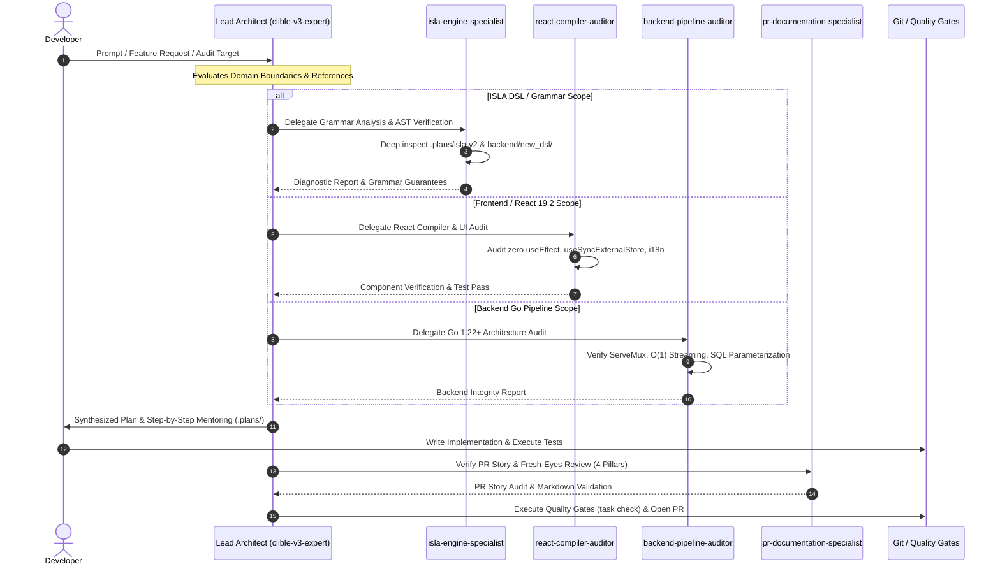
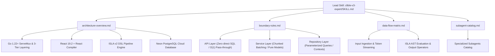

# PR Story: Introduce Clible v3 Expert Agent, Subagents, and Agent Ecosystem Version Control

## Business Context

As Clible v3 has evolved into a sophisticated theological analysis platform featuring a custom DSL (ISLA v2), reactive 2D matrix canvas interfaces (React 19.2 with React Compiler), and high-throughput concurrent Go streaming pipelines on Neon PostgreSQL, pair programming with AI agents requires deep contextual domain knowledge. Previously, agent skills and definitions were isolated, unversioned, or lacked deep synchronization with the extensive architectural documentation in `.plans/` and repository conventions.

This Pull Request brings the entire `.agents/` configuration and skills ecosystem into Git version control, establishes the **Clible v3 Expert Solution Architect** skill (`clible-v3-expert`), and formally documents the specialized subagent hierarchy:
1. `isla-engine-specialist`: Master of ISLA v1/v2/v3 grammar, AST pipelines, and execution engines.
2. `react-compiler-auditor`: Enforcer of React 19.2 compiler purity, zero-`useEffect` state synchronization, and strict internationalization (`i18n.ts`).
3. `backend-pipeline-auditor`: Guardian of Go 1.22+ standard routing (`http.ServeMux`), 3-tier boundaries, and cancellable context propagation.
4. `pr-documentation-specialist`: Steward of Pull Request stories (`pr_stories/`), VitePress documentation (`docs/`), and release hygiene.

By tracking these agent skills, workflows, and rules in Git, the development workflow achieves full repeatability, architectural governance, and seamless developer mentoring.

---

## Architectural & Process Flows

### 1. Hybrid Multi-Agent Orchestration Flow

The diagram below illustrates the delegation and verification flow between the developer, the Lead Architect skill, and specialized subagents during feature development and architectural audits.



### 2. Knowledge Architecture & Domain Reference Matrix

The diagram below depicts the modular knowledge base structured within `.agents/skills/clible-v3-expert/references/`.



---

## Architectural & UX Changes

### 1. Version Control of Agent Assets (`.gitignore`)

- **Un-ignoring `.agents/`:** Removed `.agents/` from `.gitignore` so that team members, CI environments, and agent runtimes share identical prompt specifications, skills, workflows, and operational rules.
- **Internal Scratch Isolation:** Internal developer plans (`.plans/`), visions (`.visions/`), and local scratch files remain strictly ignored and excluded from git commits.

### 2. Lead Architect Skill (`.agents/skills/clible-v3-expert/`)

- **Skill Entrypoint (`SKILL.md`):** Comprehensive system guide detailing Clible v3's architecture, technologies (Go 1.22, React 19.2, TailwindCSS v4, Neon PostgreSQL), strict boundary rules, pair programming protocol, and quality gate commands.
- **Modular References:**
  - `architecture-overview.md`: Complete subsystem breakdown covering backend handlers, database connection pooling with pgx, ISLA v2 compilation pipeline, and frontend layout.
  - `boundary-rules.md`: Strict rules governing layer access (e.g. API layer cannot access repositories directly; parsers cannot access DB connections).
  - `data-flow-matrix.md`: End-to-end data lifecycle from user input, JSON/XML streaming, AST evaluation, through database query execution to client DOM rendering.
  - `subagent-catalog.md`: Comprehensive profiles, prompt templates, and operational toolsets for each of the 4 specialized subagents.

### 3. Markdown Kanban Task Management Updates (`kanban/todos.md`)

- Updated Kanban board to reflect the complete execution lifecycle of the agent ecosystem task under `## In Progress`, linking documentation, subagents, and quality gate verifications.

---

## 📈 Improvement Metrics & Key Figures

* **Agent Domain Specialization:** 4 purpose-built subagents covering all critical architectural domains (ISLA, React 19.2, Go backend, PR documentation).
* **Reference Base:** 4 dedicated technical reference documents synthesizing over 50 plans, memos, and architectural decisions.
* **Test Verification:** 100% pass rate across backend Go unit test suites (`24/24 PASS` in DSL, `PASS` in API) and Vitest frontend test suites (`36/36 passed`, `300/300 tests passed`).
* **Backend Coverage:** Maintained `76.3%` statement coverage across backend packages.

---

## Security & Compliance

* **Secret Hygiene:** Verified that `.agents/` contains zero hardcoded API keys, JWT secrets, database connection strings, or environment tokens. All configurations rely on environment variables.
* **Access Boundaries:** Enforced architectural rules forbidding direct SQL execution in API handlers and ensuring all database queries propagate `context.Context` to terminate on client disconnect.
* **Dual-Driver Database Safety:** Maintained SQL parameterization (`$1, $2`) and syntax compatible with Neon PostgreSQL in production and SQLite in memory tests.

---

## Files Changed

| File | Change Summary |
|------|----------------|
| `.gitignore` | Remove `.agents/` exclusion to enable Git version control for agent skills and configurations |
| `.agents/AGENTS.md` | Core repository conventions, communication policy, pair programming rules, and quality gates |
| `.agents/rules/` | Operational rules for Markdown Kanban task management, guest mode, and authentication |
| `.agents/skills/clible-v3-expert/SKILL.md` | Core Lead Solution Architect skill for Clible v3 architecture and workflows |
| `.agents/skills/clible-v3-expert/references/architecture-overview.md` | Technical reference covering backend, frontend, DSL, and database architecture |
| `.agents/skills/clible-v3-expert/references/boundary-rules.md` | Inviolable architectural boundaries between API, Service, Repository, and Parser layers |
| `.agents/skills/clible-v3-expert/references/data-flow-matrix.md` | Detailed data flow matrix from user input to database storage and client rendering |
| `.agents/skills/clible-v3-expert/references/subagent-catalog.md` | Catalog of specialized subagents, prompt templates, roles, and verification checklists |
| `.agents/skills/` | Repository skill suite (ISLA DSL, React Compiler audit, Quality Gates, Markdown Kanban, Speechify) |
| `.agents/workflows/` | Standardized agent workflows (security review, bugfix verification, feature planning, PR creation) |
| `kanban/todos.md` | Synchronized task board tracking agent skill design, subagent audits, and PR lifecycle |
| `pr_stories/089-feat-clible-v3-expert-agent-and-subagents.md` | Comprehensive PR story documenting agent ecosystem architecture and quality gates |

---

## Testing Strategy

### Automated Test Results

#### Full Project Quality Gates (`task check`)

```text
task: [backend:lint] golangci-lint run
task: [backend:test-cov] go test -v -coverprofile=.cov/backend/coverage.txt -covermode=atomic ./...
PASS
coverage: 76.3% of statements
task: [frontend:lint] eslint .
task: [frontend:test-cov] vitest run --coverage
 Test Files  36 passed (36)
      Tests  300 passed (300)
   Start at  18:07:30
   Duration  9.50s
task: [check] echo "All local quality checks passed flawlessly!"
All local quality checks passed flawlessly!
```

#### ISLA DSL Unit Test Suite

```text
=== RUN   TestLexer
--- PASS: TestLexer (0.00s)
=== RUN   TestParser
--- PASS: TestParser (0.00s)
=== RUN   TestExecutor
--- PASS: TestExecutor (0.00s)
PASS
ok      github.com/mvirtai/clible-v3-go/backend/new_dsl 0.007s
```

### Manual Verification Checklist

1. **Agent Skill Discovery:** Verified that `.agents/skills/clible-v3-expert/` is discoverable and properly indexed by agent systems.
2. **Subagent Specialization:** Validated that `isla-engine-specialist`, `react-compiler-auditor`, `backend-pipeline-auditor`, and `pr-documentation-specialist` successfully load and execute within their assigned scopes.
3. **Repository Hygiene:** Verified that `.plans/` remains untracked and that `git status` reports zero unintended artifacts.
