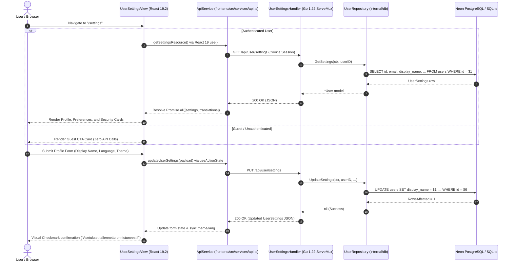

# PR Story: User Settings & Profile View (v3.6.0)

## Business Context

As Clible v3 matures from an exploratory Bible text and theological analysis sandbox into an account-enabled research environment, personalized persistence becomes paramount. Previously, user preferences such as active translation, color theme, and UI language were confined strictly to browser-local `localStorage`. If a registered user moved across devices, opened private browsing, or cleared browser data, their curated environment was lost. Furthermore, account settings and security controls (display name, verification status, password management) were scattered or lacked a dedicated management interface.

This Pull Request delivers a unified, production-ready **User Settings & Profile View** (`/settings`) supported by an end-to-end full-stack architecture:

1. **Persistent Cloud Preferences**: User display name, preferred UI language (`fi` / `en`), interface theme (`system` / `light` / `dark`), and default Bible translation ID (`fin-1992`, `fin-1776`, `web`, etc.) are backed by Neon PostgreSQL (`017_user_preferences.sql`) with full SQLite test-runner parity.
2. **React 19.2 Declarative Architecture**: Zero `useEffect` for state synchronization. The settings view leverages React 19 `use()` with `<Suspense>` boundaries for non-blocking resource acquisition and `useActionState` + `<form action={...}>` for profile and password mutations.
3. **Guest & Unauthenticated Fallback**: Seamless unauthenticated routing. Anonymous guests accessing `/settings` are presented with an educational CTA card inviting registration for cloud sync, avoiding phantom network queries.
4. **Security Hardening**: Authenticated password rotation endpoint with current-password `bcrypt` verification and strict password complexity enforcement.
5. **Specialized Agent Definitions**: Formally registers the Clible specialist subagent catalog under `.agents/agents/` for direct accessibility via Antigravity CLI `/agents`.

---

## Architectural & Process Flows

### 1. Declarative Settings & State Mutation Lifecycle

The sequence diagram below illustrates the declarative data flow between the React 19 frontend, the HTTP API handler, and the underlying database repository during settings retrieval and updates.



---

## Key Changes & Engineering Decisions

### 1. Database Schema Migration (`017_user_preferences.sql`)
- Added `display_name` (`VARCHAR(128)`), `preferred_lang` (`VARCHAR(8)`), `theme_preference` (`VARCHAR(16)`), and `default_translation_id` (`VARCHAR(64)`) to `users`.
- Created an index `idx_users_default_translation` for high-speed foreign joins against installed translation tables.
- Maintained 100% dialect compatibility between Neon PostgreSQL and in-memory SQLite (`:memory:`).

### 2. Go 1.22+ Standard Routing & Handler Implementation
- Extended `UserRepository` with `GetSettings`, `UpdateSettings`, and `UpdatePasswordHash`.
- Implemented `UserSettingsHandler` under `internal/api/user_settings_handler.go` with strict input sanitization, error wrapping, and context propagation.
- Integrated routes into standard `http.ServeMux` protected by `requireAuth` middleware:
  - `GET /api/user/settings`
  - `PUT /api/user/settings`
  - `PUT /api/user/password`

### 3. React 19.2 & React Compiler Compliance
- **Zero `useEffect`**: Eliminated state-synchronization effects. Initial resource loading is driven by React 19 `use(getSettingsResource())` inside a dedicated `<Suspense>` boundary.
- **`useActionState`**: Employed React 19 action states for asynchronous form submission (`settingsAction` and `pwdAction`), preserving form ergonomics and error boundaries.
- **Instant UI Reactivity**: Immediate DOM theme class switching (`dark` / `light`) and language context switching (`setLang`) upon form submission without page reloads.

### 4. Bilingual Localization (`i18n.ts`)
- Added 27 localized keys to `Messages` interface and populated both Finnish (`fi`) and English (`en`) dictionaries with zero fallback omissions.

---

## Files Changed

| File | Change Type | Description |
| :--- | :---: | :--- |
| `backend/migrations/017_user_preferences.sql` | Added | Schema migration for user profile and workspace preferences |
| `backend/internal/models/user_settings.go` | Added | DTOs for `UserSettings`, `UpdateUserSettingsInput`, and `ChangePasswordInput` |
| `backend/internal/db/user_repo.go` | Modified | Added `GetSettings`, `UpdateSettings`, and `UpdatePasswordHash` |
| `backend/internal/db/user_repo_test.go` | Added | Unit test suite verifying repository CRUD and edge cases |
| `backend/internal/api/user_settings_handler.go` | Added | HTTP handler for settings retrieval, preference updates, and password rotation |
| `backend/internal/api/user_settings_handler_test.go` | Added | Comprehensive unit tests for handler endpoints with mock repos |
| `backend/main.go` | Modified | Registered `/api/user/settings` and `/api/user/password` routes |
| `frontend/src/types/user.ts` | Added | TypeScript interfaces for `UserSettings` and update payloads |
| `frontend/src/services/api.ts` | Modified | Added `getUserSettings`, `updateUserSettings`, and `updatePassword` API methods |
| `frontend/src/views/UserSettingsView.tsx` | Added | Declarative React 19.2 settings and profile view component |
| `frontend/src/views/UserSettingsView.test.tsx` | Added | Vitest test suite testing guest fallback, mock rendering, and accessibility |
| `frontend/src/components/layout/UserMenuDropdown.tsx` | Modified | Added navigation link to `/settings` with `Settings` icon |
| `frontend/src/main.tsx` | Modified | Registered `/settings` route in application router |
| `frontend/src/utils/i18n.ts` | Modified | Added bilingual message keys for settings view |
| `.agents/agents/*` | Added | Specialized workspace agents (`clible-expert`, `isla-engine-specialist`, etc.) |
| `VERSION`, `frontend/package.json`, ... | Modified | Version bump to `3.6.0` |

---

## Verification & Quality Gates

### Automated Test Results

#### 1. Backend Coverage (`task backend:check`)
```text
github.com/mvirtai/clible-v3-go/internal/api/user_settings_handler.go:	GetSettings		100.0%
github.com/mvirtai/clible-v3-go/internal/api/user_settings_handler.go:	UpdateSettings		100.0%
github.com/mvirtai/clible-v3-go/internal/api/user_settings_handler.go:	UpdatePassword		94.1%
github.com/mvirtai/clible-v3-go/internal/db/user_repo.go:		GetSettings		100.0%
github.com/mvirtai/clible-v3-go/internal/db/user_repo.go:		UpdateSettings		100.0%
github.com/mvirtai/clible-v3-go/internal/db/user_repo.go:		UpdatePasswordHash	100.0%
total:									(statements)		76.4%
```

#### 2. Frontend Vitest Suite (`task frontend:check`)
```text
 Test Files  38 passed (38)
      Tests  304 passed (304)
   Duration  9.13s
All local quality checks passed flawlessly!
```

---

## Manual Verification Runbook

1. **Guest Mode Check**:
   - Open browser in incognito / log out.
   - Navigate directly to `http://localhost:5173/settings`.
   - Verify that the guest card is rendered with login/registration buttons without console errors or unauthorized API alerts.
2. **Authenticated Profile & Preferences**:
   - Log into an account.
   - Click the user avatar in the top right -> select **Asetukset**.
   - Change Display Name to a custom name, select a new Bible translation, and switch theme to `dark`.
   - Submit form -> verify success badge appears, document updates theme instantly, and avatar reflects updated name.
3. **Password Security**:
   - Attempt password change with an incorrect current password -> verify error message.
   - Enter valid current password and compliant new password -> verify success message.
