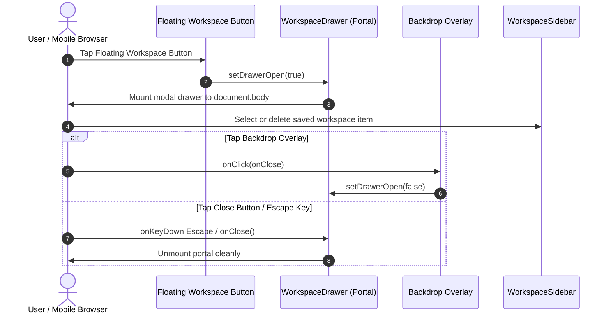
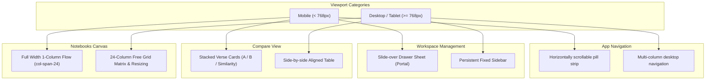

# PR Story: Mobile-First Responsive UX & Touch Ergonomics (v3.6.0)

## Business Context

Clible v3 is an advanced Scripture study and theological analysis workbench designed for web researchers, scholars, and daily readers. While the desktop experience previously featured high information density and customizable multi-column layouts, mobile users (360px–430px viewports) experienced significant friction:

1. **Horizontal Viewport Overflow**: Fixed-width dropdowns and desktop tables caused horizontal scrolling, obscuring content and breaking standard mobile viewport guarantees.
2. **Congested Navigation**: A 6-column fixed grid squeezed navigation tab titles on smartphones, resulting in clipped text and poor touch ergonomics.
3. **Workspace Inaccessibility on Mobile**: The workspace sidebar was hidden on mobile screens (`hidden md:block`) with no interactive mechanism for mobile users to access their saved searches, verse passages, or analytical comparisons.
4. **Desktop Table Comparison**: Dual-translation alignment (`CompareView`) was strictly tabular (`<table>`), requiring awkward horizontal scrolling on small touchscreens.
5. **Reader & Search Touch Constraints**: Fixed text sizing hindered readability across diverse smartphone display densities, chapter navigation required scrolling back to the top of long chapters, and search filters lacked touch-friendly sizing.
6. **2D Canvas Matrix Density**: The 24-column CSS grid matrix in Notebooks caused cards to shrink to unusable widths (~170px) on mobile viewports.

This Pull Request delivers a comprehensive **Mobile-First Responsive UX** overhaul across all Clible views, adhering strictly to **React 19.2 declarative architecture** (zero `useEffect` for state synchronization) and mobile accessibility guidelines.

---

## Architectural & Process Flows

### 1. Mobile Drawer Architecture & Declarative Portals

The sequence diagram below illustrates how mobile users interact with the new slide-over `WorkspaceDrawer` using React 19 createPortal without window event listeners.

### 2. Viewport & Component Responsive Breakdown

---

## Key Changes & Implementations

### Phase 1: Viewport & Layout Foundation
- **`frontend/index.html`**: Added `viewport-fit=cover` to ensure edge-to-edge rendering on devices with camera notches or dynamic islands.
- **`frontend/src/index.css`**: Added CSS variables for safe-area insets (`--safe-top`, `--safe-bottom`, `--safe-left`, `--safe-right`), `.no-scrollbar` utility, and `overflow-x: clip` to prevent viewport stretching.
- **`frontend/src/components/layout/AppHeader.tsx`**: Integrated safe-area insets and touch-optimized header padding.
- **`frontend/src/components/layout/UserMenuDropdown.tsx`**: Replaced fixed `w-[360px]` with `w-[min(calc(100vw-1.5rem),360px)]` to prevent overflow on 360px screens.
- **`frontend/src/components/layout/ViewModeTabs.tsx`**: Replaced congested fixed grid with a smoothly scrolling horizontal pill strip (`min-h-[40px] sm:min-h-[44px]`).

### Phase 2: Mobile Workspace Drawer
- **`frontend/src/components/layout/WorkspaceDrawer.tsx`**: Implemented a slide-over mobile drawer mounted via `createPortal`. Complies with React 19.2 by using declarative click-outside and keydown delegation with zero `useEffect` window listeners.
- **`frontend/src/components/layout/WorkspaceSidebar.tsx`**: Replaced hover-only `group-hover:opacity-100` action buttons with persistent touch-visible buttons on mobile (`opacity-100 md:opacity-0 md:group-hover:opacity-100`).
- **`frontend/src/App.tsx`**: Mounted floating action button (FAB) for mobile viewports to summon `WorkspaceDrawer`.

### Phase 3: Translation Comparison Ergonomics
- **`frontend/src/components/compare/CompareView.tsx`**: Implemented stacked cards view for mobile (`md:hidden`) showing reference, similarity meter, Translation A, and Translation B in a readable vertical card, while preserving the parallel multi-column table on desktop (`hidden md:block`).
- **`frontend/src/components/compare/CompareView.test.tsx`**: Added automated unit tests verifying both mobile stacked cards and desktop table rendering.

### Phase 4: Reader & Search Ergonomics
- **`frontend/src/components/reader/VerseReader.tsx`**:
  - Added font size toggle (`A- / A+`) supporting 5 text sizes (`sm`, `base`, `lg`, `xl`, `2xl`) persisted in `localStorage: clible:reader_font_size`.
  - Added dual chapter navigation at both the top and bottom of chapters with accessible `min-h-[44px]` touch targets.
  - Enhanced verse click ergonomics with active tactile feedback (`active:bg-[var(--accent-bg)]`).
- **`frontend/src/components/search/SearchHub.tsx` & `VerseSearch.tsx`**:
  - Expanded search mode switcher into a thumb-friendly 2-column grid on mobile (`w-full grid grid-cols-2`).
  - Enlarged regex and scope filter controls to meet 38px+ touch minimums.
- **`frontend/src/components/reader/VerseReader.test.tsx` & `SearchHub.test.tsx`**: Added unit tests for font adjustments and responsive search grids.

### Phase 5: Notebooks & Specialized Views
- **`frontend/src/components/notebook/SortableNotebookCard.tsx` & `index.css`**:
  - Added mobile fallback CSS rule `@media (max-width: 767px) { .notebook-matrix-card { grid-column: span 24 !important; } }` ensuring 100% full-width readability on small screens.
  - Hidden multi-edge resize handles on mobile (`hidden md:block`) to prevent swipe/scroll gesture conflicts.
  - Constrained card drag reordering strictly to the designated `dragHandle` element.

---

## Verification & Test Results

All quality gates passed with zero warnings or errors:

- **TypeScript Compilation**: `pnpm exec tsc -b` passed flawlessly.
- **ESLint**: 0 errors, 0 warnings across frontend codebase.
- **Frontend Unit Tests**: 41 test files, 316 tests passing in Vitest with coverage.
- **Backend Quality Gate**: Go linting, module tidy, and integration test suite passing with race detector (`task backend:check`).
- **Fullstack Quality Gate**: `task check` passed completely.
