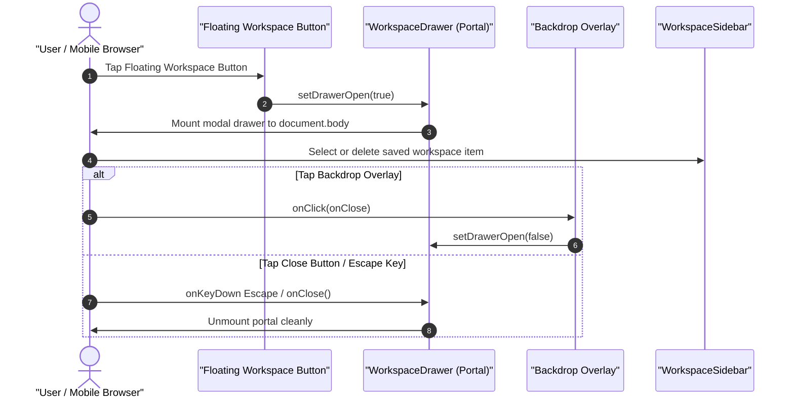
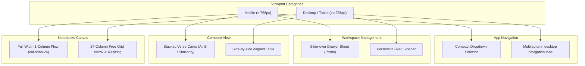
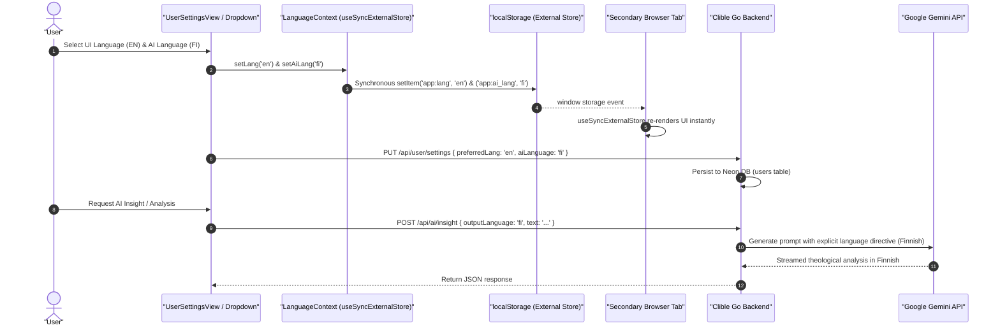

# PR Story: Mobile-First Responsive UX, Smart Input Ergonomics & AI Language Decoupling (v3.7.0)

## Business Context

Clible v3 is an advanced Scripture study and theological analysis workbench designed for web researchers, scholars, and daily readers. While the desktop experience previously featured high information density and customizable multi-column layouts, mobile users (360px–430px viewports) experienced significant friction:

1. **Horizontal Viewport Overflow**: Fixed-width dropdowns and desktop tables caused horizontal scrolling, obscuring content and breaking standard mobile viewport guarantees.
2. **Congested Navigation**: A 6-column fixed grid squeezed navigation tab titles on smartphones, resulting in clipped text and poor touch ergonomics. An initial horizontal scrollstrip required sideways scrolling, so navigation was refactored into an intuitive, space-efficient mobile dropdown selector.
3. **Workspace Inaccessibility on Mobile**: The workspace sidebar was hidden on mobile screens (`hidden md:block`) with no interactive mechanism for mobile users to access their saved searches, verse passages, or analytical comparisons.
4. **Desktop Table Comparison**: Dual-translation alignment (`CompareView`) was strictly tabular (`<table>`), requiring awkward horizontal scrolling on small touchscreens.
5. **Reader & Search Touch Constraints**: Fixed text sizing hindered readability across diverse smartphone display densities, chapter navigation required scrolling back to the top of long chapters, and search filters lacked touch-friendly sizing.
6. **Input Clearing Friction**: When navigating between views with an active scripture reference, users had to manually backspace or select-all to enter a new query. Furthermore, semantic search buttons resized during execution, shifting adjacent input text.
7. **Coupled Language Preferences**: Previously, the application language setting inadvertently coupled UI strings with AI response generation, preventing bilingual scholars from reading a Finnish UI while requesting AI insights in English (or vice versa).

This Pull Request delivers a comprehensive **Mobile-First Responsive UX & Ergonomics** overhaul across all Clible views, accompanied by a **Smart Clear Input** pattern and full decoupling of **Interface Language vs. AI Response Language**, adhering strictly to **React 19.2 declarative architecture** (zero `useEffect` for state synchronization) and mobile accessibility guidelines.

---

## Architectural & Process Flows

### 1. Mobile Drawer Architecture & Declarative Portals

The sequence diagram below illustrates how mobile users interact with the slide-over `WorkspaceDrawer` using React 19 `createPortal` without window event listeners.

### 2. Viewport & Component Responsive Breakdown

### 3. Decoupled Language Architecture & Multi-Tab Synchronization

The sequence diagram below models the decoupled language architecture, demonstrating how `useSyncExternalStore` guarantees zero-`useEffect` multi-tab synchronization and dispatches user preferences to backend Gemini services.

---

## Key Changes & Implementations

### Phase 1: Viewport & Layout Foundation
- **`frontend/index.html`**: Added `viewport-fit=cover` to ensure edge-to-edge rendering on devices with camera notches or dynamic islands.
- **`frontend/src/index.css`**: Added CSS variables for safe-area insets (`--safe-top`, `--safe-bottom`, `--safe-left`, `--safe-right`), `.no-scrollbar` utility, and `overflow-x: clip` to prevent viewport stretching.
- **`frontend/src/components/layout/AppHeader.tsx`**: Integrated safe-area insets and touch-optimized header padding.
- **`frontend/src/components/layout/UserMenuDropdown.tsx`**: Replaced fixed `w-[360px]` with `w-[min(calc(100vw-1.5rem),360px)]` to prevent overflow on 360px screens. Preserved the instant `FI` / `EN` toggle button.

### Phase 2: Mobile Workspace Drawer
- **`frontend/src/components/layout/WorkspaceDrawer.tsx`**: Implemented a slide-over mobile drawer mounted via `createPortal`. Complies with React 19.2 by using declarative click-outside and keydown delegation with zero `useEffect` window listeners.
- **`frontend/src/components/layout/WorkspaceSidebar.tsx`**: Replaced hover-only `group-hover:opacity-100` action buttons with persistent touch-visible buttons on mobile (`opacity-100 md:opacity-0 md:group-hover:opacity-100`).
- **`frontend/src/App.tsx`**: Mounted floating action button (FAB) for mobile viewports to summon `WorkspaceDrawer`.

### Phase 3: Mobile Navigation: Compact Dropdown Selector
- **`frontend/src/components/layout/ViewModeTabs.tsx`**: Replaced horizontal scroll strip on mobile viewports (`< 768px`) with a compact dropdown selector featuring current view indicator, localized titles, and 44px touch targets, eliminating horizontal scrolling while preserving desktop multi-column tabs (`>= 768px`).
- **`frontend/src/components/layout/ViewModeTabs.test.tsx`**: Verified dropdown toggle, selection navigation, and responsive visibility.

### Phase 4: Translation Comparison Ergonomics
- **`frontend/src/components/compare/CompareView.tsx`**: Implemented stacked cards view for mobile (`md:hidden`) showing reference, similarity meter, Translation A, and Translation B in a readable vertical card, while preserving the parallel multi-column table on desktop (`hidden md:block`).
- **`frontend/src/components/compare/CompareView.test.tsx`**: Added automated unit tests verifying both mobile stacked cards and desktop table rendering.

### Phase 5: Reader & Search Ergonomics
- **`frontend/src/components/reader/VerseReader.tsx`**:
  - Added font size toggle (`A- / A+`) supporting 5 text sizes (`sm`, `base`, `lg`, `xl`, `2xl`) persisted in `localStorage: clible:reader_font_size`.
  - Added dual chapter navigation at both the top and bottom of chapters with accessible `min-h-[44px]` touch targets.
  - Enhanced verse click ergonomics with active tactile feedback (`active:bg-[var(--accent-bg)]`).
- **`frontend/src/components/search/SearchHub.tsx` & `VerseSearch.tsx`**:
  - Expanded search mode switcher into a thumb-friendly 2-column grid on mobile (`w-full grid grid-cols-2`).
  - Enlarged regex and scope filter controls to meet 38px+ touch minimums.
  - Fixed semantic search execute button text expansion to prevent layout shift.
- **`frontend/src/components/reader/VerseReader.test.tsx` & `SearchHub.test.tsx`**: Added unit tests for font adjustments and responsive search grids.

### Phase 6: Smart Clear Input Ergonomics
- **`frontend/src/utils/useSmartClearInput.ts`**: Created reusable input ergonomics hook:
  - When an input is populated with an active reference and has not yet been edited (`isPristine === true`), pressing Enter clears the field immediately.
  - Typing any regular character replaces the entire pre-filled value with the typed character without requiring manual backspacing or selection.
- **`frontend/src/utils/useSmartClearInput.test.tsx`**: Unit tests verifying single-keystroke replacement and enter-to-clear behaviors.
- **Integrated Across Views**: Deployed `useSmartClearInput` in `VerseSearch.tsx`, `AiSemanticSearch.tsx`, and `CompareView.tsx`.

### Phase 7: AI Language Decoupling & Zero-`useEffect` Architecture
- **Database Migration**: `backend/migrations/018_ai_language_preference.sql` added `ai_language VARCHAR(16) NOT NULL DEFAULT 'fi'` to `users`.
- **Backend Architecture**:
  - `backend/internal/models/user_settings.go`: Added `AiLanguage` field to `UserSettings` and `UpdateUserSettingsInput`.
  - `backend/internal/db/user_repo.go`: Integrated `ai_language` column into `GetByID`, `GetSettings`, and `UpdateSettings`.
  - `backend/internal/api/user_settings_handler.go`: Validates `aiLanguage` (`fi`, `en`, `auto`).
  - `backend/internal/services/ai_service.go`: Extended `GetInsight`, `GetTone`, and `GetComparison` methods to accept `outputLanguage` and guide Gemini prompts accordingly.
  - `backend/internal/api/ai_handler.go`: Decodes `outputLanguage` request parameters.
- **Frontend `LanguageContext.tsx`**:
  - Completely removed all `useEffect` hooks.
  - Implemented `useSyncExternalStore` with window `storage` event listeners for multi-tab synchronization.
  - Supported independent `lang` (`fi` | `en`) and `aiLang` (`fi` | `en` | `auto`).
- **Frontend `UserSettingsView.tsx`**:
  - Added separate dropdown selects for UI Language and AI Response Language.
  - Utilizes React 19 `useActionState` and `use(resourcePromise)` with zero `useEffect`.
- **AI Consumers Updated**: Wired `aiLang` into `VerseReader.tsx`, `AnalyticsView.tsx`, `CompareView.tsx`, `AiSemanticSearch.tsx`, and `App.tsx`.
- **i18n**: Added bilingual entries for all new settings in `frontend/src/utils/i18n.ts`.

### Phase 8: Notebooks Canvas 1-Column Responsive Fallback
- **`frontend/src/components/notebook/SortableNotebookCard.tsx` & `index.css`**:
  - Added mobile fallback CSS rule `@media (max-width: 767px) { .notebook-matrix-card { grid-column: span 24 !important; } }` ensuring 100% full-width readability on small screens.
  - Hidden multi-edge resize handles on mobile (`hidden md:block`) to prevent swipe/scroll gesture conflicts.
  - Constrained card drag reordering strictly to the designated `dragHandle` element.

---

## Files Changed

| File | Changes | Description |
| :--- | :--- | :--- |
| `backend/migrations/018_ai_language_preference.sql` | +4 | SQL migration adding `ai_language` column to `users` |
| `backend/internal/db/migrations.go` | +3 | SQLite adaptation for test suite schema execution |
| `backend/internal/models/user_settings.go` | +2 | Added `AiLanguage` to model structs |
| `backend/internal/db/user_repo.go` | +17, -1 | SQL queries updated with `ai_language` |
| `backend/internal/db/user_repo_test.go` | +7, -1 | Unit tests for user settings persistence |
| `backend/internal/api/user_settings_handler.go` | +5, -1 | Validation and handler for AI language input |
| `backend/internal/api/user_settings_handler_test.go` | +8, -0 | API tests for user settings update endpoint |
| `backend/internal/services/ai_service.go` | +30, -3 | Prompt instructions parameterized with `outputLanguage` |
| `backend/internal/services/ai_service_test.go` | +10, -3 | Unit tests verifying language directives in AI service |
| `backend/internal/api/ai_handler.go` | +29, -3 | Request decoding of `outputLanguage` |
| `backend/internal/api/ai_handler_test.go` | +26, -3 | AI handler unit tests |
| `frontend/index.html` | +2, -1 | `viewport-fit=cover` meta tag |
| `frontend/src/index.css` | +26, -0 | Safe-area variables, `.no-scrollbar`, mobile matrix override |
| `frontend/src/App.tsx` | +51, -10 | Floating workspace FAB, mobile drawer, AI study language mapping |
| `frontend/src/components/layout/AppHeader.tsx` | +3, -0 | Safe-area padding integration |
| `frontend/src/components/layout/UserMenuDropdown.tsx` | +2, -1 | Responsive max-width clamping |
| `frontend/src/components/layout/ViewModeTabs.tsx` | +192, -64 | Mobile compact dropdown navigation vs. desktop tabs |
| `frontend/src/components/layout/ViewModeTabs.test.tsx` | +74, -0 | Navigation tests for mobile dropdown selector |
| `frontend/src/components/layout/WorkspaceDrawer.tsx` | +103, -0 | Slide-over mobile drawer component |
| `frontend/src/components/layout/WorkspaceDrawer.test.tsx` | +133, -0 | Unit tests for drawer portal |
| `frontend/src/components/layout/WorkspaceSidebar.tsx` | +4, -2 | Touch-visible action buttons on mobile |
| `frontend/src/components/compare/CompareView.tsx` | +271, -78 | Stacked card view on mobile, smart clear input, AI language integration |
| `frontend/src/components/compare/CompareView.test.tsx` | +233, -0 | Unit tests for mobile cards and desktop comparison |
| `frontend/src/components/reader/VerseReader.tsx` | +221, -38 | Font size scaler, dual chapter navigation, AI language pass |
| `frontend/src/components/reader/VerseReader.test.tsx` | +66, -1 | Unit tests for font scaling and chapter navigation |
| `frontend/src/components/search/SearchHub.tsx` | +6, -2 | 2-column mobile search mode grid |
| `frontend/src/components/search/SearchHub.test.tsx` | +55, -0 | Touch target and responsive layout tests |
| `frontend/src/components/search/VerseSearch.tsx` | +68, -18 | Smart clear input, touch-friendly filter targets |
| `frontend/src/components/search/AiSemanticSearch.tsx` | +36, -16 | Fixed button text expansion, AI language preference pass |
| `frontend/src/components/analytics/AnalyticsView.tsx` | +58, -22 | Pass user's AI response language to tone and deep dive calls |
| `frontend/src/components/original/OriginalStudyView.tsx` | +52, -14 | AI language preference mapping |
| `frontend/src/components/notebook/SortableNotebookCard.tsx` | +83, -24 | Mobile touch handle constraints and drag handling |
| `frontend/src/context/LanguageContext.tsx` | +92, -34 | Zero-`useEffect` `useSyncExternalStore` implementation |
| `frontend/src/views/UserSettingsView.tsx` | +28, -6 | Decoupled UI and AI response language select controls |
| `frontend/src/views/UserSettingsView.test.tsx` | +32, -0 | Unit tests for distinct language selectors |
| `frontend/src/types/user.ts` | +2, -0 | Added `aiLanguage` to user interfaces |
| `frontend/src/services/api.ts` | +9, -4 | API client methods extended with `outputLanguage` |
| `frontend/src/utils/i18n.ts` | +25, -2 | Finnish and English dictionaries for new AI language preferences |
| `frontend/src/utils/useSmartClearInput.ts` | +59, -0 | Single-keystroke replace & enter-to-clear hook |
| `frontend/src/utils/useSmartClearInput.test.tsx` | +121, -0 | Unit tests for smart input ergonomics |

---

## Verification & Test Results

All quality gates passed with zero warnings or errors:

- **TypeScript Compilation**: `pnpm exec tsc -b` passed with 0 type errors.
- **ESLint**: `eslint .` passed with 0 errors and 0 warnings.
- **Frontend Unit Tests**: 42 test files, 324 tests passing in Vitest with coverage.
- **Backend Quality Gate**: Go linting, module tidy, and integration test suite passing with race detector (`task backend:check`).
- **Fullstack Quality Gate**: `task check` passed completely.
