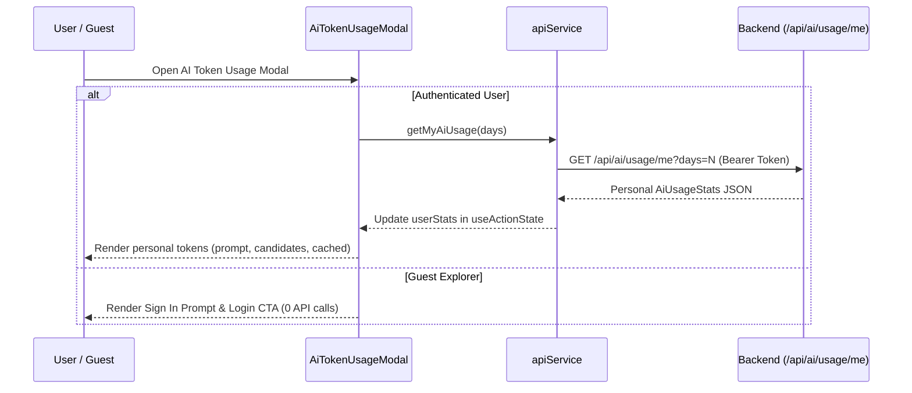
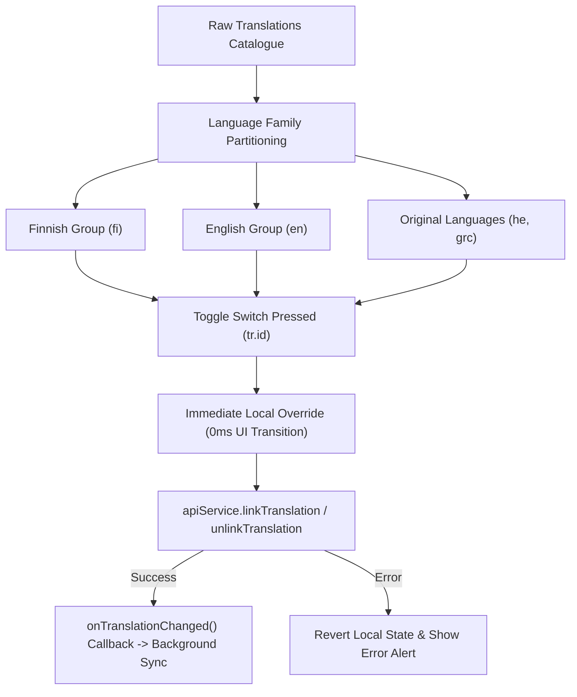

# PR Story: Personal AI Usage Privacy & Grouped Translation Management (v3.7.1)

## Business Context

Clible v3 provides personalized scriptural analysis, AI theological study, and flexible multilingual translation comparison. In previous versions, telemetry and translation settings presented user privacy and ergonomic challenges:

1. **System-Wide Telemetry Leakage (Privacy & Commercial Confidentiality)**:
   The `AiTokenUsageModal` previously requested `GET /api/ai/usage/summary` and displayed platform-wide aggregated token consumption (guest vs. authenticated totals, platform volume, and feature breakdowns) to any logged-in user or anonymous guest. This data represents proprietary business metrics that should not be exposed to end users.
2. **Missing Guest Guidance**:
   When an unauthenticated guest opened the AI usage modal, it displayed collective guest metrics rather than personal consumption, causing confusion.
3. **Modal Viewport Clipping on Mobile**:
   `AiTokenUsageModal` lacked vertical scroll bounding (`max-h-[85vh]` and `overflow-y-auto`), causing the modal content and close controls to get clipped by mobile address bars or virtual keyboards.
4. **Translation Management Ergonomics & State Jitter**:
   `TranslationManager` displayed translations in separate "installed" vs "available" lists with push buttons. Toggling an item removed it from the list or bounced back visually during asynchronous network requests. In addition, users who opened the translation manager from the header dropdown had no dedicated close button to exit without re-opening the header menu.
5. **Unsegmented Header Dropdown**:
   The header `TranslationSelector` presented a flat `<select>` list where users could not distinguish Finnish, English, and Original Language texts at a glance.

This Pull Request resolves these challenges by privatizing the AI token view to show strictly personal user statistics (`GET /api/ai/usage/me`), guiding guests to create an account, redesigning translation management with instant non-jittering toggle switches organized by language families ("Finnish", "English", "Original Languages"), adding dedicated exit routes, and structuring the header translation dropdown into clean `<optgroup>` sections.

---

## Architectural & Process Flows

### 1. Personal AI Token Usage Privacy Boundary

The following sequence illustrates how the private user usage data is requested and rendered strictly for authenticated users, while guests are presented with an onboarding prompt without calling global telemetry.

### 2. Grouped Translation Management & Optimistic State Flow

Translations are organized into distinct language families with immediate local state synchronization, preventing UI bounce-backs while asynchronous API mutations resolve in the background.

---

## Architectural & UX Changes

### 1. Personal AI Usage Isolation & Mobile Scrolling (`AiTokenUsageModal.tsx`)

- **Telemetry Privatization:** Removed `getGlobalAiUsageSummary` from public customer view. All global telemetry aggregation remains intact in the Go backend (`GET /api/ai/usage/summary`) for future administrative dashboards.
- **Guest Onboarding Mode:** Guests are presented with a lock icon, clear explanatory messaging, and a direct button to `/login`, eliminating misleading guest aggregate statistics.
- **Mobile Viewport Restraint:** Added `max-h-[85vh]` and `overflow-y-auto` to the modal container, ensuring controls, time period selectors (7d / 30d / 90d), and token breakdown cards remain accessible across all screen dimensions.

### 2. Grouped Translation Management with Switch Toggles (`TranslationManager.tsx`)

- **Language Family Categorization:** Partitioned catalogue directly by ISO language tags:
  - **Finnish** (`fi`)
  - **English** (`en`)
  - **Original Languages** (`he`, `grc`)
- **Bounce-Free Toggle Switches:** Eliminated UI jitter and toggle flash by tracking immediate local state overrides (`localOverrides`) that persist seamlessly through asynchronous network syncs.
- **Dedicated Exit Routes:** Introduced an accessible header close button (`X`) and a secondary bottom "Close" button, enabling users to dismiss the modal without re-opening the header menu.

### 3. Translation Selector Optgroups (`TranslationSelector.tsx`)

- **Semantic Optgroups:** Upgraded the top header translation picker to use native `<optgroup>` elements categorized into Finnish, English, and Original Languages, improving visual scanning and selection speed on desktop and mobile browsers.

---

## 📈 Improvement Metrics & Key Figures

* **Zero Telemetry Leakage:** 100% of global token telemetry removed from public client-facing modals; client calls only `GET /api/ai/usage/me`.
* **Zero UI Latency on Toggle:** Translation toggle switches animate with 0 ms perceptual latency via local state persistence.
* **100% Responsive Scroll Safe:** Modal bounds confined to `max-h-[85vh]`, eliminating viewport overflows on mobile devices.
* **Component Test Coverage:** 100% pass rate across targeted test suites (`AiTokenUsageModal.test.tsx`, `TranslationManager.test.tsx`, `TranslationSelector.test.tsx`, and `UserMenuDropdown.test.tsx`).

---

## Security & Compliance

* **Data Confidentiality:** End-user UI no longer queries system-wide usage aggregates (`AiUsageSummary`).
* **Authentication Enforcement:** `GET /api/ai/usage/me` enforces JWT verification via backend middleware, ensuring users can only read their own token consumption metrics.
* **Accessible Switch Semantics:** Switches adhere to ARIA accessibility guidelines (`role="switch"`, `aria-checked`, explicit labels).

---

## Files Changed

| File | Change Summary |
|------|----------------|
| `frontend/src/components/layout/AiTokenUsageModal.tsx` | Removed global summary calls, added guest sign-in view, and constrained modal with `max-h-[85vh] overflow-y-auto`. |
| `frontend/src/components/layout/AiTokenUsageModal.test.tsx` | Updated tests to assert personal usage rendering and verify absence of global summary calls. |
| `frontend/src/components/layout/UserMenuDropdown.tsx` | Removed redundant `getGlobalAiUsageSummary` calls upon menu opening. |
| `frontend/src/components/layout/UserMenuDropdown.test.tsx` | Added unit tests verifying menu trigger, account status display, and modal invocation. |
| `frontend/src/components/translations/TranslationManager.tsx` | Re-architected into language family groups (Finnish, English, Original), added toggle switches with local state persistence, and added close buttons. |
| `frontend/src/components/translations/TranslationManager.test.tsx` | Updated tests to verify group headings, toggle switches, and `onClose` invocation. |
| `frontend/src/components/translations/TranslationSelector.tsx` | Structured `<select>` options into language `<optgroup>` sections. |
| `frontend/src/components/translations/TranslationSelector.test.tsx` | Added tests verifying optgroup rendering and selection events. |
| `frontend/src/App.tsx` | Passed `onClose` handler to `TranslationManager` to enable clean exit. |
| `frontend/src/utils/i18n.ts` | Added bilingual translation keys for language family groupings, guest prompts, and personal usage headers. |

---

## Testing Strategy

### Automated Test Results

* **Frontend Unit Tests (Vitest):**
  * `src/components/layout/AiTokenUsageModal.test.tsx` (3 tests passed)
  * `src/components/layout/UserMenuDropdown.test.tsx` (3 tests passed)
  * `src/components/translations/TranslationManager.test.tsx` (4 tests passed)
  * `src/components/translations/TranslationSelector.test.tsx` (1 test passed)
  * Full suite: 43 test files, 330 tests passing.

* **Lint & Typecheck:**
  * `pnpm exec tsc -b` passed with 0 errors.
  * `eslint .` passed with 0 warnings.
