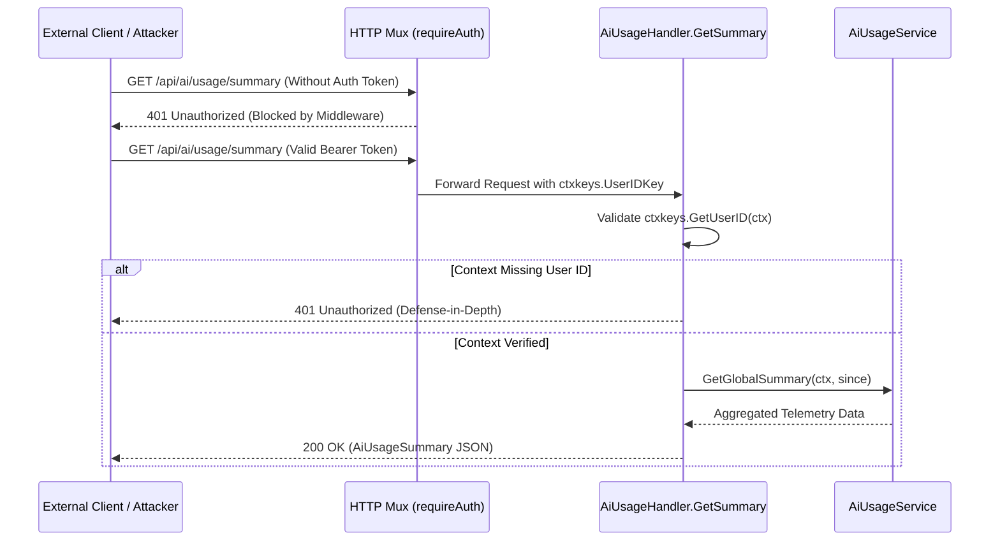
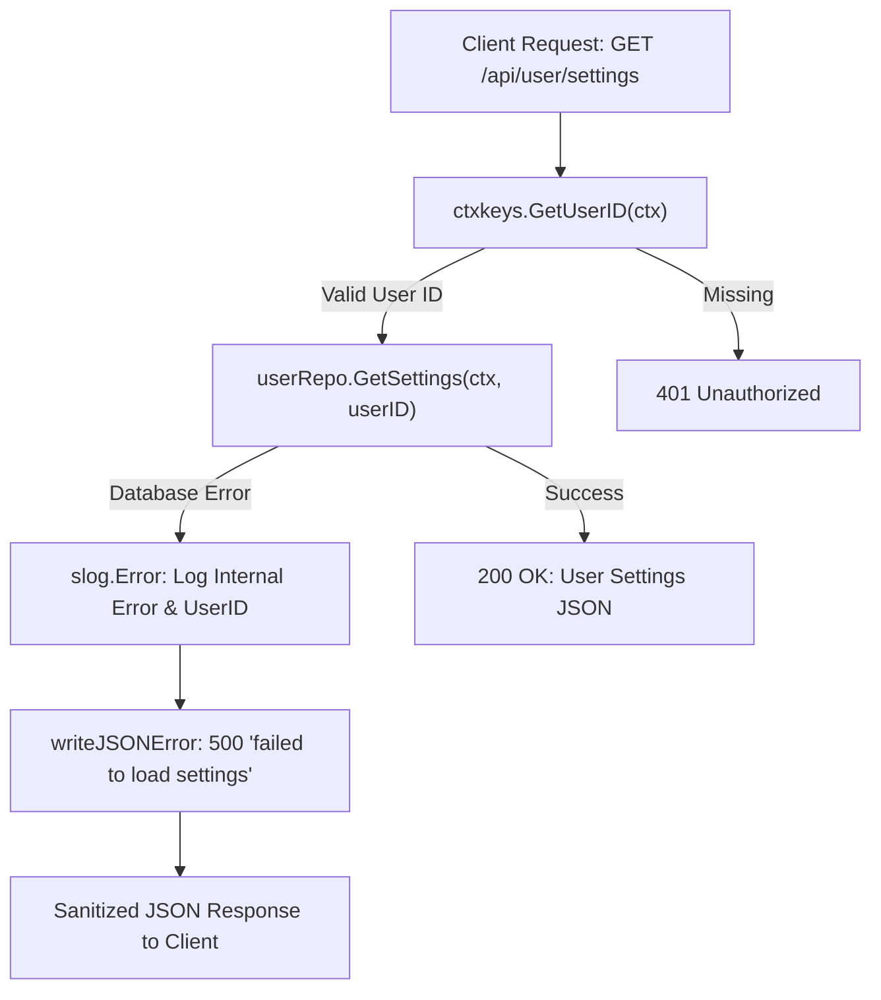

# PR Story: Security Hardening for AI Telemetry and User Settings (v3.7.2)

## Business Context

Following the implementation of user profile settings and personalized AI token telemetry, an internal SecOps security audit (`SECOPS-2026-09-22-002`) identified three architectural vulnerabilities requiring remediation prior to production release:

1. **Internal Database Error Information Disclosure (CWE-209)**:
   In `UserSettingsHandler.GetSettings`, database failure strings (`err.Error()`) were returned directly in HTTP error responses to clients. Under connection interruptions or driver issues, this exposed internal schema details, table names, and backend stack state.
2. **Unauthenticated Access to Global AI Usage Summary (CWE-862)**:
   The backend route `GET /api/ai/usage/summary` remained mounted with `optionalAuth`, allowing unauthenticated actors to query platform-wide aggregated AI usage, guest vs. authenticated breakdown figures, and feature distributions.
3. **Missing Display Name Upper Bound Validation (CWE-20)**:
   In `UserSettingsHandler.UpdateSettings`, `input.DisplayName` lacked length validation, creating a vector for payload bloat, unbounded database storage, or layout deformation.

This Pull Request addresses all three findings, resolving all vulnerabilities identified in `.security_audits/security-audit-2026-09-22-ai-token-telemetry-and-user-settings.md` to achieve a full `PASS` status.

---

## Architectural & Process Flows

### 1. Defense-in-Depth Authentication on AI Telemetry Summary

The sequence below depicts the two-tier authentication validation protecting `/api/ai/usage/summary`: routing-level middleware rejection and handler-level fallback checks.



### 2. Error Sanitization and Structured Logging

Internal errors are sequestered to server logs using `log/slog`, ensuring zero leakage of database internals to HTTP clients.



---

## Architectural & Security Changes

### 1. Database Error Sanitization & Structured Logging (`user_settings_handler.go`)

- Replaced raw `err.Error()` string concatenation with standard library `log/slog.Error`.
- Emits sanitized generic message `"failed to load settings"` with HTTP 500 status code.

### 2. Route Protection & Handler Defense-in-Depth (`main.go`, `ai_usage_handler.go`)

- Upgraded `GET /api/ai/usage/summary` route registration in `backend/main.go` from `optionalAuth` to `requireAuth`.
- Added handler-level authentication check (`ctxkeys.GetUserID(r.Context())`) in `AiUsageHandler.GetSummary` returning `401 Unauthorized` for unauthenticated requests.
- Updated `ai_usage_handler_test.go` with explicit test cases asserting 401 for unauthenticated calls and 200 for authenticated calls.

### 3. Display Name Upper Bound Validation (`user_settings_handler.go`)

- Enforced upper bound constraint `len(input.DisplayName) > 100` returning `400 Bad Request` with `"display name too long (max 100 characters)"`.
- Added unit test `TestUserSettingsHandler_UpdateSettings` verifying rejection of oversized display names.

---

## Files Changed

| File | Change Summary |
|------|----------------|
| `backend/internal/api/user_settings_handler.go` | Sanitized database error responses with `slog.Error` (SEC-01) and enforced max 100 char length on `DisplayName` (SEC-03). |
| `backend/internal/api/user_settings_handler_test.go` | Added test case verifying 400 rejection for display names exceeding 100 characters. |
| `backend/internal/api/ai_usage_handler.go` | Added defense-in-depth authentication verification to `GetSummary` (SEC-02). |
| `backend/internal/api/ai_usage_handler_test.go` | Split `TestAiUsageHandler_GetSummary` into unauthorized (401) and authenticated (200) test assertions. |
| `backend/main.go` | Changed `GET /api/ai/usage/summary` route protection from `optionalAuth` to `requireAuth`. |
| `backend/internal/version/version.go` | Version bump to 3.7.2. |
| `frontend/src/utils/version.ts` | Version bump to 3.7.2. |
| `frontend/package.json` | Version bump to 3.7.2. |
| `VERSION` | Version bump to 3.7.2. |
| `.security_audits/security-audit-2026-09-22-ai-token-telemetry-and-user-settings.md` | Updated audit report status to PASS with all 3 items marked as KORJATTU. |

---

## Testing Strategy

### Automated Backend Verification

- `task backend:check` passed with all Go linters clean, modules tidy, and statement test coverage at **76.4%**.
- Targeted unit test execution:

```text
=== RUN   TestAiUsageHandler_GetSummary
=== RUN   TestAiUsageHandler_GetSummary/unauthorized_when_user_id_is_missing_from_context
=== RUN   TestAiUsageHandler_GetSummary/returns_summary_when_authenticated
--- PASS: TestAiUsageHandler_GetSummary (0.00s)
=== RUN   TestUserSettingsHandler_UpdateSettings
=== RUN   TestUserSettingsHandler_UpdateSettings/display_name_exceeding_100_characters_returns_400
--- PASS: TestUserSettingsHandler_UpdateSettings (0.01s)
PASS
```

### Full Quality Gates

- `task check` passed completely across backend and frontend suites.
