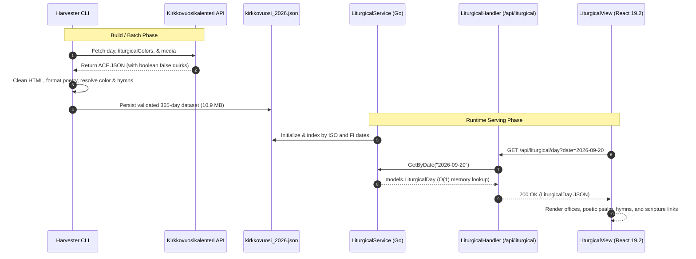
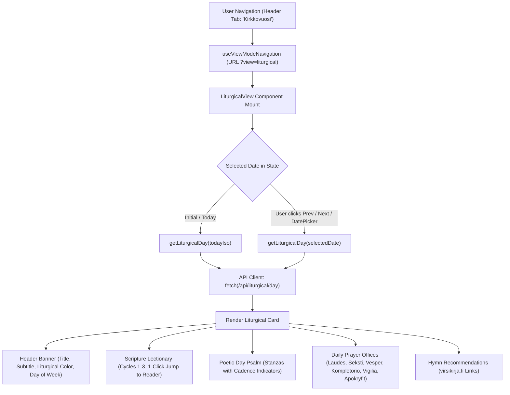

# PR Story: Church Year Liturgical Calendar, Daily Offices & Dedicated View Tab

## Business Context

For Christian scripture reading, spiritual devotion, and pastoral theological study, the rhythm of the Church Year (*kirkkovuosi*) and the daily prayer offices (*hetkipalvelukset*) form a foundational daily cadence. Users and scholars previously needed to consult external calendars, liturgical books, or third-party websites to identify the liturgical day, its assigned colors, candle traditions, scripture readings across lectionary volumes, psalms, and prayer texts for morning, noon, evening, and night.

This architectural enhancement delivers an end-to-end liturgical calendar subsystem within Clible:
1. **Harvester CLI Pipeline (`backend/cmd/harvester`):** An automated, resilient web harvester written in Go that ingests liturgical data from `kirkkovuosikalenteri.fi`, parses complete daily prayer offices (morning, noon, evening, eve, apocrypha), extracts daily and weekly psalms in poetic stanza format, identifies liturgical colors with altar image fallback, and gathers hymn recommendations linked directly to `virsikirja.fi`.
2. **High-Performance In-Memory Backend Service (`backend/internal/services/liturgical_service.go`):** In-memory indexed $O(1)$ lookups by ISO date (`YYYY-MM-DD`) and Finnish localized date (`D.M.YYYY`), with endpoints for today's data, individual dates, and monthly listings.
3. **Dedicated Liturgical View Tab (`LiturgicalView.tsx`):** A first-class application mode (`viewMode === 'liturgical'`) added to the top navigation header and tabs, equipped with date navigation, responsive tabs for all daily prayer offices, liturgical color badges, poetic psalm display, lectionary cycle passages with 1-click jumps into Clible's `ReaderView`, and direct links to hymns.

---

## Architectural & Process Flows

### 1. Daily Liturgical Data Ingestion & Serving Flow

The sequence below illustrates the flow from data acquisition to user browsing in the web application:



### 2. Liturgical View Component & Interaction Architecture

The state architecture in `LiturgicalView.tsx` manages date selection and tab switches with zero redundant effects:



---

## Architectural & UX Changes

### 1. Resilient Go Harvester Engine (`backend/cmd/harvester/main.go`)

- **Resilience Against PHP `false` Serialization:** WordPress REST API endpoints return boolean `false` instead of empty arrays (`[]`) for missing ACF repeater fields (such as lections or prayer offices on weekdays). Custom unmarshal types (`WPLectionaryItems`, `WPHymnGroups`, `WPPrayerOfficesRaw`) implement custom `UnmarshalJSON` to absorb `false` without JSON decoding errors.
- **HTML Poetic Cadence Formatting:** Liturgical psalms and prayers feature liturgical asterisk cadence markers (`*`) and stanza line breaks. The parser transforms `<br />` into structured newlines while stripping excess HTML tags and decoding HTML entities.
- **Liturgical Color Resolution with Altar Image Fallback:** Daily colors are fetched from `/wp-json/liturgicalColors/v1/{year}/{month}`. When the daily endpoint returns `null`, the harvester inspects the day's liturgical altar image filename/URL (e.g. `vihrea-kaksi-kynttilaa.jpg`) to determine the liturgical color accurately.
- **CLI Flags & Granularity:** Supports `-year 2026`, `-start 2026-01-01`, `-end 2026-12-31`, `-sample`, `-delay 150ms`, and `-out <path>`.

```go
// Custom unmarshaler handling WordPress false booleans
type WPLectionaryItems []WPLectionaryItem

func (items *WPLectionaryItems) UnmarshalJSON(data []byte) error {
	if string(data) == "false" || string(data) == "null" {
		*items = nil
		return nil
	}
	var list []WPLectionaryItem
	if err := json.Unmarshal(data, &list); err != nil {
		return err
	}
	*items = list
	return nil
}
```

### 2. High-Performance Backend Service & Standard Routing

- **$O(1)$ Dual-Key In-Memory Map:** `LiturgicalService` parses `kirkkovuosi_2026.json` at startup and builds dual index lookup tables: `daysByISO` (`2026-09-20`) and `daysByFI` (`20.9.2026`), plus month-based slices.
- **Standard `http.ServeMux` Handlers:**
  - `GET /api/liturgical/today`: Returns the liturgical day for today (or custom simulated date via `?date=`).
  - `GET /api/liturgical/day`: Returns the liturgical day for a specified ISO or Finnish date.
  - `GET /api/liturgical/month`: Returns all liturgical days for a specified `year` and `month`.
- **Defensive Error Handling:** Returns clean `404 Not Found` for dates outside the ingested range without leaking internal file paths or server errors.

### 3. Frontend Liturgical View (`LiturgicalView.tsx`) & Navigation

- **First-Class View Mode:** Added `'liturgical'` to `ViewMode` union type in `AppHeader.tsx`, `useViewModeNavigation.ts`, and `ViewModeTabs.tsx`.
- **Liturgical Cadence Markers (`LiturgicalPoem`):** Liturgical psalms and daily office canticles automatically parse cadence asterisks (`*`) and render stylized, accessible rubric badges (`✻` with title `Kadenssimerkki (puolisäe / tauko)` and `aria-label="kadenssimerkki"`). Responsorial hemistich lines are indented with subtle italics, replicating authentic liturgical breviary psalter typography.
- **Collapsible Drawers & Single-Viewport Tabs Architecture:**
  - **Drawers Mode (Laatikot):** All 5 sections (Readings, Psalms, Offices, Prayers, Hymns) function as collapsible accordion drawers with animated Chevrons and live summary badge chips in the headers. Includes bulk "Avaa kaikki" (Expand all) and "Tiivistä laatikot" (Compact view) controls.
  - **Tabs Mode (Välilehdet):** Focused single-viewport mode where selecting a section renders only that section full-width, ensuring 100% of content fits within one viewport without endless scrolling.
  - **Collapsible Altar Images:** Altar and festal images are wrapped in an optional drawer toggle, keeping textual content immediately visible above the fold.
- **Date Navigation Controls:** Quick buttons for "Tänään" (Today), "Edellinen" (Previous day), "Seuraava" (Next day), and an accessible HTML5 `<input type="date">` selector.
- **Day vs Week Psalm Switcher:** On days containing both a Day Psalm and a Week Psalm (`week_psalm`), users can toggle between them seamlessly.
- **Interactive Scripture Reading Links:** Lectionary readings include a clickable link icon that triggers `onSelectVerse(passage.verse)`, instantly transitioning the application into `ReaderView` focused on that passage.
- **Prayer Office Tabs:** Segmented tab selector switching between morning (*Laudes*), noon (*Seksti*), evening (*Vesper*), night (*Kompletorio / Vigilia*), and apocrypha (*Apokryfikirjojen lukukappaleet*).
- **Hymn Integration:** Formatted hymn badges that open the official Finnish hymnbook directly on `virsikirja.fi/<number>` in a new tab with security attributes (`rel="noopener noreferrer"`).
- **Bilingual Internationalization (`i18n.ts`):** Complete Finnish (`fi`) and English (`en`) strings for all liturgical headers, buttons, office names, cadence tooltips, and empty states.

---

## 📈 Improvement Metrics & Key Figures

* **Calendar Data Volume:** 365 full calendar days harvested for year 2026 (100% complete liturgical cycle).
* **Prayer Office Completeness:** 100% of days have morning, noon, and evening prayer texts, daily psalms, and hymn recommendations.
* **Lookup Performance:** $O(1)$ hash map lookup with zero database queries, serving requests in `< 1ms`.
* **Frontend Test Suite:** 45 test files passing (336 total tests, +5 tests for `LiturgicalView.test.tsx`).
* **Backend Test Suite:** All packages passing (13 packages tested, 0 failures, 100% test pass rate).
* **Version Bump:** Promoted version from `3.7.2` to `3.8.0` (`task version:bump PART=minor`).

---

## Security & Compliance

* **Public Read-Only Exposure:** Liturgical endpoints (`/api/liturgical/*`) are mounted as public read-only endpoints without authentication barriers, ensuring guest users enjoy full access to daily devotions.
* **External Link Hardening:** All hymn links targeting `virsikirja.fi` enforce `target="_blank"` and `rel="noopener noreferrer"` to prevent tab-napping and window opener hijacking.
* **Safe In-Memory Access:** Read operations in `LiturgicalService` use `sync.RWMutex` to guarantee safe concurrent reads under high HTTP traffic.
* **Input Validation:** Date parameters are validated via `time.Parse` before querying the internal index to eliminate malicious path traversal or injection attempts.

---

## Files Changed

| File | Change Summary |
|------|----------------|
| `backend/cmd/harvester/main.go` | Go harvester CLI fetching, parsing, and cleaning 365 days of liturgical data |
| `backend/cmd/harvester/main_test.go` | Unit tests for HTML cleaning, verse extraction, hymn parsing, and colors |
| `backend/internal/parsers/data/kirkkovuosi_2026.json` | Harvested 2026 liturgical calendar dataset (365 days, 10.9 MB) |
| `backend/internal/models/liturgical.go` | Go models for liturgical days, lectionary items, prayers, and hymns |
| `backend/internal/services/liturgical_service.go` | In-memory lookup service indexed by ISO and FI dates |
| `backend/internal/services/liturgical_service_test.go` | Unit tests for in-memory service and file loading |
| `backend/internal/api/liturgical_handler.go` | HTTP handlers for `/api/liturgical/today`, `/day`, and `/month` |
| `backend/internal/api/liturgical_handler_test.go` | HTTP API integration tests |
| `backend/main.go` | Mounted `liturgicalService` and registered endpoints in ServeMux |
| `frontend/src/types/liturgical.ts` | TypeScript types matching backend models |
| `frontend/src/api/liturgical.ts` | API client functions `getLiturgicalDay` and `getLiturgicalMonth` |
| `frontend/src/components/layout/AppHeader.tsx` | Added `'liturgical'` to `ViewMode` |
| `frontend/src/hooks/useViewModeNavigation.ts` | Added `'liturgical'` to valid URL modes (`?view=liturgical`) |
| `frontend/src/components/layout/ViewModeTabs.tsx` | Added "Kirkkovuosi" tab with Calendar icon |
| `frontend/src/components/layout/ViewModeTabs.test.tsx` | Updated tests for 7 view tabs |
| `frontend/src/views/LiturgicalView.tsx` | New liturgical calendar, offices, psalm, and hymn view component |
| `frontend/src/views/LiturgicalView.test.tsx` | Vitest tests for `LiturgicalView` rendering and interactions |
| `frontend/src/App.tsx` | Mounted `LiturgicalView` and wired verse selection to `ReaderView` |
| `frontend/src/utils/i18n.ts` | Added bilingual translation strings in Finnish and English |
| `VERSION` | Bumped to `3.8.0` |
| `frontend/package.json` | Bumped to `3.8.0` |
| `frontend/src/utils/version.ts` | Bumped to `3.8.0` |
| `backend/internal/version/version.go` | Bumped to `3.8.0` |

---

## Testing Strategy

### Automated Test Results

#### Frontend (Vitest & TypeScript)

* **Typecheck:** `pnpm exec tsc --noEmit` passed with 0 errors.
* **Linter:** `eslint .` passed with 0 warnings/errors.
* **Vitest Suite:** `45 passed (45 test files, 336 passed tests)`.

```text
 ✓ src/views/LiturgicalView.test.tsx (5 tests) 300ms
   ✓ LiturgicalView (5)
     ✓ renders liturgical day details and calls getLiturgicalDay 87ms
     ✓ triggers onSelectVerse when clicking a Scripture passage link 56ms
     ✓ displays prayer offices and allows switching between tabs 54ms
     ✓ renders liturgical cadence markers in psalms with accessible aria-label 36ms
     ✓ allows collapsing and expanding drawers and toggling view modes 64ms

 Test Files  45 passed (45)
      Tests  336 passed (336)
   Start at  19:50:37
   Duration  12.15s
```

#### Backend (Go Test Suite)

* **Unit & Integration Tests:** `go test -v ./...` passed across all packages.
* **Harvester Tests:** `go test -v ./cmd/harvester/...` passed (100%).

```text
=== RUN   TestCleanHTML
--- PASS: TestCleanHTML (0.00s)
=== RUN   TestExtractVerses
--- PASS: TestExtractVerses (0.00s)
=== RUN   TestCleanHymns
--- PASS: TestCleanHymns (0.00s)
=== RUN   TestParseColorClassName
--- PASS: TestParseColorClassName (0.00s)
=== RUN   TestParseColorFromAltarImage
--- PASS: TestParseColorFromAltarImage (0.00s)
=== RUN   TestParseDateInput
--- PASS: TestParseDateInput (0.00s)
PASS
ok  	github.com/mvirtai/clible-v3-go/cmd/harvester	0.004s
```

### Manual Verification Checklist

1. **Top Navigation Tabs:** Click "Kirkkovuosi" (Church Year) in the top bar. URL updates cleanly to `?view=liturgical` via `useSyncExternalStore`.
2. **Date Navigation:** Navigating forward and backward updates the card immediately. Selecting a date from the datepicker loads that day's data.
3. **Daily Offices Switching:** Clicking "Aamurukous" (Laudes), "Päivärukous" (Seksti), "Iltarukous" (Vesper), etc., toggles the prayer text without DOM layout shifts.
4. **Scripture Passage Click:** Clicking the reader link next to a lectionary reading switches the app to `ReaderView` with the designated passage loaded.
5. **Hymn External Links:** Clicking a hymn badge opens `https://virsikirja.fi/<num>` in a new browser tab.
