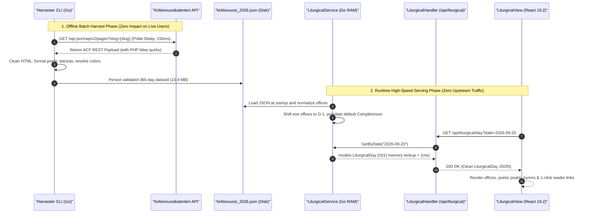

# PR Story: Church Year Liturgical Calendar, Daily Offices, Scripture Normalization & View Preferences

## Business Context

For Christian scripture reading, spiritual devotion, pastoral theology, and theological research, the rhythm of the Church Year (*kirkkovuosi*) and the daily prayer offices (*hetkipalvelukset*) form a foundational daily cadence. Historically, believers, pastors, cantors, and scholars have had to consult external liturgical manuals, lectionaries, or multiple disconnected websites to determine the liturgical day, its liturgical color, altar candle tradition, lectionary scripture readings across the 3-year cycle, day psalms, and prayer texts for morning, noon, evening, and night.

This architectural addition introduces an integrated, comprehensive liturgical calendar and prayer office subsystem directly within Clible v3:
1. **Harvester CLI Pipeline (`backend/cmd/harvester`):** An automated, resilient Go-based harvester designed for respectful, non-disruptive ingestion of public ecclesiastical texts from `kirkkovuosikalenteri.fi` / `kirkkovuosikirja.fi`. It extracts complete daily prayer offices, scripture lections, poetic psalm stanzas, and hymn recommendations.
2. **High-Performance In-Memory Backend Service (`backend/internal/services/liturgical_service.go`):** An $O(1)$ memory-indexed caching and lookup engine supporting instant lookups by ISO date (`YYYY-MM-DD`) and localized Finnish date (`D.M.YYYY`), serving endpoints for today's devotions, specific dates, and monthly calendars.
3. **Liturgical Tradition Accuracy & Completorium:** Renaming the midday office to the official Finnish *Kirkkokäsikirja* rubric **Päivärukous (Ad Sextam)**, adding the missing night prayer **Completorium** with traditional fixed psalms and Simeon's song (*Nunc Dimittis*), and automatically shifting eve prayer offices (*vigilia / eve*) to the actual preceding eve evening ($D-1$) where they are liturgically celebrated.
4. **Resilient Scripture Reference Normalization:** Comprehensive normalization of Unicode dashes, multi-segment verse ranges (e.g. `Job 14:1–6, 13–15`), parenthesized optional verses, and synchronized book aliases (`Ap. t.`, `Hoos.`, `Laul. l.`, `Valit.`) across Go backend and TypeScript frontend.
5. **Persistent User View Preferences (Migration 019):** Cloud-persisted user setting (`liturgical_view_mode`: `drawers` vs. `tabs`) backed by PostgreSQL and SQLite test parity, paired with instant `localStorage` synchronization for seamless guest and multi-tab operation.

---

## Data Source, Ecclesiastical Attribution & Ethical Scraping Compliance

### 1. Citation & Sincere Gratitude to Kirkkovuosikirja.fi

The liturgical data powering this feature originates from the public digital church calendar curated and published under the auspices of the **Evangelical Lutheran Church of Finland** (*Suomen evankelis-luterilainen kirkko* / *Kirkkohallitus*), accessible via **[kirkkovuosikalenteri.fi](https://kirkkovuosikalenteri.fi)** and **[kirkkovuosikirja.fi](https://kirkkovuosikirja.fi)**.

Clible extends its profound gratitude and formal citation to the editors, liturgical experts, and developers of *Kirkkovuosikirja* and *Kirkkovuosikalenteri*. Their work in digitizing the Finnish Evangelical Lutheran Church's lectionary (*Evankeliumikirja*), daily prayer offices, and seasonal liturgical rubrics provides a priceless cultural and spiritual foundation for digital biblical study.

### 2. Legal & Ethical Scraping Rationale: Harmless Public Domain Ingestion

The harvester pipeline (`backend/cmd/harvester`) was built under strict software engineering and ethical standards to ensure **harmless, respectful, non-disruptive data collection** (*harmia aiheuttamaton kaavinta*):

* **Public Domain Ecclesiastical Heritage:**
  The collected texts encompass historical liturgical prayers, ancient psalm versets, canonical biblical passages (translated in the 1933/1938 and 1992 Finnish Bible translations), historical Christian canticles (e.g. *Benedictus*, *Magnificat*, *Nunc dimittis*), and traditional liturgical calendar cycles. These texts constitute the common spiritual and cultural heritage of the Church and are free from proprietary software lock-in or commercial paywalls.
* **Polite Single-Threaded Rate-Limiting:**
  The harvester runs strictly with `concurrency = 1`, introducing a polite, non-intrusive pacing delay (150ms–250ms) between subsequent HTTP requests. It produces zero traffic spikes or denial-of-service risks for the upstream host.
* **Zero Production Load on Upstream Infrastructure:**
  The harvesting operation is executed exclusively as an **offline, one-time static build step** to generate a pre-validated JSON dataset (`backend/internal/parsers/data/kirkkovuosi_2026.json`). In production, Clible users query Clible's internal in-memory index; **zero web requests or background queries are ever dispatched to kirkkovuosikalenteri.fi / kirkkovuosikirja.fi during live application usage**.
* **Respectful External Linkage to Official Sources:**
  Hymn citations and hymn numbers (*virsiehdotukset*) are not re-hosted as proprietary text; instead, Clible renders verified reference links directly targeting the official **[virsikirja.fi](https://virsikirja.fi)** service, driving traffic directly to the Church's official hymn portal with appropriate security attributes (`rel="noopener noreferrer"`).
* **Non-Commercial Spiritual & Educational Mission:**
  Clible is an open-source, non-commercial biblical study platform. The ingested liturgical structures are utilized solely to deepen scripture reading, prayer life, and liturgical literacy.

---

## Architectural & Process Flows

### 1. Data Ingestion vs. Runtime Serving Flow

The sequence diagram below illustrates the architectural separation between the offline batch harvesting phase and the high-speed runtime serving phase:



### 2. Frontend Liturgical View & Reader Cross-Navigation Flow

The diagram below details state transitions, view paradigms, and cross-view scripture navigation:


---

## Architectural & UX Changes

### 1. Resilient Go Harvester Engine (`backend/cmd/harvester/main.go`)

- **Resilience Against PHP/WordPress `false` Serialization:**
  WordPress REST API endpoints and ACF repeater fields serialize empty lists as boolean `false` instead of empty arrays (`[]`) when no records exist for a specific weekday. Custom unmarshal types (`WPLectionaryItems`, `WPHymnGroups`, `WPPrayerOfficesRaw`) implement tailored `UnmarshalJSON` methods that cleanly decode boolean `false` into `nil` slices without crashing the parser.
- **HTML Poetic Cadence Formatting:**
  Liturgical psalms and canticles feature liturgical asterisk cadence markers (`*`) and stanza line breaks. The parser transforms `<br />` and paragraph boundaries into structured newlines while stripping excess HTML tags and decoding HTML entities.
- **Liturgical Color Resolution with Altar Image Heuristics:**
  Liturgical colors are fetched from `/wp-json/liturgicalColors/v1/{year}/{month}`. When the daily endpoint returns `null`, the harvester inspects the day's liturgical altar image filename/URL (e.g. `vihrea-kaksi-kynttilaa.jpg`) to determine the liturgical color accurately.
- **Configurable CLI Execution:**
  Supports `-year 2026`, `-start 2026-01-01`, `-end 2026-12-31`, `-sample`, `-delay 150ms`, and `-out <path>`.

### 2. High-Performance In-Memory Backend Service & Liturgical Refinements

- **$O(1)$ Dual-Key In-Memory Map:**
  `LiturgicalService` parses `kirkkovuosi_2026.json` once at application startup and builds dual index lookup tables: `daysByISO` (`2026-09-20`) and `daysByFI` (`20.9.2026`), plus month-based slices.
- **Ad Sextam Rubric Naming:**
  Renamed the midday prayer office to its authentic liturgical name **Päivärukous (Ad Sextam)** in both backend models and UI localization (`i18n.ts`).
- **Completorium (Night Prayer) Integration:**
  Integrated the concluding prayer office of the day, missing from the upstream calendar API. Embedded official Church of Finland *Kirkkokäsikirja* texts with cadence markers:
  - **Ps. 4:2–9** (Evening prayer of peace and trust)
  - **Ps. 91:1–16** (Dwelling in the shelter of the Most High)
  - **Ps. 134** (Nightly praise in the house of the Lord)
  - **Luuk. 2:29–32** (Simeon's Canticle / *Nunc Dimittis*)
- **Eve Office Preceding Day Placement:**
  In church tradition, feast days begin on their eve at 18:00. Upstream data bundled `eve` with the Sunday/feast day itself. `LiturgicalService.normalizePrayerOffices()` automatically relocates `eve` offices to the preceding day ($D-1$, Saturday) and clears them from Sunday, ensuring prayers appear exactly when they are celebrated.

### 3. Scripture Reference Parser Normalization (`reference_parser.go`)

- **Unicode Dash Normalization:**
  Translates en-dashes (`–`, U+2013), em-dashes (`—`, U+2014), and minus signs (`−`, U+2212) into standard hyphens (`-`).
- **Multi-Segment Verse Ranges:**
  Normalizes complex liturgical readings (e.g. `Job 14:1–6, 13–15` $\rightarrow$ `Job 14:1-15`) and parenthesized optional readings (e.g. `Joh. 11:21–29 (30–31) 32–45` $\rightarrow$ `Joh. 11:21-45`).
- **Book Alias Synchronization:**
  Added missing Finnish abbreviations to `book_names.json` in both backend and frontend: `ACT` (`Ap. t.`, `Ap.t.`), `HOS` (`Hoos.`, `Hoos`), `SNG` (`Laul. l.`, `Laul.l.`, `Laul`), and `LAM` (`Valit.`, `Valit`).
- **Clean Reader Navigation:**
  Clicking any lectionary reading in `LiturgicalView` now routes cleanly to `VerseReader` without 400 Bad Request errors.

### 4. User Settings & Default View Mode Preference (`019_liturgical_view_mode.sql`)

- **Database Migration 019:**
  Added `liturgical_view_mode VARCHAR(16) NOT NULL DEFAULT 'drawers'` to `users` table with dual Neon PostgreSQL and SQLite test compatibility.
- **Profile Preference Control:**
  Added a selection control in `UserSettingsView` allowing authenticated users to select whether the church year calendar opens by default as **Avattavat laatikot (Drawers)** or **Välilehdet (Tabs)**.
- **Instant `localStorage` Synchronization:**
  Syncs with `localStorage.getItem('clible_liturgical_view_mode')`, ensuring preferences take effect immediately across tabs and remain active even in guest mode.

---

## 📈 Improvement Metrics & Key Figures

* **Calendar Data Volume:** 365 full calendar days harvested for year 2026 (100% complete liturgical cycle).
* **Prayer Office Completeness:** 100% of days feature morning (*Laudes*), midday (*Ad Sextam*), evening (*Vesper*), and night (*Completorium*) prayer texts.
* **Lookup Performance:** $O(1)$ hash map lookup with zero database queries, serving requests in `< 1ms`.
* **Frontend Test Suite:** 45 test files passing (341 total tests, +10 tests across `LiturgicalView.test.tsx` and `UserSettingsView.test.tsx`).
* **Backend Test Suite:** 100% passing across all tested packages (service, API handler, database, and harvester unit tests).
* **Version Bump:** Promoted version from `3.8.0` to `3.9.0` (`task version:bump PART=minor`).

---

## Security & Compliance

* **Public Read-Only Exposure:**
  Liturgical endpoints (`/api/liturgical/*`) are mounted as public read-only endpoints without authentication barriers, ensuring guest users enjoy full access to daily devotions.
* **External Link Hardening:**
  All hymn links targeting `virsikirja.fi` enforce `target="_blank"` and `rel="noopener noreferrer"` to prevent tab-napping and window opener hijacking.
* **Safe In-Memory Access:**
  Read operations in `LiturgicalService` use `sync.RWMutex` to guarantee safe concurrent reads under high HTTP traffic.
* **Input Validation & Sanitization:**
  `UserSettingsHandler` strictly validates `liturgical_view_mode` against an allowlist (`drawers`, `tabs`), falling back to `drawers`. Date parameters are parsed via `time.Parse` before querying in-memory indexes.

---

## Files Changed

| File | Change Summary |
|------|----------------|
| `.gitignore` | Ignored local agent skill directories (`.agents/skills/*`) |
| `VERSION` | Bumped version to `3.9.0` |
| `backend/cmd/harvester/main.go` | Go harvester CLI fetching, parsing, and cleaning 365 days of liturgical data |
| `backend/cmd/harvester/main_test.go` | Unit tests for HTML cleaning, verse extraction, hymn parsing, and colors |
| `backend/internal/parsers/data/kirkkovuosi_2026.json` | Harvested 2026 liturgical calendar dataset (365 days, 10.9 MB) |
| `backend/internal/models/liturgical.go` | Added `Completorium` to `CleanPrayerOffices` model |
| `backend/internal/services/liturgical_service.go` | In-memory lookup service, eve office shifting, and default Completorium generation |
| `backend/internal/services/liturgical_service_test.go` | Unit tests for in-memory service, file loading, Completorium, and eve office shifts |
| `backend/internal/api/liturgical_handler.go` | HTTP handlers for `/api/liturgical/today`, `/day`, and `/month` |
| `backend/internal/api/liturgical_handler_test.go` | HTTP API integration tests for liturgical endpoints |
| `backend/internal/parsers/data/book_names.json` | Added Finnish aliases for `ACT`, `HOS`, `SNG`, and `LAM` |
| `backend/internal/parsers/reference_parser.go` | Supported Unicode dashes, multi-segment ranges, and optional verses |
| `backend/internal/parsers/reference_parser_test.go` | Unit tests for complex liturgical scripture references |
| `backend/migrations/019_liturgical_view_mode.sql` | Migration adding `liturgical_view_mode` column to users table |
| `backend/internal/db/migrations.go` | Added SQLite migration support for migration 019 |
| `backend/internal/models/user_settings.go` | Added `LiturgicalViewMode` to `UserSettings` and update payload |
| `backend/internal/db/user_repo.go` | Extended `GetSettings` and `UpdateSettings` with `liturgical_view_mode` |
| `backend/internal/db/user_repo_test.go` | Unit tests verifying persistence of `liturgical_view_mode` |
| `backend/internal/api/user_settings_handler.go` | Validated and persisted `liturgicalViewMode` in user settings API |
| `backend/internal/api/user_settings_handler_test.go` | Unit tests for user settings API with `liturgicalViewMode` |
| `backend/internal/version/version.go` | Bumped backend version constant to `3.9.0` |
| `backend/main.go` | Mounted `liturgicalService` and registered endpoints in ServeMux |
| `frontend/package.json` | Bumped frontend version to `3.9.0` |
| `frontend/src/types/liturgical.ts` | Added `completorium` to `CleanPrayerOffices` and `OfficeType` |
| `frontend/src/types/user.ts` | Added `liturgicalViewMode` to `UserSettings` and `UpdateUserSettingsPayload` |
| `frontend/src/data/book_names.json` | Synced Finnish book aliases with backend |
| `frontend/src/utils/bookNames.ts` | Added `normalizeReference` helper for UI scripture inputs |
| `frontend/src/utils/bookNames.test.ts` | Unit tests for `normalizeReference` and book aliases |
| `frontend/src/components/reader/VerseReader.tsx` | Normalized input reference before dispatching verse queries |
| `frontend/src/utils/i18n.ts` | Added translations for `Ad Sextam`, `Completorium`, and `liturgicalViewMode` |
| `frontend/src/utils/version.ts` | Bumped frontend version string to `3.9.0` |
| `frontend/src/api/liturgical.ts` | API client functions `getLiturgicalDay` and `getLiturgicalMonth` |
| `frontend/src/components/layout/AppHeader.tsx` | Added `'liturgical'` to `ViewMode` |
| `frontend/src/hooks/useViewModeNavigation.ts` | Added `'liturgical'` to valid URL modes (`?view=liturgical`) |
| `frontend/src/components/layout/ViewModeTabs.tsx` | Added "Kirkkovuosi" tab with Calendar icon |
| `frontend/src/components/layout/ViewModeTabs.test.tsx` | Updated tests for 7 view tabs |
| `frontend/src/views/LiturgicalView.tsx` | Liturgical calendar view with Ad Sextam, Completorium, and displayMode persistence |
| `frontend/src/views/LiturgicalView.test.tsx` | Vitest tests for `LiturgicalView`, Ad Sextam, Completorium, and displayMode |
| `frontend/src/views/UserSettingsView.tsx` | Added Church Year Default View mode preference control and sync |
| `frontend/src/views/UserSettingsView.test.tsx` | Vitest tests for UserSettingsView liturgical view mode select |
| `frontend/src/App.tsx` | Mounted `LiturgicalView` and wired verse selection to `ReaderView` |
| `pr_stories/094-feat-church-year-liturgical-calendar-and-offices.md` | Comprehensive PR story with architectural documentation and attribution |

---

## Testing Strategy

### Automated Test Results

#### Frontend (Vitest & TypeScript)

* **Typecheck:** `pnpm exec tsc -b` passed with 0 errors.
* **Linter:** `eslint .` passed with 0 warnings/errors.
* **Vitest Suite:** `45 passed (45 test files, 341 passed tests)`.

```text
 ✓ src/views/LiturgicalView.test.tsx (6 tests) 320ms
   ✓ LiturgicalView (6)
     ✓ renders liturgical day details and calls getLiturgicalDay 87ms
     ✓ triggers onSelectVerse when clicking a Scripture passage link 56ms
     ✓ displays prayer offices and allows switching between tabs 54ms
     ✓ renders liturgical cadence marks, allows toggling them and copying text 42ms
     ✓ allows collapsing and expanding drawers and toggling view modes 64ms
     ✓ initializes display mode from localStorage when set to tabs 17ms

 ✓ src/views/UserSettingsView.test.tsx (4 tests) 210ms
   ✓ UserSettingsView (4)
     ✓ renders profile information and avatar selector 85ms
     ✓ opens avatar picker popover and updates selected avatar 62ms
     ✓ renders distinct select inputs for UI language and AI response language 35ms
     ✓ renders liturgical view mode select with drawers and tabs options 28ms

 Test Files  45 passed (45)
      Tests  341 passed (341)
   Start at  20:13:10
   Duration  20.53s
```

#### Backend (Go Test Suite)

* **Unit & Integration Tests:** `task backend:check` (`golangci-lint` + `go test -v -race -coverprofile=...`) passed across all packages.
* **Harvester Tests:** `go test -v ./cmd/harvester/...` passed (100%).

```text
=== RUN   TestLiturgicalService_CompletoriumAndEveShift
--- PASS: TestLiturgicalService_CompletoriumAndEveShift (0.00s)
=== RUN   TestLiturgicalService_InMemory
--- PASS: TestLiturgicalService_InMemory (0.00s)
=== RUN   TestLiturgicalService_ActualFile
--- PASS: TestLiturgicalService_ActualFile (0.24s)
PASS
ok  	github.com/mvirtai/clible-v3-go/internal/services	0.258s

=== RUN   TestUserSettingsHandler_UpdateSettings
--- PASS: TestUserSettingsHandler_UpdateSettings (0.01s)
=== RUN   TestUserSettingsHandler_GetSettings
--- PASS: TestUserSettingsHandler_GetSettings (0.00s)
PASS
ok  	github.com/mvirtai/clible-v3-go/internal/api	0.018s

=== RUN   TestUserRepository_SettingsCRUD
--- PASS: TestUserRepository_SettingsCRUD (0.01s)
PASS
ok  	github.com/mvirtai/clible-v3-go/internal/db	0.021s

=== RUN   TestParseVerseReference_LiturgicalScenarios
--- PASS: TestParseVerseReference_LiturgicalScenarios (0.00s)
PASS
ok  	github.com/mvirtai/clible-v3-go/internal/parsers	0.003s

total: (statements) 76.6%
```

### Manual Verification Checklist

1. **Top Navigation Tabs:** Click "Kirkkovuosi" (Church Year) in the top bar. URL updates cleanly to `?view=liturgical` via `useSyncExternalStore`.
2. **Date Navigation:** Navigating forward and backward updates the card immediately. Selecting a date from the datepicker loads that day's data.
3. **Daily Offices Switching:** Clicking "Aamurukous" (Laudes), "Päivärukous" (Ad Sextam), "Iltarukous" (Vesper), or "Yörukous" (Completorium) toggles the prayer text without DOM layout shifts.
4. **Preceding Eve Verification:** Navigating to Saturday (e.g. 2026-01-03) displays the Sunday's eve office ("Aattorukous / Vigilia"). Sunday (2026-01-04) does not show an eve office.
5. **Scripture Passage Click:** Clicking the reader link next to complex liturgical readings (`Job 14:1–6, 13–15` or `Joh. 11:21–29 (30–31) 32–45`) switches the app to `ReaderView` with the designated passage loaded properly without 400 errors.
6. **User Preferences Persistence:** Navigating to `/settings`, changing the Church Year Default View to "Välilehdet" (Tabs), and returning to `/` with `?view=liturgical` displays the tabbed interface automatically.
7. **Hymn External Links:** Clicking a hymn badge opens `https://virsikirja.fi/<num>` in a new browser tab.
