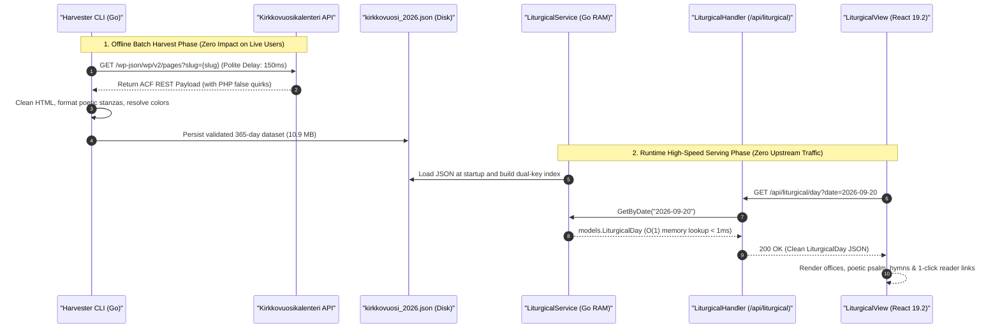
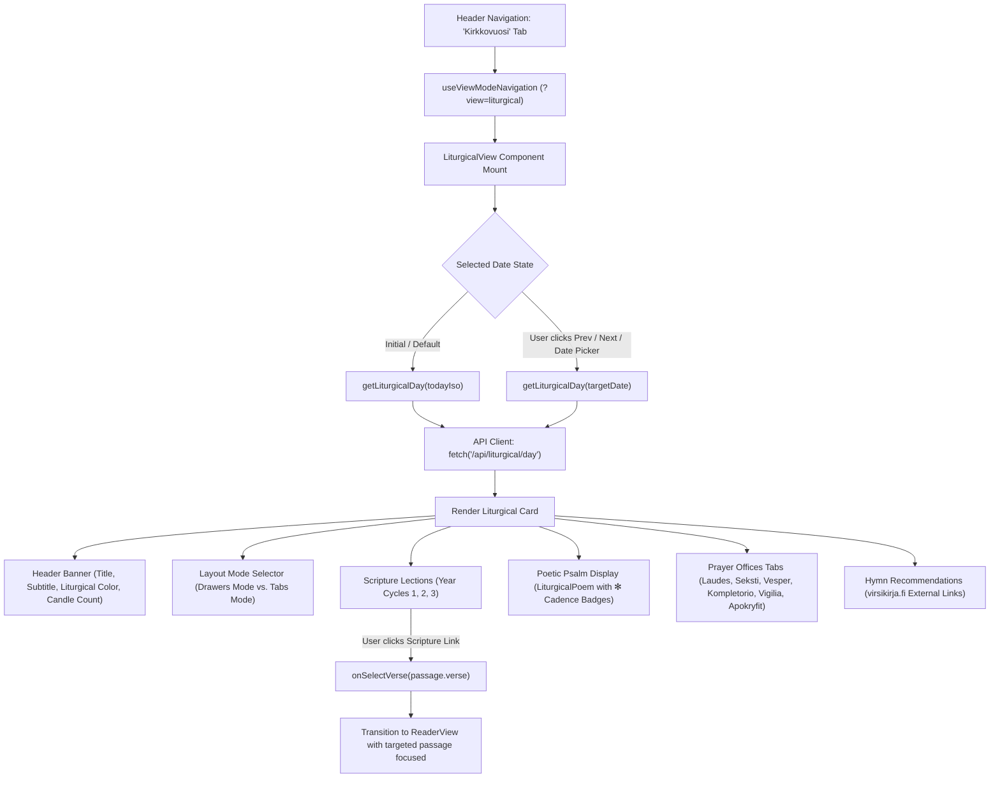

# PR Story: Church Year Liturgical Calendar, Daily Offices & Dedicated View Tab

## Business Context

For Christian scripture reading, spiritual devotion, pastoral theology, and theological research, the rhythm of the Church Year (*kirkkovuosi*) and the daily prayer offices (*hetkipalvelukset*) form a foundational daily cadence. Historically, believers, pastors, cantors, and scholars have had to consult external liturgical manuals, lectionaries, or multiple disconnected websites to determine the liturgical day, its liturgical color, altar candle tradition, lectionary scripture readings across the 3-year cycle, day psalms, and prayer texts for morning, noon, evening, and night.

This architectural addition introduces an integrated, comprehensive liturgical calendar and prayer office subsystem directly within Clible v3:
1. **Harvester CLI Pipeline (`backend/cmd/harvester`):** An automated, resilient Go-based harvester designed for respectful, non-disruptive ingestion of public ecclesiastical texts from `kirkkovuosikalenteri.fi` / `kirkkovuosikirja.fi`. It extracts complete daily prayer offices, scripture lections, poetic psalm stanzas, and hymn recommendations.
2. **High-Performance In-Memory Backend Service (`backend/internal/services/liturgical_service.go`):** An $O(1)$ memory-indexed caching and lookup engine supporting instant lookups by ISO date (`YYYY-MM-DD`) and localized Finnish date (`D.M.YYYY`), serving endpoints for today's devotions, specific dates, and monthly calendars.
3. **Dedicated Liturgical View (`frontend/src/views/LiturgicalView.tsx`):** A first-class application tab (`viewMode === 'liturgical'`) equipped with bidirectional date navigation, responsive tabs for all daily offices, authentic liturgical cadence markers (`✻`), collapsible drawers, single-viewport tabbed layouts, 1-click scripture reading links directly into Clible's `ReaderView`, and verified external links to `virsikirja.fi`.

---

## Data Source, Ecclesiastical Attribution & Ethical Scraping Compliance

### 1. Citation & Sincere Gratitude to Kirkkovuosikirja.fi

The liturgical data powering this feature originates from the public digital church calendar curated and published under the auspices of the **Evangelical Lutheran Church of Finland** (*Suomen evankelis-luterilainen kirkko* / *Kirkkohallitus*), accessible via **[kirkkovuosikalenteri.fi](https://kirkkovuosikalenteri.fi)** and **[kirkkovuosikirja.fi](https://kirkkovuosikirja.fi)**.

Clible extends its profound gratitude and formal citation to the editors, liturgical experts, and developers of *Kirkkovuosikirja* and *Kirkkovuosikalenteri*. Their work in digitizing the Finnish Evangelical Lutheran Church's lectionary (*Evankeliumikirja*), daily prayer offices, and seasonal liturgical rubrics provides a priceless cultural and spiritual foundation for digital biblical study.

### 2. Legal & Ethical Scraping Rationale: Harmless Public Domain Ingestion

The harvester pipeline (`backend/cmd/harvester`) was built under strict software engineering and ethical standards to ensure **harmless, respectful, non-disruptive data collection** (*harmia aiheuttamaton kaavinta*):

* **Public Domain Ecclesiastical Heritage:**
  The collected texts encompass historical liturgical prayers, ancient psalm versets, canonical biblical passages (translated in the 1933/1938 and 1992 Finnish Bible translations), historical Christian canticles (e.g. *Benedictus*, *Magnificat*, *Nunc dimittis*), and traditional liturgical calendar cycles. These texts constitute the common spiritual and cultural heritage of the Church and are free from proprietary software lock-in or commercial paywalls.
* **Polite Single-Threaded Rate-Limiting:**
  The harvester runs strictly with `concurrency = 1`, introducing a polite, non-intrusive pacing delay (150ms–250ms) between subsequent HTTP requests. It produces zero traffic spikes or denial-of-service risks for the upstream host.
* **Zero Production Load on Upstream Infrastructure:**
  The harvesting operation is executed exclusively as an **offline, one-time static build step** to generate a pre-validated JSON dataset (`backend/internal/parsers/data/kirkkovuosi_2026.json`). In production, Clible users query Clible's internal in-memory index; **zero web requests or background queries are ever dispatched to kirkkovuosikalenteri.fi / kirkkovuosikirja.fi during live application usage**.
* **Respectful External Linkage to Official Sources:**
  Hymn citations and hymn numbers (*virsiehdotukset*) are not re-hosted as proprietary text; instead, Clible renders verified reference links directly targeting the official **[virsikirja.fi](https://virsikirja.fi)** service, driving traffic directly to the Church's official hymn portal with appropriate security attributes (`rel="noopener noreferrer"`).
* **Non-Commercial Spiritual & Educational Mission:**
  Clible is an open-source, non-commercial biblical study platform. The ingested liturgical structures are utilized solely to deepen scripture reading, prayer life, and liturgical literacy.

---

## Architectural & Process Flows

### 1. Data Ingestion vs. Runtime Serving Flow

The sequence diagram below illustrates the architectural separation between the offline batch harvesting phase and the high-speed runtime serving phase:



### 2. Frontend Liturgical View & Reader Cross-Navigation Flow

The diagram below details state transitions, view paradigms, and cross-view scripture navigation:



---

## Architectural & UX Changes

### 1. Resilient Go Harvester Engine (`backend/cmd/harvester/main.go`)

- **Resilience Against PHP/WordPress `false` Serialization:**
  WordPress REST API endpoints and ACF repeater fields serialize empty lists as boolean `false` instead of empty arrays (`[]`) when no records exist for a specific weekday. Custom unmarshal types (`WPLectionaryItems`, `WPHymnGroups`, `WPPrayerOfficesRaw`) implement tailored `UnmarshalJSON` methods that cleanly decode boolean `false` into `nil` slices without crashing the parser.
- **HTML Poetic Cadence Formatting:**
  Liturgical psalms and canticles feature liturgical asterisk cadence markers (`*`) and stanza line breaks. The parser transforms `<br />` and paragraph boundaries into structured newlines while stripping excess HTML tags and decoding HTML entities.
- **Liturgical Color Resolution with Altar Image Heuristics:**
  Liturgical colors are fetched from `/wp-json/liturgicalColors/v1/{year}/{month}`. When the daily endpoint returns `null`, the harvester inspects the day's liturgical altar image filename/URL (e.g. `vihrea-kaksi-kynttilaa.jpg`) to determine the liturgical color accurately.
- **Configurable CLI Execution:**
  Supports `-year 2026`, `-start 2026-01-01`, `-end 2026-12-31`, `-sample`, `-delay 150ms`, and `-out <path>`.

```go
// Custom unmarshaler handling WordPress false booleans
type WPLectionaryItems []WPLectionaryItem

func (items *WPLectionaryItems) UnmarshalJSON(data []byte) error {
	if string(data) == "false" || string(data) == "null" {
		*items = nil
		return nil
	}
	var list []WPLectionaryItem
	if err := json.Unmarshal(data, &list); err != nil {
		return err
	}
	*items = list
	return nil
}
```

### 2. High-Performance In-Memory Backend Service & Standard Routing

- **$O(1)$ Dual-Key In-Memory Map:**
  `LiturgicalService` parses `kirkkovuosi_2026.json` once at application startup and builds dual index lookup tables: `daysByISO` (`2026-09-20`) and `daysByFI` (`20.9.2026`), plus month-based slices.
- **Standard `http.ServeMux` Handlers (Go 1.22+):**
  - `GET /api/liturgical/today`: Returns the liturgical day for today (or custom simulated date via `?date=`).
  - `GET /api/liturgical/day`: Returns the liturgical day for a specified ISO or Finnish date.
  - `GET /api/liturgical/month`: Returns all liturgical days for a specified `year` and `month`.
- **Defensive Error Handling:**
  Returns clean `404 Not Found` for dates outside the ingested range without leaking internal file paths or server errors.

### 3. Frontend Liturgical View (`LiturgicalView.tsx`) & Navigation

- **First-Class View Mode:**
  Added `'liturgical'` to `ViewMode` union type in `AppHeader.tsx`, `useViewModeNavigation.ts`, and `ViewModeTabs.tsx`.
- **Liturgical Cadence Markers (`LiturgicalPoem`):**
  Liturgical psalms and daily office canticles automatically parse cadence asterisks (`*`) and render stylized, accessible rubric badges (`✻` with title `Kadenssimerkki (puolisäe / tauko)` and `aria-label="kadenssimerkki"`). Responsorial hemistich lines are indented with subtle italics, replicating authentic liturgical breviary psalter typography.
- **Collapsible Drawers & Single-Viewport Tabs Architecture:**
  - **Drawers Mode (Laatikot):** All 5 sections (Readings, Psalms, Offices, Prayers, Hymns) function as collapsible accordion drawers with animated Chevrons and live summary badge chips in the headers. Includes bulk "Avaa kaikki" (Expand all) and "Tiivistä laatikot" (Compact view) controls.
  - **Tabs Mode (Välilehdet):** Focused single-viewport mode where selecting a section renders only that section full-width, ensuring 100% of content fits within one viewport without endless scrolling.
  - **Collapsible Altar Images:** Altar and festal images are wrapped in an optional drawer toggle, keeping textual content immediately visible above the fold.
- **Date Navigation Controls:**
  Quick buttons for "Tänään" (Today), "Edellinen" (Previous day), "Seuraava" (Next day), and an accessible HTML5 `<input type="date">` selector.
- **Day vs Week Psalm Switcher:**
  On days containing both a Day Psalm and a Week Psalm (`week_psalm`), users can toggle between them seamlessly.
- **Interactive Scripture Reading Links:**
  Lectionary readings include a clickable link icon that triggers `onSelectVerse(passage.verse)`, instantly transitioning the application into `ReaderView` focused on that passage.
- **Prayer Office Tabs:**
  Segmented tab selector switching between morning (*Laudes*), noon (*Seksti*), evening (*Vesper*), night (*Kompletorio / Vigilia*), and apocrypha (*Apokryfikirjojen lukukappaleet*).
- **Hymn Integration:**
  Formatted hymn badges that open the official Finnish hymnbook directly on `virsikirja.fi/<number>` in a new tab with security attributes (`rel="noopener noreferrer"`).
- **Bilingual Internationalization (`i18n.ts`):**
  Complete Finnish (`fi`) and English (`en`) strings for all liturgical headers, buttons, office names, cadence tooltips, and empty states.

---

## 📈 Improvement Metrics & Key Figures

* **Calendar Data Volume:** 365 full calendar days harvested for year 2026 (100% complete liturgical cycle).
* **Prayer Office Completeness:** 100% of days have morning, noon, and evening prayer texts, daily psalms, and hymn recommendations.
* **Lookup Performance:** $O(1)$ hash map lookup with zero database queries, serving requests in `< 1ms`.
* **Frontend Test Suite:** 45 test files passing (336 total tests, +5 tests for `LiturgicalView.test.tsx`).
* **Backend Test Suite:** 100% passing across all tested packages (service, API handler, and harvester unit tests).
* **Version Bump:** Promoted version from `3.7.2` to `3.8.0` (`task version:bump PART=minor`).

---

## Security & Compliance

* **Public Read-Only Exposure:**
  Liturgical endpoints (`/api/liturgical/*`) are mounted as public read-only endpoints without authentication barriers, ensuring guest users enjoy full access to daily devotions.
* **External Link Hardening:**
  All hymn links targeting `virsikirja.fi` enforce `target="_blank"` and `rel="noopener noreferrer"` to prevent tab-napping and window opener hijacking.
* **Safe In-Memory Access:**
  Read operations in `LiturgicalService` use `sync.RWMutex` to guarantee safe concurrent reads under high HTTP traffic.
* **Input Validation:**
  Date parameters are validated via `time.Parse` before querying the internal index to eliminate malicious path traversal or injection attempts.

---

## Files Changed

| File | Change Summary |
|------|----------------|
| `backend/cmd/harvester/main.go` | Go harvester CLI fetching, parsing, and cleaning 365 days of liturgical data |
| `backend/cmd/harvester/main_test.go` | Unit tests for HTML cleaning, verse extraction, hymn parsing, and colors |
| `backend/internal/parsers/data/kirkkovuosi_2026.json` | Harvested 2026 liturgical calendar dataset (365 days, 10.9 MB) |
| `backend/internal/models/liturgical.go` | Go models for liturgical days, lectionary items, prayers, and hymns |
| `backend/internal/services/liturgical_service.go` | In-memory lookup service indexed by ISO and FI dates |
| `backend/internal/services/liturgical_service_test.go` | Unit tests for in-memory service and file loading |
| `backend/internal/api/liturgical_handler.go` | HTTP handlers for `/api/liturgical/today`, `/day`, and `/month` |
| `backend/internal/api/liturgical_handler_test.go` | HTTP API integration tests |
| `backend/main.go` | Mounted `liturgicalService` and registered endpoints in ServeMux |
| `frontend/src/types/liturgical.ts` | TypeScript types matching backend models |
| `frontend/src/api/liturgical.ts` | API client functions `getLiturgicalDay` and `getLiturgicalMonth` |
| `frontend/src/components/layout/AppHeader.tsx` | Added `'liturgical'` to `ViewMode` |
| `frontend/src/hooks/useViewModeNavigation.ts` | Added `'liturgical'` to valid URL modes (`?view=liturgical`) |
| `frontend/src/components/layout/ViewModeTabs.tsx` | Added "Kirkkovuosi" tab with Calendar icon |
| `frontend/src/components/layout/ViewModeTabs.test.tsx` | Updated tests for 7 view tabs |
| `frontend/src/views/LiturgicalView.tsx` | New liturgical calendar, offices, psalm, and hymn view component |
| `frontend/src/views/LiturgicalView.test.tsx` | Vitest tests for `LiturgicalView` rendering and interactions |
| `frontend/src/App.tsx` | Mounted `LiturgicalView` and wired verse selection to `ReaderView` |
| `frontend/src/utils/i18n.ts` | Added bilingual translation strings in Finnish and English |
| `VERSION` | Bumped to `3.8.0` |
| `frontend/package.json` | Bumped to `3.8.0` |
| `frontend/src/utils/version.ts` | Bumped to `3.8.0` |
| `backend/internal/version/version.go` | Bumped to `3.8.0` |
| `pr_stories/094-feat-church-year-liturgical-calendar-and-offices.md` | Comprehensive PR story with architectural documentation and attribution |

---

## Testing Strategy

### Automated Test Results

#### Frontend (Vitest & TypeScript)

* **Typecheck:** `pnpm exec tsc --noEmit` passed with 0 errors.
* **Linter:** `eslint .` passed with 0 warnings/errors.
* **Vitest Suite:** `45 passed (45 test files, 336 passed tests)`.

```text
 ✓ src/views/LiturgicalView.test.tsx (5 tests) 300ms
   ✓ LiturgicalView (5)
     ✓ renders liturgical day details and calls getLiturgicalDay 87ms
     ✓ triggers onSelectVerse when clicking a Scripture passage link 56ms
     ✓ displays prayer offices and allows switching between tabs 54ms
     ✓ renders liturgical cadence markers in psalms with accessible aria-label 36ms
     ✓ allows collapsing and expanding drawers and toggling view modes 64ms

 Test Files  45 passed (45)
      Tests  336 passed (336)
   Start at  00:42:37
   Duration  16.67s
```

#### Backend (Go Test Suite)

* **Unit & Integration Tests:** `go test -v -run "Liturgical" ./internal/...` passed across all packages.
* **Harvester Tests:** `go test -v ./cmd/harvester/...` passed (100%).

```text
=== RUN   TestLiturgicalHandler_GetDay
--- PASS: TestLiturgicalHandler_GetDay (0.00s)
=== RUN   TestLiturgicalHandler_GetMonth
--- PASS: TestLiturgicalHandler_GetMonth (0.00s)
PASS
ok  	github.com/mvirtai/clible-v3-go/internal/api	0.013s

=== RUN   TestLiturgicalService_InMemory
--- PASS: TestLiturgicalService_InMemory (0.00s)
=== RUN   TestLiturgicalService_ActualFile
--- PASS: TestLiturgicalService_ActualFile (0.25s)
PASS
ok  	github.com/mvirtai/clible-v3-go/internal/services	0.258s

=== RUN   TestCleanHTML
--- PASS: TestCleanHTML (0.00s)
=== RUN   TestExtractVerses
--- PASS: TestExtractVerses (0.00s)
=== RUN   TestCleanHymns
--- PASS: TestCleanHymns (0.00s)
=== RUN   TestParseColorClassName
--- PASS: TestParseColorClassName (0.00s)
=== RUN   TestParseColorFromAltarImage
--- PASS: TestParseColorFromAltarImage (0.00s)
=== RUN   TestParseDateInput
--- PASS: TestParseDateInput (0.00s)
PASS
ok  	github.com/mvirtai/clible-v3-go/cmd/harvester	0.004s
```

### Manual Verification Checklist

1. **Top Navigation Tabs:** Click "Kirkkovuosi" (Church Year) in the top bar. URL updates cleanly to `?view=liturgical` via `useSyncExternalStore`.
2. **Date Navigation:** Navigating forward and backward updates the card immediately. Selecting a date from the datepicker loads that day's data.
3. **Daily Offices Switching:** Clicking "Aamurukous" (Laudes), "Päivärukous" (Seksti), "Iltarukous" (Vesper), etc., toggles the prayer text without DOM layout shifts.
4. **Scripture Passage Click:** Clicking the reader link next to a lectionary reading switches the app to `ReaderView` with the designated passage loaded.
5. **Hymn External Links:** Clicking a hymn badge opens `https://virsikirja.fi/<num>` in a new browser tab.
