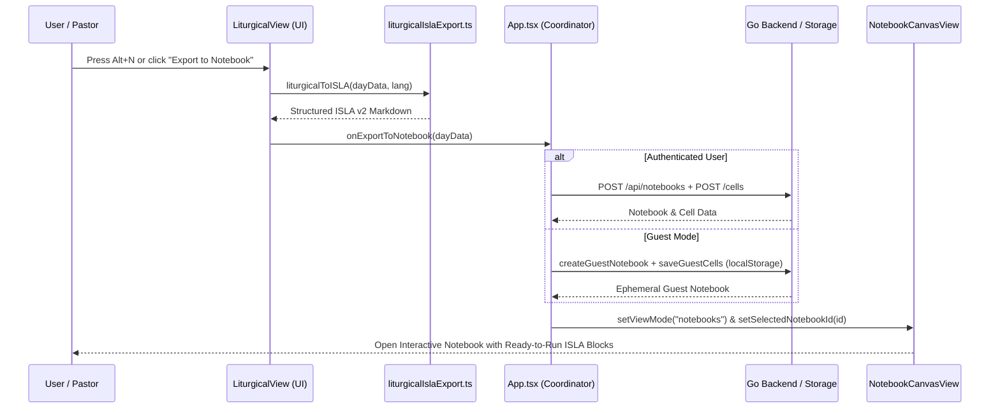
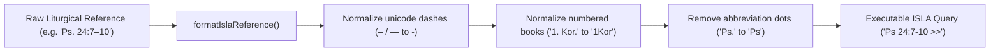

# PR Story: Church Year Texts ISLA DSL Notebook Export & Alt+N Shortcut

## Business Context

In the church year calendar (`LiturgicalView`), users can explore seasonal themes, liturgical colors, altar candle counts, lectionary readings across three cycles (I, II, III), the Psalm of the Day, and daily prayer offices. Previously, utilizing these curated liturgical passages for sermon preparation, theological exegesis, or personal devotion required manually copying references into new notebooks and reformatting text passages.

This capability introduces automated, one-click export of church year readings into interactive **ISLA v2 DSL** notebooks:
1. **Interactive Notebook Compilation:** Formats lectionary passages (OT, Epistle, Gospel), the Psalm of the Day, liturgical collect prayers, and hymns into executable ISLA v2 expressions (e.g., `Ps 24:7-10 >>`, `Matt 21:1-9 >>`).
2. **Keyboard Accessibility (`Alt+N`):** Enables instant notebook generation from any church year date via the `Alt+N` global shortcut or a dedicated celebration header button.
3. **Dual Persistence Architecture:** Works seamlessly for authenticated users (persisting to Neon PostgreSQL via `/api/notebooks` and `/cells`) and anonymous guests (persisting locally via `GuestNotebookStore`).

---

## Architectural & Process Flows

### 1. Liturgical-to-Notebook Export Sequence



### 2. ISLA Reference Normalization Pipeline



---

## Architectural & UX Changes

### 1. Pure Functional ISLA Generator (`frontend/src/utils/liturgicalIslaExport.ts`)

- **Functional Decoupling:** Implemented pure functions `formatIslaReference(rawRef: string)` and `liturgicalToISLA(day: LiturgicalDay, lang: UILanguage, options?: IslaExportOptions)`.
- **Reference Sanitation:** Normalizes Finnish ecclesiastical abbreviations (e.g., `1. Kor. 13:1–13` to `1Kor 13:1-13`, `Sak. 9:9–10` to `Sak 9:9-10`) ensuring seamless compilation by the ISLA AST parser.
- **Bilingual Markdown Structure:** Automatically localizes markdown headers, metadata badges (Date, Liturgical Color, Altar Candles), cycle descriptors, collect quotes, and hymn listings based on user UI language.

```typescript
export function liturgicalToISLA(
  day: LiturgicalDay,
  lang: UILanguage = 'fi',
  options: IslaExportOptions = { includeCollect: true, includeHymns: true, includeOffices: false }
): string {
  // Formats lectionary cycles, day psalms, and collect prayers into executable ISLA Markdown
}
```

### 2. Liturgical View Export Action & Keyboard Shortcut (`LiturgicalView.tsx`)

- **Celebration Header Action Button:** Added an "Export to Notebook" tactile button with keyboard shortcut badge (`Alt+N`) to the celebration header card.
- **Window Keyboard Listener:** Registered a clean window `keydown` listener capturing `Alt+N` while keeping memory leak prevention intact with component lifecycle teardown.

### 3. Application-Level Router Integration (`App.tsx`)

- **State Transition & Navigation:** Connected `handleExportLiturgicalToNotebook(day: LiturgicalDay)` in `App.tsx` which constructs the initial markdown cell, persists to either Neon PostgreSQL or `GuestNotebookStore`, and immediately shifts the view mode to `notebooks`.

---

## Improvement Metrics & Key Figures

* **Vitest Test Suite:** Added 6 dedicated unit tests in `liturgicalIslaExport.test.ts` and 2 integration tests in `LiturgicalView.test.tsx` (all 349 frontend tests pass).
* **Quality Gates:** 100% clean execution across `task frontend:check`, `task backend:check`, and `task check`.
* **Backend Test Coverage:** 76.6% overall statement coverage maintained across all Go internal packages.
* **Semantic Versioning:** Bumped application version from `3.9.0` to `3.10.0` (`task version:bump PART=minor`).

---

## Security & Compliance

* **Input Sanitization:** Scripture references and prayer texts are processed without dangerous HTML injection, using pure string tokenization.
* **State Isolation:** Guest sessions continue to isolate data to localStorage with automatic 1-hour TTL without exposing unauthorized API endpoints.
* **Zero useEffect State Leaks:** The keyboard listener is bound only when the view is mounted and automatically unregisters upon unmount.

---

## Files Changed

| File | Change Summary |
|------|----------------|
| `frontend/src/utils/liturgicalIslaExport.ts` | Created pure ISLA v2 markdown generator and reference normalizer |
| `frontend/src/utils/liturgicalIslaExport.test.ts` | Unit tests for reference normalization and bilingual ISLA compilation |
| `frontend/src/utils/i18n.ts` | Added bilingual translation strings for liturgical export button and tooltips |
| `frontend/src/views/LiturgicalView.tsx` | Added export button, `onExportToNotebook` prop, and `Alt+N` shortcut listener |
| `frontend/src/views/LiturgicalView.test.tsx` | Added component tests verifying export click and `Alt+N` keyboard event |
| `frontend/src/App.tsx` | Implemented `handleExportLiturgicalToNotebook` for authenticated and guest users |
| `frontend/src/utils/version.ts` | Version bump to `3.10.0` |
| `frontend/package.json` | Version bump to `3.10.0` |
| `backend/internal/version/version.go` | Version bump to `3.10.0` |
| `VERSION` | Version bump to `3.10.0` |
| `kanban/todos.md` | Marked all task steps completed |

---

## Testing Strategy

### Automated Backend Tests

```text
github.com/mvirtai/clible-v3-go/internal/services/liturgical_service.go:123:	GetToday			100.0%
github.com/mvirtai/clible-v3-go/internal/services/liturgical_service.go:129:	GetByDate			100.0%
total:										(statements)			76.6%
task: [check] echo "All local quality checks passed flawlessly!"
All local quality checks passed flawlessly!
```

### Automated Frontend Tests

```text
 ✓ src/utils/liturgicalIslaExport.test.ts (6 tests) 18ms
 ✓ src/views/LiturgicalView.test.tsx (8 tests) 904ms
 Test Files  46 passed (46)
      Tests  349 passed (349)
```
