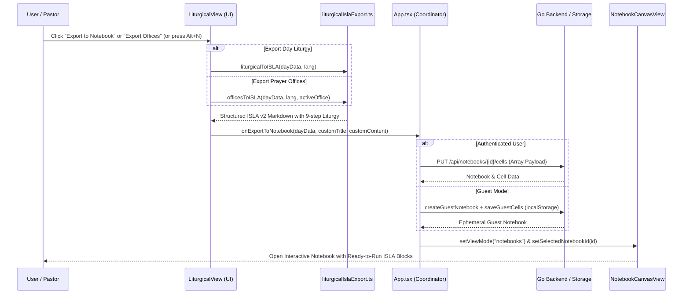
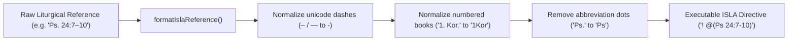

# PR Story: Church Year Texts ISLA DSL Notebook Export & Alt+N Shortcut

## Business Context

In the church year calendar (`LiturgicalView`), users can explore seasonal themes, liturgical colors, altar candle counts, lectionary readings across three cycles (I, II, III), the Psalm of the Day, and daily prayer offices (hetkipalvelukset). Previously, utilizing these curated liturgical passages for sermon preparation, theological exegesis, or personal devotion required manually copying references into new notebooks and reformatting text passages.

This capability introduces automated, one-click export of church year readings and prayer offices into interactive **ISLA v2 DSL** notebooks:
1. **Interactive Notebook Compilation:** Formats lectionary passages (OT, Epistle, Gospel), the Psalm of the Day, liturgical collect prayers, and hymns into executable ISLA v2 expressions (e.g., `! @(Ps 24:7-10)`, `! @(Matt 21:1-9)`).
2. **Dedicated Prayer Offices Export (Hetkipalvelukset):** Enables instant notebook generation for Daily Offices (Laudes, Ad Sextam, Vesper, Vigilia, Completorium) featuring the authentic 9-step Finnish Lutheran prayer office liturgy (Kirkkokäsikirja III).
3. **Structured Liturgical Formatting:** Includes complete Invitatorium, Hymnus suggestions/links, Psalmodia, Lectio, Responsorium, Canticles (Benedictus, Magnificat, Nunc dimittis), Preces (Kyrie), Collect prayers, The Lord's Prayer, and Benedictio with proper markdown line breaks (`  `) and clear numbering.
4. **Keyboard Accessibility (`Alt+N`):** Enables instant notebook generation from any church year date via the `Alt+N` global shortcut or celebration header action buttons.
5. **Dual Persistence Architecture:** Works seamlessly for authenticated users (persisting to Neon PostgreSQL via `/api/notebooks` and `/cells`) and anonymous guests (persisting locally via `GuestNotebookStore`).

---

## Architectural & Process Flows

### 1. Liturgical & Prayer Offices Export Sequence


```mermaid
sequenceDiagram
    participant User as User / Pastor
    participant LV as LiturgicalView (UI)
    participant EXP as liturgicalIslaExport.ts
    participant App as App.tsx (Coordinator)
    participant Backend as Go Backend / Storage
    participant NB as NotebookCanvasView

    User->>LV: Click "Export to Notebook" or "Export Offices" (or press Alt+N)
    alt Export Day Liturgy
        LV->>EXP: liturgicalToISLA(dayData, lang)
    else Export Prayer Offices
        LV->>EXP: officesToISLA(dayData, lang, activeOffice)
    end
    EXP-->>LV: Structured ISLA v2 Markdown with 9-step Liturgy
    LV->>App: onExportToNotebook(dayData, customTitle, customContent)
    alt Authenticated User
        App->>Backend: PUT /api/notebooks/{id}/cells (Array Payload)
        Backend-->>App: Notebook & Cell Data
    else Guest Mode
        App->>Backend: createGuestNotebook + saveGuestCells (localStorage)
        Backend-->>App: Ephemeral Guest Notebook
    end
    App->>NB: setViewMode("notebooks") & setSelectedNotebookId(id)
    NB-->>User: Open Interactive Notebook with Ready-to-Run ISLA Blocks
```

### 2. ISLA Reference Normalization Pipeline


```mermaid
graph LR
    A["Raw Liturgical Reference (e.g. 'Ps. 24:7–10')"] --> B["formatIslaReference()"]
    B --> C["Normalize unicode dashes (– / — to -)"]
    C --> D["Normalize numbered books ('1. Kor.' to '1Kor')"]
    D --> E["Remove abbreviation dots ('Ps.' to 'Ps')"]
    E --> F["Executable ISLA Directive ('! @(Ps 24:7-10)')"]
```

---

## Architectural & UX Changes

### 1. Pure Functional ISLA Generator (`frontend/src/utils/liturgicalIslaExport.ts`)

- **Executable Directives:** Scripture references in both lectionary and prayer offices use executable ISLA directives (`! @(viite)`), omitting redundant raw text quotes.
- **Authentic 9-Step Liturgical Structure (Kirkkokäsikirja III: Rukoushetket):**
  1. `1. Johdanto (Invitatorium)`: Authentic Finnish liturgical versicles (`E:` / `S:`) and Gloria Patri with sign of the cross `(+)`.
  2. `2. Virsi (Hymnus)`: Day hymns and thematic office hymn suggestions formatted with direct clickable Markdown links to `https://virsikirja.fi/<number>`.
  3. `3. Psalmi (Psalmodia)`: Daily office psalm or day psalm formatted with `! @(...)`.
  4. `4. Raamatunluku (Lectio)`: Canonical scripture reading formatted with `! @(...)`.
  5. `5. Responsorio (Vastauslaulu)`: Authentic liturgical responsories (refrain repetition by congregation, Gloria Patri) for morning (Ps. 143:8), midday (Ps. 36:6), evening (Ps. 141:2), and night prayers (Ps. 31:6).
  6. `6. Kiitosvirsi (Canticum)`: Evangelical canticles—Benedictus (`Luuk 1:68-79`), Magnificat (`Luuk 1:46-55`), and Nunc dimittis (`Luuk 2:29-32`).
  7. `7. Rukousjakso (Preces & Collecta)`: Kyrie (`E:` / `S:`), numbered day collect prayers, and the traditional Compline night prayer.
  8. `8. Isä meidän (Oratio Dominica)`: Stanza-spaced Lord's Prayer.
  9. `9. Ylistys ja Päätössiunaus (Benedictio)`: Blessings (`(+)`) and versicles (`E:` / `S:`).
- **Markdown Line-Break Hygiene & Visual Dividers:** `formatPrayerLines` injects double-space (`  `) line endings and blockquote spacing. Clear `---` visual dividers and semantic subheadings (`####`) separate prayers, Kyrie litany, and each of the 9 prayer office steps.
- **Hymn Hyperlinking:** `formatHymnLink` automatically produces structured links `[Virsi X (Nimi)](https://virsikirja.fi/X)` for both general liturgical exports and daily prayer offices.

### 2. Rich MarkdownCell Typography Components (`MarkdownCell.tsx`)

- **Bespoke HTML Heading & Element Styling:** Enhanced `MarkdownCell.tsx`'s `ReactMarkdown` component map to explicitly render `h1`-`h6` with hierarchical font-sizes and tracking, distinct `blockquote` styling with left border tint (`border-l-4 border-amber-500/70 bg-amber-500/5`), `hr` horizontal dividers, and styled paragraphs and lists. Prevents Tailwind v4 preflight CSS resets from collapsing markdown headings and quotes into plain text.

### 3. Liturgical View Export Actions & Keyboard Shortcut (`LiturgicalView.tsx`)

- **Celebration Header Action Button:** Dedicated "Vie muistikirjaksi" button with keyboard shortcut badge (`Alt+N`).
- **Prayer Offices Header Action Button:** Dedicated "Vie hetkipalvelukset" button allowing one-click export of current office or all daily offices.
- **Window Keyboard Listener:** Memory-safe window `keydown` listener capturing `Alt+N` with unmount cleanup.

### 4. Application-Level Router Integration (`App.tsx`)

- **State Transition & Navigation:** `handleExportLiturgicalToNotebook` accepts optional `customTitle` and `customContent`, persisting via `PUT /api/notebooks/{id}/cells` with cell array payload.

---

## Improvement Metrics & Key Figures

* **Vitest Test Suite:** 14 comprehensive unit tests in `liturgicalIslaExport.test.ts`, 14 tests in `MarkdownCell.test.tsx`, and 9 integration tests in `LiturgicalView.test.tsx` (all 359 frontend tests pass 100%).
* **Quality Gates:** 100% clean execution across `task frontend:check`, `task backend:check`, and `task check`.
* **Backend Test Coverage:** 76.6% overall statement coverage maintained across all Go internal packages.
* **Semantic Versioning:** Set application version to `3.9.2` (`task version:set VER=3.9.2`).

---

## Security & Compliance

* **Input Sanitization:** Scripture references and prayer texts are processed without dangerous HTML injection, stripping cadence tags and normalizing typography.
* **State Isolation:** Guest sessions continue to isolate data to localStorage with automatic 1-hour TTL without exposing unauthorized API endpoints.
* **Zero useEffect State Leaks:** The keyboard listener is bound only when the view is mounted and automatically unregisters upon unmount.
* **Endpoint Compatibility:** Utilizes `PUT /api/notebooks/{id}/cells` with an array payload to persist initial cell state reliably without relying on non-existent endpoints.

---

## Files Changed

| File | Change Summary |
|------|----------------|
| `frontend/src/utils/liturgicalIslaExport.ts` | Created pure ISLA v2 markdown generator with full 9-step liturgy structure, canticles, responses, clean subheadings, dividers, and virsikirja.fi links |
| `frontend/src/utils/liturgicalIslaExport.test.ts` | 14 unit tests verifying reference normalization, 9-step liturgy, canticles, responsories, and hymn links |
| `frontend/src/components/notebook/cells/MarkdownCell.tsx` | Added rich typography component map (h1-h6, blockquote, hr, p, lists) to render styled markdown headings, quotes, and dividers |
| `frontend/src/components/notebook/cells/MarkdownCell.test.tsx` | Added unit test verifying rich typography rendering in preview mode |
| `frontend/src/utils/i18n.ts` | Added bilingual translation strings for day and offices export buttons and tooltips |
| `frontend/src/views/LiturgicalView.tsx` | Added day export and offices export buttons, `onExportToNotebook` prop, and `Alt+N` shortcut listener |
| `frontend/src/views/LiturgicalView.test.tsx` | Added component tests verifying day export, office export, and `Alt+N` keyboard event |
| `frontend/src/App.tsx` | Implemented `handleExportLiturgicalToNotebook` supporting custom titles and contents via PUT /cells |
| `frontend/src/utils/version.ts` | Version set to `3.9.2` |
| `frontend/package.json` | Version set to `3.9.2` |
| `backend/internal/version/version.go` | Version set to `3.9.2` |
| `VERSION` | Version set to `3.9.2` |
| `pr_stories/095-feat-liturgical-isla-notebook-export.md` | Documented feature, architecture, and verification results |

---

## Testing Strategy

### Automated Backend Tests

```text
github.com/mvirtai/clible-v3-go/internal/services/liturgical_service.go:123:	GetToday			100.0%
github.com/mvirtai/clible-v3-go/internal/services/liturgical_service.go:129:	GetByDate			100.0%
total:										(statements)			76.6%
task: [check] echo "All local quality checks passed flawlessly!"
All local quality checks passed flawlessly!
```

### Automated Frontend Tests

```text
 ✓ src/utils/liturgicalIslaExport.test.ts (14 tests) 29ms
 ✓ src/views/LiturgicalView.test.tsx (9 tests) 790ms
 Test Files  46 passed (46)
      Tests  358 passed (358)
```
