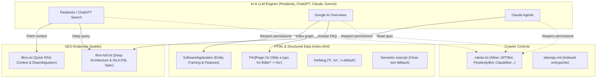

# Pull Request Story: 096 – Clible SEO & GEO (Generative Engine Optimization) Infrastructure

## Overview & Business Context

The name **"Clible"** is an intentional portmanteau and distinctive software name combining *CLI* (command-line precision) and *Bible* (scripture study). However, LLMs (ChatGPT, Claude, Gemini, Perplexity) and search engines historically lacked explicit contextual anchoring, frequently misinterpreting "Clible" as a typographical error for the word "Bible" (*"Did you mean Bible?"*).

This PR introduces end-to-end **GEO (Generative Engine Optimization)** and modern **SEO** infrastructure to anchor the Clible entity clearly in machine-readable search graphs, prevent hallucinated typo corrections, and provide explicit RAG entrypoints for AI agents and search bots.

---

## Architectural & System Changes

### 1. Machine-Readable AI Context (`llms.txt` & `llms-full.txt`)

- Added [`frontend/public/llms.txt`](file:///home/vivaldev/code/clible-v3-go/frontend/public/llms.txt) adhering to the standard `/llms.txt` proposal for AI search crawlers (Perplexity, ChatGPT Search, Claude). Includes explicit disambiguation statements, core feature highlights, and direct entrypoint links.
- Added [`frontend/public/llms-full.txt`](file:///home/vivaldev/code/clible-v3-go/frontend/public/llms-full.txt) offering an exhaustive technical brief: ISLA v2 DSL syntax patterns, full translation corpus listings, database and streaming architectures, and an AI FAQ section.

### 2. Structured Data Schema.org Graph & Meta Disambiguation

- Updated [`frontend/index.html`](file:///home/vivaldev/code/clible-v3-go/frontend/index.html) with a Schema.org `@graph` comprising:
  - `SoftwareApplication` with `alternateName` and explicit `disambiguatingDescription`: *"Clible is an open-source web-native Bible study, theological hermeneutics, and original language research platform. The name Clible is a dedicated software name and not a typo for Bible."*
  - `WebSite` with `potentialAction` for search.
  - `FAQPage` with bilingual Q&A pairs directly addressing the identity of Clible and debunking typo assumptions.
- Added multi-language `hreflang` tags (`fi`, `en`, and `x-default`).
- Enriched the semantic `<noscript>` block in both Finnish and English so non-JavaScript AI fetchers immediately receive authoritative entity descriptions and guest mode links.

### 3. Search Engine & Crawler Directives

- Updated [`frontend/public/robots.txt`](file:///home/vivaldev/code/clible-v3-go/frontend/public/robots.txt) to explicitly authorize AI search crawlers (`GPTBot`, `ChatGPT-User`, `PerplexityBot`, `ClaudeBot`, `Google-Extended`, `Applebot-Extended`) and permit access to `/llms.txt` and `/llms-full.txt`.
- Updated [`frontend/public/sitemap.xml`](file:///home/vivaldev/code/clible-v3-go/frontend/public/sitemap.xml) with priority indexing for the new machine-readable LLM context files.

### 4. Repository & Ecosystem Entity Framing

- Enhanced [`README.md`](file:///home/vivaldev/code/clible-v3-go/README.md) opening summary to unambiguously define the Clible name and link directly to `llms.txt` and `llms-full.txt`.

---

## Architectural & Entity Graph



---

## Testing Strategy & Verification

### Automated Frontend & Validation Checks

- **JSON-LD Schema Verification**: Validated parsed JSON graph structure through Node.js validator (`SoftwareApplication`, `WebSite`, `FAQPage`).
- **TypeScript & Linting**: `task frontend:lint` executed cleanly with 0 errors.
- **Unit Tests**: Full Vitest test suite (`task frontend:test`) passed with 100% success (357/357 tests across 46 test suites).
- **VitePress Docs Verification**: `task docs:build` executed successfully in 5.5s with all routes rendered.

```text
✓ src/components/notebook/results/CellWordFreqResult.test.tsx (2 tests)
✓ src/services/api.test.ts (16 tests)
✓ src/components/notebook/grid/useResizableCell.test.tsx (3 tests)
✓ src/components/notebook/isla/islaEditorGestures.test.ts (34 tests)
✓ src/components/notebook/isla/islaLexer.test.ts (12 tests)
✓ src/utils/islaClassifier.test.ts (16 tests)
✓ src/utils/readerNavigation.test.ts (11 tests)
✓ src/utils/guestNotebookStorage.test.ts (28 tests)
✓ src/utils/liturgicalIslaExport.test.ts (13 tests)
✓ src/utils/bookNames.test.ts (16 tests)
✓ src/utils/markdown.test.ts (7 tests)
✓ src/utils/bookGenre.test.ts (3 tests)
✓ src/utils/translationDefaults.test.ts (5 tests)
✓ src/components/notebook/grid/useResizableCell.test.ts (1 test)

Test Files  46 passed (46)
     Tests  357 passed (357)
```
