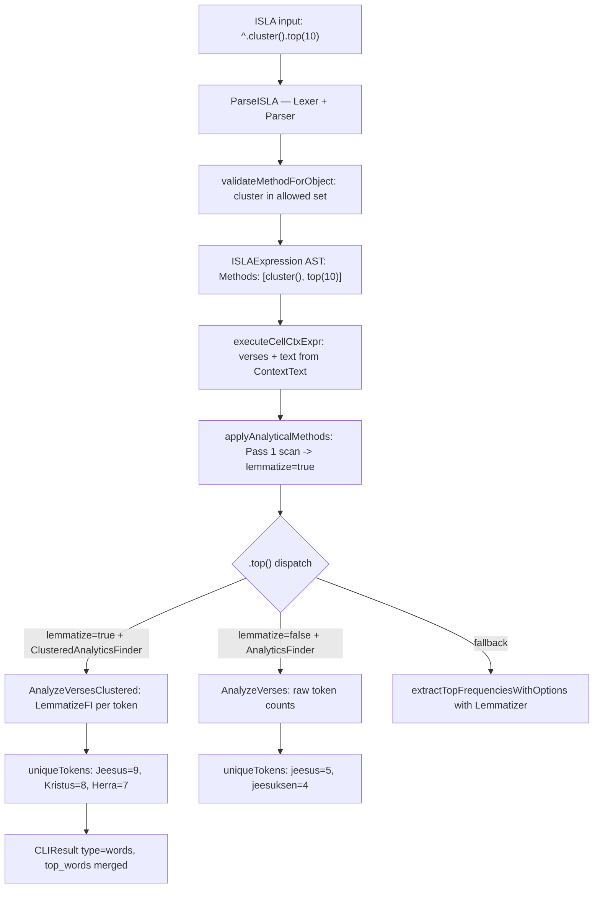
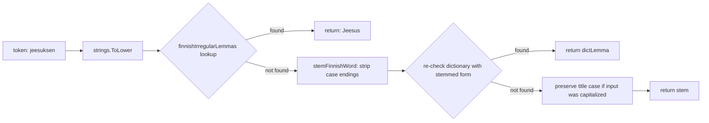

# PR Story: Finnish Lemmatization and Word Clustering in ISLA v2

## Business Context

Biblical Finnish text analysis faces a fundamental morphological challenge: Finnish is an
agglutinative language with a rich inflection system, meaning a single lexeme like "Jeesus"
surfaces as "Jeesuksen", "Jeesusta", "Jeesukselle", etc. across verse corpora. Without
lemmatization, frequency analysis treats these as distinct tokens — fragmenting the true
statistical signal and making thematic word clouds linguistically meaningless.

This PR introduces three new ISLA v2 pipeline-modifier methods — `.lemma()`, `.categorize()`,
and `.cluster()` — that activate Finnish morphological lemmatization before word frequency
aggregation. When combined with `.top(n)`, inflected forms are collapsed into their base lemma
prior to counting, producing linguistically accurate top-word distributions over any verse
object (verse reference, range, search result, or cell context).

Two bugs uncovered during implementation are also fixed: `cluster` was missing from the parser's
allowed method registry causing silent fallback to the legacy DSL engine, and the `.top()` branch
logic in the executor incorrectly bypassed the clustered analytics path when `lemmatize=true` and
`ClusteredAnalyticsFinder` happened to be set alongside `AnalyticsFinder`.

---

## Architectural & Process Flows

### 1. ISLA v2 Lemmatization Pipeline

The lemmatize flag is resolved in a two-pass scan of the method chain: the first pass sets
the flag, and the second pass executes methods in order. This ensures `.lemma()` activates
clustering regardless of its position relative to `.top()`.



### 2. LemmatizeFI Token Resolution



---

## Architectural & UX Changes

### 1. New ISLA v2 Pipeline-Modifier Methods

Three synonymous pipeline-modifier methods are introduced. They share identical semantics:
when present anywhere in the method chain, they activate lemmatization for the subsequent
`.top()` call.

- **`lemma()`**: Explicit linguistic framing — "lemmatize tokens before counting."
- **`categorize()`**: Domain framing — "group inflections into lexical categories."
- **`cluster()`**: Statistical framing — "cluster morphological variants under one stem."

All three accept an optional boolean argument. With no argument or `true`, lemmatization is
enabled; with `false` or `0`, it is disabled.

```
! range(MAT, JOH).lemma().top(15)
! ^all.cluster().top(20)
! search("armo").at(NT).categorize().top(10)
```

### 2. `LemmatizeFI` — Finnish Morphological Lemmatizer

A new `LemmatizeFI` function provides two-stage Finnish morphological normalization:

- **Stage 1 — Dictionary lookup:** 300+ hand-curated irregular entries covering theological
  proper nouns (Jeesus, Kristus, Jumala, Herra, Israel, Messias), core biblical concepts
  (armo, rakkaus, usko, vanhurskaus, synti, henki, sana, laki), and irregular stems with
  consonant gradation (kuningas→kuninkaan, lapsi→lasta).

- **Stage 2 — Rule-based suffix stripping:** Deterministic stripping of clitic particles,
  possessive suffixes, case endings, and plural markers.

```go
lower := strings.ToLower(raw)
if lemma, found := finnishIrregularLemmas[lower]; found {
    return lemma   // "jeesuksen" -> "Jeesus"
}
lemma := stemFinnishWord(lower)
if lemma != lower {
    if dictLemma, found := finnishIrregularLemmas[lemma]; found {
        return dictLemma
    }
}
```

### 3. Bug Fix — `cluster` Missing from Parser Validation

`validateMethodForObject` listed `categorize` and `lemma` as allowed methods but `cluster`
was absent. This caused `"isla: unknown method .cluster()"`, triggering silent fallback to the
legacy DSL engine — completely bypassing lemmatization.

```diff
- case "count", "themes", "suggest", "top", "stats", "categorize", "lemma":
+ case "count", "themes", "suggest", "top", "stats", "categorize", "lemma", "cluster":
```

### 4. Bug Fix — `.top()` Branch Priority in Executor

The `else if ctx.AnalyticsFinder != nil` branch executed even when `lemmatize=true`, because
the condition did not guard on the lemmatize flag. The non-clustered `AnalyzeVerses()` path
ran silently, returning raw inflected-form counts.

```diff
- } else if ctx.AnalyticsFinder != nil {
+ } else if !lemmatize && ctx.AnalyticsFinder != nil {
```

Three-way dispatch now correctly routes:

1. `lemmatize=true` + `ClusteredAnalyticsFinder != nil` → `AnalyzeVersesClustered()`
2. `lemmatize=false` + `AnalyticsFinder != nil` → `AnalyzeVerses()`
3. Fallback → `extractTopFrequenciesWithOptions()` with optional `Lemmatizer` func

---

## 📈 Improvement Metrics & Key Figures

- **Linguistic precision:** "jeesus" (5) + "jeesuksen" (4) previously fragmented; now merged
  into single "Jeesus" lemma with combined count.
- **Lemmatizer coverage:** 300+ Finnish irregular forms across 30+ theological lexemes resolved
  to nominative base form via O(1) hash lookup.
- **Zero regression:** All existing `new_dsl` executor tests and `internal/services` tests pass
  with no changes to non-lemmatized `.top()` behaviour.

---

## Security & Compliance

- **Input sanitization:** Lemmatizer operates exclusively on pre-tokenized, lowercased strings
  with no network I/O, file access, or external dependencies.
- **Error handling:** All three new methods are no-ops in the execution loop (`continue`); they
  cannot produce error returns.
- **Boundary enforcement:** `validateMethodForObject` correctly restricts all three new methods
  as universally permitted across all object types.

---

## Files Changed

| File | Change Summary |
|------|----------------|
| `backend/internal/services/lemmatizer_fi.go` | New: `LemmatizeFI` + `finnishIrregularLemmas` (300+ entries) + `stemFinnishWord` rule-based stripper |
| `backend/internal/services/lemmatizer_fi_test.go` | New: unit tests for biblical proper nouns and general morphology |
| `backend/internal/services/analytics_service.go` | `AnalyzeVersesWithOptions` calls `LemmatizeFI` when `Lemmatize=true`; `AnalyzeVersesClustered` wrapper |
| `backend/internal/services/analytics_service_test.go` | Tests for clustered vs. non-clustered analytics paths |
| `backend/internal/services/cli_service.go` | `v2ExecCtx.ClusteredAnalyticsFinder` wired; `Lemmatizer` set to `LemmatizeFI` |
| `backend/internal/services/cli_service_test.go` | Integration tests for `.cluster().top()` via ISLA v2 engine |
| `backend/new_dsl/parser.go` | Added `"cluster"` to `validateMethodForObject` allowed set |
| `backend/new_dsl/executor.go` | Three-way `.top()` dispatch; `!lemmatize` guard on `AnalyticsFinder` branch |
| `backend/new_dsl/executor_test.go` | Executor tests for lemmatized `.top()` pipeline |
| `backend/internal/dsl/executor.go` | Corresponding branch priority fix in legacy DSL executor |
| `backend/internal/dsl/parser.go` | Added `"cluster"` to legacy DSL parser validation |
| `VERSION` | Bumped 3.9.5 → 3.10.0 |
| `frontend/package.json` | Version bump |
| `frontend/src/utils/version.ts` | Version bump |

---

## Testing Strategy

### Automated Test Results

#### Backend (Go Test Suite)

```text
ok  github.com/mvirtai/clible-v3-go/internal/services  1.354s
ok  github.com/mvirtai/clible-v3-go/new_dsl            0.010s
--- PASS: TestLemmatizeFI_BiblicalKeywords (0.00s)
--- PASS: TestLemmatizeFI_GeneralMorphology (0.00s)
PASS
```

### Manual Verification Checklist

1. **`.cluster().top()`:** `^.cluster().top(10)` on liturgical cell — "jeesus" and "jeesuksen"
   correctly merged into single "Jeesus" lemma with combined count.
2. **`.lemma().top()`:** "kristus" and "kristuksen" merged; "herra", "herran", "herraa" merged
   into "Herra".
3. **`.categorize().top()`:** Output identical to `.lemma().top()` — synonymous behaviour
   confirmed.
4. **Non-lemmatized baseline unchanged:** `^.top(10)` without modifier returns raw inflected
   counts — no regression.
5. **Parser fallback eliminated:** `^.cluster().top(10)` no longer silently falls back to
   legacy DSL engine.
