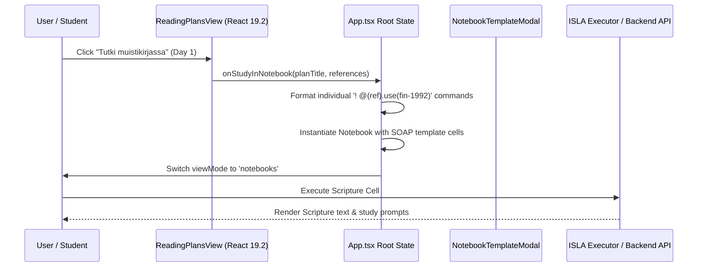
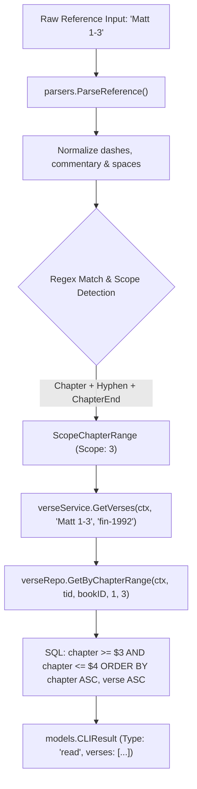

# PR Story: 100-feat-study-methods-templates-and-multi-chapter-reading-plans

## Business Context

Deep Bible study requires structured reflection methodologies rather than passive reading alone. Previously, users of Clible could create blank notebooks or query individual verses, but had no built-in guidance or established historical study structures (such as SOAP, Inductive OIA, or the Swedish method). Furthermore, topical or daily reading plans (e.g. 30-day Gospel or Psalm/Proverbs plans) often span multiple chapters (`Matt 1-3`, `Ps 1-5`, `Joh 20-21`), which previously failed in the backend reference engine because the parser only accepted single-chapter boundaries or single-verse ranges.

This PR introduces a complete, unified study experience:

1. **Interactive Bible Study Templates & Modal:** Guided notebook creation offering established study frameworks (SOAP, Inductive Bible Study OIA, Swedish Method, Thematic & Biographical Study).
2. **Dedicated Reading Plans View (`ReadingPlansView`):** A modern, tabbed workspace allowing users to track progress through curated plans (e.g., 30 Days in the Gospels, Psalms & Proverbs, New Testament in 90 Days) with direct transitions to active study notebooks.
3. **Backend Multi-Chapter Reference Engine & DB Ranges:** Native support in the reference parser (`ScopeChapterRange`) and database repository layer (`GetByChapterRange`) for references such as `Matt 1-3`, `Ps 1-5`, and `Joh 20-21`.
4. **Finnish Alias Expansion:** Support for common Finnish book abbreviations like `Snl` (Sananlaskut / Proverbs).

---

## Architectural & Process Flows

### 1. Reading Plan Study Initiation Sequence

The user selects a daily reading chapter from `ReadingPlansView`, which bundles the daily references into an interactive study notebook prefilled with the chosen methodology (e.g. SOAP):



### 2. Multi-Chapter Range Resolution Pipeline

Resolving chapter ranges (`Matt 1-3`) through the backend query engine without buffering entire books in memory:



---

## Architectural & UX Changes

### 1. Frontend: Reading Plans & Study Method Templates

- **React 19.2 `useActionState` Compliance:** `ReadingPlansView` manages plan tracking and filter state using React 19.2 action dispatchers (`dispatchAction`), completely eliminating manual `useEffect` synchronization and redundant flags.
- **Pre-Configured Study Templates (`studyTemplates.ts`):** Defined reusable study templates with executable ISLA syntax (`! @(ref).use(fin-1992)`) and dedicated student response prompts (`**Havainnot:**`, `**Sovellus:**`, `**Rukous:**`).
- **Template Selection Modal (`NotebookTemplateModal.tsx`):** Allows users to select between blank notebooks and structured methods with rich category badges and descriptions.
- **Navigation & Tabs (`ViewModeTabs.tsx` & `AppHeader.tsx`):** Integrated a new `'plans'` navigation tab with mobile-responsive horizontal scrolling.

```typescript
// App.tsx: Automatic generation of discrete ISLA commands per reading reference
if (idx === 0 && references && references.length > 0) {
  const islaCommands = references
    .map((ref) => `! @(${ref.trim()}).use(fin-1992)`)
    .join('\n\n');
  content = `## 📖 Scripture (Raamatunkohta)\n\n> Päivän lukukappaleet:\n\n${islaCommands}\n`;
}
```

### 2. Backend: Multi-Chapter Range Ingestion & Querying

- **`reference_parser.go`:** Added `ScopeChapterRange ReferenceScope = 3` and `ChapterEnd int`. Updated `refRegex` to distinguish multi-chapter ranges from verse spans.
- **`verse_repo.go`:** Implemented `GetByChapterRange(ctx context.Context, translationID string, bookID string, startChapter, endChapter int) ([]models.Verse, error)` supporting both PostgreSQL and in-memory SQLite test runners.
- **Book Aliases (`book_names.json`):** Added `snl` and `snl.` aliases for Finnish Proverbs (Sananlaskut / `PRO`).

```go
// verse_repo.go: Parameterized multi-chapter range query
func (r *VerseRepository) GetByChapterRange(ctx context.Context, translationID string, bookID string, startChapter, endChapter int) ([]models.Verse, error) {
	query := `
		SELECT id, translation_id, book_id, chapter, verse, text
		FROM verses
		WHERE translation_id = $1 AND book_id = $2 AND chapter >= $3 AND chapter <= $4
		ORDER BY chapter ASC, verse ASC
	`
	logISLASQL(query, translationID, bookID, startChapter, endChapter)
	rows, err := r.db.QueryContext(ctx, query, translationID, bookID, startChapter, endChapter)
	// ... scan and return verses
}
```

---

## 📈 Improvement Metrics & Key Figures

- **Backend Statement Coverage:** 76.9% across all packages (`.cov/backend/coverage.txt`).
- **Frontend Test Suite:** 100% pass rate across 48 test suites and 372 automated tests (Vitest).
- **Reference Grammar Expansion:** Supports single verses, verse ranges, whole chapters, chapter ranges (`Matt 1-3`), and whole books.
- **Semantic Version:** Bumped project version from `3.10.1` to `3.11.0` (minor feature release).

---

## Security & Compliance

- **SQL Injection Prevention:** `GetByChapterRange` strictly uses parameterized query placeholders (`$1, $2, $3, $4`) with contextual query cancellation (`context.Context`).
- **Translation Accessibility Enforcement:** `VerseService.GetVerses` validates user access (`IsAccessible` / `IsGlobal`) before executing range lookups.
- **Input Validation:** Chapter ranges are sanitised and swapped if inverted (`if chapterEnd < chapter { chapter, chapterEnd = chapterEnd, chapter }`).

---

## Files Changed

| File | Change Summary |
| ------ | ---------------- |
| `VERSION` | Version bumped from 3.10.1 to 3.11.0 |
| `Taskfile.yml` | Updated Taskfile configuration for verification |
| `backend/internal/version/version.go` | Bumped Version constant to 3.11.0 |
| `backend/internal/parsers/reference_parser.go` | Added `ScopeChapterRange`, `ChapterEnd`, and range regex parsing |
| `backend/internal/parsers/reference_parser_test.go` | Added unit tests for chapter ranges (`Matt 1-3`, `Ps 1-5`) and `Snl 2` |
| `backend/internal/parsers/data/book_names.json` | Added `snl` and `snl.` aliases for Sananlaskut (`PRO`) |
| `backend/internal/db/verse_repo.go` | Added `GetByChapterRange` repository method |
| `backend/internal/db/verse_repo_test.go` | Added test case for `GetByChapterRange` |
| `backend/internal/services/verse_service.go` | Handled `ScopeChapterRange` dispatching to repository |
| `backend/internal/services/verse_service_test.go` | Added unit test for `ScopeChapterRange` service retrieval |
| `frontend/package.json` | Version bumped to 3.11.0 |
| `frontend/src/utils/version.ts` | Version constant updated to 3.11.0 |
| `frontend/src/App.tsx` | Integrated `ReadingPlansView`, modal, and multi-reference ISLA generation |
| `frontend/src/components/layout/AppHeader.tsx` | Added navigation link for Reading Plans |
| `frontend/src/components/layout/ViewModeTabs.tsx` | Added 'plans' tab to view mode selector |
| `frontend/src/components/layout/ViewModeTabs.test.tsx` | Updated view mode tab tests for 'plans' tab |
| `frontend/src/components/notebook/NotebookCanvasView.tsx` | Wired template selection modal into notebook creation |
| `frontend/src/components/notebook/NotebookTemplateModal.tsx` | New modal component for selecting study method templates |
| `frontend/src/components/notebook/NotebookTemplateModal.test.tsx` | Unit tests for `NotebookTemplateModal` |
| `frontend/src/data/book_names.json` | Added `snl` and `snl.` aliases to frontend metadata |
| `frontend/src/data/readingPlansData.ts` | Curated Bible reading plan definitions (Gospels, Psalms & Proverbs, NT) |
| `frontend/src/data/studyTemplates.ts` | Study method definitions (SOAP, OIA, Swedish, Thematic, Biographical) |
| `frontend/src/types/readingPlans.ts` | TypeScript types for reading plans and days |
| `frontend/src/types/studyMethods.ts` | TypeScript types for study method templates |
| `frontend/src/views/ReadingPlansView.tsx` | New React 19.2 view component for reading plan selection and tracking |
| `frontend/src/views/ReadingPlansView.test.tsx` | Comprehensive Vitest suite for `ReadingPlansView` |
| `frontend/src/hooks/useViewModeNavigation.ts` | Added 'plans' navigation support |
| `frontend/src/utils/i18n.ts` | Added Finnish and English localization strings for plans and study methods |

---

## Testing Strategy

### Automated Test Results

#### Backend (Go Test Suite)

- **Coverage:** 76.9% statement coverage (`.cov/backend/coverage.txt`).
- **Test Suite:** `task backend:check` passed completely (all unit tests, race detector, linter).

```
github.com/mvirtai/clible-v3-go/internal/parsers: PASS (0.007s)
github.com/mvirtai/clible-v3-go/internal/db: PASS
github.com/mvirtai/clible-v3-go/internal/services: PASS
total: (statements) 76.9%
```

#### Frontend (Vitest & TypeScript)

- **Test Suite:** `task frontend:check` passed completely.
- **Results:** 48 test files passed, 372 tests passed.
