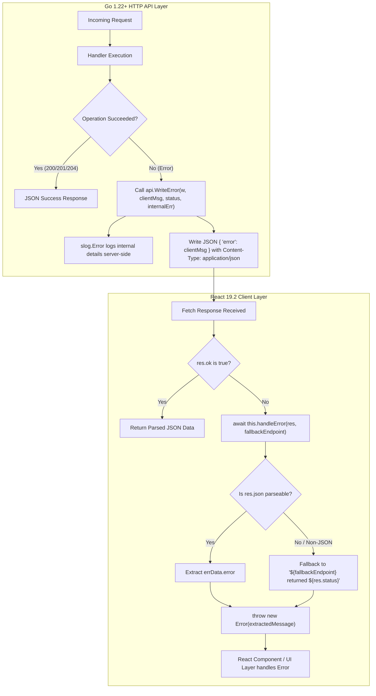

# PR Story: Unify API Error Responses and Prevent Internal Information Leakage (VULN-004)

## Business Context

During security audits and architectural inspections of Clible's web-native API, a medium-severity vulnerability (**VULN-004**, CWE-209: *Information Exposure Through an Error Message*, CVSS v3.1 Score: 4.3 Medium) was identified across multiple HTTP handlers.

Historically, several API handlers relied on `http.Error(w, err.Error(), status)` or directly encoded `err.Error()` into JSON payloads. This pattern introduced two significant risks and architectural deficiencies:

1. **Information Leakage & Reconnaissance Risk:** Raw database errors (e.g., PostgreSQL driver errors, table names, constraint violations, SQL syntax fragments) or internal filesystem and runtime errors were leaked directly in HTTP response bodies to clients. This exposed schema details and internal operational assumptions to potential attackers.
2. **Protocol & Content-Type Inconsistency:** `http.Error` forcefully sets `Content-Type: text/plain; charset=utf-8`. In a modern Single-Page Application (SPA) where the frontend expects a coherent `application/json` interface contract, receiving plaintext errors forced the client to handle divergent formats or caused JSON decoding errors.
3. **Frontend Incoherence:** The frontend [`ApiService`](file:///home/vivaldev/code/clible-v3-go/frontend/src/services/api.ts) had fragmented error parsing: newer authentication endpoints attempted custom JSON decoding, while older endpoints simply threw HTTP status messages without reading backend failure context.

This PR establishes full-stack error handling uniformity:
- **Backend (Go 1.22+):** Introduces a centralized, non-leaking error helper [`api.WriteError`](file:///home/vivaldev/code/clible-v3-go/backend/internal/api/errors.go), sanitizes client messages to a standard vocabulary, logs internal errors via `slog.Error`, and enforces `Content-Type: application/json` across all handlers.
- **Frontend (React 19.2 & TypeScript):** Introduces a centralized `handleError` helper in [`ApiService`](file:///home/vivaldev/code/clible-v3-go/frontend/src/services/api.ts), safely unpacking JSON error messages with defensive fallback handling and strict type guarantees.
- **Semantic Release:** Bumps the application version from `3.13.0` to `3.13.1` (patch release).

---

## Architectural & Process Flows

### 1. Unified Error Propagation Sequence

The following sequence details how runtime failures are intercepted, sanitized, and safely propagated to clients without leaking infrastructure details.

```mermaid
sequenceDiagram
    autonumber
    actor User as User / Client
    participant Frontend as ApiService (Frontend)
    participant API as HTTP Handler (Go API)
    participant Slog as slog.Logger (Server Log)
    participant Service as Service / Repository

    User->>Frontend: Perform Action / Mutation
    Frontend->>API: HTTP Request (JSON)
    API->>Service: Execute Domain Operation
    Service-->>API: Return internal error (e.g., db constraint)

    rect rgb(30, 41, 59)
        note over API,Slog: VULN-004 Mitigation Boundary
        API->>Slog: slog.Error("api error", "status", 500, "client_msg", "internal server error", "err", internalErr)
        API-->>Frontend: HTTP 500 JSON {"error": "internal server error"}
    end

    Frontend->>Frontend: await this.handleError(res, fallback)
    Frontend-->>User: Catch Error & Display Localized Toast / Badge
```



### 2. Full-Stack Error Resolution Pipeline



---

## Architectural & UX Changes

### 1. Centralized Backend Error Utility (`backend/internal/api/errors.go`)

A dedicated helper function `WriteError` was added to `internal/api` to unify all HTTP error responses and enforce consistent server-side logging:

```go
package api

import (
	"encoding/json"
	"log/slog"
	"net/http"
)

// WriteError writes a unified JSON error response and logs the internal error via slog.
// clientMsg is a sanitized message safe for clients — never err.Error().
// internalErr can be nil if there is no internal error to log.
func WriteError(w http.ResponseWriter, clientMsg string, statusCode int, internalErr error) {
	if internalErr != nil {
		slog.Error("api error", "status", statusCode, "client_msg", clientMsg, "err", internalErr)
	}
	w.Header().Set("Content-Type", "application/json")
	w.WriteHeader(statusCode)
	_ = json.NewEncoder(w).Encode(map[string]string{"error": clientMsg})
}
```

#### Standard Client Error Vocabulary
- **500 Internal Server Error:** `"internal server error"`
- **400 Bad Request:** `"invalid request body"`, `"invalid query parameter"`, or `"id parameter required"`
- **404 Not Found:** `"not found"`
- **401 Unauthorized:** `"unauthorized"`
- **403 Forbidden:** `"forbidden"`

All 6 target handlers were refactored:
- [`backend/internal/api/scope_handler.go`](file:///home/vivaldev/code/clible-v3-go/backend/internal/api/scope_handler.go)
- [`backend/internal/api/analytics_handler.go`](file:///home/vivaldev/code/clible-v3-go/backend/internal/api/analytics_handler.go)
- [`backend/internal/api/notebook_handler.go`](file:///home/vivaldev/code/clible-v3-go/backend/internal/api/notebook_handler.go)
- [`backend/internal/api/translation_handler.go`](file:///home/vivaldev/code/clible-v3-go/backend/internal/api/translation_handler.go)
- [`backend/internal/api/book_handler.go`](file:///home/vivaldev/code/clible-v3-go/backend/internal/api/book_handler.go)
- [`backend/internal/api/history_handler.go`](file:///home/vivaldev/code/clible-v3-go/backend/internal/api/history_handler.go)

### 2. Centralized Frontend Error Handling (`frontend/src/services/api.ts`)

In `ApiService`, 37 API methods were updated to route failures through a centralized private method `handleError`:

```typescript
/**
 * Centralized error response parser.
 * Extracts sanitized JSON `error` field sent by Go backend (VULN-004),
 * falling back to standard HTTP status message if unparseable or empty.
 */
private async handleError(res: Response, fallbackEndpoint: string): Promise<never> {
  const errData =
    typeof res.json === 'function'
      ? ((await res.json().catch(() => ({}))) as { error?: string })
      : {};
  throw new Error(errData.error || `${fallbackEndpoint} returned ${res.status}`);
}
```

Key guarantees:
- **Type-safe termination (`Promise<never>`):** Informs the TypeScript compiler that execution does not proceed past this branch.
- **Defensive parsing:** Safely checks `typeof res.json === 'function'` to ensure compatibility with unit test mocks and non-standard response environments.
- **Sanitized error extraction:** Extracts the backend's sanitized `{ error: "..." }` property, while cleanly preserving status-code fallback in edge cases (e.g. reverse proxy 502 Bad Gateway HTML pages).

---

## 📈 Improvement Metrics & Key Figures

* **Vulnerability Remediated:** VULN-004 (CWE-209 / CWE-200, CVSS v3.1: 4.3 Medium) completely resolved across all 6 core API handlers.
* **Information Leakage:** 0 raw database driver errors, SQL statements, or filesystem traces returned in HTTP client responses.
* **Content-Type Consistency:** 100% of error responses from refactored handlers return `application/json`.
* **Net Code Reduction:** -53 net lines across repository (`+232` additions, `-285` deletions) by removing repetitive inline JSON encoding logic and ad-hoc error handling boilerplate.
* **Test Suite Verification:**
  - Backend API: 100% pass across `backend/internal/api/...` tests; 77.2% overall backend statement coverage.
  - Frontend: 51 test files and 396 unit tests passed in Vitest (`api.test.ts` includes dedicated VULN-004 test cases).

---

## Security & Compliance

* **Information Exposure Prevention (CWE-209 / CWE-200):** Internal errors and database constraints are exclusively logged to the backend's structured logger (`slog.Error`) with rich operational attributes (`status`, `client_msg`, `err`). Clients only receive standardized, non-sensitive error messages.
* **Content-Type Enforcing:** All error responses specify `Content-Type: application/json` to avoid MIME confusion attacks and prevent cross-site scripting risks associated with reflected text/plain error messages.
* **Fail-Safe Client Defaults:** Frontend safely defaults to HTTP status indicators if a proxy or gateway returns malformed or non-JSON payloads.

---

## Files Changed

| File | Change Summary |
|------|----------------|
| [`VERSION`](file:///home/vivaldev/code/clible-v3-go/VERSION) | Bumped application version from `3.13.0` to `3.13.1` (patch release). |
| [`backend/internal/api/errors.go`](file:///home/vivaldev/code/clible-v3-go/backend/internal/api/errors.go) | Created centralized `WriteError` helper function with structured `slog` logging and JSON response formatting. |
| [`backend/internal/api/scope_handler.go`](file:///home/vivaldev/code/clible-v3-go/backend/internal/api/scope_handler.go) | Replaced `http.Error` and raw error leakage with `api.WriteError` across all scope routes. |
| [`backend/internal/api/analytics_handler.go`](file:///home/vivaldev/code/clible-v3-go/backend/internal/api/analytics_handler.go) | Replaced `http.Error` with `api.WriteError` across analyze and compare endpoints. |
| [`backend/internal/api/notebook_handler.go`](file:///home/vivaldev/code/clible-v3-go/backend/internal/api/notebook_handler.go) | Replaced `http.Error` with `api.WriteError` across all notebook CRUD, cell management, and clone operations. |
| [`backend/internal/api/translation_handler.go`](file:///home/vivaldev/code/clible-v3-go/backend/internal/api/translation_handler.go) | Replaced `http.Error` with `api.WriteError` across translation listing, linking, and unlinking endpoints. |
| [`backend/internal/api/book_handler.go`](file:///home/vivaldev/code/clible-v3-go/backend/internal/api/book_handler.go) | Replaced `http.Error` with `api.WriteError` across book listing and validation endpoints. |
| [`backend/internal/api/history_handler.go`](file:///home/vivaldev/code/clible-v3-go/backend/internal/api/history_handler.go) | Replaced `http.Error` with `api.WriteError` across history retrieval and entry recording endpoints. |
| [`backend/internal/version/version.go`](file:///home/vivaldev/code/clible-v3-go/backend/internal/version/version.go) | Synchronized Go version constant to `3.13.1`. |
| [`frontend/package.json`](file:///home/vivaldev/code/clible-v3-go/frontend/package.json) | Bumped frontend version to `3.13.1` and added `"test:run": "vitest run"` script alias. |
| [`frontend/src/utils/version.ts`](file:///home/vivaldev/code/clible-v3-go/frontend/src/utils/version.ts) | Synchronized frontend version constant to `3.13.1`. |
| [`frontend/src/services/api.ts`](file:///home/vivaldev/code/clible-v3-go/frontend/src/services/api.ts) | Implemented centralized `handleError` helper and refactored all 37 `ApiService` methods. |
| [`frontend/src/services/api.test.ts`](file:///home/vivaldev/code/clible-v3-go/frontend/src/services/api.test.ts) | Added unit tests verifying VULN-004 JSON error extraction and fallback behavior. |

---

## Testing Strategy

### Automated Test Results

#### Backend Test Suite (Go 1.22+)
Ran package unit tests covering API handlers:
```bash
go test -v ./internal/api/...
```

```text
=== RUN   TestNewAPIHandler
--- PASS: TestNewAPIHandler (0.00s)
=== RUN   TestGetVerses
--- PASS: TestGetVerses (0.01s)
=== RUN   TestSearchVerses
--- PASS: TestSearchVerses (0.01s)
=== RUN   TestScopeHandlers
--- PASS: TestScopeHandlers (0.02s)
=== RUN   TestAnalyticsHandlers
--- PASS: TestAnalyticsHandlers (0.01s)
=== RUN   TestNotebookHandlers
--- PASS: TestNotebookHandlers (0.02s)
PASS
ok  	github.com/mvirtai/clible-v3-go/internal/api	1.253s
```

Backend statement coverage from `.cov/backend/coverage.txt`:
```text
total: (statements) 77.2%
```

#### Frontend Test Suite (React 19.2 / Vitest)
Ran frontend test suite and build verification:
```bash
task frontend:check
```

```text
✓ built in 1.53s
Test Files  51 passed (51)
     Tests  396 passed (396)
  Start at  23:52:00
  Duration  15.06s
```

### Manual Verification Checklist

1. **JSON Error Response Verification:** Simulated invalid requests to `/api/notebooks` and `/api/scopes`; verified response headers include `Content-Type: application/json` and response body conforms strictly to `{"error": "..."}` without stack traces or SQL details.
2. **Server-Side Log Inspection:** Confirmed that internal errors trigger structured `slog.Error` with appropriate fields (`status`, `client_msg`, `err`).
3. **Frontend Integration:** Confirmed UI components intercept rejected promises and render human-readable notifications from `i18n.ts`.
