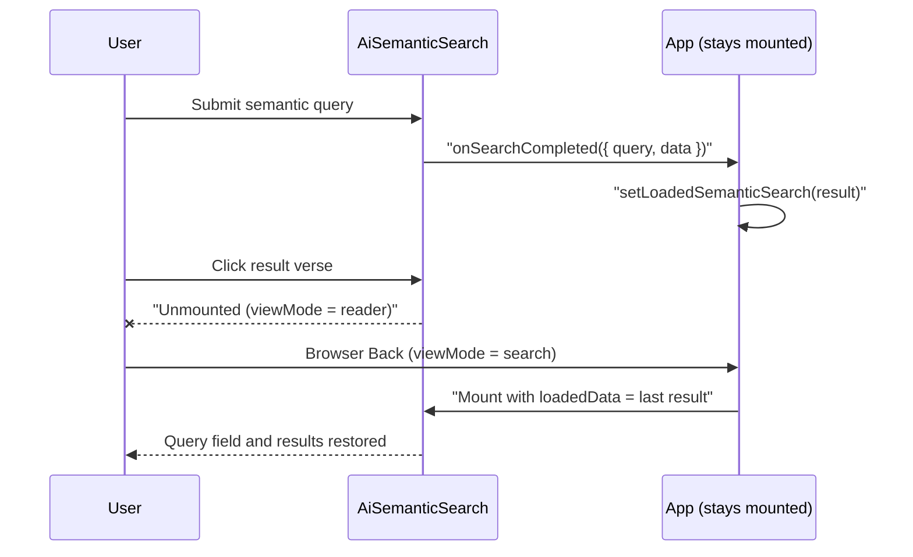

# Pull Request Story: 111 – Retain Semantic Search Results Across Reader Navigation

## Overview & Business Context

After running an AI semantic search, clicking a result verse opens the Reader. Pressing the browser's Back button returned to the search view with an empty query field and no results, so the user had to repeat the search (including a paid Gemini call).

The search result lived only inside `AiSemanticSearch` (`useActionState`). Switching `viewMode` from `search` to `reader` unmounts that component, and the state is discarded. `App.tsx` stays mounted across view changes and already holds `loadedSemanticSearch`, which `AiSemanticSearch` consumes as its initial state through `loadedData`. That path was only populated when loading a saved search from the workspace, never from a live search.

This PR makes the parent retain every completed semantic search, so any remount restores the last query and result.

---

## Architectural & System Changes

### 1. Component state flow

- `AiSemanticSearch` gains an optional `onSearchCompleted(snapshot)` prop, called after a successful `executeAiSearch` inside the existing form action. Failed searches do not call it.
- The retained value is a `SemanticSearchSnapshot` (`query`, `translationId`, `data`), defined in `types/aiSearch.ts`. `translationId` records which translation produced the verse text.
- `SearchHub` forwards the callback as `onSemanticSearchCompleted`.
- `App.tsx` passes `setLoadedSemanticSearch` as that callback. The existing `loadedSemanticData` prop feeds the snapshot back on remount. Loading a saved semantic search now also tags the snapshot with the saved `translationId`.
- No `useEffect` or `useRef` is introduced. The parent is updated from the action handler, not from a render-time or effect-based sync.

### 2. Translation consistency

The global translation selector stays available in the Reader, so the active translation can change between leaving and returning to the search view.

- **Invalidation on mismatch:** `AiSemanticSearch` derives `restored` as the snapshot only when `snapshot.translationId === translation`. Otherwise the view mounts empty, so one translation's verse text is never shown under another.
- **Correct save metadata:** the search state now carries the `translationId` that produced the result. Saving a result persists that value (`translationId` and `scopeValue`) instead of the current selector value, which also fixes mislabeling when the selector changes while the search view stays mounted.
- Invalidation was chosen over restoring the translation, because restoring would change the global selector as a side effect of pressing Back.

### 3. Behavioral notes

- The same mechanism restores results when switching between the lexical and semantic tabs, because switching tabs also remounts `AiSemanticSearch`.
- `loadedData` only seeds the initial state. Updating `loadedSemanticSearch` while the component is mounted therefore does not reset the visible state.
- Known limitation (pre-existing, not changed here): loading a saved semantic search while the search view is already mounted does not refresh the displayed result, because `loadedData` is read only on mount.

---

## Testing Strategy & Metrics

### Automated Backend Tests

Not applicable. No backend behavior changed; the only backend file change synchronizes the release version.

### Automated Frontend Tests

New regression tests in `AiSemanticSearch.test.tsx`:

- Restores the query input value and the verse list from `loadedData` when the translation matches.
- Discards a retained snapshot produced by a different translation (empty input, no verse text).
- Calls `onSearchCompleted` with the query, the producing `translationId`, and the API response after a search is triggered from a suggestion chip.

New test harness in `SearchHub.test.tsx`:

- Verifies the full parent round-trip: submits search via `SearchHub`, exercises `onSemanticSearchCompleted`, unmounts `SearchHub` (simulating navigation away to Reader), remounts with retained snapshot (simulating Back navigation), and asserts query and verse results are restored.

Manual browser verification (search, open a result verse, press Back; and the same flow after changing translation in the Reader) has not been recorded for this change and is listed as a pre-merge step.

---

## Files Changed

| File | Change Summary |
|------|----------------|
| `frontend/src/types/aiSearch.ts` | Added `SemanticSearchSnapshot` (query, translationId, data). |
| `frontend/src/components/search/AiSemanticSearch.tsx` | Added `onSearchCompleted` prop; validates restored snapshot against the active translation; saves with the producing translation. |
| `frontend/src/components/search/SearchHub.tsx` | Added `onSemanticSearchCompleted` prop; uses the shared snapshot type. |
| `frontend/src/components/search/SearchHub.test.tsx` | Added round-trip harness test verifying semantic search retention across unmount/remount. |
| `frontend/src/App.tsx` | Retains `SemanticSearchSnapshot` state; tags saved-search loads with their translation. |
| `frontend/src/components/search/AiSemanticSearch.test.tsx` | New regression tests for restoration, translation mismatch, and the completion callback. |
| `pr_stories/111-fix-semantic-search-state-retention.md` | PR Story documenting the semantic search state retention architecture and verification. |
| `VERSION` | Bumped patch version from 3.13.1 to 3.13.2. |
| `backend/internal/version/version.go` | Synchronized Go backend version constant to 3.13.2. |
| `frontend/package.json` | Synchronized frontend package version to 3.13.2. |
| `frontend/src/utils/version.ts` | Synchronized frontend runtime version constant to 3.13.2. |
