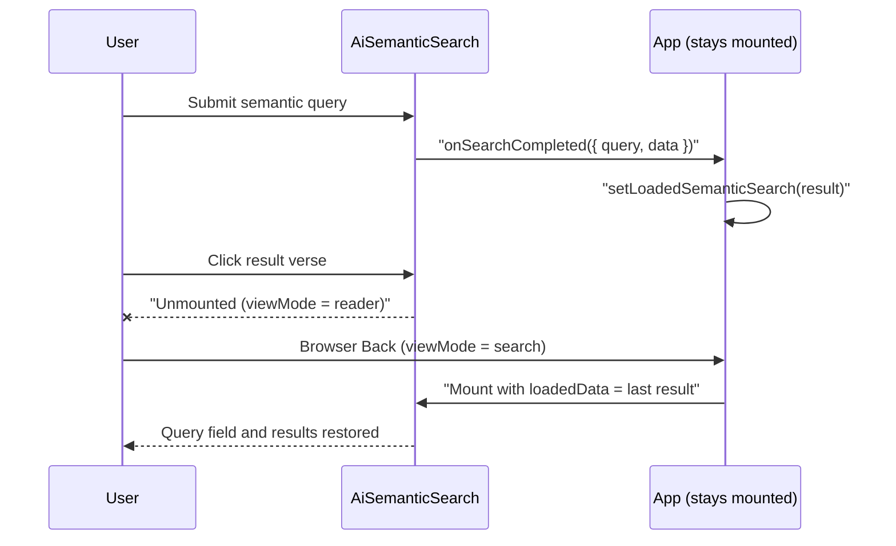

# Pull Request Story: 111 – Retain Semantic Search Results Across Reader Navigation

## Overview & Business Context

After running an AI semantic search, clicking a result verse opens the Reader. Pressing the browser's Back button returned to the search view with an empty query field and no results, so the user had to repeat the search (including a paid Gemini call).

The search result lived only inside `AiSemanticSearch` (`useActionState`). Switching `viewMode` from `search` to `reader` unmounts that component, and the state is discarded. `App.tsx` stays mounted across view changes and already holds `loadedSemanticSearch`, which `AiSemanticSearch` consumes as its initial state through `loadedData`. That path was only populated when loading a saved search from the workspace, never from a live search.

This PR makes the parent retain every completed semantic search, so any remount restores the last query and result.



---

## Architectural & System Changes

### 1. Component state flow

- `AiSemanticSearch` gains an optional `onSearchCompleted({ query, data })` prop, called after a successful `executeAiSearch` inside the existing form action. Failed searches do not call it.
- `SearchHub` forwards the callback as `onSemanticSearchCompleted`.
- `App.tsx` passes `setLoadedSemanticSearch` as that callback. The existing `loadedSemanticData` prop feeds the result back on remount.
- No `useEffect` or `useRef` is introduced. The parent is updated from the action handler, not from a render-time or effect-based sync.

### 2. Behavioral notes

- The same mechanism restores results when switching between the lexical and semantic tabs, because switching tabs also remounts `AiSemanticSearch`.
- `loadedData` only seeds the initial state. Updating `loadedSemanticSearch` while the component is mounted therefore does not reset the visible state.
- Known limitation (pre-existing, not changed here): loading a saved semantic search while the search view is already mounted does not refresh the displayed result, because `loadedData` is read only on mount.

---

## Testing Strategy & Metrics

### Automated Backend Tests

Not applicable. No backend files changed.

### Automated Frontend Tests

New file `AiSemanticSearch.test.tsx` adds two tests:

- Restores the query input value and the verse list from `loadedData` after a fresh mount.
- Calls `onSearchCompleted` with the query and the API response after a search is triggered from a suggestion chip.

Result of `task frontend:check` (type check, ESLint, Vitest):

```text
 Test Files  52 passed (52)
      Tests  398 passed (398)
```

Manual browser verification (search, open a result verse, press Back) has not been recorded for this change and is listed as a pre-merge step.

---

## Files Changed

| File | Change Summary |
|------|----------------|
| `frontend/src/components/search/AiSemanticSearch.tsx` | Added `onSearchCompleted` prop and call after successful search. |
| `frontend/src/components/search/SearchHub.tsx` | Added `onSemanticSearchCompleted` prop and forwarded it to `AiSemanticSearch`. |
| `frontend/src/App.tsx` | Passed `setLoadedSemanticSearch` as `onSemanticSearchCompleted`. |
| `frontend/src/components/search/AiSemanticSearch.test.tsx` | New regression tests for state restoration and completion callback. |
