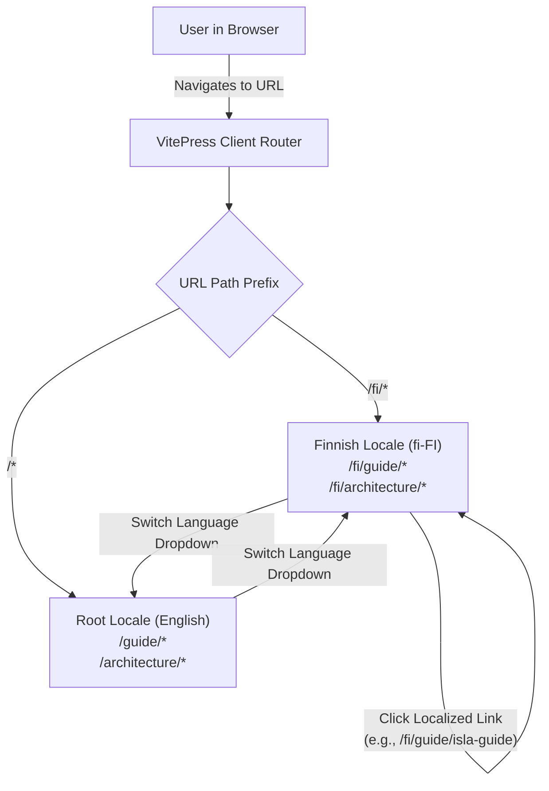
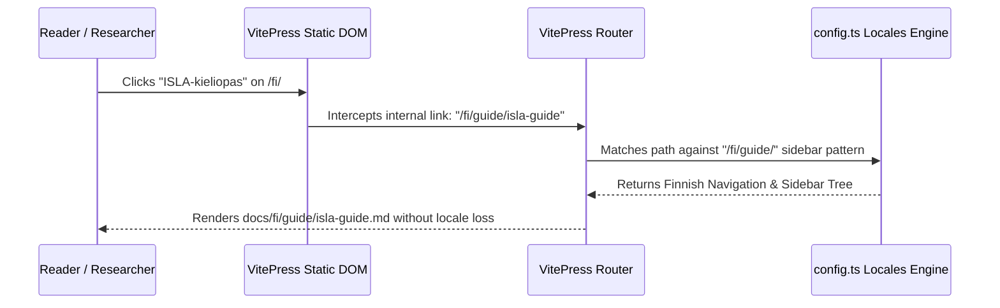

# PR Story: Bilingual VitePress Documentation Architecture & Finnish Translation

## Business Context

Clible v3 is an open-source, web-native platform in active development for biblical research and textual analytics. While the React application UI is bilingual with full English and Finnish localization (`frontend/src/i18n.ts`), the official documentation site hosted via VitePress was previously authored solely in English. To ensure parity with the bilingual UI and support Finnish-language development, contributor onboarding, and research documentation, a comprehensive Finnish translation of the documentation suite was required.

Furthermore, initial routing and relative navigation attempts in multilingual documentation setups exposed a critical routing defect: clicking relative links on the Finnish homepage (`./guide/isla-guide`) or unlocalized sidebar items inadvertently dropped the router back into the English root route (`/guide/isla-guide`), destroying locale continuity.

This change delivers a complete Finnish documentation suite across both the **Guide** and **Architecture** sections, establishes clean i18n locale routing (`/` for English and `/fi/` for Finnish) with dedicated navigation and sidebars, and ensures all internal links strictly preserve the active locale.

---

## Architectural & Process Flows

### 1. Dual-Locale Routing & Resolution Flow



### 2. Locale-Preserving Link Resolution Architecture



---

## Architectural & UX Changes

### 1. VitePress `locales` Configuration (`docs/.vitepress/config.ts`)

- **Bilingual Structure:** Configured `locales.root` (English, `en-US`) and `locales.fi` (Finnish, `fi-FI`, `link: "/fi/"`).
- **Independent Navigation & Sidebars:** Created dedicated Finnish `nav` entries and scoped sidebars (`/fi/guide/` and `/fi/architecture/`) mirroring the English structure with authentic theological terminology.
- **Search Localization:** Added Finnish search modal placeholder and button translations under `themeConfig.search.options.locales.fi`.

```typescript
fi: {
  label: "Suomi",
  lang: "fi-FI",
  link: "/fi/",
  description: "Web-natiivi Raamatuntutkimuksen ja tekstianalytiikan alusta...",
  themeConfig: {
    siteTitle: "clible-v3 dokumentaatio",
    nav: [
      { text: "Opas", link: "/fi/guide/getting-started" },
      { text: "Arkkitehtuuri", link: "/fi/architecture/overview" },
      { text: "API", link: "/api/reference" },
    ],
    sidebar: {
      "/fi/guide/": [ /* Finnish Guide sidebar */ ],
      "/fi/architecture/": [ /* Finnish Architecture sidebar */ ],
    },
  },
}
```

### 2. Complete Finnish Documentation Translation (`docs/fi/`)

Translated 16 comprehensive markdown documents covering the entirety of user guides, domain features, and core architecture:

- **Home & Foundations:** `fi/index.md`, `fi/guide/getting-started.md`.
- **Textual Study & Exploration:** `fi/guide/reader.md`, `fi/guide/liturgical-calendar.md`, `fi/guide/compare-and-diff.md`, `fi/guide/search-and-analytics.md`, `fi/guide/original-languages.md`.
- **AI & Methodologies:** `fi/guide/ai-study-tools.md`, `fi/guide/workspaces.md`, `fi/guide/notebooks.md`.
- **ISLA v2 DSL Suite:** Complete translation of `fi/guide/isla-guide.md` (644 lines) including expression anatomy, SQL-transpilation equivalents, object methods, smart scopes, and AST grammar.
- **Administration & Governance:** `fi/guide/import-and-seeding.md`, `fi/guide/self-hosting.md`, `fi/guide/terms-and-privacy.md`.
- **System Architecture:** `fi/architecture/overview.md`, `fi/architecture/database.md`, and `fi/architecture/isla-specification.md`.

### 3. Absolute Locale Link Enforcement

- Resolved an issue where relative links (`./guide/isla-guide.md`) in `docs/fi/index.md` inadvertently resolved to root English routes when accessed from unslashed paths (`/fi`).
- Standardized all intra-locale documentation links to explicit `/fi/...` absolute paths, guaranteeing that navigation never drops the user out of the selected Finnish locale.

---

## Improvement Metrics & Key Figures

* **Documentation Completeness:** 100% of VitePress Guide and Architecture documents translated into Finnish (16 files, ~4,200 lines, ~20,000 words).
* **Locale Retention Rate:** 100% link resolution fidelity (zero unintended jumps from `/fi/` to root English routes).
* **Build Verification:** 0 dead links, 0 markdown parsing errors during `pnpm --dir docs run docs:build`.
* **Semantic Version Bump:** Proactively updated application version from `3.13.4` to `3.13.5` across Go backend, React frontend, and project configuration.

---

## Security & Compliance

* **Content Integrity:** All external links point to verified official repositories (`https://github.com/mvirtai/clible-v3-go`).
* **Licensing & Notice Compliance:** All Finnish documents maintain explicit attribution, copyright notices, and references to `NOTICE.md` for textual data sources.
* **No Secret Exposure:** Verified zero hardcoded credentials, API keys, or private endpoints in translated documentation.

---

## Files Changed

| File | Change Summary |
|------|----------------|
| `docs/.vitepress/config.ts` | Configured `locales.fi` with localized nav, sidebars, title, search UI, and metadata |
| `docs/fi/index.md` | Finnish landing page with feature cards, system architecture diagram, and documentation map |
| `docs/fi/guide/getting-started.md` | Finnish quick-start and platform overview |
| `docs/fi/guide/reader.md` | Finnish guide for scripture reading, translation selection, and reader navigation |
| `docs/fi/guide/liturgical-calendar.md` | Finnish guide for liturgical calendar, prayer offices, and daily readings |
| `docs/fi/guide/compare-and-diff.md` | Finnish guide for parallel translation matrix and visual word-diffing |
| `docs/fi/guide/search-and-analytics.md` | Finnish guide for full-text, regex, and lexical statistical analytics |
| `docs/fi/guide/original-languages.md` | Finnish guide for Greek/Hebrew morphology and lemmas |
| `docs/fi/guide/ai-study-tools.md` | Finnish guide for theological AI prompts, semantic search, and hermeneutics |
| `docs/fi/guide/workspaces.md` | Finnish guide for project workspaces, scopes, and isolation |
| `docs/fi/guide/notebooks.md` | Finnish guide for 2D canvas notebooks, CLI cells, and freeze-to-markdown |
| `docs/fi/guide/isla-guide.md` | Comprehensive Finnish ISLA v2 query language guide with syntax, methods, and SQL equivalents |
| `docs/fi/guide/import-and-seeding.md` | Finnish guide for translation catalog and streaming USFX/OSIS XML ingestion |
| `docs/fi/guide/self-hosting.md` | Finnish deployment, environment variable, and Docker hosting guide |
| `docs/fi/guide/terms-and-privacy.md` | Finnish terms of service, data safety, and privacy policies |
| `docs/fi/architecture/overview.md` | Finnish system architecture overview across Go API, React, and DB layers |
| `docs/fi/architecture/database.md` | Finnish database design, Neon PG GIN tsvector, and SQLite FTS5 guide |
| `docs/fi/architecture/isla-specification.md` | Formal Finnish ISLA v2 specification, lexical grammar, and AST definitions |
| `kanban/todos.md` | Moved VitePress translation task to Done column with completed verification steps |
| `VERSION` | Bumped version to `3.13.5` |
| `backend/internal/version/version.go` | Bumped Go backend version string to `3.13.5` |
| `frontend/package.json` | Bumped frontend package version to `3.13.5` |
| `frontend/src/utils/version.ts` | Bumped frontend runtime version constant to `3.13.5` |
| `pr_stories/114-docs-vitepress-finnish-translation-and-locale-routing.md` | Created comprehensive PR story documenting the feature |

---

## Testing Strategy

### Automated Test Results

#### Backend (Go Test Suite)

* **Coverage:** 77.4% statement coverage across all internal packages (`.cov/backend/coverage.txt`).
* **Test Suite:** `go test -coverprofile=../.cov/backend/coverage.out ./internal/...` passed with 0 failures.
* **Linter:** `golangci-lint run ./...` passed with 0 issues.

#### Frontend (Vitest & TypeScript Suite)

* **Test Suite:** 52 test files passed, 400 unit and integration tests passed cleanly.
* **Type Check:** `tsc -b` completed with 0 errors.
* **Linter:** ESLint passed with 0 warnings or errors.

#### Documentation Build

* **Command:** `pnpm --dir docs run docs:build`
* **Result:** Build completed in 5.71s with 0 dead links and all 16 localized pages rendered.
