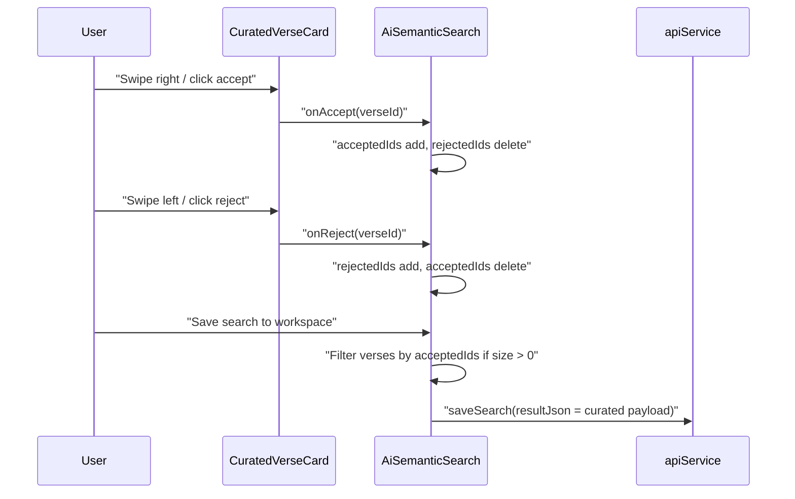
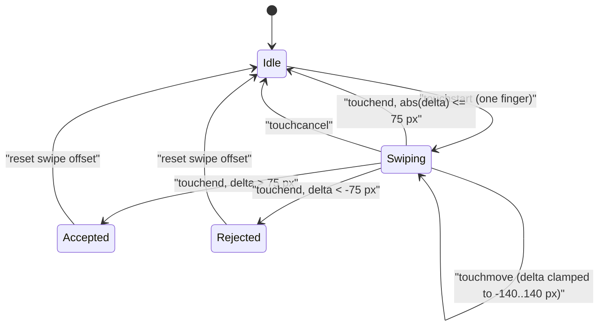

# PR Story: Semantic Search Verse Curation and Swipe Triage

## Business Context

The AI semantic search returns a fixed list of verse hits. The user cannot separate the best matches from secondary ones before saving the search to a workspace, and on mobile, managing individual results through small buttons is awkward.

This PR adds a curation layer on top of the semantic search result list. Each verse can be accepted, rejected, or restored. On touch devices a card can be swiped right to accept and left to reject. On desktop the same actions are available as buttons. When a search is saved to a workspace, accepted verses are persisted in preference to the full result list.

The change is frontend-only. No backend behavior, API contract, or database schema changed.

---

## Architectural & Process Flows

### 1. Curation and save flow

Curation state is held as two `Set<string>` values of verse IDs. The visible list and all counters are derived during render, so there is no mirrored `filteredVerses` state.



### 2. Swipe gesture state



---

## Architectural & UX Changes

### 1. `CuratedVerseCard`

- **Gesture handling without dependencies:** touch events are bound directly through JSX handlers (`onTouchStart`, `onTouchMove`, `onTouchEnd`, `onTouchCancel`). No `useEffect`, no window listeners, no gesture library.
- **Threshold:** a swipe commits only beyond `SWIPE_THRESHOLD_PX = 75`. The card offset is clamped to ±140 px and springs back after release.
- **Desktop actions:** accept and reject buttons call `stopPropagation` so they do not trigger verse navigation. Clicking accept on an already accepted verse restores it. A rejected verse shows a restore button.
- **Navigation:** the verse reference area remains a button that calls `onSelectVerse` (click, `Enter`, `Space`). `onSelectVerse` is optional.

### 2. `VerseCurationHeader`

- Filter tabs (All, Accepted, Rejected) with count badges.
- "Accept all" is shown only while some verses are not accepted. "Reset curation" is shown only once at least one verse is accepted or rejected.

### 3. `AiSemanticSearch` integration

- `acceptedIds`, `rejectedIds`, and `curationFilter` are the only new state. Displayed verses and counts are computed in render.
- Curation state resets after each successful new search.
- **Save behavior:** when `acceptedIds.size > 0`, the persisted `resultJson` contains only accepted verses. When nothing is accepted, the full result is saved, so the previous behavior is preserved for users who do not curate.

```tsx
verses:
  acceptedIds.size > 0
    ? searchState.data.search.verses.filter((v) => acceptedIds.has(v.id))
    : searchState.data.search.verses,
```

### 4. Types and i18n

- `AiVerseMatch` is extracted from the inline `AiSearchResponse.search.verses` element type so components can share it. The shape is unchanged.
- New `curate*` strings were added to `Messages` and to both the `en` and `fi` dictionaries.

### 5. Known gaps

- The `curateKeyboardHint` string describes `A` / `D` shortcuts, but no keyboard shortcut handlers are implemented in this PR. Only click, touch, and the existing `Enter` / `Space` verse navigation are wired.
- `curateSwipeHint`, `curateSaveOnlyAccepted`, and `curateSaveAll` strings are defined but not yet rendered in the UI.
- The empty-filter placeholder reuses `curateAcceptedCount(0)` / `curateRejectedCount(0)` instead of a dedicated empty-state message.
- Curation is not persisted across reader navigation remounts; it resets with the component.

---

## Improvement Metrics & Key Figures

- **Frontend test suite:** 54 test files, 418 tests passing (`task check`).
- **New tests:** 10 in `CuratedVerseCard.test.tsx`, 6 in `VerseCurationHeader.test.tsx`, 2 added to `AiSemanticSearch.test.tsx`.
- **State model:** two ID sets plus one filter value; all lists and counters are pure derivations.
- **Dependencies:** none added.

---

## Security & Compliance

- **Access control:** unchanged. The save path still requires `activeScopeId` and goes through the existing `apiService.saveSearch`.
- **Input handling:** the curated payload is built from verses already returned by the backend; the client only filters the existing array by ID.
- **Error handling:** the existing save error path is unchanged.
- No backend, SQL, authentication, or dependency changes, so no dedicated security audit was run.

---

## Files Changed

| File | Change Summary |
|------|----------------|
| `frontend/src/components/search/CuratedVerseCard.tsx` | New card with swipe gestures, desktop actions, and restore |
| `frontend/src/components/search/VerseCurationHeader.tsx` | New filter tabs, counters, accept-all and reset actions |
| `frontend/src/components/search/AiSemanticSearch.tsx` | Curation state, derived filtering, curated save payload, new components wired in |
| `frontend/src/types/aiSearch.ts` | Extracted `AiVerseMatch` type |
| `frontend/src/utils/i18n.ts` | Added `curate*` keys for `en` and `fi` |
| `frontend/src/components/search/CuratedVerseCard.test.tsx` | New tests for rendering, actions, keyboard selection, touch gestures |
| `frontend/src/components/search/VerseCurationHeader.test.tsx` | New tests for tabs, counts, accept-all, reset |
| `frontend/src/components/search/AiSemanticSearch.test.tsx` | Integration tests for filtering, accept-all, and curated save payload |
| `VERSION` | Bump to 3.14.0 |
| `frontend/package.json` | Version bump to 3.14.0 |
| `frontend/src/utils/version.ts` | Version bump to 3.14.0 |
| `backend/internal/version/version.go` | Version bump to 3.14.0 |
| `backend/go.mod` | `go` directive changed from `1.26.5` to `1.26` (toolchain side effect, see note) |
| `go.work` | `go` directive changed from `1.26.5` to `1.26` (toolchain side effect, see note) |
| `kanban/todos.md` | Moved the curation task to Done |

> **Note:** the `go.mod` and `go.work` directive changes were produced by the local Go toolchain (`go1.26.2`) and are not part of the feature.

---

## Testing Strategy

### Automated Test Results

#### Frontend (Vitest)

```text
Test Files  54 passed (54)
     Tests  418 passed (418)
```

Frontend coverage figures were not available in `.cov/` at the time of writing, so none are claimed here.

#### Backend (Go)

No backend behavior changed. `task backend:check` passed.

### Manual Verification Checklist

Not performed. The behavior is covered by automated Vitest tests only; no manual browser or touch-device verification has been done for this change.
