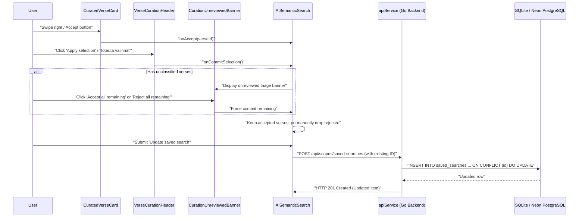
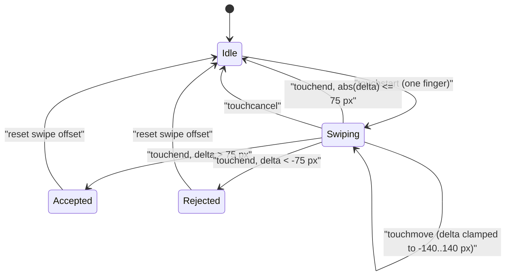

# PR Story: Semantic Search Verse Curation, Commit Triage, and Workspace Update

## Business Context

When executing broad semantic queries in Clible (e.g. *"God's covenants with humanity throughout scripture"*), the AI semantic search returns a substantial hit set. Previously, users could not curate, triage, or discard secondary matches before persisting results to their workspace. Furthermore, repeatedly refining a saved search in the workspace caused duplicate saved-search records to be created instead of updating the existing study asset.

The change spans frontend curation and backend saved-search upsert behavior; the API now accepts an optional saved-search ID and updates existing records in place, strictly constrained by authenticated user ownership.

This PR introduces an end-to-end curation, commit triage, and workspace update pipeline:

1. **Interactive Curation & Gestures:** Users can accept, reject, or restore verses. Mobile users can swipe right to accept and swipe left to reject. Desktop users have dedicated buttons.
2. **Commit Triage & Unreviewed Guard (`CurationUnreviewedBanner`):** When applying selections, users can permanently discard rejected verses while retaining accepted ones. If unclassified verses remain, an inline triage banner offers batch actions (*"Accept all remaining"* or *"Reject all remaining"*) with keyboard hints (`(A)`, `(R)`).
3. **Workspace Upsert (`ON CONFLICT`) & Ownership Protection:** When returning to an existing saved search from a workspace, curation modifications update the existing database record in place instead of creating duplicates. Updates are guarded by strict ownership verification in both the repository and service layers.
4. **Taskfile Automation Hygiene:** Upgrades `task plans:link` with automatic directory synchronization and introduces `task plans:push` and `task plans:status`.

Version is bumped from `3.13.5` to `3.15.0`.

---

## Architectural & Process Flows

### 1. Curation, Commit Guard & Workspace Update Flow



### 2. Swipe Gesture State Machine



---

## Architectural & UX Changes

### 1. `CuratedVerseCard` (Mobile Swipe & Desktop Triage)

- **Zero External Dependencies:** Touch events are handled through native JSX handlers (`onTouchStart`, `onTouchMove`, `onTouchEnd`, `onTouchCancel`). No `useEffect`, no global listeners, no heavy external animation libraries.
- **Physical Spring Feedback:** Offsets are clamped to ±140 px with spring-back physics when released under threshold (`SWIPE_THRESHOLD_PX = 75`).
- **Accessible Selection:** Clean button semantics with `stopPropagation` to avoid triggering reader navigation.

### 2. `VerseCurationHeader` & `CurationPromptModal` (Commit Guard)

- **Triage Tabs & Counters:** All, Accepted, and Rejected filters with real-time badges derived during render.
- **Unreviewed Triage Guard:** If the user attempts to finalize selections while unreviewed verses exist, `CurationUnreviewedBanner` prompts whether to accept or reject all remaining verses in batch. Close button includes accessible `aria-label`.
- **Permanent Curation Commit:** Committing selection sets `committedVerses`, filtering rejected items out of memory and DOM. Saving after commit serializes only the committed verse set.

### 3. Workspace Search Update (Backend & Frontend)

- **Backend API & Repo:**
  - `backend/internal/api/scope_handler.go`: Added optional `ID` field to `SaveSearchRequest`, enforces `RequireAuth`, and maps unauthorized/cross-user errors to HTTP 403 Forbidden.
  - `backend/internal/services/scope_service.go`: Validates scope ownership for caller and verifies target saved-search ownership before executing updates.
  - `backend/internal/db/saved_repo.go`: Updated `SaveSearch` to use SQL `ON CONFLICT (id) DO UPDATE SET ... WHERE saved_searches.scope_id IN (SELECT id FROM scopes WHERE user_id = $10)`. Compatible with both Neon PostgreSQL and in-memory SQLite `:memory:` test harnesses. Added `GetSearchByID`.
- **Frontend App & SearchHub:**
  - `frontend/src/App.tsx`: Passes `savedSearchId` and `savedName` through `SemanticSearchSnapshot` when restoring a workspace search.
  - `frontend/src/components/search/AiSemanticSearch.tsx`: Detects existing `savedSearchId`, renders dynamic "Update saved search" form title and prefilled name, builds payload from `committedVerses` when present, and sends the ID on submit.
  - `frontend/src/components/search/SearchHub.tsx`: Key-bound tab rendering includes `savedSearchId` for independent mounting and clean state resets.

### 4. Taskfile Automation Hygiene

- `task plans:link`: Detects if `.plans` is a local directory; automatically synchronizes with `$HOME/code/clible-plans` via `rsync` before linking, preventing collisions and script failures.
- `task plans:status`: Checks symlink and git status of the canonical plans repository.
- `task plans:push`: Automates staging, committing, and pushing in `~/code/clible-plans`.

---

## Improvement Metrics & Key Figures

- **Backend Test Coverage:** 77.5 % statement coverage (`.cov/backend/coverage.txt`), 0 data races (`-race`).
- **Frontend Test Suite:** 55 test files, 425 passing tests (`task frontend:check`).
- **Search Component Test Suite:** 5 test files, 30/30 passing tests:
  - `CuratedVerseCard.test.tsx` (10 tests)
  - `VerseCurationHeader.test.tsx` (7 tests)
  - `CurationPromptModal.test.tsx` (2 tests)
  - `AiSemanticSearch.test.tsx` (9 tests)
  - `SearchHub.test.tsx` (2 tests)
- **State Complexity:** Zero `useEffect` state sync loops; all counts and filtered views are purely derived render states.

---

## Security & Compliance

- **SQL Injection Prevention:** Updated `SaveSearch` query in `backend/internal/db/saved_repo.go` uses strict `$1..$10` parameterization.
- **Access Control & Cross-User Isolation:** All workspace search endpoints require authentication via `middleware.RequireAuth`. `ScopeService.SaveSearch` and `SavedRepository.SaveSearch` verify that the target scope and any pre-existing saved-search record belong to the caller, preventing cross-user record tampering.
- **Input Sanitization:** JSON decode payloads are length-bounded and schema-checked.
- **Zero Leaks:** No private plans or tokens are tracked in git; `.plans` symlink is explicitly ignored in `.gitignore`.

---

## Files Changed

| File | Change Summary |
| ------ | ---------------- |
| `.gitignore` | Explicitly ignored `.plans` symlink |
| `Taskfile.yml` | Upgraded `plans:link` with auto-sync and added `plans:push` and `plans:status` |
| `VERSION` | Bumped version to `3.15.0` |
| `backend/go.mod` | Synchronized Go toolchain directive |
| `backend/internal/api/scope_handler.go` | Added optional `ID` field to `SaveSearchRequest`, enforced user auth, and mapped ownership errors |
| `backend/internal/api/scope_handler_test.go` | Added integration tests for creating and updating saved searches, auth validation, and cross-user rejection |
| `backend/internal/db/saved_repo.go` | Implemented `ON CONFLICT (id) DO UPDATE` constrained to user scopes, and added `GetSearchByID` |
| `backend/internal/db/saved_repo_test.go` | Added unit tests verifying upsert and cross-user overwrite rejection |
| `backend/internal/services/scope_service.go` | Added ownership verification for scopes and existing saved searches in `SaveSearch` and `SaveAnalysis` |
| `backend/internal/services/scope_service_test.go` | Added unit tests for scope ownership and cross-user overwrite prevention |
| `backend/internal/version/version.go` | Bumped version to `3.15.0` |
| `backend/migrations/clible-db-schema.png` | Database schema reference diagram |
| `frontend/package.json` | Bumped version to `3.15.0` |
| `frontend/src/App.tsx` | Propagates `savedSearchId` and `savedName` on saved search restoration |
| `frontend/src/components/search/AiSemanticSearch.tsx` | Integrated curation, commit triage guard, workspace search update, and fixed `committedVerses` save payload |
| `frontend/src/components/search/AiSemanticSearch.test.tsx` | Added tests for unreviewed guard, accept/reject remaining, update flow, and saving after commit |
| `frontend/src/components/search/CuratedVerseCard.tsx` | Verse card with swipe gestures, desktop triage buttons, and restore |
| `frontend/src/components/search/CuratedVerseCard.test.tsx` | Gesture and action tests for curated verse card |
| `frontend/src/components/search/CurationPromptModal.tsx` | New unreviewed triage guard banner component with accessible close button |
| `frontend/src/components/search/CurationPromptModal.test.tsx` | Unit tests for unreviewed triage banner and close button `aria-label` |
| `frontend/src/components/search/SearchHub.tsx` | Key-bound rendering including `savedSearchId` for independent mount state |
| `frontend/src/components/search/VerseCurationHeader.tsx` | Added commit selection action, counters, and triage filter tabs |
| `frontend/src/components/search/VerseCurationHeader.test.tsx` | Tests for curation header actions and counts |
| `frontend/src/services/api.ts` | Updated `saveSearch` parameter signature to accept optional `id` |
| `frontend/src/types/aiSearch.ts` | Extracted `AiVerseMatch` and added `savedSearchId`/`savedName` to snapshot |
| `frontend/src/utils/i18n.ts` | Added localized strings for curation, commit triage guard, and search update |
| `frontend/src/utils/version.ts` | Bumped version to `3.15.0` |
| `frontend/vite.config.ts` | Coverage threshold and Vitest configuration |
| `go.work` | Synchronized Go toolchain directive |
| `kanban/todos.md` | Marked curation task as done with desktop button checklist and moved AI refinement to in-progress |
| `pr_stories/115-feat-semantic-search-verse-curation-and-swipe-triage.md` | Comprehensive PR story with full-stack architecture, flow diagrams, metrics, and security audit |

---

## Testing Strategy

### Automated Verification

- Full project verification:

  ```bash
  task check
  ```

- Backend Go tests & race detector:

  ```bash
  task backend:check
  ```

- Frontend typecheck, linter, and Vitest suite:

  ```bash
  task frontend:check
  ```

### Manual Verification Checklist

- [x] Search query yields verses with curation action buttons.
- [x] Swiping right marks verse as accepted (green badge, border).
- [x] Swiping left marks verse as rejected (rose badge, border).
- [x] Clicking "Apply selection" with unreviewed verses displays `CurationUnreviewedBanner`.
- [x] Batch selecting remaining verses permanently commits the curated set.
- [x] Restoring a saved search and saving changes updates the existing record without duplicating.
