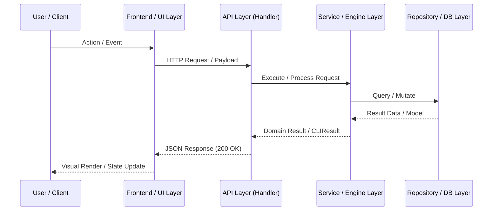
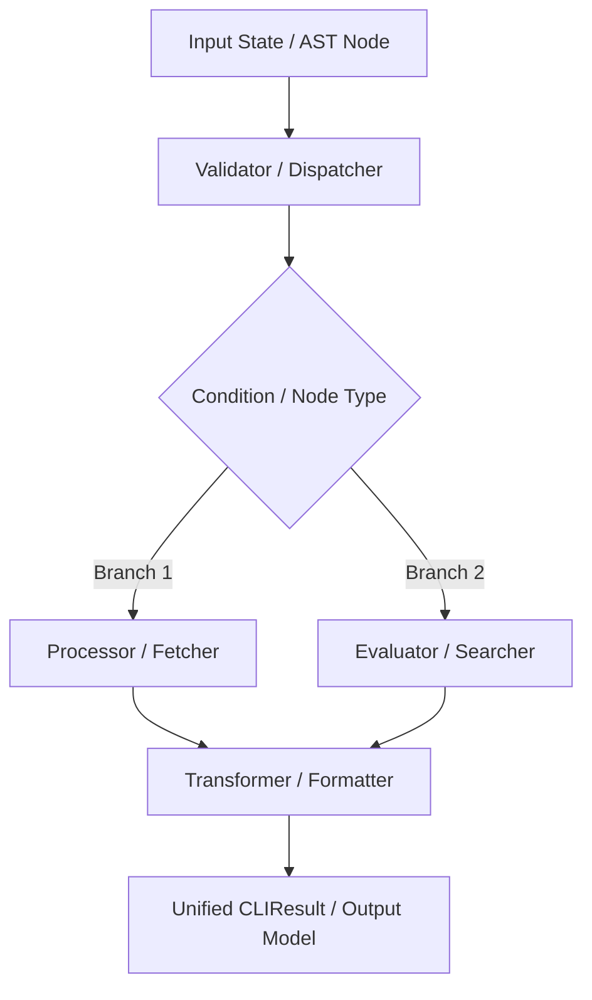

# PR Story: [Descriptive Feature / Architectural Title]

## Business Context

[Detailed problem statement, background motivation, user impact, and overall business value. Explain why this architectural capability is necessary and what user or system workflows it unlocks.]

---

## Architectural & Process Flows

### 1. [Process Flow / Sequence Title]

[Short description of the sequence and interactions across actors, layers, and protocols.]



### 2. [Data Pipeline / State Machine Diagram]

[Short description of the data transformation, state machine, or execution pipeline.]



---

## Architectural & UX Changes

### 1. [Key Component / Architecture Focus 1]

- **[Subpoint Title]:** [Detailed explanation of design patterns, idioms, and guarantees.]
- **[Subpoint Title]:** [Explanation of edge-case handling or lifecycle management.]

```[language]
// Key illustrative code snippet demonstrating the primary idiom or pattern
```

### 2. [Key Component / Architecture Focus 2]

- **[Subpoint Title]:** [Explanation of component behavior, state transitions, or integration logic.]
- **[Subpoint Title]:** [Explanation of memory, allocation, or streaming efficiency.]

---

## 📈 Improvement Metrics & Key Figures

* **[Metric 1]:** [e.g., Statement coverage increased from X% to Y%]
* **[Metric 2]:** [e.g., Latency, algorithmic complexity O(1) streaming vs O(N) memory]
* **[Metric 3]:** [e.g., Precision, continuous resolution, or elimination of edge-case regressions]
* **[Metric 4]:** [e.g., Performance, zero hook overhead, strict boundary enforcement]

---

## Security & Compliance

* **[Access Control & Ownership]:** [How user ownership and auth boundary checks are enforced.]
* **[Input Sanitization & Bounds]:** [How user inputs, bounds, and parameters are validated and sanitized.]
* **[Error Handling]:** [How errors are propagated without leaking internal details.]

---

## Files Changed

| File | Change Summary |
|------|----------------|
| `path/to/file.ext` | [Summary of structural and logic changes] |
| `path/to/test.ext` | [Summary of test coverage additions] |

---

## Testing Strategy

### Automated Test Results

#### Backend (Go Test Suite)

* **Coverage:** [Statement coverage metrics from `.cov/backend/coverage.txt`]
* **Test Suite:** `go test -v ./...` or package-specific test outputs.

```text
[Paste terminal test output here]
```

### Manual Verification Checklist

1. **[Verification Item 1]:** [Steps performed to manually verify feature behavior.]
2. **[Verification Item 2]:** [UI / edge case validation steps performed.]
